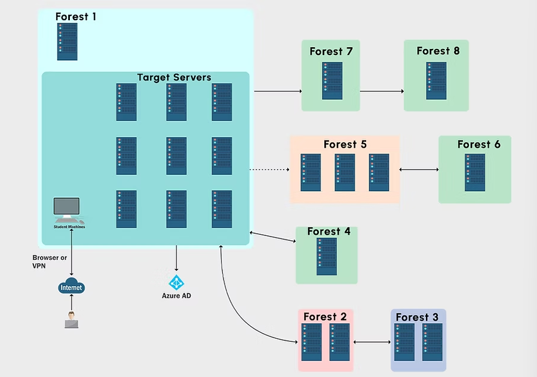
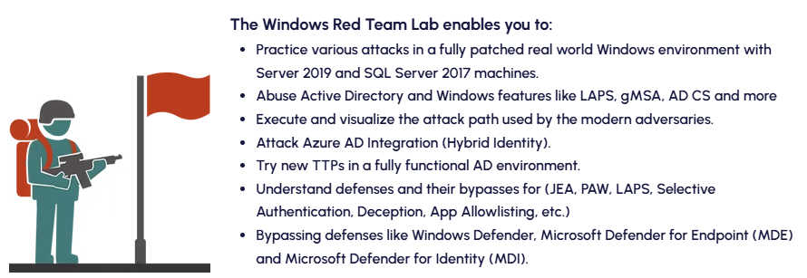
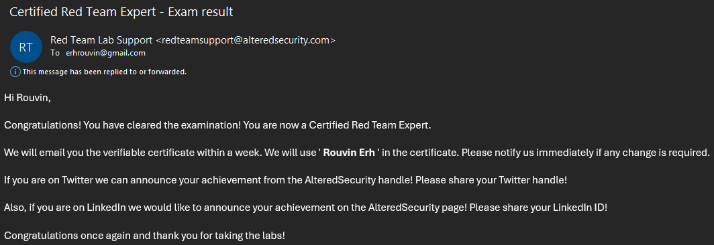

# CRTE Review

## TL;DR

The lab itself was impressively large and packed with things to explore. The exam itself was alright, and the course does a fantastic job covering the requirements. Overall, a great course.

## Introduction

The Certified Red Team Expert (CRTE) course focuses on Active Directory (AD) exploitation and comes with an extensive lab environment to practice in. The course assumes an initial foothold as a regular user account and guides you through escalating privileges by exploiting commonly misconfigured features within AD environments.

The lab is fully patched, with defences like Microsoft defender, MDE and MDI enabled. Since zero-days and public exploits aren’t the focus, the real challenge lies in understanding and exploiting misconfigurations instead. The lab is accessed via a VPN, and using RDP to access the **student** machine.

One can expect to learn:

The course itself can be found here:



## Pre-Requisites

I enrolled in CRTE during my red team internship back in 2023. Thanks to prior experience from OSCP and tons of HackTheBox (HTB) machines, I was already comfortable with AD exploitation basics like AS-REP Roasting, MSSQL server abuse, and using `impacket` tools. So, I decided to skip the beginner Certified Red Team Professional (CRTP) course and head straight for CRTE.

The course itself covers the topics well, so I recommend being familiar with HTB machines and the general penetration testing workflow.

## The Course

I loved the course and its lab! The lab was massive, with many different domains, trusts relationships and even an Azure AD part that could be enumerated for misconfigurations to abuse.

The lab itself was not a challenge lab that required users to pwn machines to capture flags, but rather a guided walkthrough. Each step of AD exploitation was walked through, from initial enumeration to domain escalation. This worked well for me, especially when learning newer techniques in a properly secured AD environment.

The lab was also reliable and stable. I did run into one issue where I accidentally broke the connection to my student VM. Their support team responded on the same day, quickly identified the problem, and fixed it. Solid customer support!

Some of the topics covered:

- Usage of Powershell scripts for offensive security
- Domain Enumeration
- Privilege Escalations
- Domain Escalation
- Lateral Movement
- Cross Forest Attacks
- Detecting and Defending against attacks

The most interesting portion of the course was the **detection and defence** topic. Coming from HackTheBox and CTFs, I never thought much about defence, since the goal was simply to pwn the network instead of patching it. Learning about tools like Azure Key Vault, Credential Guard, and various Windows Event IDs helped round out my understanding of both attacking and defending AD environments.

For the lab, users could opt to do it with a C2 tool if they wish, but I did not do so.

While not necessary, the course sparked my interesting in reading more about AD and Windows lateral movement. I read up more using **ATTL4S's** blogs, which do deep-dives into various techniques:



## Pricing

The prices are based on the number of days of lab access:

Starting at US$249, it’s easily one of the best deals for the depth and quality offered. I chose the 30-day option, which fit perfectly alongside my internship. I found that 30 days was more than enough time, especially with prior knowledge of the fundamentals.

## Exam

The exam consists of two phases:

- 48 hours to complete the objective.
- 48 hours to write and submit a professional report.

So, **96 hours** was provided for the entire exam. The goal is to gain code execution on a number of machines within the network. I managed to gain pwn the entire exam network for my attempt.

I will not say much about the exam itself, but I will say that there were a few roadblocks that required thorough enumeration to overcome. Everything you need to solve the exam is covered in the course materials, both tools and techniques. I did not need much external research except for some reporting references.

When it comes to the report, I followed a structure similar to the OSCP report format: starting with a high-level summary, followed by a breakdown of each attack chain and privilege escalation path. Reporting as I went helped in saving time.

One key difference is that the report **must contain remediation and recommended fixes** for each misconfiguration exploited. For each step, I added recommendations for each vulnerability along with references to official documentation and best practices.

I ended up with a report of 35 pages. I submitted my report on 22 July 2023, and got my reply on 26 July 2023 that I had passed!

## Conclusion

All in all, this was an excellent course, both for the knowledge gained and the value for money. It really helped me solidify my AD exploitation and defense evasion skills and gave me a much better understanding of how to secure these environments.

Last thing to note is that the certificate expires after 3 years, so I will have to retake it soon.