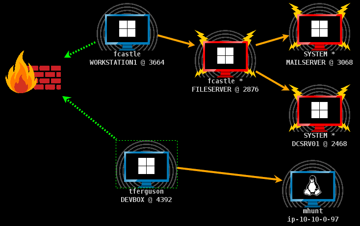
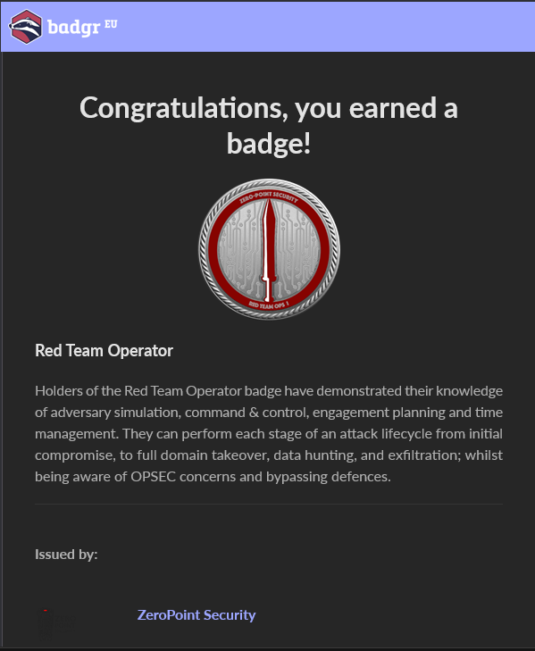

# CRTO Review

## TL;DR

It was a great introduction to red teaming, and playing around with Cobalt Strike was fun.  As for the exam, I found it required external research beyond the course notes and was not as straightforward as expected. The course does not really go through everything in detail, as students are expected to figure it out. Understanding why each attack works and under what conditions is essential.

## Introduction

The Certified Red Team Operator (CRTO) course covers the **red teaming** attack lifecycle, from initial access and credential dumping to privilege escalation on Windows machines and lateral movement across them. The course is entirely self-paced and online, covering Active Directory (AD) attacks and misconfigurations. What stood out most to me was its focus on Operational Security (OPSEC) and hands-on use of Cobalt Strike to perform the attacks.

CRTO is offered by Zero-Point Security, with course material created by Daniel Duggan.

Labs are hosted by SnapLabs and can be spun up on demand. Each lab session runs for a set number of hours, which start counting down once launched. When the timer hits zero, you will need to purchase more hours to continue. **Be sure to shut down your lab you are done done as the timer keeps running even if idle!**

The labs are accessed via browser-based RDP, and all necessary tools come pre-installed, so there is no need to set up anything on your own system.

Cobalt Strike, a widely used commercial tool for red teams and APT groups, is included in the lab, which was exciting for me as it was my first time using it. It is also important to note that transferring or installing the lab’s version of Cobalt Strike onto your own machines is strictly forbidden.

The syllabus for the course is pretty extensive, and can be found on the course's website:



## Pre-Requisites

I took this course in 2023 while I was interning with a red team. By that time, I was already comfortable with Active Directory exploitation and penetration testing, having completed my OSCP the year before and rooted many HackTheBox machines. I was familiar with techniques like AS-REP Roasting, MSSQL server abuse, and using the `impacket` toolset.

However, I had zero exposure to OPSEC concepts and had never worked with any C2 frameworks before. Using Cobalt Strike for the first time and learning about its capabilities was an eye-opening experience. The course also recommends having some knowledge of C# and C.

## The Course

All in all, I thought the course was **fantastic** and thoroughly enjoyed it. Learning to think about OPSEC and working with Cobalt Strike helped broaden my understanding of red teaming.

The course content was clear, well-structured, and regularly updated. In fact, the notes were updated while I was enrolled with new information.

The course begins with AD attacks and getting familiar with using Cobalt Strike to launch execute them. However, it starts with **Windows Defender being turned off.** At the end of the course, it is recommended that you redo all the exercises with Defender turned on, which is crucial since both the exam and real-world scenarios will have the AV turned on.

The course **does not hold your hand**. While commands and steps were provided, there little explanation about why the attacks work. I had to do my own research to understand the prerequisites and behavior of each attack. When I went through the material again with Defender enabled, there was also no guidance on how to bypass defenses. It was pure trial and error, which was tough but allowed me to learn a lot.

Despite the challenges, I had a great time. Working with Cobalt Strike and watching an entire domain fall under my control via its interface was always incredibly satisfying:

I noted that while AD attacks were taught in the course, it was merely a medium to teach red team concepts. The course taught me that red teaming is less about the attacks themselves and more about understanding OPSEC, defensive measures, and the flow of an entire engagement. I would call it a great intro to red teaming tools and practices, rather than just another AD exploitation course.

One downside of the course is the SnapLabs experience. SnapLabs is headquartered in USA, and I am from Singapore. This means that the browser RDP sessions were pretty laggy, with actions taking around 1 - 2 seconds to register. Apart from that, I faced no issues with the labs, and they were stable.

Again, **ATTL4S's** blogs were useful to supplement my learning about Windows and AD:



`ired.team` notes were another solid supplement, especially for understanding Cobalt Strike and certain AD attacks more deeply than the course materials covered.



## Pricing

The course notes and labs are sold separately:

The course notes come with lifetime access and frequent updates. Every time the notes were updated, I learned something new by revisiting them. For £405, I felt the price was absolutely worth it for the quality of material. And of course, playing around with Cobalt Strike was fun!

I chose the Course + 30 Days Lab bundle, which I found was just enough time to finish all the material and redo parts of it with Defender enabled. Granted, I already had experience with AD attacks, and I mostly needed to focus on OPSEC and getting comfortable with Cobalt Strike.

## Exam

The exam runs over **4 calendar days**, with a total of **48 hours of lab time** allocated. This averages out to about 12 hours per day. To pass, **6 out of 8 flags must be submitted**, and there was no report submission. I found this was more than enough time to complete the objectives. The generous time given allowed me to rest and not stress out too much.

**It is essential to practice the course material with Defender enabled and make sure you can reproduce every attack.** I did refer to external resources during the exam to understand why certain attacks worked, but that was attributed to lack of research done on my part.

I felt the exam was fair, enjoyable, and rewarding. Once I submitted my flags, I received the badge within an hour.

## Conclusion

I highly recommend this course to anyone serious about improving their red teaming skills. With lifetime access to well maintained course notes, hands-on experience with Cobalt Strike, and a strong focus on OPSEC, it offers excellent value and stands out from other certifications. I genuinely enjoyed the difficult learning process, and the course gave me a clear understanding of how red teaming differs from traditional penetration testing.

Plus, the certification itself does not expire, which is a nice bonus.