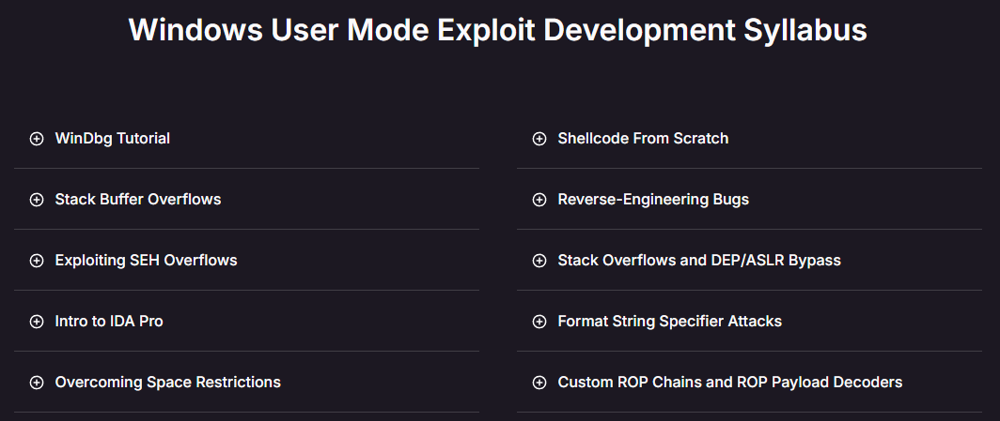
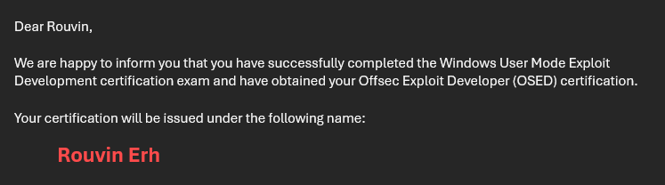

# OSED Review

## TL;DR

I personally feel that this course is a decent introduction to binary exploitation for Windows machines. I have a love-hate relationship with binary exploitation. Sometimes I hate it because of how tedious it can be, but seeing a ROP chain work to achieve remote code execution will always feel satisfying. The exam was extremely tedious, but the majority of the content was well covered in the course. Writing the report was also exhausting due to the amount of detail required. I took this course to clear the OSCE3 certification before graduating from university.

## Introduction

The OffSec Exploit Developer (OSED) course focuses on exploit development for x86 Windows binary exploitation. It covers topics such as reverse engineering, bypassing Data Execution Policy (DEP) and Address Space Layout Randomization (ASLR) through Return-Oriented Programming (ROP). It also includes Structured Exception Handler (SEH) overflows, format string vulnerabilities, custom shellcoding, and the reverse engineering process required to develop exploits. It carries on from the OSCP's Buffer Overflow topics, where you learn how to find bad characters and use `jmp esp` to execute reverse shell payloads on the stack.

The course syllabus is as follows:



## Pre-Requisites

I was familiar with binary exploitation thanks to Capture the Flag (CTF) challenges, HackTheBox (HTB), and university coursework (thanks CS2107 and CS3235). I was comfortable reading and writing code in C (thanks CS1010). I also had some exposure to writing assembly (thanks CS2100), and understood the basics of operating system internals (I hated CS2106). Concepts like stack overflows were not new, but **I was far from an expert**.

The binary exploitation techniques I knew were quite basic. My knowledge included ROP chaining, `ret2libc` attacks, and bypassing ASLR and DEP on **Linux machines**. I had no experience with Windows exploitation.

At the time I took this course, I already had a lifetime subscription to Maldev Academy, which covered malware development techniques. Working through some of the modules there made me comfortable in reading Microsoft's documentation for Win32 API methods and understanding how executables are structured. For example, I knew what a Process Environment Block (PEB) was and that DLLs were linked there.

I personally feel this is one of the OffSec courses where despite being an "Advanced" course, you could actually tackle this without doing the OSCP or penetration testing experience. I recommend that one be vaguely familiar with assembly, stack overflows, operating systems and process memory management.

## The Course

The course itself was alright, not bad but not great. Although I learned a significant amount, the fact that all the material focused on x86 rather than x64 was a big note. However, I understand the decision, since the course is likely designed to prepare students for EXP-401, the OffSec Exploitation Expert (OSEE) course, which covers x64 topics. While you could technically learn the materials by reverse engineering some CVEs on `exploitdb`, I wanted the certification and also a structured course to learn the topics.

All required tools and software were provided by the course, and the only debugger used during the course and allowed in the exam is WinDbg.

Different memory vulnerabilities in the provided software were explored, including SEH overflows, which were entirely new to me. The course also covered how to create custom shellcode for reverse shells or other payloads. Egghunters were another interesting topic.

I found the usage of IDA for reverse engineering slightly difficult to follow, as my x86 assembly skills were not great. While I had no prior experience with Windows exploits, my familiarity with other debuggers, such as `gdb`, made the learning curve slightly easier. I am not a binary exploitation expert by any means, so I used the OSED Discord channel to ask for help with exercises at times. Big thanks to `ApexPredator` and the other users there who helped me out.

The "Extra Mile" exercises were fun to complete, and I managed to solve the majority of them except for Faronics. Although tedious, achieving a reverse shell for each challenge was immensely satisfying, and taught me about certain 'variations' on the techniques used.

## Pricing

OffSec courses are currently priced at US$1,749. I am somewhat on the fence about whether the OSED was worth the cost. On one hand, the course provided valuable exposure to exploit development, the process of writing custom shellcode, and served as a solid introduction to reverse engineering and exploit writing.

On the other hand, I do not see myself using these skills much in the immediate future, as I am currently more focused on application security. Additionally, the course only covered x86, and it did not prepare me for real-world exploit hunting, which is understandable given that OSED is advertised as an introduction to exploit development.

I believe the course's value largely depends on your goals. If your goal is to obtain the OSCE3 certification, as mine was, then the course is reasonable. However, if your intention is to pursue a career in exploit development or vulnerability research, this course only scratches the surface, and much more learning will be required.

## Exam

For the exam you are given **48 hours to get at least 60 out of 100 points** by finishing the assignments. Another **24 hours** is given to write the report.

Again, generative AI could not be used, and the exam is designed in a way such that no automated tools can be used. I did not use any libraries like `pwntools` or tools like `mona`. I stuck to `rp++`, along with `struct` and `sockets` module. I used this extension to prevent AI overviews from being shown on screen:



The exam itself was straightforward, and everything necessary was covered in the course materials. There were no surprises, and the difficulty was about what I expected. The 48-hour window is more than sufficient to complete the objectives. I finished most of the work on the first day and spent the beginning of the second day finalizing my answers. One thing I highly recommend is **doing the extra miles** and **practicing!** ROP chaining and writing shellcode is all about practice and getting used to it.

Due to the nature of binary exploitation, the exam was quite tedious for me, so I recommend **taking regular breaks to maintain sanity**.

The hard part was writing the report, as my report ended up being **80+ pages**, the longest I have submitted to OffSec so far. This was because I had to explain every single step done with great detail, with the majority of my report being images and long code snippets. I think I included more than necessary, but that is because I did not want to fail and redo the exam again.

One important thing that I almost missed out is to **include your assignment scripts within the 7z file submitted!** This exam differs from the typical OffSec exam where scripts are included within the reports. Below is the command used to create the `.7z` file taken from the OSED Exam Guide:

```bash
$ 7z a OSED-OS-XXXXX-Exam-Report.7z OSED-OS-XXXXX-Exam-Report.pdf assignment1.py assignment2.py assignment3.py

7-Zip 9.20 Copyright (c) 1999-2010 Igor Pavlov 2010-11-18 p7zip Version 9.20 (locale=en_US.UTF-8,Utf16=on,HugeFiles=on,2 CPUs)

Scanning

Updating archive OSED-OS-XXXXX-Exam-Report.7z


Everything is Ok
```

Read the exam guide carefully!



After submitting the report, I got my results within 24 hours:



## Conclusion

Overall, the course was alright. I was not a binary exploitation expert before taking it, and I still would not consider myself one. However, it provided a good introduction to Windows exploitation, and I did learn how shellcode and proof-of-concept (PoC) exploits are developed. I also gained an appreciation for the complexities involved in bypassing DEP on Windows, especially when compared to Linux environments.