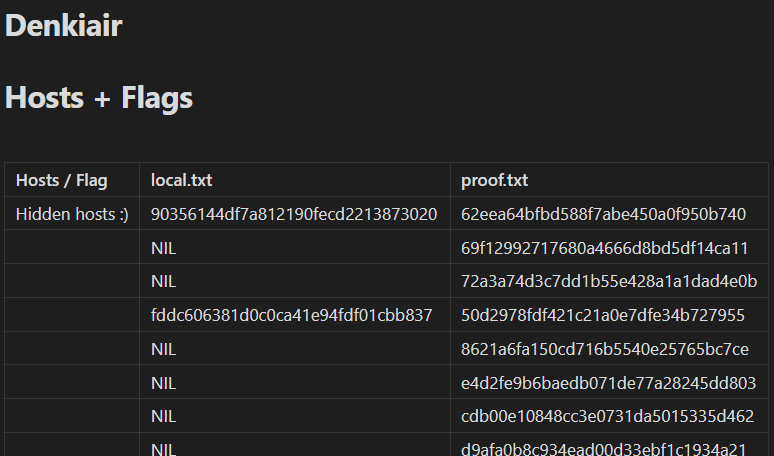
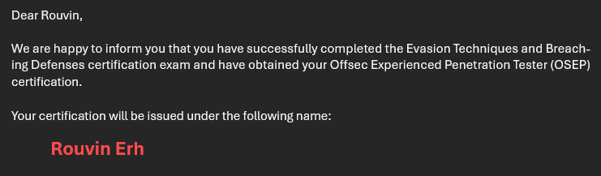
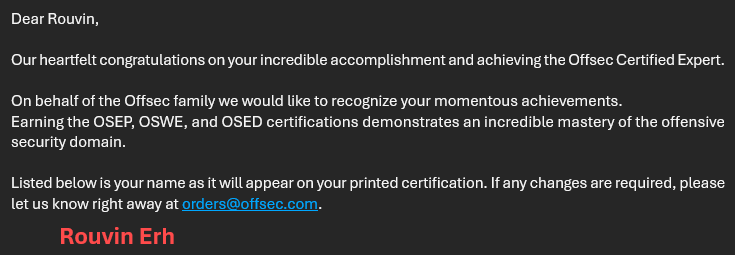

# OSEP Review

## TL;DR

Overall, the course was fun, but I have somewhat mixed feelings about it, hence the longer review. I divided it into 3 sections: client-side attacks, defence evasion, and lateral movement. The client-side portion feels slightly outdated, focusing on macros and JScript, along with reflective PowerShell execution which was more relevant. The defence evasion section introduces foundational techniques such as process injection and hollowing in C#, which are not new and well documented. The lateral movement portion is the most interesting to me, covering Active Directory abuses, SQL Server exploitation, and post-exploitation methods. I feel the course provides a structured overview of defence evasion and advanced penetration testing and is great for people coming straight from the OSCP, but much of the material can be found in cheaper courses or is outdated. I took this course to complete the OSCE3 certification before graduating from university.

## Introduction

The OSEP (Offensive Security Experienced Penetration Tester) course is an intermediate-to-advanced penetration testing training that focuses on defence evasion and post-exploitation techniques. It teaches students how to bypass security mechanisms, perform defence evasion, and conduct post-exploitation activities such as lateral movement within Active Directory environments.

This course felt like a continuation of the OSCP. The challenge labs and exam felt like a larger OSCP lab, this time exposing students to new considerations instead of simply running payloads within a machine.

I would say that techniques from OSCP are still very much relevant, along with the new evasion and Active Directory exploits taught.

The course syllabus is rather long, and can be found here:



## Pre-Requisites

I highly recommend that students be familiar with all OSCP concepts, as well as more advanced Active Directory topics and enumeration techniques. The course covers phishing and defence evasion adequately, providing a good enough foundation in these areas. Additionally, having some knowledge of C# can be helpful for customizing payloads and understanding how they are crafted.

Prior to taking this course, I had already completed the Certified Red Team Expert (CRTE) and Certified Red Team Operator (CRTO) certifications, giving me familiarity with Active Directory exploits and the use of C2 tools. I also have a lifetime subscription to Maldev Academy, where I learned many defence evasion techniques in both C# and C. While not strictly necessary, these experiences made it much easier for me to progress through the course. I will cover these later on in my critiques for the course.

## The Course

As mentioned earlier, I personally divided the course into 3 sections and will comment on each separately. I spent most of my time crafting my own payloads to bypass defences, along with learning to do Active Directory attacks from both Linux and Windows (which was very useful in the exam).

### Client-Side Attacks

This section of the course focused on phishing attacks and reflective code execution. While I picked up several new techniques, I did not particularly enjoy the entire portion.

Learning about attacks and creating shellcode runners using Visual Basic was interesting, but I often found myself thinking, "When am I going to use this?" It made it harder to make it fun.

I understand that phishing remains a common attack vector, and it is important for penetration testers to be familiar with it. However, Office macros and JScript are largely outdated, as modern security solutions can easily detect and block these methods. That said, not all targets are fully patched or updated, so there may still be niche scenarios where these techniques could be relevant. That said, it was still cool to learn how to craft my own payloads that allocate memory and execute arbitrary code from an HTA file or macro.

I enjoyed the reflective PowerShell modules more, as PowerShell remains highly practical. Although some techniques are slightly dated, creating my own payloads was enjoyable and provided valuable hands-on experience. I especially enjoyed the analysis of the artifacts left behind using PowerShell shellcode runners, and figuring out how to call WinAPIs from PowerShell alone.

The most rewarding aspect of this section was experimenting to see what would be flagged by the lab's security solutions and what would bypass them. This exercise offered useful practice, and I can envision applying these skills in real-world scenarios.

### Defence Evasion

This section of the course focuses on antivirus evasion and application whitelist bypass techniques. The antivirus evasion modules primarily cover process injection using C#, simple methods like XOR-ing shellcode, and AMSI bypasses. The application whitelist portion addresses bypassing AppLocker and Constrained Language Mode (CLM).

I found the AMSI and application whitelist chapters valuable since it covered things I was unaware of. This felt slightly more useful, as I have seen these techniques being used in HackTheBox machines, but never understood it fully until now.

The rest of the material was less impactful for me. Prior to the OSEP, I completed about 50  modules on Maldev Academy, which covers advanced techniques such as API hashing and PPID spoofing written in C. Process Injection, obfuscating shellcode with XOR, and calling WinAPIs in C# with P/Invoke are the beginner modules in Maldev Academy. That being said, Maldev Academy is not something that everyone has access to, hence I can still see value in this section of the course.

For someone coming from an OSCP background, the defence evasion content highlights the difference between a standard lab environment where any Meterpreter payload works and a more realistic setup where such payloads may be blocked. It is a good introduction to thinking about defences when testing real environments. However, there was very little focus on **Operational Security (OPSEC)** during this course. Users could go ahead to write files anyway and generate as much as noise as desired, so long as the payload was obfuscated, which was somewhat unrealistic.

### Lateral Movement

This section covers post-exploitation techniques such as credential harvesting with `mimikatz.exe` and Active Directory abuse using tools like `impacket` and `Rubeus.exe`.

The Windows post-exploitation steps are fairly standard, focusing on credential dumping, while the Linux portion follows similar principles, emphasizing the identification of artifacts left behind. I have no specific critiques for this section, as it is an essential part of the course.

The Active Directory content is relatively basic, covering ACL and Kerberos Delegation abuse methods. The course also has a new chapter on Active Directory Certificate Services (ADCS) abuse, indicating that the exam might change soon. Having previously completed the CRTE and CRTO certifications, I found this section to be a helpful recap, especially since my internships and university courses do not involve much AD work. The only thing I learned from this is about Linux systems in Active Directory, and how to go about abusing those. The rest were fairly standard abuses that one would see in a HackTheBox Active Directory machine.

While OSEP provides a good overview, the CRTE course covers these topics in greater depth, focusing entirely on Active Directory rather than blending it with defense evasion. Of course, the OSEP's Active Directory content cannot be directly compared to the CAPE course.

The biggest takeaway was learning how to pivot using **Ligolo-Ng** instead of `chisel`. I cannot recommend it enough, since I do not have to use `proxychains` at all and it is much faster!

## Pricing

OffSec courses are currently priced at US$1749, and I believe OSEP is worth the cost for those coming from an OSCP background. For me personally, however, I am on the fence about whether it was fully worth it.

The CRTE course costs US\$300, CRTO costs about US\$500, and Maldev Academy's lifetime access with updates also costs US\$500. Completing all 3 of these resources would provide much deeper preparation in each area:

- CRTE for Active Directory exploits
- CRTO for Active Directory with some OPSEC considerations
- Maldev Academy for advanced AV evasion techniques

Each of these resources dives deeper into specific aspects that OSEP covers. As a result, my experience with OSEP mainly served as a recap of what I had already learned, along with some exposure to new AppLocker bypasses and opportunities to craft payloads using PowerShell and Visual Basic. While I did not gain as much new knowledge as I had hoped, I still found it fun pwning the domains within the challenge labs.

The long list of flags obtained always feels satisfying!

## Exam

For the exam, students are given **48 hours to achieve at least 100 points OR gain access to the objective specified in the exam portal** to pass. Afterward, an additional **24 hours** are given to write the report. The reporting standard is similar to the OSCP.

I felt over prepared for the exam due to my prior coursework. I gained initial access within the first 30 minutes and then proceeded through the exam at a steady pace. Within the first 7 hours, I got got access to the `secret.txt` file. The remainder of the first day was spent attempting to capture every flag on the network before going to bed. Upon waking, I wrote and submitted my report just after the 25 hour mark. In total, I submitted **17 flags** and my report was **70 pages**, most of which was screenshots.

I had a lot of fun during the exam, which was highly relevant to the material covered in the course. While the exam was not easy, it was straightforward, with a clear 'next step' if proper post-exploitation and domain enumeration procedures were followed.

I had concerns about initial access, having read that it was similar to OSCP. In the end, it was very similar to the practice labs. Although I submitted 17 flags, I am fairly certain I missed 1 because I could not access a machine. I still think about that today.

I received my results after 3 days:

### Tips

Complete the challenge labs, particularly **CowMotors and Denkiair**, as they are highly relevant. Note that Denkiair was significantly harder than the actual exam. I did not focus much on the Extra Miles, but I spent time learning how to craft payloads that would bypass security solutions and practiced Active Directory attacks from Linux using `impacket`.

I simulated exam-style note-taking in these labs, as tracking the many flags and hosts without proper documentation would have been difficult. For CowMotors and Denkiair, I treated them like practice exams and refined the note-taking process I later used during the actual exam.

The most valuable strategy I used was creating an extensive 'cheatsheet,' documenting every command and payload in a single Markdown file. This included all encoded shellcode runners, PowerShell scripts, `mimikatz.exe` commands, and methods for exploiting each Active Directory misconfiguration using `Rubeus.exe` and `impacket`. During the exam, this proved extremely helpful, as I could quickly search with Ctrl + F for the command I needed to progress.

## Conclusion

Overall, OSEP provides a structured and engaging hands-on experience, particularly for those coming straight from OSCP. While some content may feel basic or slightly outdated, the labs and exam are enjoyable and provide a solid foundation in defense evasion, post-exploitation, and Active Directory attacks. You may not learn the latest cutting-edge techniques, as other providers cover specific areas in greater depth, but OSEP is excellent for breadth, giving students exposure to multiple topics they can later specialise in.

With this, I have achieved my OSCE3 and am 'done' with OffSec courses!

