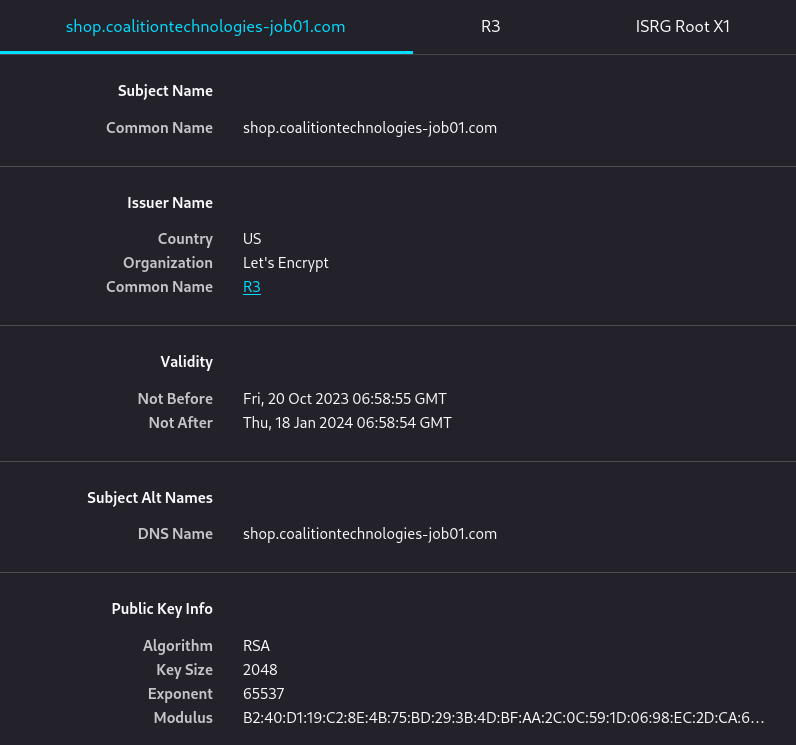
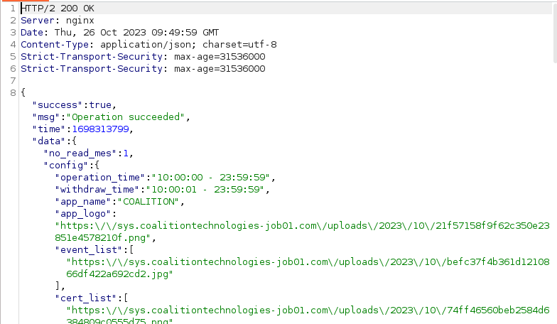
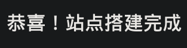
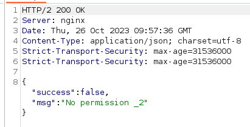

# Coalition Technologies

## Receiving Scam

Recently, I received this message from a 'recruiter', and instead of blocking, I decided to reply. This number had a country code of `62`, indicating that it is an Indonesian number.


Afterwards, another entity with a Singaporean number contacted me.


Firstly, as a student of computing, I think that any form of software optimisation is **REALLY HARD**. This 'recruiter' says that we just have to 'click on the app' and it will be optimised. If software optimisation were as easy as that, then I think computer scientists wouldn't be paid as much.

Anyways, I played along. I was given an invitation code to use, and told to inform this person after registering a new user on the site.

## Initial Web Enum

As usual, I opened all links in a fresh VM with Burpsuite intercepting every response to be safe. 



Burpsuite is a tool used to view the the Internet (HTTP) traffic between my computer and the remote server. Using this, one can gain a better understanding as to how the remote server works, and how it processes information from the user.



The first URL at `https://coalitiontechnologies.com` seemed totally legit.


There was nothing out of the ordinary about this site, and running searches on this company returned a lot of legit results.

The interesting part was the second URL pointing to `https://shop.coalitiontechnologies-job01.com/`.

Visiting brings me to a login page:


Before going into the services, I took a look at the URLs via a tool called `whatweb` to gain some basic knowledge on it, such as where the server is based and what kind of backend services it runs on.



```bash
$ whatweb https://coalitiontechnologies.com   
https://coalitiontechnologies.com [200 OK] Access-Control-Allow-Methods[GET, POST, OPTIONS, HEAD], Country[UNITED STATES][US], Email[chosen-sprite@2x.png,flags@2x.png,sales@coalitiontechnologies.com], Frame, HTML5, HTTPServer[nginx], IP[44.242.171.161], JQuery[2.7.14,3.7.0], Lightbox, Open-Graph-Protocol[website], PoweredBy[The], Script[application/javascript,application/ld+json,rocketlazyloadscript,text/javascript], Strict-Transport-Security[max-age=15552000; preload], Title[SEO Company - #1 Rated in America - We Lift Sales by 4x - Coalition Technologies], UncommonHeaders[access-control-allow-methods,access-control-allow-headers,x-content-type-options,referrer-policy,content-security-policy], WordPress, X-Frame-Options[DENY], X-XSS-Protection[1; mode=block], nginx

$ whatweb http://shop.coalitiontechnologies-job01.com/
http://shop.coalitiontechnologies-job01.com/ [301 Moved Permanently] Country[UNITED STATES][US], HTTPServer[nginx], IP[216.83.44.123], RedirectLocation[https://shop.coalitiontechnologies-job01.com/], Strict-Transport-Security[max-age=31536000], Title[301 Moved Permanently], nginx
https://shop.coalitiontechnologies-job01.com/ [200 OK] Country[UNITED STATES][US], HTML5, HTTPServer[nginx], IP[216.83.44.123], Script, Strict-Transport-Security[max-age=31536000], Title[app], X-UA-Compatible[IE=edge], nginx
```



There are a few key differences here:
* Both the sites were running on different backends, which on its own is not enough to safely say that this is a scam.
* The first site had a custom title, while the second one just had `app`, which looks kinda suspicious.
* The first site seemed to have much more headers for it, while the second did not.

Next, I wanted to take a look at the page sources for both of these sites. The fake website had some Chinese on it, which isn't always the best sign:


## Domain Names + TLS Cert

If you haven't noticed by now, both of these sites have domains that are actually **completely different**. 

The first site was running on the `coalitiontechnologies.com` domain, which was legit. Since they probably owned that domain, any subdomains on the legit site would be something like `shop.coalitiontechnologies.com` or something. 



A subdomain is basically another site that has the same base domain. So if `example.com` is a domain I own, I could host two different sites on `portfolio.example.com` and `resume.example.com` for example. Basically, it allows me to only buy 1 domain and split it for multiple different websites.



The second site, although it had `coalitiontechnologies` within the URL name, was actually a different domain. The 'base' domain for the second site was `coalitiontechnologies-job01.com`, a completely different domain from the legit one. `shop.coalitiontechnologies-job01.com` is just one of the active subdomains. 

To confirm this, one can check the TLS certificate to see the domains it applies to. 



For non-tech readers, TLS certificates are basically the things used to encrypt web requests and traffic between your computer and a remote server. It is the thing that puts the 'S' for Secure in 'HTTPS'.

If the traffic was not encrypted, an attacker can sit in between you and the server (figuratively or even literally) and intercept all your unencrypted traffic to read the data you send. This is called a **Man In The Middle** attack, and this could result in leaked passwords or other sensitive information depending on your interaction with the website.



One can examine this certificate by clicking on the lock icon.


Here's the legit website's certificate:


And here's the fake one:



The two certificates are completely different, and are for completely different domain names. Some organisations use one TLS certificate for all their domains. For example, NUS uses a wildcard TLS cert to manage all their domains.


The wildcard in this case is the `*` character, meaning that this one certificate manages all of the subdomains within NUS, like `comp.nus.edu.sg` or `chs.nus.edu.sg`. In some cases, companies may opt to have different TLS certificates to prevent all their domains from being compromised if the Certificate Authority has been hacked.

So if the Certificate Authority for NUS's TLS certificate had the private key leaked, then **ALL** domains from NUS could be spoofed.

## Subdomain Enumeration

I was still curious about how exactly this scam functions, and since the scammers already had my phone number I decided to just login.

The website had a pop-up that showcased some kind of 'rewards':


The website was pretty basic, and it was the classic 'Deposit money and get paid!' scam.


There was a `/apisUrl` endpoint located on the server too when traffic was proxied via Burpsuite, which returned some JSON.



Interestingly, I found a subdomain of this site at `sys.coalitiontechnologies-job01.com`. Running a `feroxbuster` scan on this site reveals a few interesting directories.



For non-tech readers, directory scanning is an enumeration technique to find all the file system of a website. Tools like `feroxbuster` or `gobuster` are used to brute force all of these. They use something called **wordlists**, which are basically giant `.txt` files containing popular names of directories, like `/admin` or `/static`. 




Visiting this site just shows me some basic chinese, and translated it means 'Success! The site works.' 



Fuzzing this one revealed nothing much, I was denied access to every directory / endpoint. 

## Scam Enumeration

Back to the main website, I took a closer look at the requests being sent to the server and how exactly did this scam work. Within the requests, there was an `Authorization` HTTP Header, which was sending:

```
<some MD5 hash>!<my phone number>
```

Without it, I was unable to access the API.



Right after this, I was IP blocked from the site, which was no matter since I could just change VPN. They were dumb enough not to block my phone number lol. 

In order to draw money, I had to key in my details for the site:


It doesn't even bother verifying the details entered. Anyways, I could not withdraw money because I didn't do the tasks.


In order to do the tasks, one has to dump at least $100 into the site, and it will then do something when I click start.


So basically, they promise you get paid by clicking 'Start', and the 'account details' aren't even verified to at least ensure you enter a valid provider. Also, if one could make 'software optimisation' as easy as clicking a button, why would you want to hire someone for that. 

There wasn't much else I could do with this website, so I moved on.

## Talking to Scammer

I went ahead and contacted the scammer and told them that their site was pretty bad.


I think they were pretty depressed:


Anyways, surprisingly they didn't block me, so I just told them that ruining lives is bad, and asked them if their family knew what they were doing now, how would they feel? Also I sent them a bunch of articles about how people's lives have been ruined.

Had a pretty decent (and totally unexpected) chat about their life before blocking them.

## Conclusion

Scam! I have reported the scammers and blocked them. Was pretty interesting to see how these sort of sites functioned. Of course, I reverted the VM back to a prior snapshot I took before I went on the website.