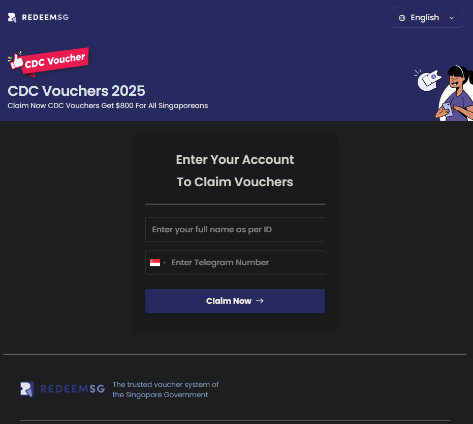
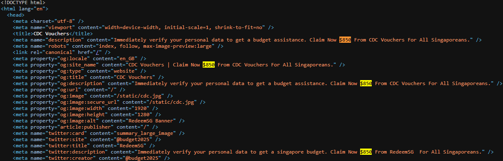
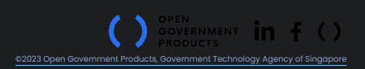
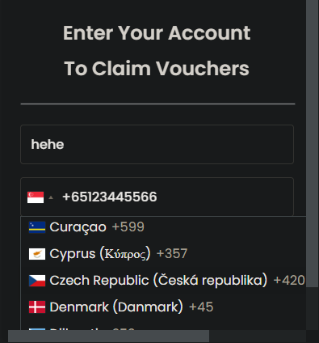
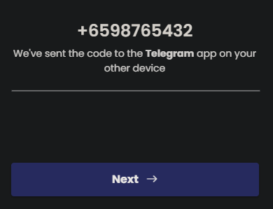
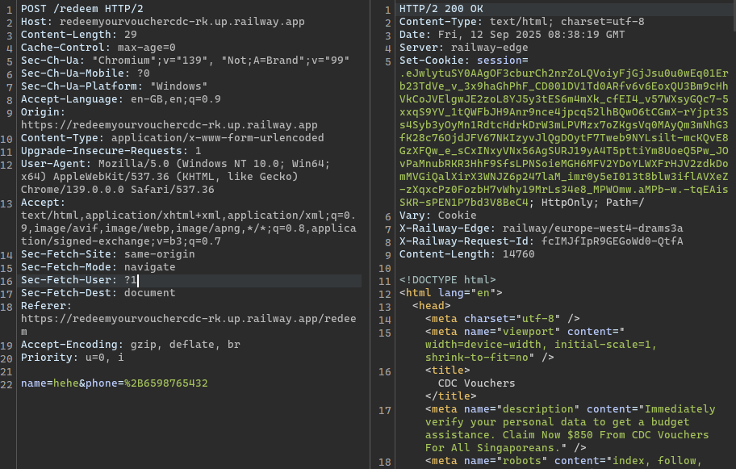
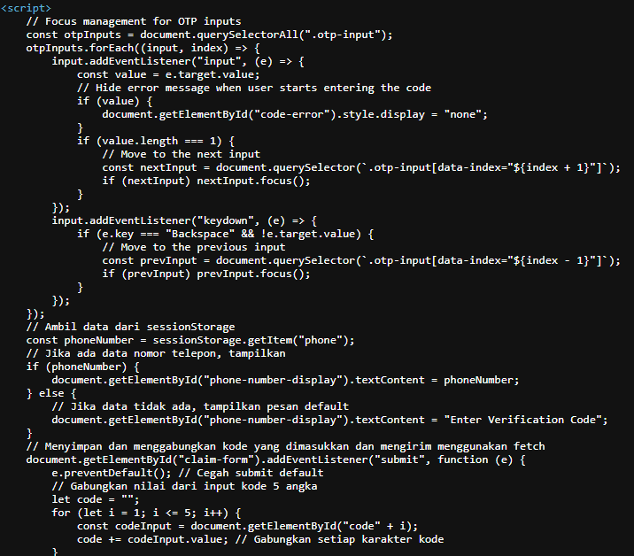

# CDC Voucher Telegram Scam

## CDC Vouchers?

In the middle of doing application security testing, I received this notification on Telegram from someone that I had not spoken to in a long time:

Normally, I would ignore this. But, this time I already had all my security tools up and running, so I took a closer look.

### Telegram Group

This message was forwarded from a `CDC VOUCHERS` channel:

To my knowledge, the Singapore government does not use Telegram channels to distribute these vouchers.



CDC vouchers are government-issued digital vouchers in Singapore that households can use to offset daily expenses at participating supermarkets, hawkers, and other shops.



### Web Enumeration

Clicking the application shows that this is a custom application deployed on Railway:

I visited the site in a sandboxed machine just in case. The website imitates the Singapore Government site, using the same fonts and colours.

The page source itself does not reveal much, other than the discrepancy for the amount of vouchers given. The amount advertised is \$800, but the attacker mentioned \$850 within the page source:

The bottom of the page also shows that the scam may have started in 2023:

So this attacker is probably not Singaporean, since I am quite certain most Singaporeans would know how much is given.

The website itself seems to allow non-Singapore phone numbers as well:

When a phone number and name are submitted, the app states that a Telegram code is sent to a device.

The subsequent POST request:

The input parameters are well-validated, so no injection attacks. The page source of the `/redeem` endpoint shows some interesting comments:

There's some basic code to handle the OTP code passed in. For some reason, the attackers gave up on English halfway and switched to **Bahasa Indonesia**.

What I suspect they are doing is:

1. Getting a user to enter their phone number.
2. Triggering a Telegram OTP using the phone number, and waiting for the user to enter their OTP code on the scam site.
3. Taking over the account, and sending this message to every other contact on Telegram. This explains why it was sent to me randomly.

This is obviously a scam, and it preys on victims who are not aware of Telegram account stealers. There are many discrepancies in the site, with some indicating that this scam has been attempted every year since 2023, and unfortunately people still fall for it.

It is also quite obvious that some AI tool was used to generate the front-end code, judging from the code comments left behind.