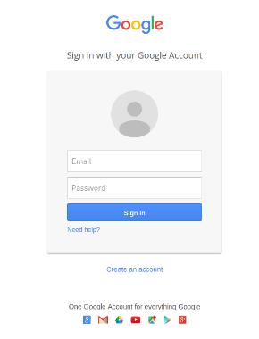
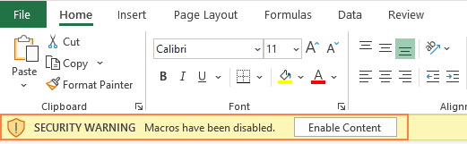

# Social Engineering

Social engineering is a tactic to make a target reveal sensitive information or perform a specific action (like transferring money). These attacks include:

* Scam emails asking you for money.
* Phishing documents with embedded viruses.
* Impersonation over the phone.
* Malware disguised as legitimate bank applications which steal sensitive data from a user.

Social engineering attacks are easy to perform with a high success rate, with around 70 - 90% of all cybersecurity attacks starting with phishing. In Singapore, victims losing millions of dollars to scammers.



## Types of Attacks

There are a few types of attacks:

* Pre-texting
  * Placing the person in a realistic but fake situation.
  * One could impersonate help desk staff, then ask for your email and password for 'administrative' purposes.
  * Most of the time, attackers will try to create a sense of urgency to force the victim to panic and act rashly. This is done through mentioning limited time offers or telling the victim they are in trouble with the police.

* Phishing
  * Spear Phishing - Targeting specific individuals within an organisation. These attacks are highly successful as attackers take their time to study the target, find out their habits and craft the best possible attack.
  * Whaling - Targeting senior management, such as CTO or CEO, to gain specific info about an organisation.
  * Vishing - Scam calls

* Baiting
  * Leaving CDs and USB drives on the floor and getting someone to pick it up and connect to their device.
  * These devices can contain ransomware or other forms of malware that executes upon connection to a computer.
  * The drama hacker show Mr Robot does show [this](https://www.youtube.com/watch?v=O5MvtqgLYeA) pretty decently.

* Physical
  * Tailgating someone to an entrance. Can be as simple as asking someone to hold the door for you.
  * Dressing up as plumbers to gain access into buildings.
  * Faking ID cards and badges, as most employees lack proper training for staff when it comes to simple observation due to complacency. Most security guards are likely to shy away from confrontation and not challenge a legitimate looking ID card too.

## Examples of Attacks

### Credential Harvesting

Credential Harvesting is an attack that involves stealing personal data from a user, and one common attack vector is through faked login pages, which can be generated using the Social-Engineer Toolkit (SET), a framework designed for social engineering attacks.



For example, one can generate a website login that is identical to the Google login page:

This page is identical to the real Google login page, so all links point to valid domains and the icons are in the same positions. One can attempt to sign in:

<figure><figcaption></figcaption></figure>

Upon pressing 'Sign in', an attacker's computer can capture the result.

<figure><figcaption></figcaption></figure>

Afterwards, the user will be redirected to the real Google sign in to reduce any suspicion that they had just been phished.

Setting this up took less than 20 seconds, and you best believe that it's just as easy for an attacker to set it up and deploy publicly. Phishing as a Service is already present in the dark web, with criminal attackers offering their services to create personalised emails or websites to be delivered to victims.

### Macro Attack

Another common attack vector is embedding malware within documents such as PDFs or Microsoft Word Documents. These are designed to be executed upon a specific event such as opening the document, and this technique is the most popular initial access vector by hackers today.

For Microsoft Office documents, this is done using Macros, which are basically Visual Basic Scripts. Originally, these were designed to quickly automate tasks, and hackers ruined that.

An attack can be demonstrated using Crafty from Proving Grounds Practice, where a payload (malicious code) is embedded within a Microsoft Word document posing as a 'resume'. For this machine, the website allows the uploading of `.doc` files:

<figure><figcaption></figcaption></figure>

Further suppose a user will open **any resume** uploaded without checking. As such, I can create a VBS script like so:

<figure><figcaption>
<em>Encoded Reverse Shell</em>
</figcaption></figure>

Afterwards, the code can be assigned to an event, such as the starting of Microsoft Office to read the document:

<figure><figcaption></figcaption></figure>

Afterwards, the file can be uploaded. When the user opens the file, the payload executes itself. In this case, it triggers a callback to my machine which can be used to steal credentials for the user `thecybergeek`. 

<figure><figcaption></figcaption></figure>

This is a basic example of how Macros can be used maliciously to steal credentials. In most cases, anti-virus solutions can scan these documents and detect malicious code. However, these solutions can always be bypassed with code obfuscation and encryption.

### Phone App Malware

An increasingly common attack vector in Singapore today, done through convincing users to download an application to buy commodities such as durians or eggs.

I have been trying to get my hands on a sample to reverse engineer and analyse, but obviously it is not being uploaded anywhere... I tried to contact the scammer themselves but they did not reply me. 

Either ways, this author posted a great article into the analysis of a sample he got, showing how it works, where the information goes, and how attackers end up stealing information.



To prevent falling victim to this, don't install applications from random places. If you do, NEVER give it permissions over your camera and microphone

## Mitigations

In the case where one has discovered a potentially malicious domain or email, inform the organisation's security team / delete the document. Other employees should be made aware as well to prevent anyone from falling prey. **DO NOT FORWARD THE DOCUMENT TO THE REST!**

### Check Links

Secure websites will have a `https://` instead of `http://`.  The 'S' in HTTPS means secure, which means that the site has end to end encryption, preventing your data from being read by anyone intercepting responses. Typically, your browser will tell you if a website has valid certificates and encryption is enabled.

However, certificates themselves are not enough to determine if a website is safe, as one still has to determine WHERE a URL leads to. Another thing to check for is domain name. Here are some fake websites:

* https://facebook.corn
* https://gooogle.com
* https://twitter.corn

The domains above look legit if glanced over. Attackers can also perform **domain squatting** by buying and registering these lookalike domains, then loading them with malicious code / credential harvesting pages for users to accidentally use.

### Enable Content Button

When receiving files from an unidentified sender, always make sure that the sender's email is legit and from authorised people.

Even if you were to open Microsoft Office documents accidentally, there is still one last line of defence which is this yellow pop-up.

<figure><figcaption></figcaption></figure>

Honestly, I find it stupid that Microsoft does not flag this out more, as most users just press 'Enable Content' without much consideration. Please do not enable content unless you need to!

The best is to never download the file to your computer. No one can know for sure if it is safe.