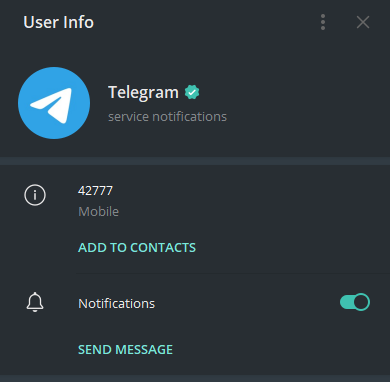

# Telegram Customer Service

## Fake Customer Service

I recently received this message from a `Customer Service Assistant` user on Telegram. It claims that I 'breached regulations', I and must 'verify myself within 6 hours' or my access will be revoked.

For context, the message was sent at 11.54am, and it is 9.30pm at the time of writing. Telegram still works fine for me.

If you glance really quickly, then it looks real thanks to the 'verified' blue tick symbol used. However, this is fake, as highlighted by Telegram themselves.

Telegram Premium allows you to set custom emojis, which can be stickers, next to your name instead of the default star symbol. Sure enough, the blue tick icon is a custom sticker pack.

The contact itself also looks different from the **actual** Telegram service notifications.

Here is the real one:

And here is the fake one:

Really different. The real one indicates it is for **service notifications**, whereas the fake one is clearly a (malicious) user. Also, the URL sent is clearly some kind of third-party site.

Now, knowing that this is clearly a scam, I took a look at the website in a virtual machine with Burp Suite to proxy the requests.



A **virtual machine (VM) is like a computer inside your computer. It lets you run different operating systems or software in a separate, isolated environment, so you can test things or run programs without affecting your main system.

**Burp Suite** is a tool used by cybersecurity professionals to test the security of websites. It acts like a middleman between your browser and a website, allowing you to inspect, modify, and analyze the information being sent and received to find weaknesses or vulnerabilities.



## Website Enumeration

When the website is visited, I am redirected to another site:

The first thing to note is how the final website URL ends with `.xyz`, which does not look official compared to `.com` or `.net`.

The page title also copies the official Telegram Web, making it more real for unaware users:

So this page is trying to mimic a real Telegram login page. I filled in a fake phone number to see what happens.

Pressing 'Next' will prompt me for a code.

This code is sent when a user is trying to login to Telegram from an unknown device.

So, if I were to key in the actual code sent to my actual number, it allows a threat actor to login as me on another device. They can then do impersonate me and send messages, of which I notice they tend to promote cryptocurrency scams to the user's entire contact list.

Next, I took a look at the website requests being sent. The first thing I noted was the requesting of `/system/context.js` from this website:

The website uses `.ru`, hinting that it is a Russian site, so this scam is probably by a Russian threat actor.

Next, I noticed that there were no actual HTTP requests being sent to the server. Instead, I kept getting WebSocket requests:



HTTP requests and WebSockets are two ways for computers to talk to each other over the internet.

HTTP requests: Like sending a letter — you ask for something (like a web page), the server gets your request, sends back the information, and then the connection closes. It is a one-time conversation.

WebSocket: More like a phone call — once the connection is made, it stays open, so both sides can send and receive information anytime, in real-time, without having to reconnect every time. This is great for things like chat apps or live updates.

The actual data is being sent to `https://kws4.web.telegram.org/`, which is a legitimate domain owned by Telegram. The data looks like a bunch of garbage characters because it is **encrypted**, and it is impossible for me to decrypt it.

I wanted to dig deeper into this, but it appears that tbe traffic would be encrypted anyways, plus I did not want to enter my real phone number and risk losing my account.

Instead, I took a look at the page source using the browser's inspector tools. Sometimes, people leave extra information here, like code comments or links to other sites.

`Base64` strings were used within it.



Base64 is a way to encode data into a string of text that only uses letters, numbers, and a few symbols. It is often used to safely send things like images or files over the internet, making sure the data does not get messed up along the way. **This is not a form of encryption, it is just another way of writing data and it can be decoded**.



It is always suspicious to see 'real' websites have `Base64` strings included in them. I decoded one of them in the terminal to get `Telegram Security Check`, which is still odd.

## Conclusion

I could spend hours diving into each Javascript file and resource used by this website, but I think the information I have suffices to conclude that this is a fake Russian account stealer.

So this form of attack is known as **phishing with account compromise**. The initial message preview tries to create a sense of urgency to get the user to perform an action. When a user is hasty and stressed, they can gloss over obvious details that reveals shows it is a scam.

The website itself looks very similar to the real login for Telegram, and an already stressed user that wants to save their account can gloss over the domain information and page source. The user sending the message also looks convincing, with the fake verified symbol.

It is important to exercise caution when receiving messages from unknown users, and especially so when these messages contain URLs for us to click.