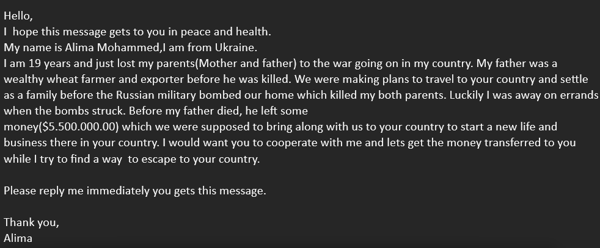

# Ukraine

## Ukraine Emails

I recently received this email from some random user:

To me, this is an obvious scam. This is because:

* The sender is `mrs.geralev@gmail.com`, which doesn't match the name of the sender.
* The recipients are 'undisclosed', for whatever reason.
* If you read the message, it sounds very...off. Why would a 'war victim' need MY help?

All of this is nothing new when it comes to scams, I just found it extremely disgusting that people are seriously trying to profit from a war that has killed at least 100,000 people, most of whom were innocent.

The worst part is that these are all over the place. Scammers really are the worst people.




