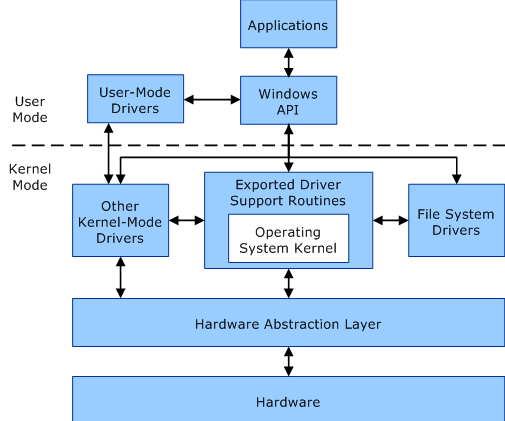
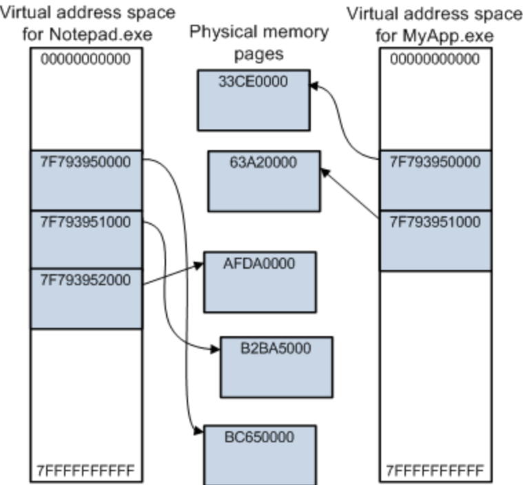

# Windows Fundamentals

## Modes

Processors running Windows have 2 modes:

* User Mode
* Kernel Mode

Here's an illustration of how it works:



### User Mode

Applications run in User Mode, and Operating System (OS) requirements run in Kernel mode. Most drivers also run in kernel mode, but some can run in user mode.

When you start a process like `notepad.exe` (a user mode application), Windows creates a process for the application. This process is then given a private Virtual Address Space and a private handle table. This is set to **private** to prevent memory data from one application being altered by another.

Each application runs in isolation, meaning that one process doesn't affect another. If it wasn't, then something like `chrome.exe` crash if `notepad.exe` crashes. The virtual address space of a user mode application also cannot affect the space for the OS (kernel mode).

### Kernel Mode

All code that runs in this mode share a single virtual address space. This means that if a kernel mode application happens to write data to somewhere else, other parts of the OS could be affected.

They also don't run in parallel, meaning that if one crashes, the whole OS crashes and we get BSOD'd.

## Processes and Threads

### Processes

In its simplest terms, a process is the execution of a program. Running an application on Windows consists of one or more processes whcih run in parallel. Each process has the following:

* Virtual Address Space allocated
* Open handles to system objects
* Executable Code
* A unique Process ID (PID)
* Priority Class
* Security Context
* Uses environment variables

When we start something like `notepad.exe`, the OS will start the process with a **primary thread**, and the process can create additioanl threads from any of its active threads.

Processes can also spawn child processes. A process that does so is called the **parent process**.

### Threads

A thread is a unit of which the OS uses to allocate processor time. All threads of one process share virtual address space and system resources, meaning they can communicate and share data. They are also managed in the context of a process, and have their own thread context.

That being said, threads are allowed to have their own security contexts, which can be used for impersonation of users.

## Virtual Memory

Almost all computers today use virtual memory, which allows for a larger range of accessible memory buffer that is larger than the available physical memory. Virtual memory relies on **pages**, which are 4KB chunks that divide the whole memory range. If the memory supply is small, the memory manager saves pages of physical memory to a disk file. Pages of data or code are shifted between the memory and the disk when needed.

TLDR --> Allows for more memory without physical limitations, mapping chunks of memory to disk files allows for 'secondary memory'.

Pages have 3 states:

* Free --> Page is free to be reserved or committed. However, this cannot be read from or written to.
* Reserved --> Reserved for future use. Page is not accessible yet, and there is no physical storage.
* Committed --> Memory charges have been allocated from the overall size of RAM and paging files on disk. The page is accessible and is controlled by one of the memory protection constants. When the process using this page terminates, the page is made free again.

There are quite a few memory constants represented as integers:

* `PAGE_EXECUTE_READWRITE` --> `0x40` enables RWX of memory. Discouraged since memory being both WX is not common.
* `PAGE_READONLY` --> `0x02` enables R of memory.
* `PAGE_NOACCESS` --> `0x01` disables all access.

Memory has some protection as well. These don't make memory exploits impossible, but certainly a lot harder:

* DEP (NX) --> Prevents memory from being executed within a certain region.
* ASLR (PIE) --> Randomly arranges address space positions of key data areas of a process, including base of the executable.

Here's an illustration of how the memory works:



The above shows how two processes have their own virtual address space. The processes use contiguous memory regions, but they are not mapped to contiguous physical memory slots.

Memory can be accessed using functions from the Windows API suchas `HeapAlloc()`.

## DLLs

This is Windows version of the `libc.so` files we have in Linux systems. These files cannot be executed like a `.exe`. Similar to their Shared Object counterparts, contain executable functions or data that can be used by multiple applications concurrently. Most of the time, they are used to export functions used by a process, and they have to be invoked by other programs to execute the code.

Windows uses a system-wide DLL base address to load some DLLs at the same base address in virtual memory space for all processes to optimise memory usage. Most processes use functions exported from `kernel32.dll`, which exposes most applications to the Win32 base APIs.

For example, if our process calls `CreateProcessA`, it needs to have `kernel32.dll` loaded within it's virtual memory space, else it will fail. Most of the Microsoft functions are quite well-documented, telling you what each function requires as input and what it does. Here's the `CreateProcessA` format:

```c
BOOL CreateProcessA(
  [in, optional]      LPCSTR                lpApplicationName,
  [in, out, optional] LPSTR                 lpCommandLine,
  [in, optional]      LPSECURITY_ATTRIBUTES lpProcessAttributes,
  [in, optional]      LPSECURITY_ATTRIBUTES lpThreadAttributes,
  [in]                BOOL                  bInheritHandles,
  [in]                DWORD                 dwCreationFlags,
  [in, optional]      LPVOID                lpEnvironment,
  [in, optional]      LPCSTR                lpCurrentDirectory,
  [in]                LPSTARTUPINFOA        lpStartupInfo,
  [out]               LPPROCESS_INFORMATION lpProcessInformation
);
```

While DLLs cannot be directly executed, `rundll32.exe` allows for us to run specific functions within them.

```
Usage: rundll32.exe <DLL_NAME>,<FUNCTION_NAME>
rundll32.exe kernel32.dll,CreateProcessA
```

This explains why `rundll32.exe` is so well-signatured and all C2 tools try to migrate their processes elsewhere.

## Windows API

The Windows API is the programming interface provided to programmers to interact with the OS and hardware components. The `ntdll.dll` DLL is the lowest layer available in user mode, commonly called the Native API or NTAPI. This file is also used to implement many of the kernel APIs used in `kernel32.dll`.

Here's how the flow goes for file creation:

* Process calls `CreateFile`.
* `CreateFile` calls `CreateFile` API from `kernel32.dll`.
* `CreateFile` calls `NtCreateFile` from `ntdll.dll`.
* Does a `syscall`, which calls kernel drivers and performs the task.

It is possible for applications to invoke `syscall` to NTAPI directly.

## Tools

One can find out what each process is doing, what DLLs it has loaded, what functions it is calling and how the memory is mapped using tools like x64dbg or Process Hacker.





## Resources








