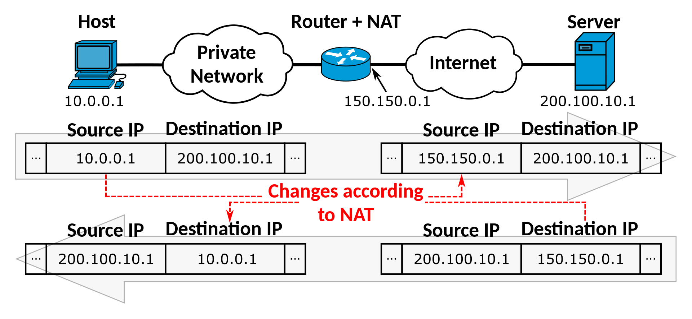

# Addresses

Currently, there are a few type of addresses in networking. There are IP addresses, MAC addresses, port addresses, logical addresses and so on.&#x20;

## MAC Address

The **Media Access Control (MAC)** address is a unique, 12-character alphanumeric attribute that is used to identify individual electronic devices on a network.

MAC addresses are sort of like the ID numbers of computers, and there are unique identifiers for each computer. Each MAC address is tied to the Network Interface Controller on a device, and from a MAC address we can tell the manufacturer of the device, as well as the ID of the device itself.

MAC addresses are structured like so:

<figure><figcaption></figcaption></figure>

The OUI would tell us who made the device, like Apple or Microsoft. The next part is tied to the NIC of the device, kind of like an ID. Each MAC address is unique and different across each device (that does not stop the spoofing of MAC Addresses!).

## IPv4 Addresses

As the name implies, the **Internet Protocol (IP)** address is a numerical label, such as **192.0.0.1**. I like to think of them like a computer's home address. Without an IP address, routers and switches do not know where the computer really is. IP addresses can be tied to a domain name (like google.com or comp.nus.edu.sg) and referenced via Domain Name Service (DNS) protocols. Within LAN networks, each device has their own IP address.

An IP address is structured like this: **x.x.x.x**, where each **x** is an arbitrary number from 0 - 255 and each number is called **an octet**. There are a few special cases, such as not having 0 as the first number.

There are 2 types of IP address**:**

* **Private IPv4 Address**
  * These are what are used within our **local networks**, meaning they cannot be found on the Internet and no one can connect to them directly from the Internet.&#x20;
  * Used mainly in homes, offices, or other Local Area Networks (LAN).&#x20;
  * These are further split into 3 different subclasses. **There are actually more, but I'll only cover these.**
    * Class A: 10.0.0.0 to 10.255.255.255 with default of /8.
    * Class B: 172.16.0.0 to 172.31.255.255 with default of /16.
    * Class C: 192.168.0.0 to 192.168.255.255 with default of /24.
* **Public IPv4 Address**
  * These addresses are what online servers, like Instagram and Facebook uses.&#x20;
  * They are meant for everyone to know so people can connect to them and use their serviecs online.
  * Technically have their own classes as well, but generally are all IP addresses that don't fall into the ranges stated above.

### Subnets

Subnets are basically a logical subdivision of an IP network. For example, a common network subnet is **192.168.0.0/24**. That /24 has a significant meaning to it.

In IPv4 addresses, all the IPv4 addresses are 32-bits, with each octet having 256 possible values from 0 - 255. To understand subnetting, we need to understand how to count in bits. Now suppose we want to represent the number 173 in binary, AKA 1s and 0s.&#x20;

#### Binary Counting

We can use the table below to see how it's done. Starting from the most significant bit, we check the first bit, representing the number 128, can fit within 173. It can, so we indicate a 1 in the box, and then take 128 away from 173, giving us 45.

Then, we check if 64 can fit within 45, and it cannot because 64 > 45, hence we put a 0. repeat this process until we get finish all the bits and the number is represented. We should get a table like this:

<figure><figcaption></figcaption></figure>

So basically, 173 = 10101101 in binary. This is an 8-bit number, meaning that it can only represent up to 256 or 2^8 numbers, maxing out at 11111111. For larger numbers, like 16 or 32-bit, they can be presented using more columns in the table.&#x20;

#### Subnet Counting

As mentioned earlier, within a LAN network, each device has their own IP address so packets know where to go and do not clash basically. So when we buy an IP address, we don't usually buy just one, we would typically buy a subnet of them.

Most routers we buy nowadays operate on the /24 subnet. /24 is known as the **subnet mask**, and in this case represents the **network prefix**, meaning there are 24 bits allocated to the prefix, and **the remaining 8 bits are the host IDs**. Combined, these make up a total of **32 bits, which is the max for IPv4 addresses**. The maximum number of hosts on a this network would be **2^8, where each host has a unique host ID.**

So on a singular router at home, I can have up to 254 devices. The number of possible hosts on a network is given by **taking the total number of hosts and minusing 2**. Basically, 2^8 - 2.&#x20;

The minus 2 is there because we need to reserve addresses for two things:

* Network Address&#x20;
  * The router needs an IP address itself! So it takes one.
  * Usually it is the **first address**, like 192.168.3.0.
* Broadcast address
  * This serves as the address used to **broadcast** all the traffic across the subnet.
  * This is usually the last address, like 192.168.3.255.

This means that **the last possible host is on 192.168.3.254.** And the first possible hostis 192.168.3.1.&#x20;

The reason this works is because I am able to split my IP address into 2 logical partitions, one for the network prefix and one for the host IDs.&#x20;

Now you might notice, the 3 groups of IP address mentioned earlier have a different numbers. This is because they are **able to support different numbers of hosts on a network.**&#x20;

#### Subnet Masks

Earlier, I mentioned that /24 is an example of a subnet mask. Theese can be represented in octet manner as well.

/24 would be the same as 255.255.255.0. This means that we have allocated all of our single subnet to hosts.

If we were to have another number like /26, then it means we have 2^2 networks, each with 2^6 - 2 hosts within them. We would need to use the default subnet mask for the network group we are dealing with. The number of subnets is given by **2^(subnet number - default number).**

For example, 192.168.123.0/26 would have 2^2 distinct subnets, with 192.168.123.0 to 192.168.123.64 being one , 192.168.123.65 to 192.168.123.128 being another and so on. These would segregate one subnet of /24 into 4 separate networks.

This is useful because networks are able to be partitioned and kept separate. Each partition could be used for different floors in a company. Each of the different groups has a different default.

For example:

* 172.16.123.0/17 has 2^1 possible subets with 2^15 - 2 possible hosts on each subnet
* 192.168.152.0/30 has 2^6 possible subnets with 2^2 - 2 hosts on each subnet.
* 10.0.0.0/8 has 2^0 possible subnets with 2^24 - 2 hosts on the one subnet.

To practice more, I recommend this website for Subnetting:



### Network Address Translation

Earlier, I mentioned that private IP addresses aren't used to route traffic on the Internet. So if we have a request coming in from the Internet, how does the public-facing server send the request to the correct backend device?

This is where Network Address Translation (NAT) comes in. NAT is specifically used for IPv4 addresses, and is a mechanism that ties **private IP addresses to public ones**.&#x20;

Here's an image of how it works:

<figure><figcaption></figcaption></figure>

This is how routers are able to translate traffic coming from the Internet to the private backend network. As such, **private networks need not have unique addresses**. But, public addresses still need to be unique.&#x20;

NAT solved an issue of **IP Address Shortage**. Take note that when IPv4 was developed, it was developed when technology was not as widespread. As a result, it only has 2^32 possible addresses, which was a lot at the time.&#x20;

As technology continued to grow, there weren't enough IP addresses going around. As such, NAT was used to temporarily mitigate the issue of lacking IP addresses by basically allowing multiple devices to have their own local networks. As such, theoretically speaking, a company would only need to have **1 address** that is public facing to handle requests directed to the backend (assuming it was a mega-supercomputer handling everything).

This was a temporary fix, and something else was in development to resolve this issue entirely. This thing is called **IPv6 Addresses**.&#x20;

## IPv6 Addresses

IPv6 addresses are built different from IPv4 addresses. They were developed with the lack of IP addresses in mind, and as such look like this:

<figure><figcaption></figcaption></figure>

This uses hex numbers instead of octets like IPv4. Because of this, there are 2^128 possible addresses, which is about **340 trillion trillion trillion unique addresses**. Personally, I think that's enough.&#x20;

Typically IPv6 addresses have loads of 0s within them, such as **2001:0D88:AC10:FE01:0000:0000:0000:0000.** This can be represented as **2001:0D88:AC10:FE01:0:0:0:0** for easier referencing.&#x20;

IPv6 are still governed by similar laws, having public and private addresses respectively. There are different types of traffic that are supported as well, namely **unicast, multicast and anycast.** (See Packets).

### Subnetting

IPv6 Subnetting is a bit easier than IPv4 subnetting. This is because IPv4 has limited address space, hence the need to calculate out numbers and make sure that there is no wastage. However, with IPv6, the common practice today is to use /64 as one subnet. Since there are 128 total bits, this means there are 2^64 possible hosts on a network. This is clearly enough for anything.

IPv6 subnetting is not as mindful of efficiency of allocation, because there are just too many addresses. There are about 30 billion devices today, and that's no where near close to the 128-bit integer limit.

## Loopback Address

One last address that is important to take note of is **127.0.0.1**, otherwise known as the Loopback Inteface. This address refers to your computer itself, meaning if I ping 127.0.0.1, either I'm pinging my own device or I'm pinging another logical interface I've configured that **never goes down.**&#x20;

It's a logical address (not physical) that is mainly used for debugging purposes. **Because it is logical and not actually phyiscal, its always up.**
