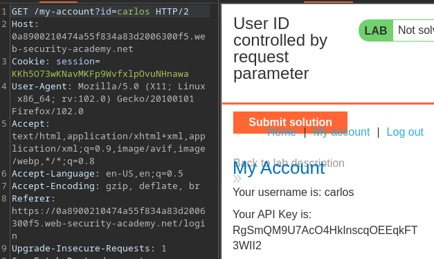
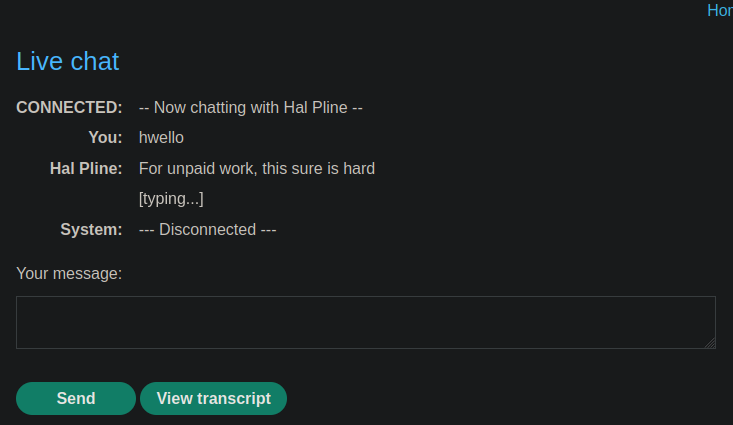
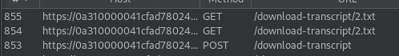

# Portswigger Writeups

## Lab 1: Unprotected Admin Panel

This website has an unprotected admin panel. Visiting `/robots.txt` shows me this:

```
User-agent: *
Disallow: /administrator-panel
```

I can access this and delete the `carlos` user, which solves the lab.


## Lab 2: Unpredictable URL

Same thing as Lab 1, just that the panel is located at a random directory.

Checking the page source reveals this randomised directory:


It's still unprotected, so deleting `carlos` is trivial.

## Lab 3: User role controlled by request parameter

Logging in, I see that there is an `Admin` cookie set to `false`.


Changing this to `true` allows me to view the `/admin` panel.


To solve the lab, just send a GET request to `/admin/delete?username=carlos`.

## Lab 4: Modifiable User Role

Loggin in, I see that there is an update email function. When testing it, I can see that a `roleid` parameter is returned in the response:


The POST request sends a JSON object with the `email` parameter. I added a `roleid` parameter and it worked:


This allows me to access the `/admin` panel to delete `carlos`.

## Lab 5: User ID controlled by request

This lab requires horizontal privilege escalation, and I have to obtain the API key of `carlos`.

Logging in, I see that the `/my-account` directory uses an `id` parameter with the username:


Changing `wiener` to `carlos` allows me to view his account:



## Lab 6: Unpredictable User ID

Same as Lab 5, just that the ID isn't as predictable. When viewing blog posts, I can see a few by `carlos`:


I noticed that the blogs posted by `carlos` contain a different user ID in the URL:


Visiting `/my-account?id=213bd623-d8a5-4374-8161-fc52861f3bcc` would show us the API key.

## Lab 7: Data Leakage in Redirect

This lab uses a plain username as the `id` parameter. When visiting `carlos`, it attempts to redirect me to the login page:


However, this does not change the fact that **the user profile is still loaded**.


## Lab 8: Password Disclosure

Logging in, I can see that there's a password change feature, with the user's password already typed in:


This value is present in the page source:


Visiting `carlos` profile via changing the `id` parameter results in his password being displayed:


Change the `id` to `administrator`, visit their profile and read the password. 


Then, login and delete `carlos`.

## Lab 9: Insecure Direct Object References (IDOR)

This lab has a live chat feature:



When using the 'View transcript' function, I can see that `2.txt` is downloaded:



Changing this to `1.txt` shows me the password of `carlos`:


## Lab 10: URL-Based Control Bypass

Attempting to visit the unauthenticated admin panel results in an 'Access denied' being returned:


This lab supports using the `X-Original-URL` header. This header overrides the target URL in requests with the one specified in this header value.

This means that although I cannot visit `/admin` directly, I can do so via using `X-Original-URL`:


I can then solve the lab by specifying `/admin/delete` within this header, which would override the target URL of `/`. The `username` parameter can be written in the target URL.


## Lab 11: Method-Based Control Bypass

To solve this lab, make `wiener` an administrator. This lab also gives us admin access straightaway.

The admin panel has a function to change user privileges.


This thing sends a POST request to `/admin-roles` with a `username` and `action` parameter. `action` is either set to 'upgrade' or 'downgrade'. 

When I logged in as `wiener` and attempted to send the same POST request, I got a 403 Unauthorized.

Changing it to a GET request solves the lab:


## Lab 12: Multi-step process with broken control on one step

This lab highlights the fact that it just takes 1 mistake for access control to be completely broken. To solve, make `wiener` the admin from a unprivileged account.

I upgraded `carlos` to administrator, and there was a confirmation page:


I noticed that replaying this request with the session cookie of `wiener` did not work. However, sending a 'Yes' confirmation (by including `confirmation=true` within the POST parameters) bypasses the authorisation check:


## Lab 13: Referer-Based Control

This lab controls access based on the `Referer` header. When vistiing the admin panel, I noticed the header:

```
Referer: https://LAB.web-security-academy.net/my-account?id=administrator
```

To solve, just send the GET request used to upgrade a user to admin with the `Referer` header set:

```http
GET /admin-roles?username=wiener&action=upgrade HTTP/2
Host: 0a10007a037b05738391a6ec002d0096.web-security-academy.net
Cookie: session=c3YbUWZ8P3UCEY84ZcYT4DwklMlVcDoa
User-Agent: Mozilla/5.0 (X11; Linux x86_64; rv:102.0) Gecko/20100101 Firefox/102.0
Accept: text/html,application/xhtml+xml,application/xml;q=0.9,image/avif,image/webp,*/*;q=0.8
Accept-Language: en-US,en;q=0.5
Accept-Encoding: gzip, deflate, br
Referer: https://0a10007a037b05738391a6ec002d0096.web-security-academy.net/admin
Upgrade-Insecure-Requests: 1
Sec-Fetch-Dest: document
Sec-Fetch-Mode: navigate
Sec-Fetch-Site: same-origin
Sec-Fetch-User: ?1
Te: trailers
```

Remember to change the `Cookie` value to the `wiener` cookie. 