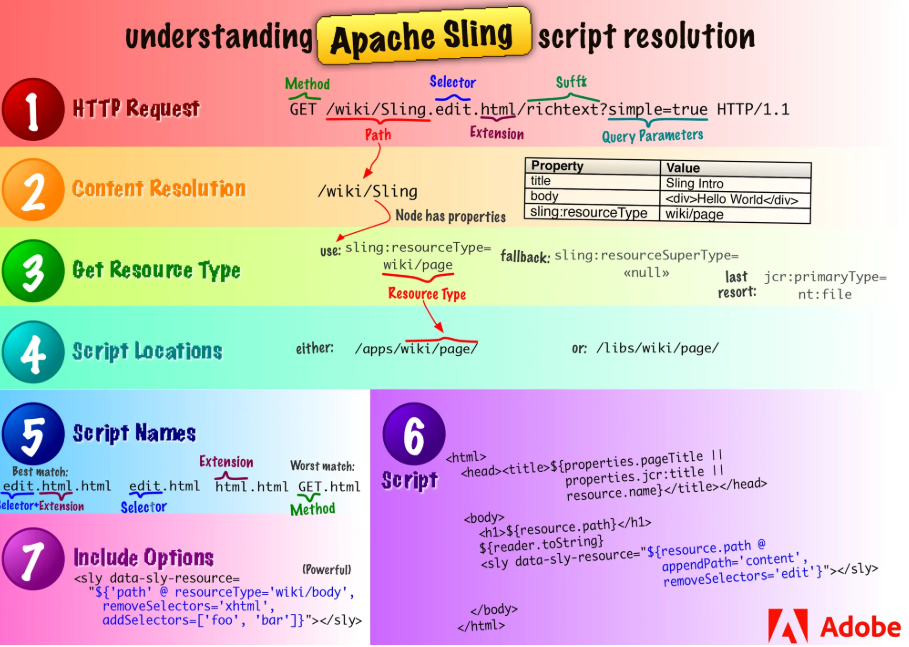
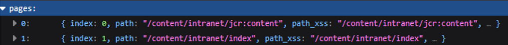

# Adobe Experience Manager Bugs

Recently, I have been coming across a number of Adobe Experience Manager (AEM) related vulnerabilities, particularly ones involving metadata leakage and unauthorised access to confidential content. This write-up covers the types of issues I have encountered and how I find them.

## Understanding AEM

AEM is a content management system developed by Adobe, primarily used by large organisations such as multinational corporations and government agencies to manage websites, digital assets, and other content. It handles things like digital asset management (DAM) and web content delivery.

AEM is built on top of an open-source web framework called **Apache Sling**, which maps incoming URLs to content resources stored in a **Java Content Repository (JCR)**. Based on the resource type, Sling finds and executes the appropriate script or servlet to render the page content in its response.

## Servlets

Apache Sling is a Java-based framework where servlets, which are Java classes responsible for handling HTTP requests and returning responses, are mapped to **resource types** rather than URL routes. This is the core of its "everything is a resource" philosophy, where URLs are resolved to nodes in a JCR instead of being routed to controllers like in a typical MVC framework.

A servlet in Sling responds to a specific combination of:

- Resource type, the type of content being requested (`/myapp/components/page`)
- HTTP method such as GET or POST
- Selectors that modify how a resource is rendered (`.infinity`, `.tidy`)
- Extensions that define the format of the response (`.json`, `.xml`)
- Suffixes
- Query parameters (`?sorted=true`)

For example, a request to `/content/home.infinity.json` is broken down into the resource path `/content/home`, the selector `infinity`, and the extension `json`, which together instruct Sling to render the resource's content tree as JSON.

This is an overview of how it works:



## Security Issues

AEM's default configuration introduces a number of security issues, most of which result in information disclosure through direct access to the JCR.

### DefaultGetServlet

The **DefaultGetServlet** is a built-in Sling servlet that renders **any JCR node** as JSON, XML, or other formats when the appropriate selector and extension are appended to a URL. It is enabled by default with no authentication required, meaning any unauthenticated user can read raw repository content.

In practice, this exposes the actual content and properties stored within JCR nodes, including credentials, user data, and configuration values. The severity of this vulnerability ranges from Low to Critical depending on what is stored. Reading `/content/dam` may only surface public assets, while accessing `/apps/system/config` could expose database credentials or API keys. In some cases, the servlet may also reveal **endpoints that are not publicly accessible**, resulting in a High Confidentiality impact.

Common paths that expose sensitive content include:
```
/content/dam.infinity.json       # dump entire DAM tree recursively
/content/usergenerated.tidy.json # formatted dump of user-generated content
/apps/system/config.json         # may expose passwords and API keys
/home.json                       # may expose password hashes and PII
```

Particularly sensitive paths include `/apps`, `/etc`, `/home`, and `/var`, which may contain secrets such as passwords and encryption keys, private user information, and AEM user data stored in properties like `jcr:createdBy` and `jcr:lastModifiedBy`.

### Dispatcher Bypass

AEM sits behind a component called the Dispatcher, which acts as a reverse proxy and basic WAF. It is often the only security layer between the public internet and the AEM publish instance, barring any enterprise WAFs, making any misconfiguration particularly dangerous. Access to specific paths is controlled through filter rules, however these rules are often trivial to bypass.

Developers commonly add overly permissive rules to allow static assets like stylesheets through the Dispatcher, such as:
```
/type "allow" url ".css"
```

For instance, a website may have `/content/secret.infinity.json` blocked, returning a 403. Visiting `/content/secret.infinity.json/a.css` bypasses the filter entirely, as the Dispatcher recognises it as a CSS request and allows it through. The backend Sling instance then strips the suffix and routes the request to the original servlet, returning the sensitive content.

In some cases, appending an extension like `a.css` or `.xml` is not even necessary. I have found instances where simply appending a `/` character is sufficient, where `/content/secret.infinity.json` returns a 403 but `/content/secret.infinity.json/` does not.

### Query Builder

The **QueryBuilderJsonServlet** is exposed at `/bin/querybuilder.json` and allows attackers to query and retrieve JCR nodes along with all of their properties, making it a more powerful version of the **DefaultGetServlet**. It accepts JCR query parameters, for example:
```
/bin/querybuilder.json?path=/home&p.hits=full&p.limit=-1
/bin/querybuilder.json?type=nt:file&nodename=*.zip
```

Setting `p.limit=-1` removes the result cap, potentially dumping an entire subtree. The **QueryBuilderFeedServlet**, exposed at `/bin/querybuilder.feed`, works similarly but retrieves nodes without their properties. Property values can still be extracted through blind binary search techniques.

## Bug Finding

When I encounter an AEM instance, I typically run this wordlist through Burp Intruder or `wfuzz`:



This covers the various paths that are commonly misconfigured in AEM deployments. That said, a clean result from the wordlist does not rule out vulnerability. Dispatcher rules are applied per path, meaning a rule may block `/content/.infinity.json` while leaving `/content/node/.infinity.json` exposed, where `node` is a path name specific to the application. In these cases, manual enumeration of content paths becomes necessary.

### Example Finding

While hunting on a program, I found that each region of the company ran its own site, with one particular region using AEM.

The wordlist identified `/content/.json` as accessible, exposing the metadata of the node itself. Visiting `/content/.children.json` to enumerate child nodes returned a 403, however appending a `/` to the end bypassed this restriction.

From the returned content, I was able to enumerate all nodes present on the website, including a `/content/intranet` node that was clearly not intended to be publicly accessible. Visiting `/content/intranet/index` directly returned a 403.


However, visiting `/content/intranet.pages.json/` successfully returned its contents:



From here, I iterated through each node, such as `/content/intranet/information.pages.json`, and eventually recovered HTML content hosted on the intranet via the `text` field. I also managed to download files marked as Confidential based on URLs found within the JCR, which escalated the severity of the finding to High.

It is worth noting that AEM vulnerabilities are rarely isolated. I found numerous other company sites in the same region with identical misconfigurations, each of which were triaged as separate findings.

## Resources

On top of the Adobe documentation, I found this set of slides particularly helpful:

