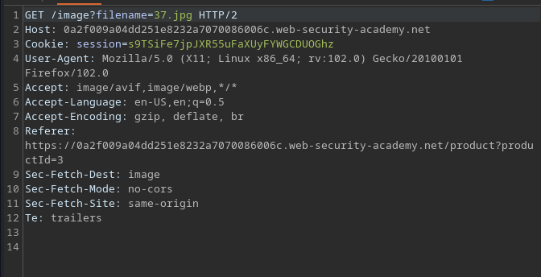
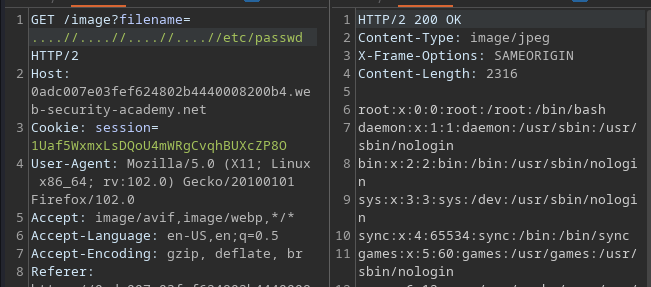

# Portswigger Writeups

## Lab 1: Simple Case

When viewing a product, this is the request that pops up:



Changing it to `../../../../../etc/passwd` solves the lab.

## Lab 2: Absolute PATH Bypass

This lab treats the supplied filename as relative to a default working directory.

Solve by entering `/etc/passwd`.


This bypasses whatever working directory since absolute PATH is used.

## Lab 3: Non-recursively stripped sequences

This application strips all the path traversal sequences before using it.

Since this recursively strips the `../` characters, it is bypassable using `....//`.



The website checks for the `../` string. In `....//`, when `../` is removed, it becomes `../`. Thus, this bypasses whatever stripping done.

## Lab 4: Superfluous URL-decode

This lab is the same as above, except it blocks input containing `../` and then performs a URL decode before using it.

Just double URL encode this:

```
..%252f..%252f..%252fetc%252fpasswd
```

The above would be decoded to `..%2f`, which is processed as `../`. Since I technically did not use `../` directly, this bypasses whatever blacklist there is.

## Lab 5: Validation at start of PATH

This lab checks whether the initial supplied path is 'correct' Just append `../../../../etc/passwd` to the 'correct' path.


## Lab 6: Validation of file extension

This lab checks whether the a valid image is retrieved by checking the extension.

Using a file upload technique, one can include `%00.jpg` to have the extension remain 'valid' since `.jpg` is part of the string.

However, when the string is URL decoded to be processed, the NULL byte truncates the rest of the string, preventing `.jpg` from being processed BUT still bypassing the file extension check.


