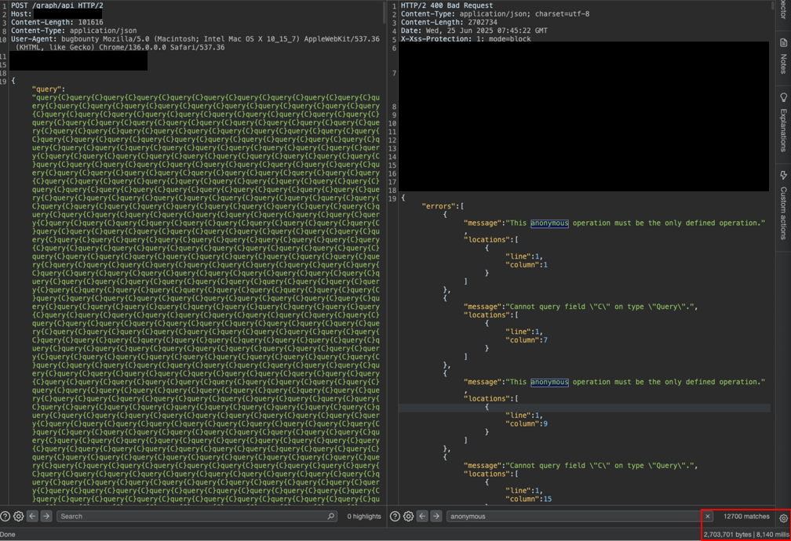

# GraphQL Batching DoS

Denial of Service (DoS) is not in scope for most bug bounties, but some do allow it, provided it demonstrates significant impact. This issue was a duplicate, as DoS on this endpoint using another technique had already been reported

## Batched Queries

In most cases, GraphQL queries or mutations look like:

```
query {your query here}
```

Some websites allow for **batched queries**. This means that in one request, a user can send multiple queries to be processed:

```
query{a}
query{b}
```

## Exploit

Generate a payload like so:

```bash
python3 -c "print('%s' % ('query{C}'*12700))" > payload.txt
```

Sending over 10,000 batched queries might result in significant delays if the server does not validate the number of queries sent. On this target, I was able to delay the response by a few seconds.



In the bottom right of the above image, notice that there are more than 12,000 matches for the word `anonymous` within the response, and that it took 8 seconds. This means that during those 8 seconds, the CPU was being used to process each of the queries.

To demonstrate impact, I used Burp Intruder to send 30 of these requests with null payloads. Then, in Repeater, I sent legitimate queries that took more than 10 seconds to return. In some cases, the request timed out after 30 seconds while Intruder was sending requests.

This shows how a single attacker can overload the backend server and exhaust resources, causing a DoS for other users.

## Fix

Batch queries are not inherently bad, however the number of queries per request should be limited. In general, a depth check must be present to not only prevent this attack, but also Circular Queries or Chained Aliases which also cause DoS.