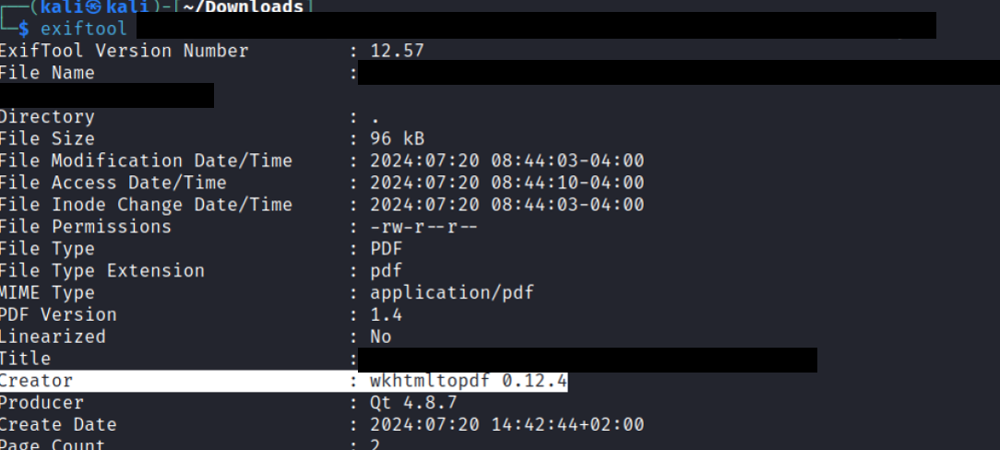
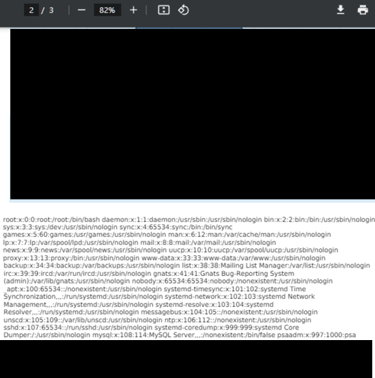

# wkhtmltopdf LFI

I finally got around to hacking the Dutch Government and getting the shirt!

## Discovery

I found a website generating PDFs that takes HTML from the client-side:


This was interesting, since tons of HackTheBox machines always told me "Client-side HTML for PDF sucks". I downloaded a random PDF and saw that it was being generated by `wkhtmltopdf 0.12.4` via `exiftool`.



This version of the library was outdated, meaning it was potentially vulnerable to LFI through HTML injection.

## Exploitation

I included this script at the bottom of the HTML used to generate the PDF:

```html
<script>
x = new XMLHttpRequest();
x.open('GET', 'file:///etc/passwd', false);
x.send();
document.write(x.responseText);
</script>
```

When the request was sent, a PDF was generated that included the contents of `/etc/passwd`:



This confirmed the vulnerability, and I notified the relevant parties about the issue. Thankfully, it was not a dupe and they processed my report. More importantly, I got the shirt:


A big thank you to the National Cyber Security Centre (NCSC) for promptly replying to me and working with me to fix the vulnerability.

## Fix

Update the libraries used and validate the HTML used to generate a PDF. `wkhtmltopdf` has a sandbox mode that can be set to prevent access to local file systems or external websites, preventing future exploitation.

## Re-Testing --> Blind SSRF

After they fixed it, I noted that it was actually still possible to do **blind SSRF** for port enumeration on the same endpoint. However, since they only accept P1 or P2 reports (I believe), my report was not processed. Still served as a good learning point though! I suppose client-side HTML and PDF generation will always have issues.

This issue is documented in the 'Not Accepted' section.
