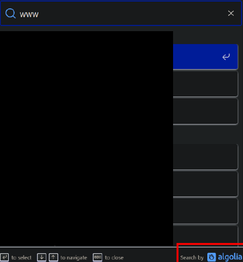
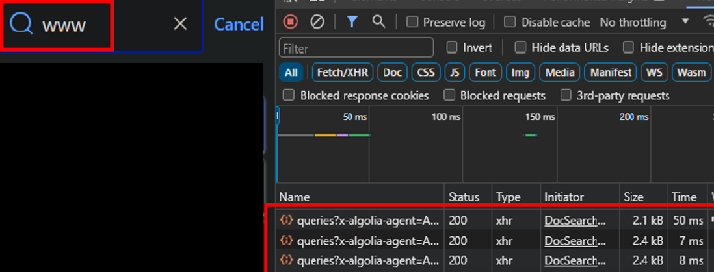
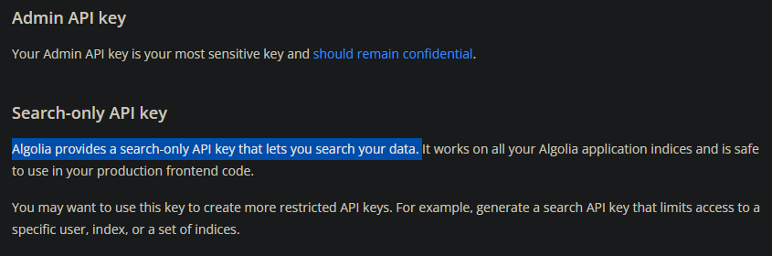
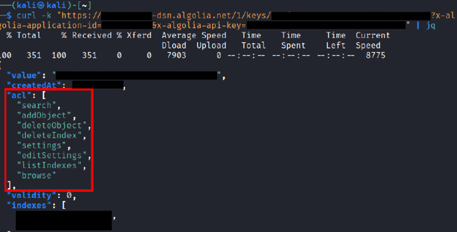
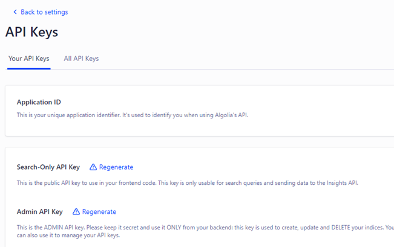
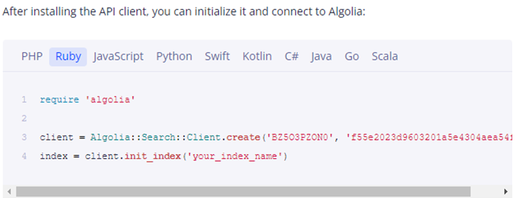

# Algolia API Misconfiguration

## Discovery

I was looking at a rather static site and wanted to search for something. That's when I noticed a search function powered by Algolia:

Algolia is a third-party, search as a service platform.



I found it rather odd that this site was using it, so I looked into it out of curiosity. Further enumeration using browser inspector tools showed that each keystroke typed in the search bar sent a request to an external domain.

The external domain was `https://APPID-dsn.algolia.net`, and the requests included 2 parameters, namely the `x-algolia-api-key` and `x-algolia-application-id`.

The next question was whether this `api-key` parameter was meant to be exposed, so I read up on the Algolia documentation. It states that the keys are safe to expose, provided they are set to **SEARCH-ONLY**. There is another **Admin API key** which must be kept secret.



I wanted to check the permissions of this key. Visiting `https://APPID-dsn.algolia.net/1/keys/APIKEY?x-algolia-application-id=APPID&x-algolia-api-key=APIKEY` will return the permissions of the key. The output from `curl` confirmed that excessive permissions were granted for this publicly exposed API key, and that it was the **Admin** key.

These administrative permissions are dangerous and can be abused by attackers:

* `listIndexes` can cause information disclosure.
* `editSettings` can be used to update indexes with Javascript, allowing for Stored XSS.
* `addObject` allows for indexes to be added, allowing attackers to deface the website by adding their own objects.

## Fix and Cause

I worked with the developers to fix this issue, which included setting up my own Algolia instance. The dashboard allows for Admin API keys to be revoked and regenerated.

The fix was straightforward: revoke the admin key and replace it with the Search-Only key. The real question is: **How did this bug occur?**

The root cause is their documentation. Algolia has 'dynamic' documentation, which generates code snippets for any developer to copy and paste, like so:

I found that this feature automatically includes the **Admin API key**. There is **little prior warning** about this, and the developer probably copied and pasted without knowing this. The API key shown above is for my now deleted Algolia account.

In hindsight, this is a major design flaw on Algolia's side.

## Other Resources




