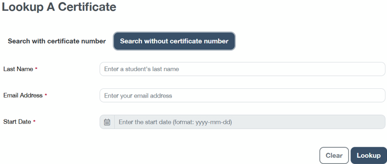
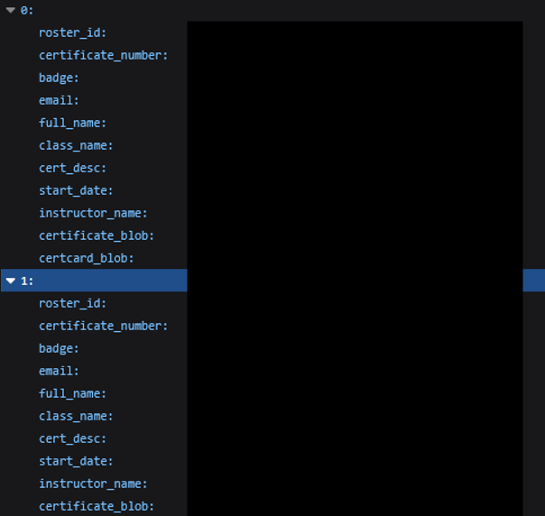
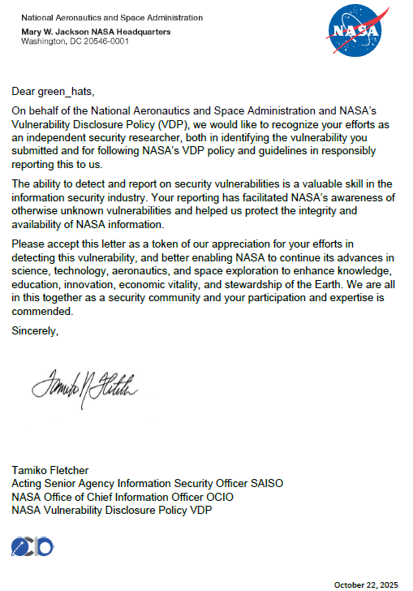

# NASA API Leaking PII

## Discovery and Impact

While enumerating `nasa.gov` subdomains with common tools (`assetfinder`, `crt.sh`, etc.), I found a site with a "Cert Lookup" feature.

The tool did not send any POST requests when lookups were performed. A page refresh triggered a GET requset to `/api/retrieve-certs.php`. 

Requesting that endpoint directly returned certificate records for over 800 participants. Returned fields included participant full names and email addresses:

This indicates the API was returning personally identifiable information (names, emails, certificate numbers) without authentication. Exposed contact details and certificate identifiers can be used for targeted phishing, social engineering, or other privacy violations.

## Reporting

I submitted a report to NASA's VDP on BugCrowd. The issue was triaged as a **P2** and remediated. I later received a Letter of Recognition for this.

