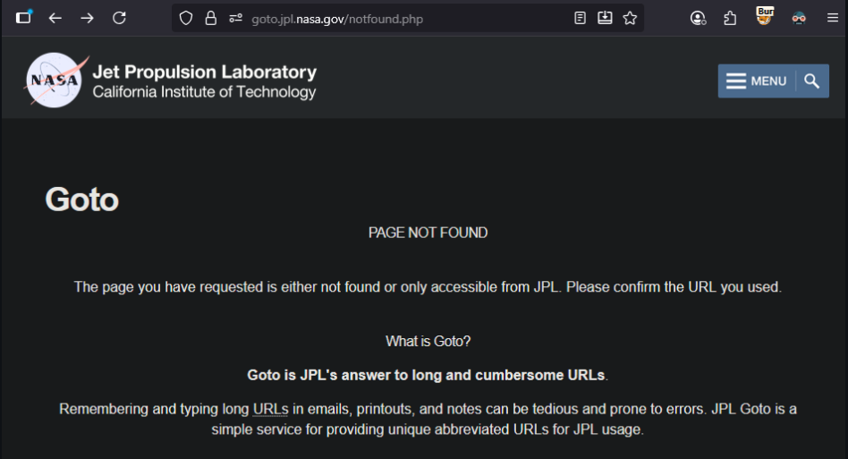
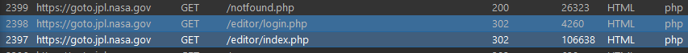
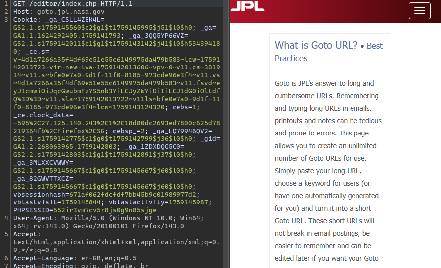
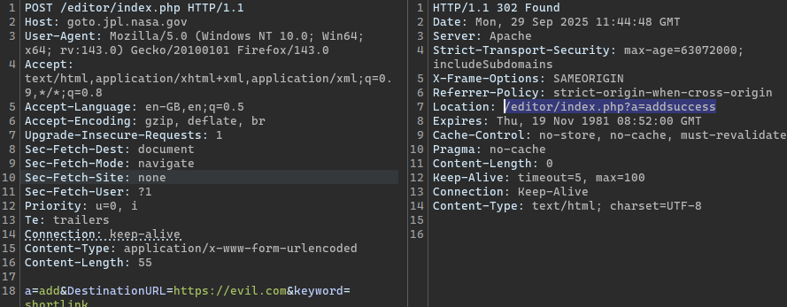
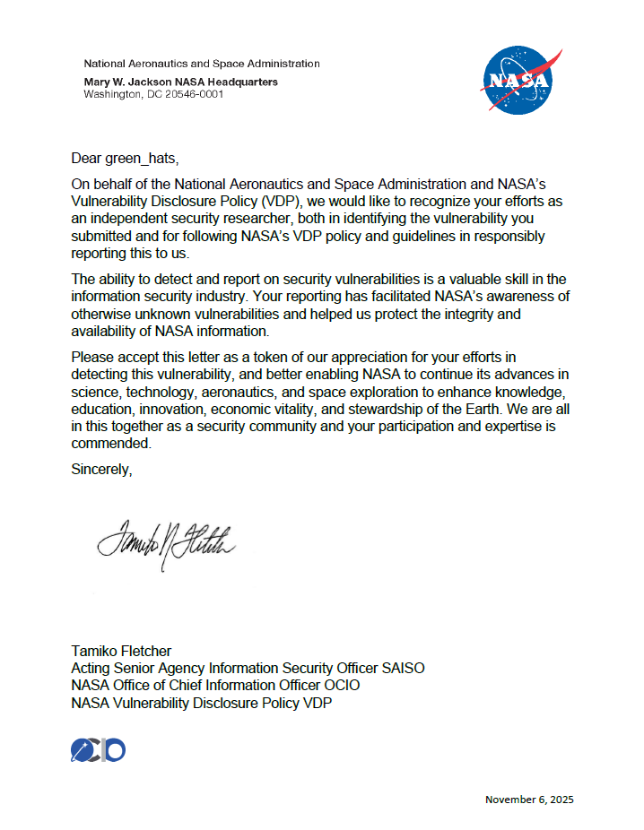

# NASA Misconfigured API

## Discovery

While enumerating `nasa.gov` subdomains with common tools (`assetfinder`, `crt.sh`, etc.), I found `goto.jpl.nasa.gov`, a site that seems to redirect users to `notfound.php`:



However, this site returned 302s with an unusually long response:



Using BurpSuite, requests can be sent directly to `index.php`, which returns 302 along with the full page contents:



The contents above show that this site is a NASA URL shortener, where staff can create shortened URLs for other sites.

I took a further look at the rest of the site, and found that there were other endpoints mentioned within the page source for `/editor/index.php`.

## Impact

By taking a look at the form parameters located within the page source, I was able to construct a POST request to create a shortened URL with the `/editor` endpoint. To demonstrate this, I created a URL with keyword of `shortlink` that redirects to `evil.com`.

```http
POST /editor/index.php HTTP/1.1
Host: goto.jpl.nasa.gov
User-Agent: Mozilla/5.0 (Windows NT 10.0; Win64; x64; rv:143.0) Gecko/20100101 Firefox/143.0
Content-Type: application/x-www-form-urlencoded
Content-Length: 55

a=add&DestinationURL=https://evil.com&keyword=shortlink
```

The response showed `addsuccess`, indicating that the URL creation worked:



Afterwards, visiting `goto.jpl.nasa.gov/shortlink` shows a redirect to `evil.com`:


The above demonstrates how an unauthorised user can access this API to make changes in the GoTo links used by NASA. Apart from adding links, I could list all links, delete existing links, or even change each link to point towards malicious sites.

## Reporting

I submitted a report that demonstrated the adding of a link to NASA's VDP. The issue was triaged as a **P4** and remediated. I later received my third Letter of Recognition for this.

