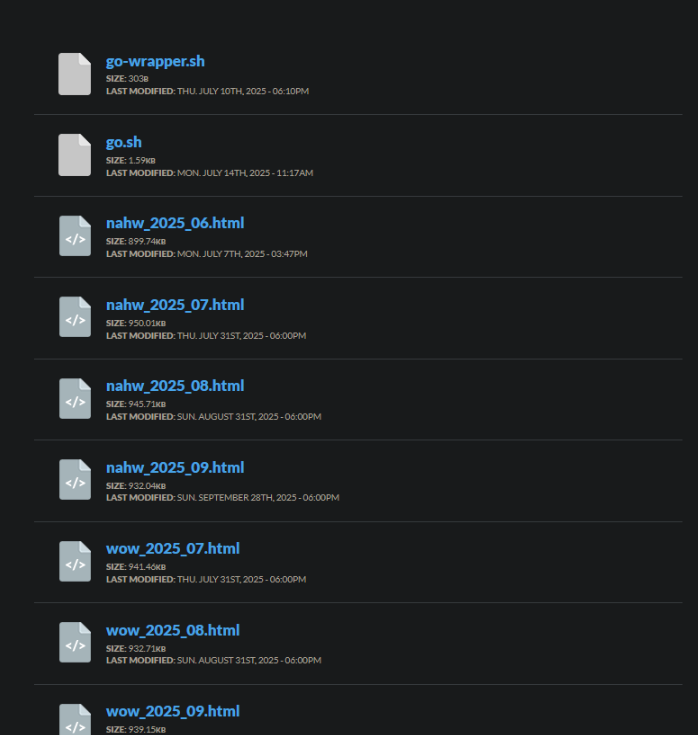
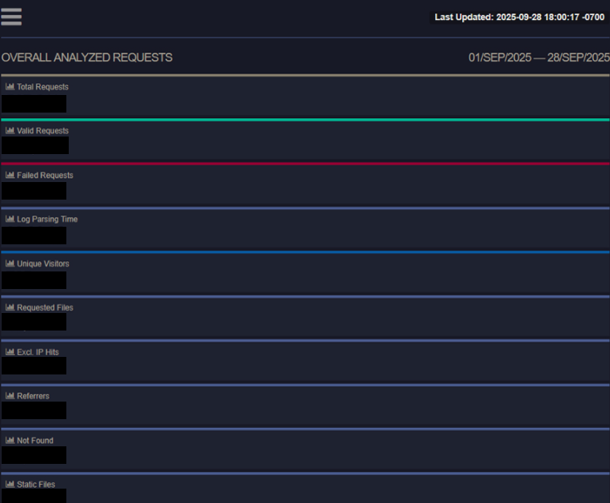
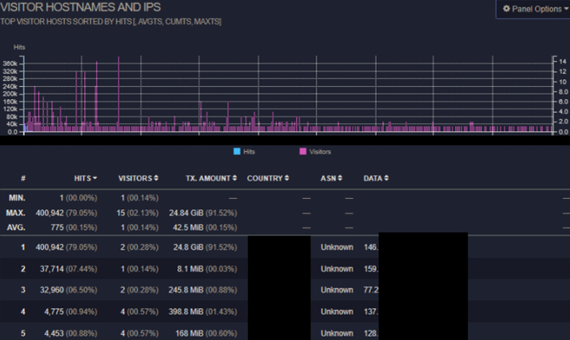
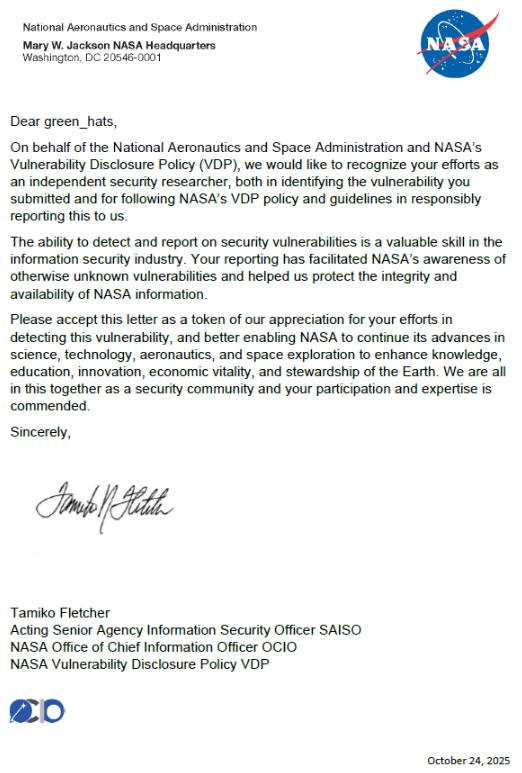

# Exposed NASA GoAccess logs

## Discovery and impact

While enumerating `nasa.gov` subdomains with common tooling (`assetfinder`, `crt.sh`, etc.), I found a site that appeared outdated as it contained broken links. Out-of-date sites often indicate limited maintenance, making it easier to find security issues.

A `gobuster` scan discovered a `/report` directory that contained GoAccess-generated reports:

The Bash scripts required credentials, but the `.html` reports were publicly accessible.

The reports included detailed traffic logs and analytics for the site, for example:

The pages exposed visitor host names and IP addresses:

Additional details (endpoints visited, origin countries, timestamps) were also visible. Because the reports exposed visitor IPs and related metadata, it qualifies as sensitive data exposure and raises privacy and operational security concerns.

## Reporting

I submitted a report to NASA's VDP on BugCrowd. The issue was triaged as a **P4** and subsequently remediated. I received another Letter of Recognition for my efforts.

