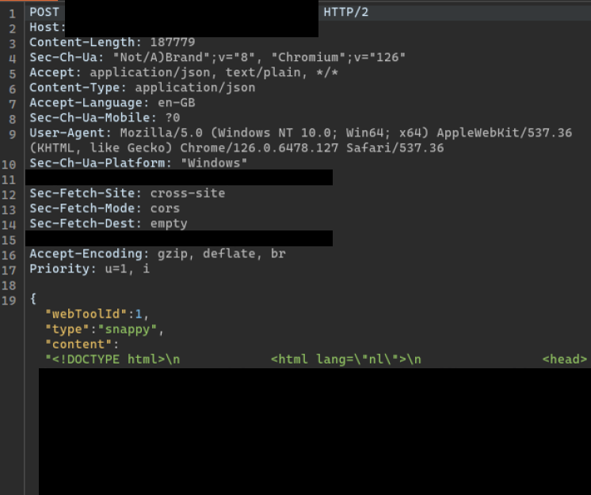
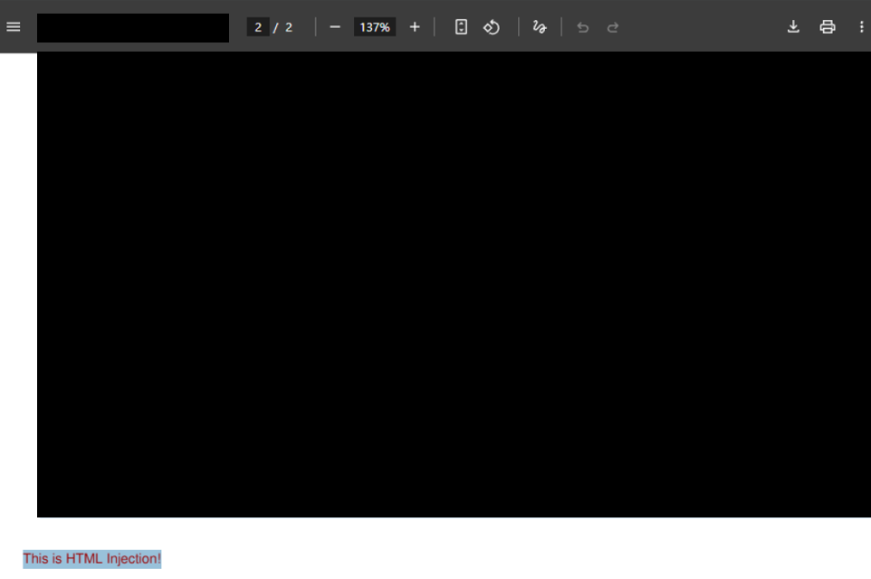
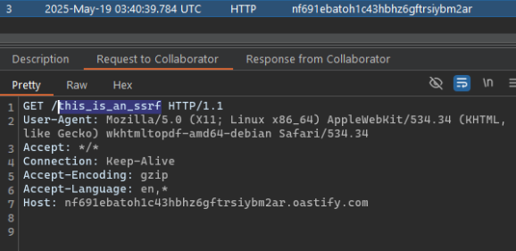
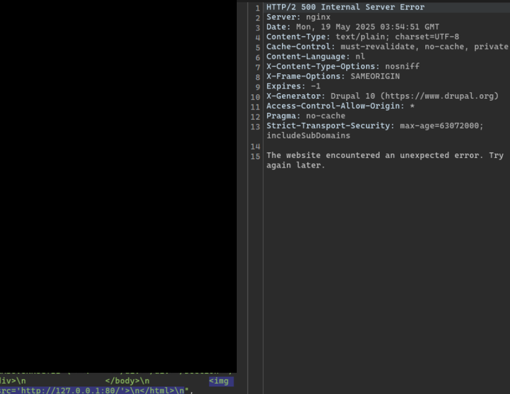

# Blind SSRF

## Discovery

This was found during the re-testing of the LFI issue I reported for PDF generation on a Dutch Government website. That particular site took HTML input from the client-side and used it to generate a PDF via `wkhtmltopdf`:



After their fix, I noticed that I was still able to do HTML injection using this payload:

```html
<pre style='color:red;'>This is HTML Injection!</pre>
```

This was the PDF generated:



`<script>` tags were no longer allowed after the fix, but I noted that `` tags still worked. Using this payload allowed for callbacks to my BurpSuite Collaborator client, with `wkhtmltopdf-amd64-debian` in the `User-Agent` header.

```html
\n
```



The IP address was Dutch as well.

## Exploitation

I knew that blind SSRF itself was not a valid issue. As such, it had to be combined with something else to become more severe and worth reporting. I noticed that using various URLs caused different issues.

For this instance, using `http://127.0.0.1:22` in the `` tag caused a PDF to be generated.


Using `http://127.0.0.1:80` did not, and actually returned a 500.



This was a blind SSRF that allowed for port enumeration. I tested further with `https://example.com` and `https://thisdoesnotexist.xyz` and noted that `example.com` returned a valid PDF while the other URL did not.

## Cause

`wkhtmltopdf` actually has `--disable-external-links --disable-internal-links` flags that can be used to prevent retrieving information from any links. I suspect that this was not included in their current settings.

I was, however, unable to exploit this further, and it was not processed further.