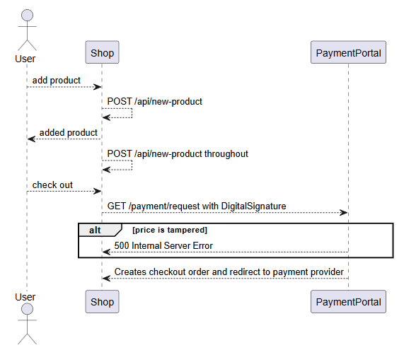
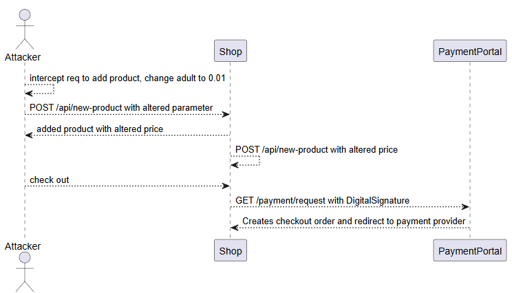

# Price Manipulation

They acknowledged the report, fixed the change, but decided my report was 'Invalid' 🤷‍♂️

## Discovery

I was looking at a target that featured a shop to buy items. When adding things to the cart, it sent a POST request to the `/api/new-product` endpoint with a JSON payload:

```http
POST /api/new-product HTTP/2
Host: target.com
Authorization: Bearer <Token>
Content-Type: application/json

{
    "date":"2025-05-22",
    "adult":"1",
    "child":"0"
}
```

The response reflected the number of adults and children, and then the final price. Throughout the check out process, it sent the same POST request multiple times, presumably ensuring that the items are not changed.

When the final button to check out was clicked, it sent a GET request to the payment portal with a few parameters:

```http
GET /Payment?ReferenceNum=<refnumber>&Price=56&DigitalSignature=<signature>
```

There was a `DigitalSignature` field that prevented parameter alteration. When `Price` was manipulated in this GET request, the server responded with a 500. 

This was the overall flow:



## Exploitation

Changing the price in the GET request to the PaymentPortal will cause errors. So, I started experimenting with the parameters within `/api/new-product`.

Eventually, I found that the `adult` parameter was not sanitised, and decimals could be used.This meant that changing the value of `adult` from `1` to `0.01` actually reduced the price by a factor of `100`.

I knew that there were multiple POST requests being sent to that endpoint throughout the checkout process as I filled my details, so exploiting any of the intermediate requests was useless.

I intercepted the initial POST request sent and changed the `adult` parameter to `0.01`. This worked in reducing the initial price. Subsequent POST requests also reflected this manipulated price. The manipulated price was eventually passed to the payment portal, and the `DigitalSignature` was created for that price. I was thus able to checkout and actually make a payment.

Sequence of exploit:



Each order had a `Number of Travelers` field, and the order created using my exploit method had 0 travelers, which I found rather odd. It also did not send me any confirmation emails, and I figured that it was due to a backend error since the variable was set to 0.

I repeated the exploit, this time using `0.5` instead of `0.01`. This worked in creating an order and calling the payment portal with `Number of Travelers` being rounded up to `1`, while the price was halved. I did not check out for this, since the product was really expensive and I did not want to pay real money.

## Reporting

I reported this issue to the relevant party. However, as my method failed to produce a valid order ID, they deemed it as 'Invalid`. They mentioned, and I quote:



```
After reviewing the issue, we observed that no Order ID was generated because no order was created. This is the expected behaviour and part of the normal application flow. As such, it is not considered a valid security issue.
```



The rather infuriating part was that after they got back to me, they **fixed the issue**  and I was unable to recreate it. I personally felt it was a bit unfair since they claimed it was 'expected behaviour', but still proceeded to change and add validation for the parameters I highlighted.

Regardless, I thought it was a pretty interesting experience, seeing how business logic flaws like this still existed despite measures like signatures being implemented.