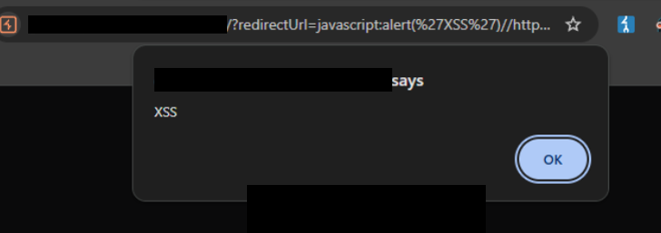

# Weak Redirect URL Validation

This was not accepted because it was not in scope and was found accidentally, but it's still an issue nonetheless.

## Discovery

I was looking into various endpoints for gateway subdomains and delved into the minified JavaScript files for pages that returned something.

Eventually, I found one domain that had limited functionality and only showed a blank screen. However, it had a minified `main.js` file present. I mainly used AI to explain chunks of the code.

Eventually, I found some logic for handling redirects. This was the logic (not the actual code) for dealing with the validation of the `redirectUrl` parameter:

```js
const handleRedirect = async () => {

    if (!redirectUrl || 
        (!redirectUrl.includes("https://") && !redirectUrl.includes("http://localhost:"))) {
        throw new Error("Not valid URL!");
    }
// Visit redirectUrl after this
```

The validation was quite weak, since it only checked for whether `https://` and `http://localhost` were present.

## Open Redirect Exploitation

There was no validation for the domain to which the user was redirected, so there was an Open Redirect present by visiting:

```http
https://vulnerable.com?redirectUrl=https://evil.com
```

## XSS Exploitation

The check for the actual URL was not enough since it was only checking whether `https://` or `http://localhost` were present. Thus, visiting triggered an `alert`:

```
https://vulnerable.com/?redirectUrl=javascript:alert(%27XSS%27)//https://
```



This works because `https://` was appended at the end and bypassed the includes check that the JavaScript uses.

I reported these 2 issues, and it was deemed Informational since the issues were not present on their main websites.