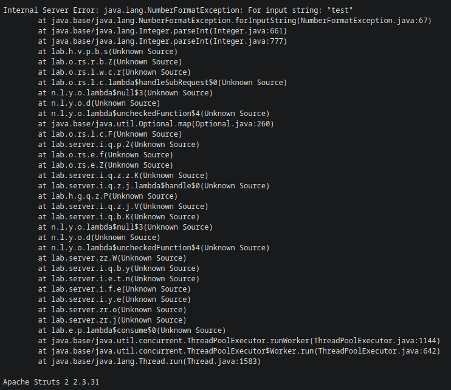
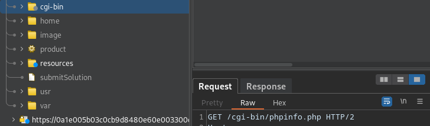
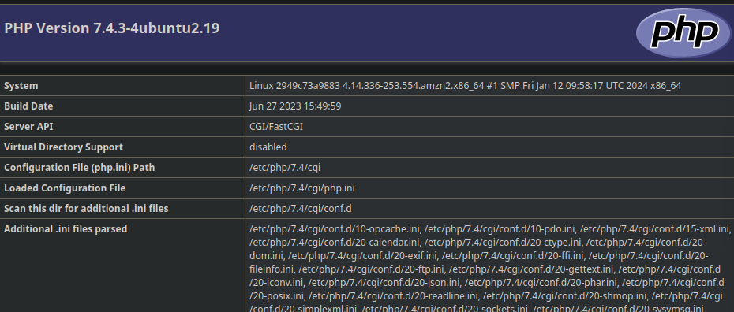
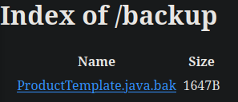
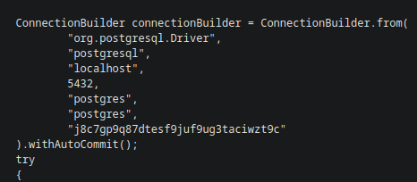
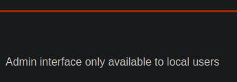
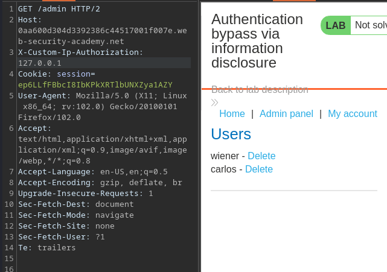
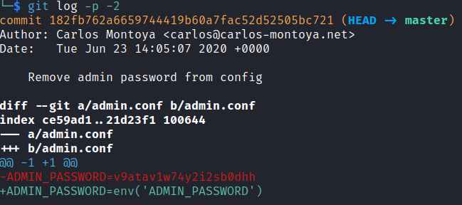

# Information Disclosure

## Lab 1: Error Messages

To solve this lab, find the version of a third-part framework used.

There's a `productId` parameter passed that contains an integer. If replaced by a string, it shows the error message:



`Apache Struts 2 2.3.31` solves the lab.

## Lab 2: Debug Page

To solve this lab, find the `SECRET_KEY` variable. This lab left a `phpinfo.php` file on the website:





Just search for `SECRET_KEY` within the page above.

## Lab 3: Backup Files

To solve this lab, find the hard-coded database password.

I ran a `gobuster` scan on the site:

```
$ gobuster dir -w /usr/share/seclists/Discovery/Web-Content/common.txt -k -u https://0aa600a30372cc9e8148168900cb007a.web-security-academy.net -H 'Cookie: session=RmNy6J8CwjXBdsoYsPgqghJa4agjIKWc'
===============================================================
Gobuster v3.6
by OJ Reeves (@TheColonial) & Christian Mehlmauer (@firefart)
===============================================================
[+] Url:                     https://0aa600a30372cc9e8148168900cb007a.web-security-academy.net
[+] Method:                  GET
[+] Threads:                 10
[+] Wordlist:                /usr/share/seclists/Discovery/Web-Content/common.txt
[+] Negative Status codes:   404
[+] User Agent:              gobuster/3.6
[+] Timeout:                 10s
===============================================================
Starting gobuster in directory enumeration mode
===============================================================
/analytics            (Status: 200) [Size: 0]
/backup               (Status: 200) [Size: 435]
```

The `/backup` directory contains this:



Within this, there's some Java code for stuff, and it contains the password:



## Lab 4: Authentication Bypass

To solve this lab, login as the admin and delete `carlos`. When trying to visit the `/admin` directory, I see this:



This gives me an idea to exploit SSRF. Since this lab is about information disclosure, I tried using TRACE to view debug information, and it worked!

This was the response:

```http
HTTP/2 200 OK
Content-Type: message/http
X-Frame-Options: SAMEORIGIN
Content-Length: 614

TRACE /admin HTTP/1.1
Host: 0aa600d304d3392386c44517001f007e.web-security-academy.net
user-agent: Mozilla/5.0 (X11; Linux x86_64; rv:102.0) Gecko/20100101 Firefox/102.0
accept: text/html,application/xhtml+xml,application/xml;q=0.9,image/avif,image/webp,*/*;q=0.8
accept-language: en-US,en;q=0.5
accept-encoding: gzip, deflate, br
upgrade-insecure-requests: 1
sec-fetch-dest: document
sec-fetch-mode: navigate
sec-fetch-site: none
sec-fetch-user: ?1
te: trailers
cookie: session=cookie
Content-Length: 0
X-Custom-IP-Authorization: <TRUNCATED>
```

There's an X-Custom-IP-Authorization header. I can use this to bypass the 'local user' check.



I can then visit `/admin/delete?username=carlos` to delete the user (this endpoint is found within the HTML for `/admin`).

## Lab 5: Version Control History

There's information disclosure via version control history. When running a `gobuster` scan, I found a `.git` repository.

```
$ gobuster dir -w /usr/share/seclists/Discovery/Web-Content/common.txt -k -u https://0ac2001804901e37806599da00eb00b0.web-security-academy.net -H 'Cookie: session=d893aVyPRCvqJphQnPppX4O1m5Dbzg1I'
===============================================================
Gobuster v3.6
by OJ Reeves (@TheColonial) & Christian Mehlmauer (@firefart)
===============================================================
[+] Url:                     https://0ac2001804901e37806599da00eb00b0.web-security-academy.net
[+] Method:                  GET
[+] Threads:                 10
[+] Wordlist:                /usr/share/seclists/Discovery/Web-Content/common.txt
[+] Negative Status codes:   404
[+] User Agent:              gobuster/3.6
[+] Timeout:                 10s
===============================================================
Starting gobuster in directory enumeration mode
===============================================================
/.git/HEAD            (Status: 200) [Size: 23]
/.git                 (Status: 200) [Size: 1201]
/.git/index           (Status: 200) [Size: 225]
/.git/logs/           (Status: 200) [Size: 548]
/.git/config          (Status: 200) [Size: 157]
```

I can install the entire repository using `wget -r https://LAB.web-security-academy.net/.git`. Afterwards, I can take a look at the `git log` output to see any changes that were made to the repository.



Using this password, I can then login as the admin and delete `carlos`.