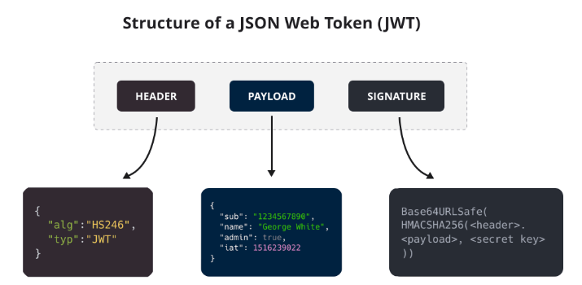

# JSON Web Tokens (JWT)

## Explanation

JWT tokens are basically cookies, used for session handling or authentication within web applications. Each token has a signature, meaning (in theory), the data within the token cannot be forged. 

Each JWT token contains the following:

The first part is self-explanatory, it contains the algorithm used. The payload contains the actual data sent to the server. And lastly is the signature. The JWT token is heavily reliant on the signature, the only protection mechanism to ensure no forged tokens are used. The entire thing is then encoded with `base64` and used in web applications.

A token's values can be broken down on this website:



Note that the signatures used have a secret key. Signatures are basically a hash with a key, so changing any part of the payload will result in a completely different signature. This means that if one does not have the password, one cannot forge a token (in theory).

## Exploitation

JWT attacks arise from sending modified JWT tokens to bypass authentication and access controls to impersonate other users. There are various methods of exploits (covered in the labs). The main reason for these vulnerabilities popping up is **flawed JWT handling**. Even if the underlying mechanisms behind token generation is secure, how it is parsed can be abused. 

For example, the token can be using a weak secret key which cane be brute forced. Or maybe the token's headers are changeable in some way.