# Web Cache Poisoning / Deception

Web cache poisoning is an exploit whereby an attacker exploits how a web server caches requests, allowing for malicious server requests to be returned to normal users. An attacker must first figure out how to get a response from the back-end server that contains a payload of some sort, cache that, and then serve it to other users on the website.

## Web Cache

Caches were developed in order to reduce the workload of servers when handling lots of requests. Imagine if a server has to send a new HTTP response with the webpage for every single HTTP request. This would overload the server and also make it run really slow. Similarly, imagine if you made a request to a website each time, and each time a new copy of the same window has to be fetched. This would result in significantly lower performance as it is slow to keep requesting a fresh copy of the same page.

It is faster to store a copy on a cache server for frequently requested pages / resources:

<figure><figcaption>
<em>Taken from PortSwigger Web Security Academy</em>
</figcaption></figure>

The web cache technology uses a 'cache key' to fingerprint requests. The key is typically a set of request attributes, like cookies, headers or parameters that a web cache uses. If the cache does have a response stored using the same key, then it simply serves the stored response instead of going to the origin server to get a fresh response.

If the web cache can be controlled by an attacker, then they could use it to obtain the sensitive data or deliver malicious payloads. For example, an attacker can cache a XSS payload, which is delivered and executed when an innocent user views the same resource.

## Poisoning

Cache poisoning requires that an attacker figure out what part of their input is **not** part of the cache key but used by the origin server. For example, the origin server might process an extra header like `X-Forwarded-Host`, but the cache does not track this header as part of the key. Including it does not influence what gets cached.

Suppose that an attacker finds that the `X-Forwarded-Host` header does not have input validation, and the origin server uses the input there to generate script tags when visiting `/index.html` of a site (so setting to `evil.com` causes a `evil.com/script.js` to be loaded on the page). This header is not part of the cache key. To exploit this, an attacker just has to get this response cached on the CDN, and any subsequent user gets served the malicious JS file.

A more common attack is causing a DoS. Instead of injecting a malicious script, an attacker can use the same unkeyed input to make the origin server return a 500 response. By getting that error page cached and served to everyone else, the attacker essentially creates a DoS condition. This is easier to exploit than a script injection attack.

## Deception

Deception is the reverse of poisoning. Instead of exploiting the gap between the cache keys are and what the origin uses, an attacker is exploiting the cache's guess on what is static versus dynamic.

Caches generally do not cache everything, because some page content is generated dynamically. For instance, visiting a user's profile page is dynamic and should not be cached on the CDN. However, images, JS and CSS files are safe to cache since they're basically the same for every user.

Many caches use simple heuristics such as the file extensions to determine what is static or not. For example, everything ending on `.jpg` or `.css` is safe to cache. This is fast, but does not actually validate the content.

One example is a site that displays session tokens and other personal data on the `/account/settings` page, with a cache that only uses extensions to determine if something should be cached. The attacker can trick the victim to log into `/account/settings/fake.css`, which the origin server either redirects back to `/account/settings` or shows the user's details in the page contents. The cache looks at the `.css` extension and determine it is safe to cache since it is a static response.

As such, the cache store's the victim's private information. All an attacker has to do then is visit `/account/settings/fake.css` to retrieve the information of the victim.

## Exploitation

The main method of which web caches are exploited is done by finding out the flaws of the cache key. Caches typically transform keyed inputs before using it to build the key. This could mean that certain query parameters are filtered out, or input is normalised by stripping port numbers or other fields. The key idea here is to find out what data gets written into a cache key and what data gets passed into the application, since the attacks here hinge on fact that the application and cache process information differently.

The exploitation steps can be broken down into 3 stages.

1. Finding a page or endpoint that provides feedback about the cache. This is called a 'cache oracle'. This could be a page that returns a header indicating `HIT` / `MISS`, has timing differences, or provides visible changes in dynamic content. Ideally, this also reflects our input so parsing mismatches can be identified. Depending on the CDN used, there are headers that can be included to check the actual cache key (although this is likely blocked).

2. Identify how the key is handled. This portion is where the keyed input is dropped or normalised before being added to the key, even though the full value reaches the application. Parts of the data passed in are stripped, perhaps.

3. Finding an exploitable gadget. After finding a cache key flaw, something needs to be injected. This could be an open redirect or XSS. Chaining the key flaw with the gadget escalates the vulnerability, and is the main impact generator.

The above methodology roughly works for both poisoning and deception. The difference is that poisoning attempts to find gaps between what is written into the cache key versus what is passed to the application's code. Deception cares about finding gaps between how the cache and origin server each parse and map URLs to a resource, only caring about whether a cache mistakes a dynamic page with sensitive data as a static one. This is done by adding junk to the end of the path or static suffixes, then checking whether the page caches the response or not.

Lastly, a cache buster can be used for testing to force a cache miss. This is good for establishing a clean baseline, and also to avoid interference with real users.

## Enumeration Techniques

Knowledge was taken from Martin Doyhenard. These are my notes from this paper:



CDNs today like CloudFlare or Akamai are used by companies, being a network of web cache proxies. However, each product parses URLs differently, and vulnerabilities arise because of it. To derive cache keys and map endpoints, origin servers typically extract the absolute path of the requested resource by using path delimiters and normalisation when parsing the URL.

### Delimiters

URL RFC defines certain characters as delimiters, like `;` or `?`. Custom characters can be added to the list, with each web framework doing things a little differently that causes path confusion between the origin and cache.

Some examples:

- Semicolon in Spring (Java): `;` is used to include matrix variables.
    - `/Account;var1=val` -> `/Account`
    - `/hello;var=a/world;var1=b;var2=c` -> `/hello/world`

- Dot in Rails: `.` is used to return different content types. Default is HTML if an extension is not used, or it is one that is not recognised.
    - `/Account.html` -> HTML view of `/Account`
    - `/Account.css` -> CSS view of `/Account`, or error if not present
    - `/Account.aaa` -> HTML view of `/Account`

- Null byte in OpenLiteSpeed: Used to truncate the path.
    - `/Account%00.html` -> `/Account`

- Newline in nginx: Only when configured to rewrite the request path. Rewrite rule must map prefix of URL and not entire pathname, a common configuration.
    - Rule: `rewrite /user/(.*) /account/$1 break;`
    - `/user/account%0aaaa` -> `/user/account`

#### Finding Origin Delimiters

1. Find a non-cacheable request, look for a method like POST, or a response with `Cache-Control: no-store` or `Cache-Control: private` header. **This is the baseline response (R0) for future comparisons**.

2. Send same request, but append a random suffix, like `/homeabcd`. If R1 is same as R0, choose a different endpoint. If different, move to step 3.

3. Using ASCII list, brute force possible delimiters, for both unencoded and URL encoded versions of characters. Compare R2 and R0, if same, then this character is a delimiter. For instance, `/home$abcd` is one possible request that may return same as `/home`.

#### Finding Cache Delimiters

Majority do not use any other than `?`. Possible to identify using a static request and response.

1. Identify cacheable request by looking for evidence that response is retrieved from cache. Look for response time, or `X-Cache: hit` header. This is R0

2. Send same request followed by delimiter and random, like `/home;avcd`.

3. Compare with R0, if identical, then character or string is delimiter.

### Normalisation

Path delimiters are used to locate the start and end of the pathname. Once path is extracted, it is normalised to its absolute form by decoding characters and removing dot-segments.

#### Encoding

This process is not consistent, many proxies decode the URL and forward message with decoded values, which means next parser may use decoded characters as delimiters. Need to test whether it is being decoded then normalised:

- Compare base request with encoded version. If using `/home/index`, check with `/%68%6f%6d%65%2f%69%6e%64%65%78`. Sometimes, it's better to encode each character individually as sometimes specific characters are not encoded

- If encoded response same as base with **no cache hit**, origin server decodes path before using it. If response is cacheable, can detect cache parser's decoding behaviour.

- Send original request followed by encoded version. If both response contain same cache headers, means second one was obtained from the proxy, and the key was decoded before being compared.

#### Dot-segment Normalisation

It is possible to exploit this normalisation by finding discrepancies between parsers to modify cache rules and obtain crafted keys. 

To see normalisation in origin server, issue non-cacheable request or request with cache buster to a known path, then send the same message with path traversal sequence.

- Send `/home?cb=123`.
- Send `/aaa/../home?cb=123` OR `/aaa\..\home?cb=123`

See if responses are identical. If yes, path is normalised before being mapped. 

To test if normalisation is present in cache server, repeat same response with cacheable response and compare `X-Cache` and `Cache-Control` headers to verify if resource was obtained from cache memory.

If we use `/hello/..%2fworld`, different servers and cache proxies normalise it differently:

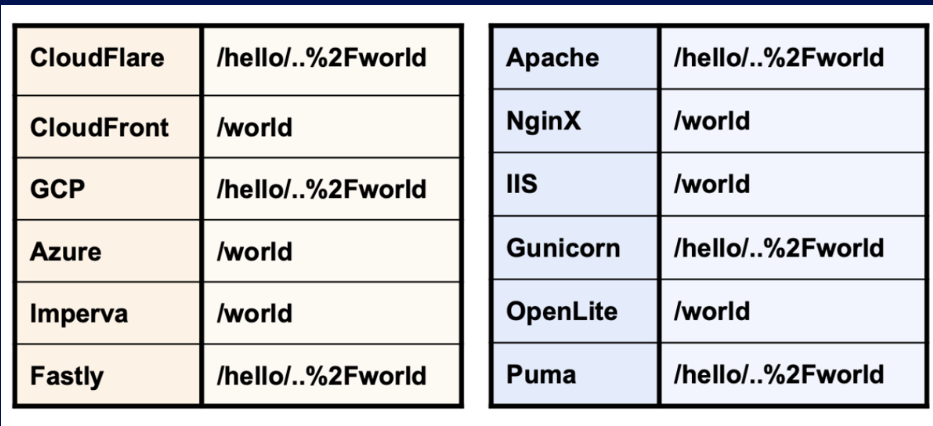

## Deception Exploitation

Most CDN providers store responses for resources with static extensions, meaning that if the requested path fields ends with a string like `.js` or `.css`, the cache proxy treats it as static.

List of static extensions by CloudFlare:

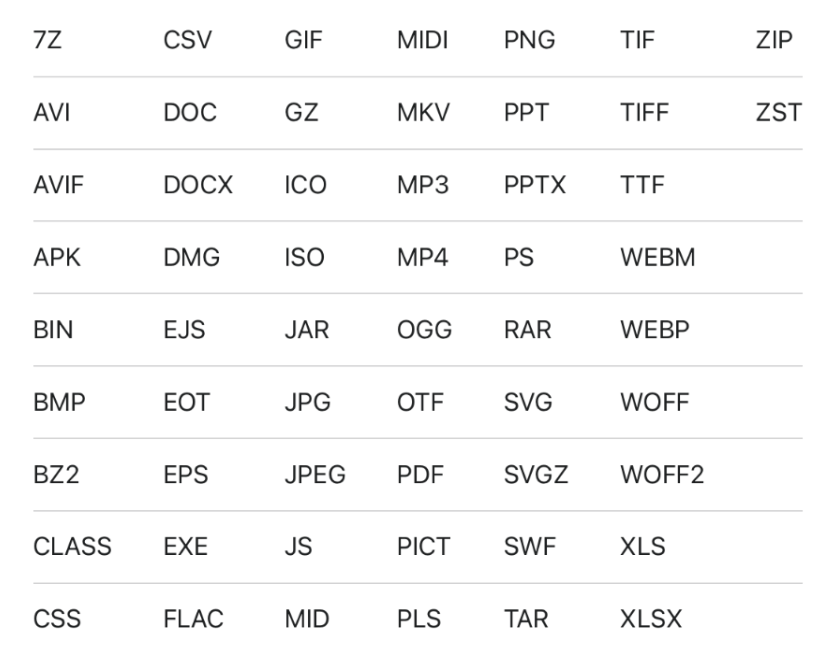

After finding the delimiter, can include a static suffix to trigger a cache rule to store any sensitive response.

For example, if `$` is a delimiter in the origin server but not the proxy, the cache can be tricked to cache account information of another user.

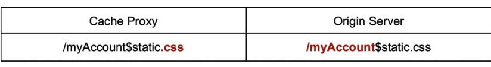

Can use same technique with an encoded character or string. Useful when origin server decodes a delimiter before parsing the URL. A `#` symbol will not work for deception as its not sent by the browser, but an encoded version can work:

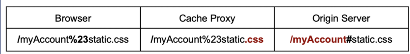

If there are multiple parsers rewriting, can apply multiple encodings. 

### Static Directories Exploits

#### With Delimiters

Rules can be created to match URL prefixes, like to cache all files from `/static`, `/assets` or `/wp-content.`

If a character is used by a delimiter by the origin server but not by the cache, and the cache normalises the path before applying a static directory rule, can hide a path traversal segment after delimiter which cache will resolve.

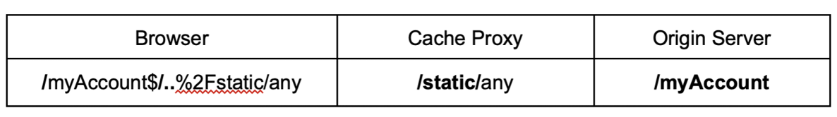

### With Normalisation

If origin server normalises path before mapping the endpoint, but cache does not normalise the path before evaluating cache rules, can add path traversal after.

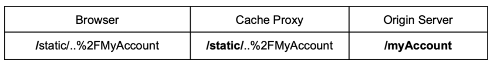

Cloudflare, Google Cloud and Fastly do not normalise paths before evaluating rules. If origin server normalises the path before mapping the request with an endpoint handler like nginx, it is possible to exploit any static directory rule.

Combining Microsoft IIS with any web cache that does not convert backslashes causes a discrepancy too:

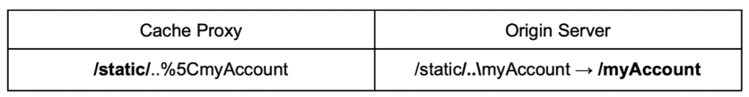

### Static Files

Files like `/robots.txt` and what not might not be in a static folder, but are also expected to be immutable in every website. Possible to create a cache rule that looks for an exact match, with CDNs like Cloudflare having a default rule for them.

Same technique as above:

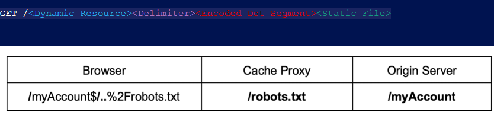

## Poisoning Exploitation

This allows for unexploitable XSS to become practical. If an attacker can use path traversal to exploit the cache key:

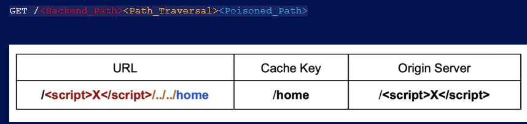

### Back-End Delimiters

Back-end delimiters are ones that are used by the origin server but not by the cache, and it is possible to generate an arbitrary ke for the cacheable resource. Delimiter stops the backedn from resolving dot-segment:

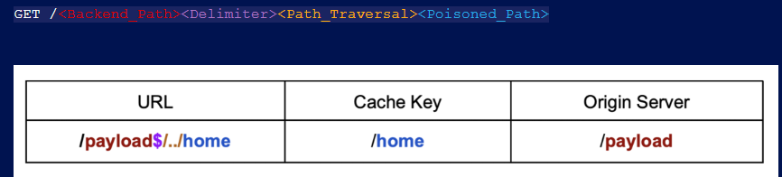

### Front-End Delimiters

Finding a character with special meaning for the cache server that can be sent through browser is rare (like `#`!). Web cache poisoning does not require user interaction, and delimiters like hash can create path confusion.

Hash fragments are interpreted differently:

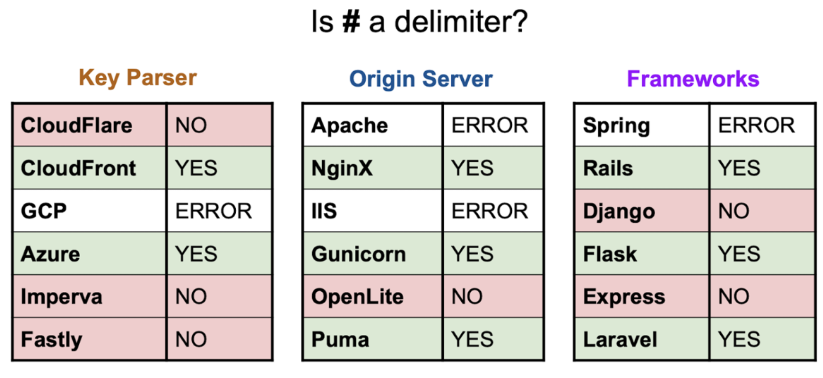

In cases with Azure that normalises path and treats hash as delimiter, it is possible to use this to modify the cache key of the stored resource:

`GET /<Poisoned_Path><Front-End_Delimiter><Path_Traversal><Backend_Path>`.

## Bug Bounty Methods

For actual programs, a combination of vulnerabilities might be combined. Similar to the labs, can make use of static files to force a caching of the poisoned response:

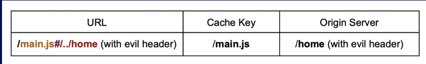

So `/main.js` is cached with an evil header that causes a redirect response. In worse case, can cause full website defacement:

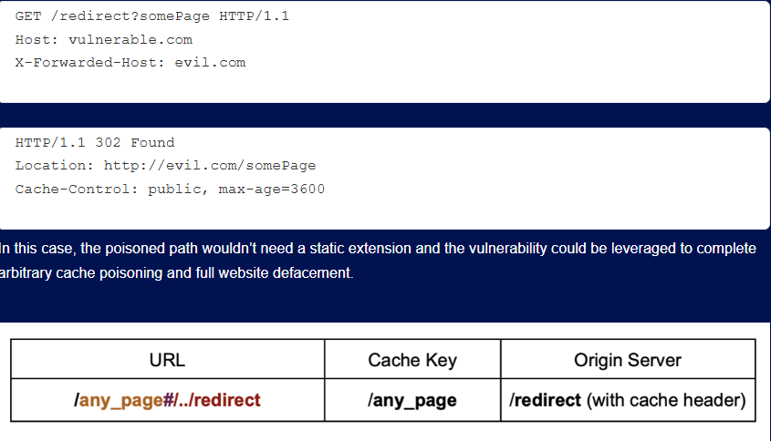

