# PortSwigger Writeups

## Cache Poisoning

### Lab 1: Unkeyed Header

Goal of the lab is to poison the cache with a response that executes `alert(document.cookie)` in the vicitm's browser.

Using Param Miner, I was able to find a hidden header:

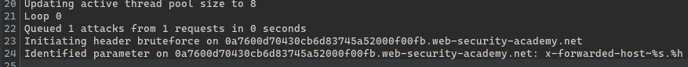

Including this header resulted in the page contents loading JS from `test.com`:

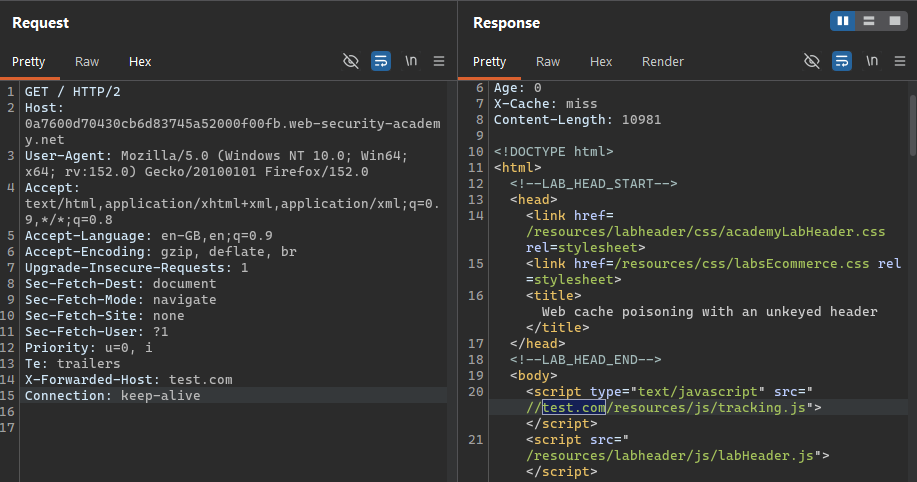

To solve the lab, firstly store the payload on the exploit server given at `/resources/js/tracking.js`:

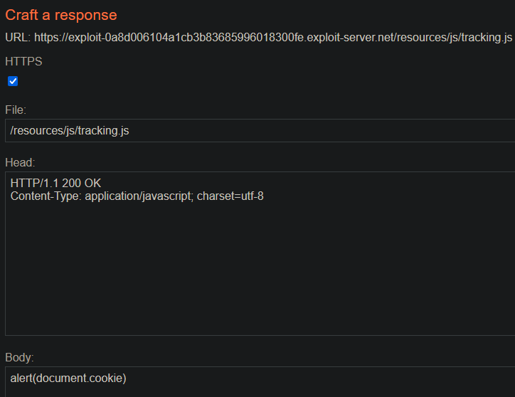

Now, we need to poison the cache. For this lab, sending the request a few times is enough to cache it.

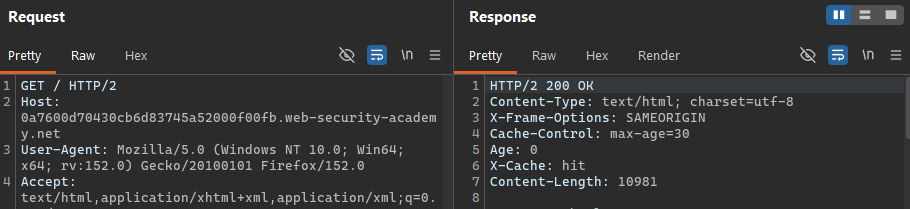

So just replace the `X-Forwarded-Host` with the exploit server URL, and wait for a bit before it solves itself.

### Lab 2: Unkeyed Cookie

Similar objective as the first lab, execute `alert(1)` in the victim's browser. 

When viewing the login page, there is a cookie called `fehost` being reflected in the page contents:

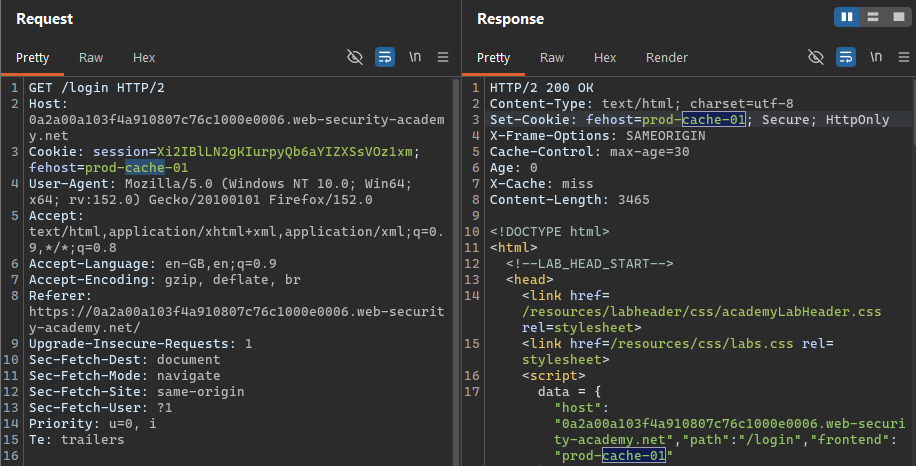

When a cache buster is added to force a miss, the page reflects this cookie. Changing it to `02` shows on the page:

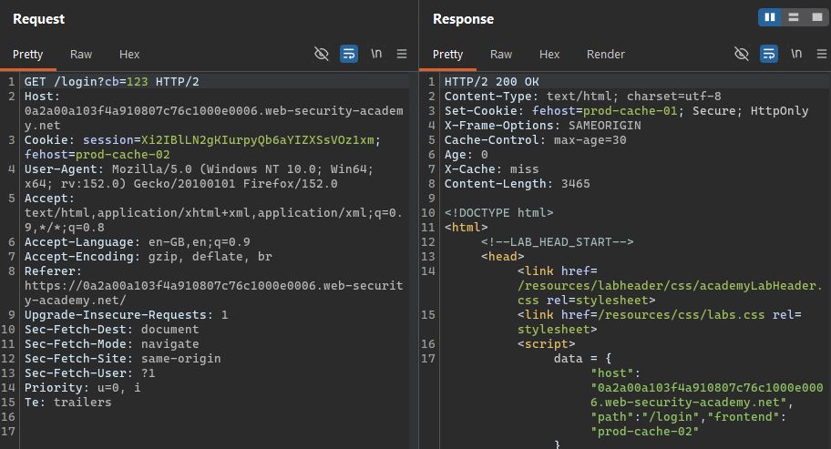

This can be broken out of to trigger the `alert(1)` function:

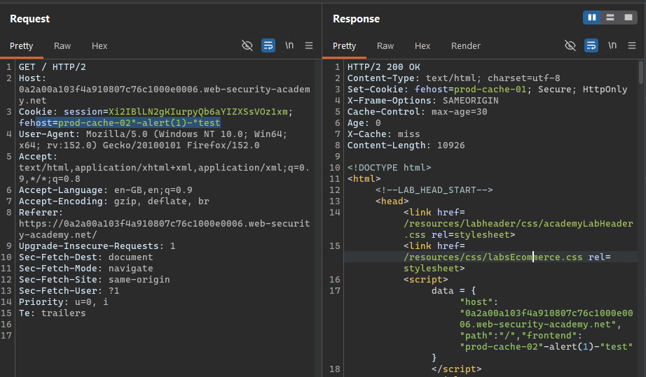

### Lab 3: Multiple Headers

This lab requires multiple headers to be used to trigger the `alert(document.cookie)` payload.

Param miner picked up on a few headers, including a `X-Forwarded-Scheme` header. When set to `https`, it returns 200:

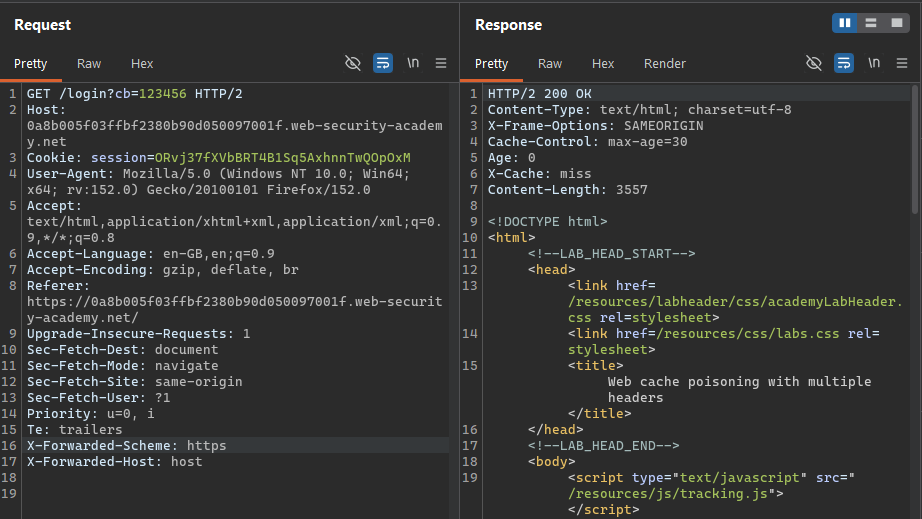

When it was set to any other value, a 302 was returned, this time redirecting users to the value specified in the `X-Forwarded-Host` header:

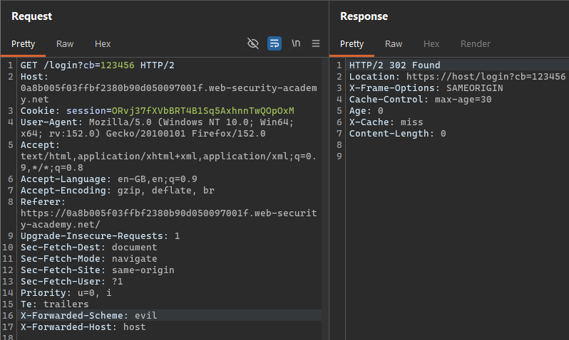

Based on this, attackers can basically force a redirect by caching the right request. By specifying the right host, victims can be redirected to third party sites:

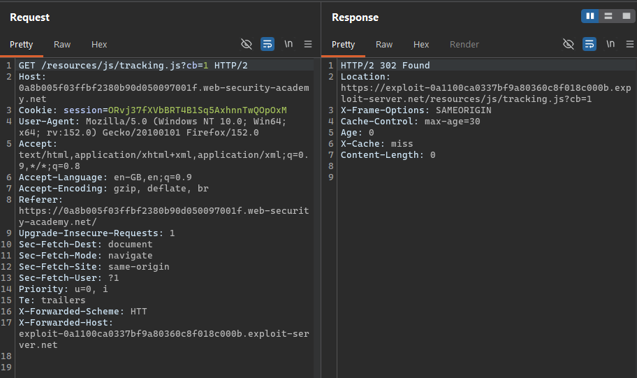

The goal is to poison the CDN's version of a JS file, forcing it to cache our exploit server's version.

Firstly, save the exploit to the target JS file of `/resources/js/tracking.js`.

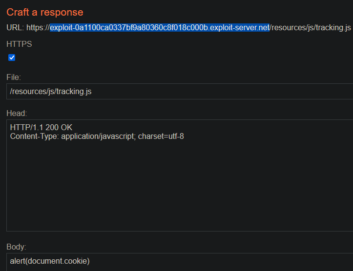

Then, cache the redirect:

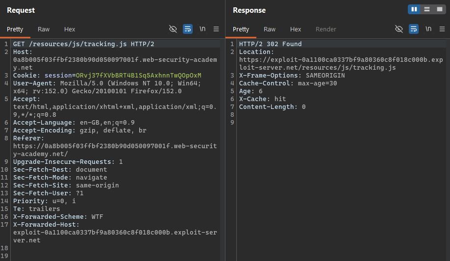

The above makes it such that when any user attempts to load the `tracking.js` file, they are redirected and load the malicious version instead.

### Lab 4: Unknown Header

Same goal as above, execute `alert(document.cookie)` in a victim's browser, with the victim viewing any comments posted.

Firstly, the unknown headers must be found. Param Miner identified that it was the `X-Host` header:

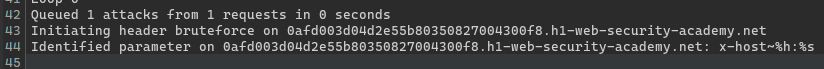

When the posts are viewed, it shows that `X-Host` is reflected in the page:

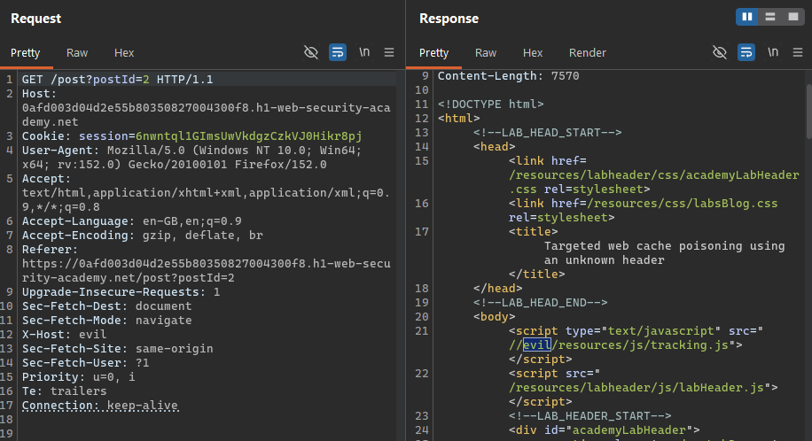

However, just doing this does not work in solving the lab. Turns out, the `Vary` HTTP header is set to `User-Agent`.

This header decides whether 2 responses should be treated the same for caching purposes. To deliver the payload, the victim's `User-Agent` must be captured and used. This would allow us to cache a malicious response for their specific agent. 

For comments, it is shown that HTML is allowed:


The exploit server also has an access log feature. To get the victim's `User-Agent`, simply inject an `img` tag that loads the exploit server, then check the exploit server logs:

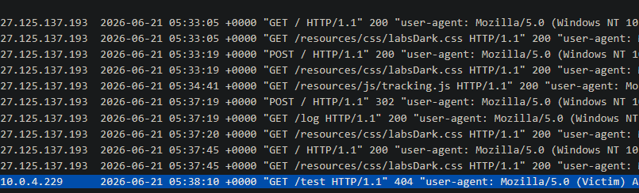

The header is:

```
user-agent: Mozilla/5.0 (Victim) AppleWebKit/537.36 (KHTML, like Gecko) Chrome/125.0.0.0 Safari/537.36
```

To solve the lab, use this header and cache a malicious response with the victim's agent:

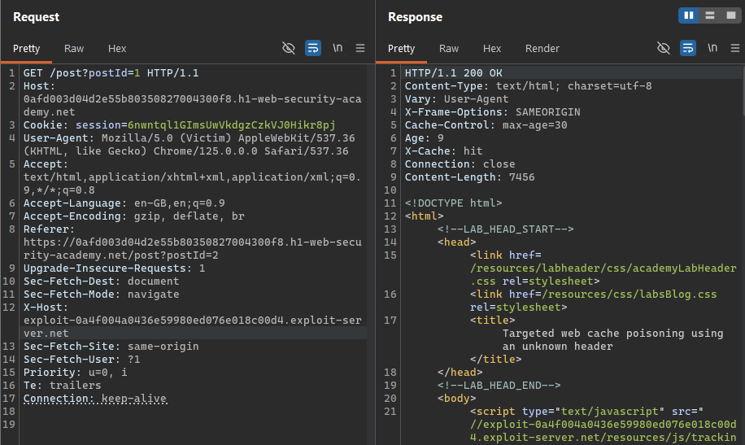

### Lab 5: Unkeyed Query String

To solve lab, poison the home page with a response that executes `alert(1)`. The hint is that `Pragma: x-get-cache-key` can be used to retrieve the current cache key. Additionally, a common request header can be used by Param Miner as a cache buster if queries are unavailable.

When using `Pragma`, I found that the cache key was based on the path requested:

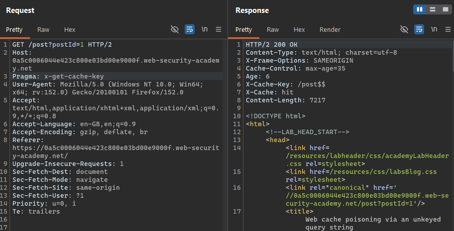

Adding extra query parameters did not force any cache misses. Sending this response to Param Miner did return the `pragma` header. When inspecting the requests, I noticed that `Origin` and `Via` headers were also sent:

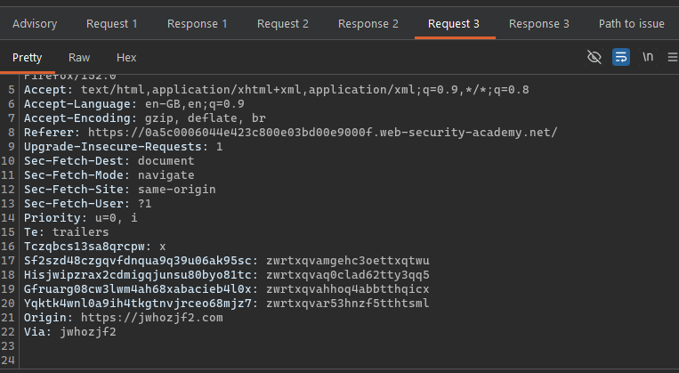

Adding `Via` did change the cache key, but adding `Origin` did:

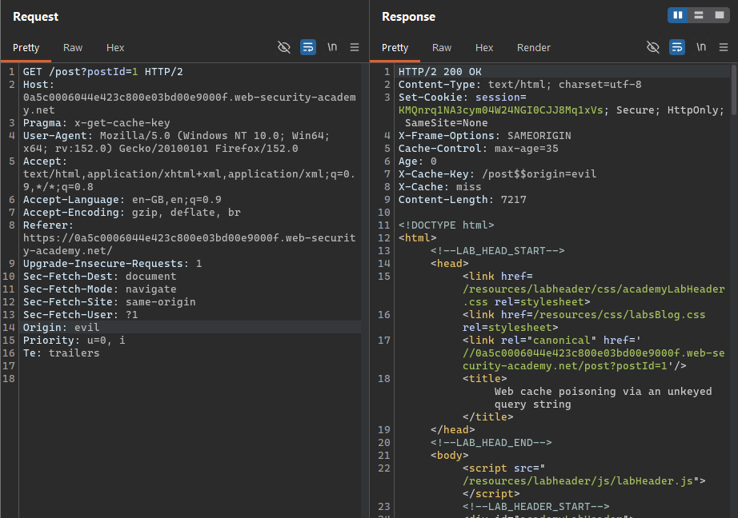

So this works in forcing a cache miss. Now, onto the XSS. There was a `postId` parameter vulnerable to HTML Injection:

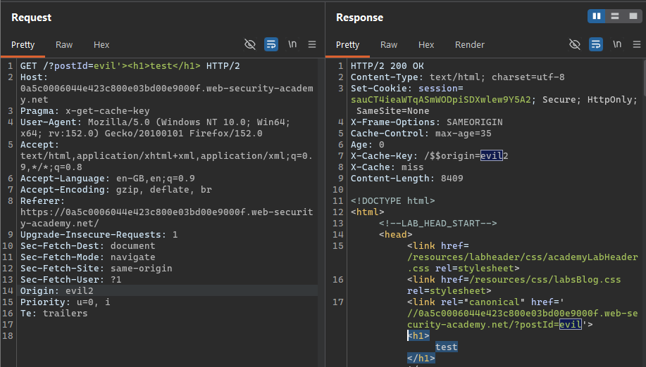

Now, to get this cached in the web cache. To do so:

1. Send `Origin` header to force a cache clear. This would restore the web cache to baseline.
2. Send request with payload but without `Origin` until a HIT is returned.

### Lab 6: Unkeyed Query Parameter

This lab uses a parameter as the cache key. To solve the lab, poison the cache with a response that executes `alert(1)`. Hint is that analytics headers and parameters can be used for cache related exploits too.

Sending to Param Miner causes `utm_content` to be returned as valid header. Sending this in after a cache reset causes it to be reflected:

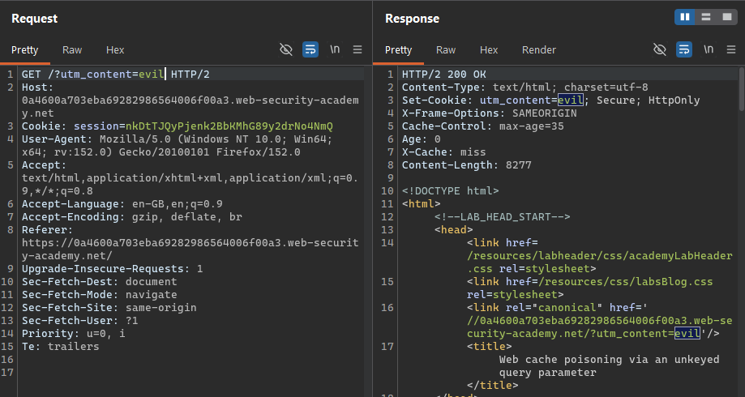

To solve the lab, send this unkeyed header multiple times, and it will eventually solve the lab.

### Lab 7: Parameter Cloaking

This is a technique that exploits how parameters are parsed to smuggle malicious headers into the response via `;` or `%0d%0a`. The hint is that the `utm_content` parameter is used again.

The lab loads a `country` cookie:

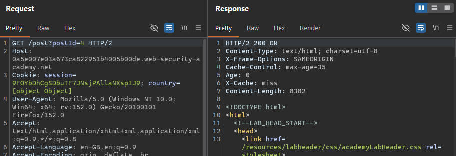

There is also a `/js/geolocate.js?callback=setCountryCookie` script:

```js
const setCountryCookie = (country) => { document.cookie = 'country=' + country; };
const setLangCookie = (lang) => { document.cookie = 'lang=' + lang; };
setCountryCookie({"country":"United Kingdom"});
```

The `callback` parameter is not sanitised, being reflected directly in the JS itself:

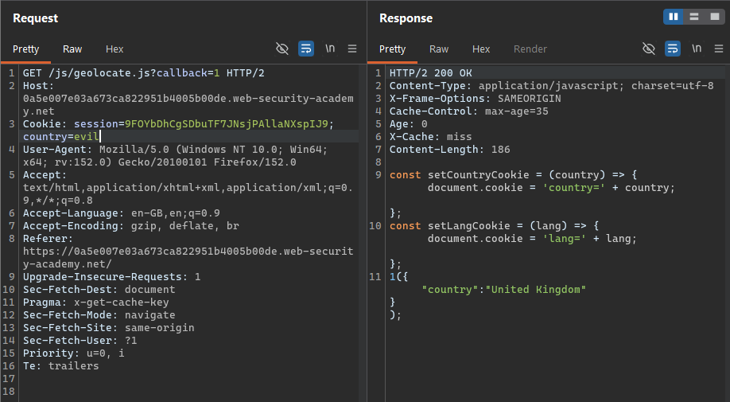

When multiple of them are set, it defaults to the last one. Adding the `utm_content` cookie causes it to be reflected in the thing as well:

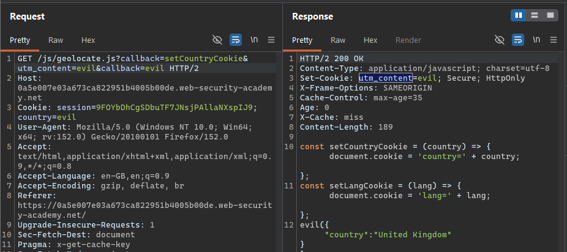

When adding a `;` to `utm_content`, it is parsed wrongly. The cookie is set to `evil0`, but the origin application stil lsees `callback` as `alert(1)`:

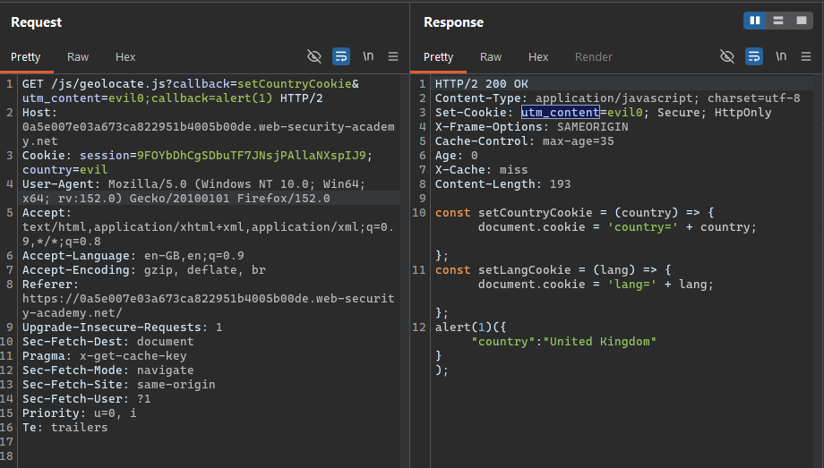

Anything after the `;` is parsed and used by the backend in the resulting JS. By appending a second one, we can override the initial function with `alert(1)`. The cache stores our malicious response as the default `?callback=setCountryCookie` since `utm_content` is not being processed by the cache as an unkeyed input. Remember that unkeyed inputs are basically inputs that the cache does not care about but the underlying application does.

### Lab 8: Fat GETs

A fat GET request is a request that includes a body, which is not typical.

This lab does accept the same `callback` parameter:

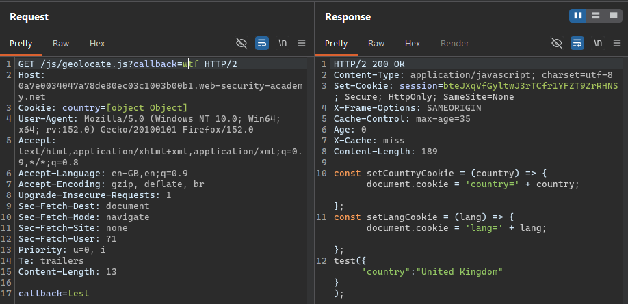

The function is set to `test` in the end. To solve the lab, simply just send this multiple times:

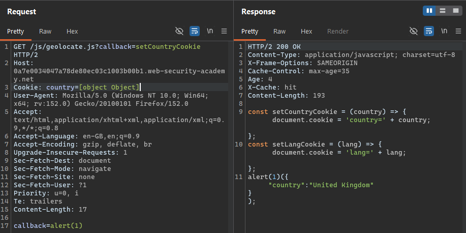

Eventually, the malicious response gets cached under the legit key.

### Lab 9: URL Normalisation

To solve this lab, a specific URL must be sent to the victim that triggers `alert(1)` that exploits the cache's normalisation process.

There is a pretty obvious XSS here:

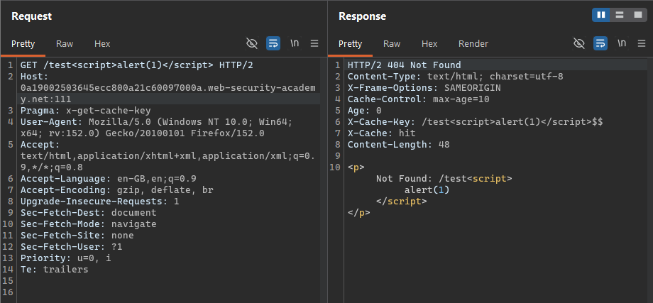

However, the browser cannot execute this payload because special characters are URL encoded by default.

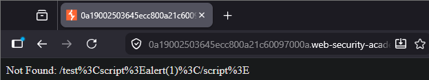

So the trick is to get the cache to store the actual XSS payload, then visit the site.

When Burp Repeater is used, raw unencoded characters can be sent to the server directly, thus allowing for the XSS in the first place. 

The normalisation done can be identified via `X-Cache-Key` header. The cache URL decodes this what is visited, and stores the malicious response in the cache. This means when a user visits `%3Cscript%3E`, the cache takes that, URL decodes it, and loads the response based on `<script>` as the key instead.

### Lab 10: DOM Vulnerability with Strict Cacheability Criteria

This lab has a DOM-based XSS with strict criteria for deciding which response are cacheable. To solve it, trigger `alert(document.cookie)` in the victim's browser.

First, send a request to Param Miner to find any hidden inputs. This lab has the `geolocate.js` file present:

```js
function initGeoLocate(jsonUrl)
{
    fetch(jsonUrl)
        .then(r => r.json())
        .then(j => {
            let geoLocateContent = document.getElementById('shipping-info');

            let img = document.createElement("img");
            img.setAttribute("src", "/resources/images/localShipping.svg");
            geoLocateContent.appendChild(img)

            let div = document.createElement("div");
            div.innerHTML = 'Free shipping to ' + j.country;
            geoLocateContent.appendChild(div)
        });
}
```

This defines the `initGeoLocate` function, which is used below:

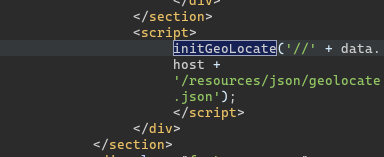

From the above, it is easy to see that the XSS issue is to do with the user's country, which might be be used later. 

Param Miner returns the `X-Forwarded-Host` header as an unlinked param. When this header is entered, it is reflected in the page:

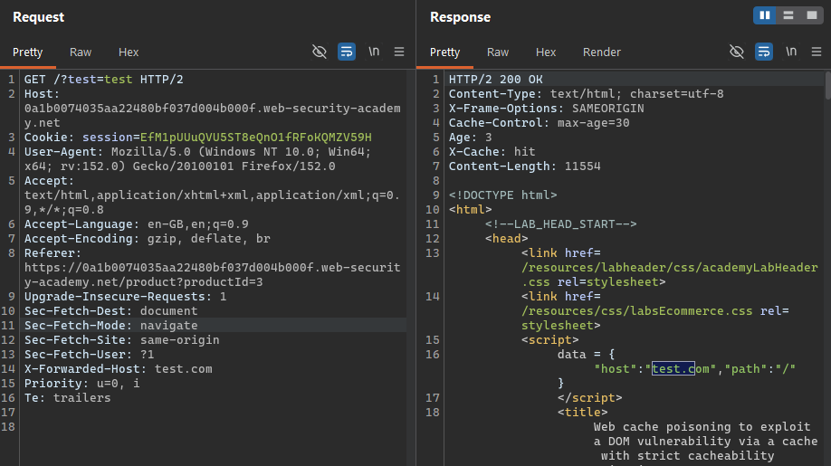

So the JS function above uses `data.host`, and the `X-Forwarded-Host` header controls the actual `host` used.

In short, we just have to specify our XSS payload within a JSON object that is eventually passed to `innerHTML`, then cache that response.

In the exploit server, store this:

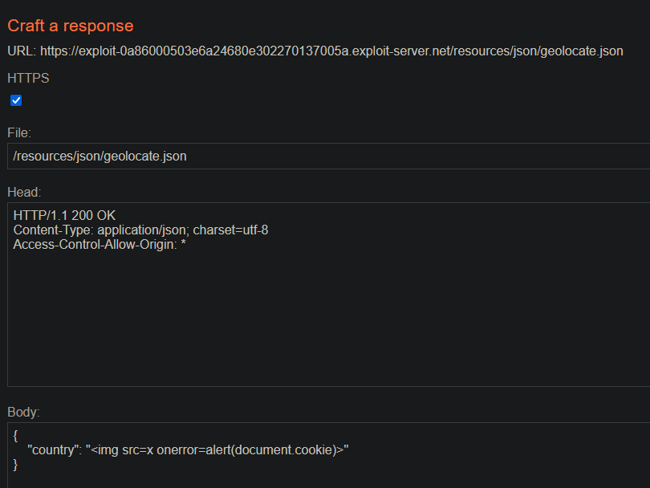

The reason we need to specify the CORS is because there are CORS related issues if not brought up:

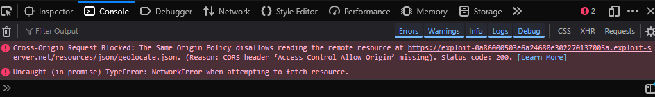

Once cached, the pop-up appears:

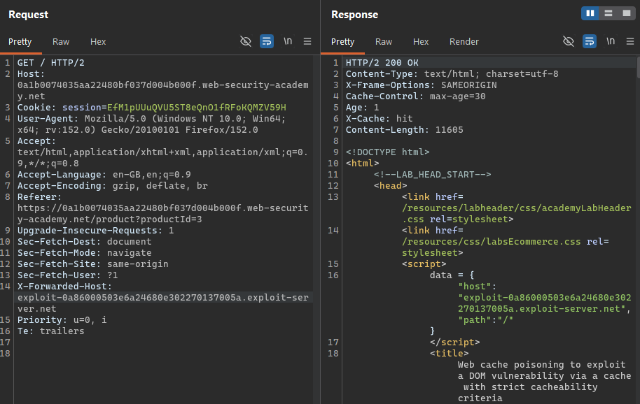

### Lab 11: Combining Cache Exploiting Chains

This lab mentions that there is a complex exploit chain required.

Param Miner returns `X-Forwarded-Host` and `X-Original-Url` as unlinked parameters.

There is also a change language feature on the site itself:

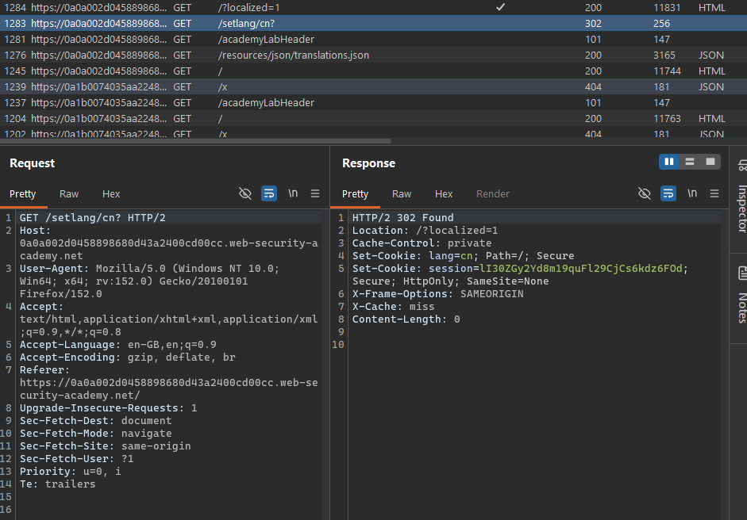

The translations are handled in `/resources/js/translations.js`:

```js
function initTranslations(jsonUrl)
{
    const lang = document.cookie.split(';')
        .map(c => c.trim().split('='))
        .filter(p => p[0] === 'lang')
        .map(p => p[1])
        .find(() => true);

    const translate = (dict, el) => {
        for (const k in dict) {
            if (el.innerHTML === k) {
                el.innerHTML = dict[k];
            } else {
                el.childNodes.forEach(el_ => translate(dict, el_));
            }
        }
    }

    fetch(jsonUrl)
        .then(r => r.json())
        .then(j => {
            const select = document.getElementById('lang-select');
            if (select) {
                for (const code in j) {
                    const name = j[code].name;
                    const el = document.createElement("option");
                    el.setAttribute("value", code);
                    el.innerText = name;
                    select.appendChild(el);
                    if (code === lang) {
                        select.selectedIndex = select.childElementCount - 1;
                    }
                }
            }

            lang in j && lang.toLowerCase() !== 'en' && j[lang].translations && translate(j[lang].translations, document.getElementsByClassName('maincontainer')[0]);
        });
}
```

The above code essentially reads the browser's cookies, and extracts its values. The vulnerable portion is that `dict` comes from the fetched JSON file's `translations` object, since it passes that into an `innerHTML` sink.

The actual JSON translations can be read:

```json
{
    "en": {
        "name": "English"
    },
    "es": {
        "name": "español",
        "translations": {
            "Return to list": "Volver a la lista",
            "View details": "Ver detailes",
            "Description:": "Descripción:"
        }
    },
    "cn": {
        "name": "中文",
        "translations": {
            "Return to list": "返回清單",
            "View details": "查看詳情",
            "Description:": "描述:"
        }
    },
```

The script takes values like `Volver a la lista` and passes it to `innerHTML`, which is the XSS injection point required.

`X-Forwarded-Host` changes the `data.host` parameter, same as above. `X-Original-Url` does not have any effect on the main page, but it does for the `/setlang` portion.

Setting `X-Original-Url` to `/` causes the `/setlang` to render the index page, rather than a redirect.

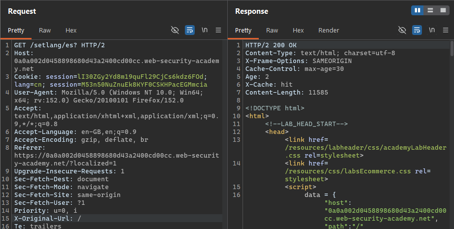

This is probably the method required to force a user to change the language to something else.

Putting it together:

- `X-Forwarded-Host` is used to poison the JSON resource loaded
- JSON resource is eventually passed to `innerHTML`, giving rise to XSS
- `X-Original-Url` is used to poison the `setlang` function, thereby forcing users who visit the site to switch language

Payload hosted on exploit server:

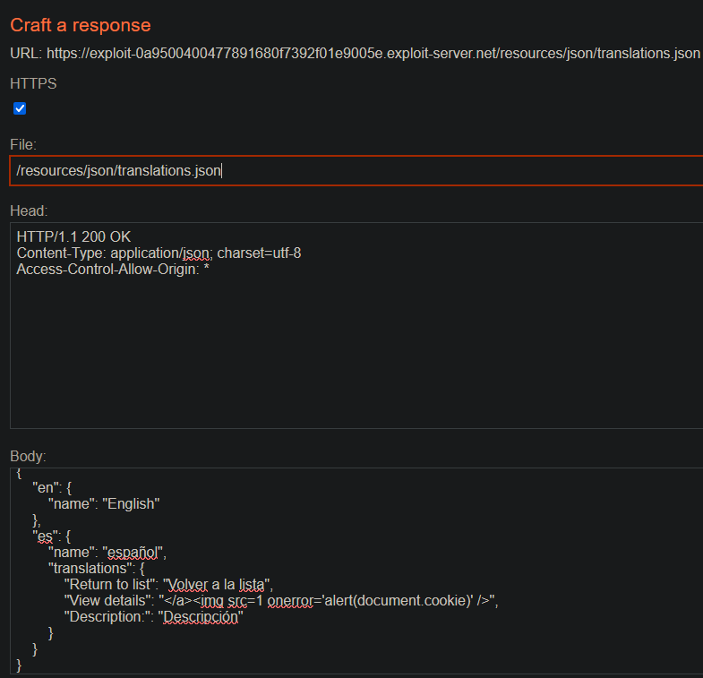

`X-Original-Url` must be set to `/setlang\es` to force all users to the Spanish page for `/`, then the `X-Forwarded-Host` poisons the actual Spanish contents translated.

Redirect users that visit page to Spanish page:

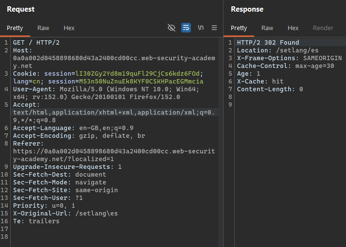

Triggering Spanish XSS:

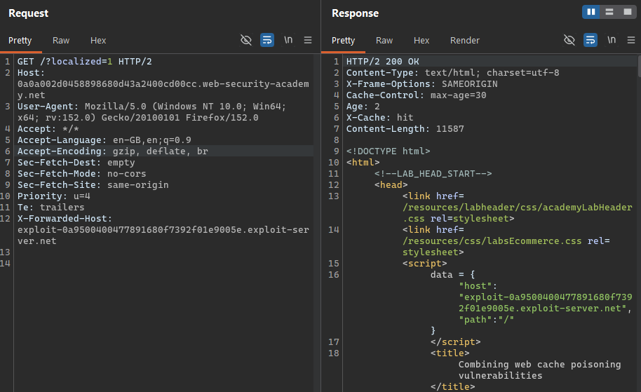

### Lab 12: Cache Key Injection (Skipped)

This lab has cache key injection, requiring users to execute `alert(1)` on the victim's page. Will not be doing this for now. 

### Lab 13: Internal Cache Poisoning

This application has multiple layers of caching to exploit. Goal is to execute `alert(document.cookie)` on victim's browser.

Param Miner found that the `X-Forwarded-Host` header was injectable. There was also a `/analytics` endpoint.

```js
function randomString(length, chars) {
    var result = '';
    for (var i = length; i > 0; --i) result += chars[Math.floor(Math.random() * chars.length)];
    return result;
}
var id = randomString(16, '0123456789abcdefghijklmnopqrstuvwxyzABCDEFGHIJKLMNOPQRSTUVWXYZ');
fetch('/analytics?id=' + id)
```

This must be the 'internal' endpoints. There is also the `setCountryCookie` endpoint.


`X-Forwarded-Host` changes the resource loaded for `analytics.js`:

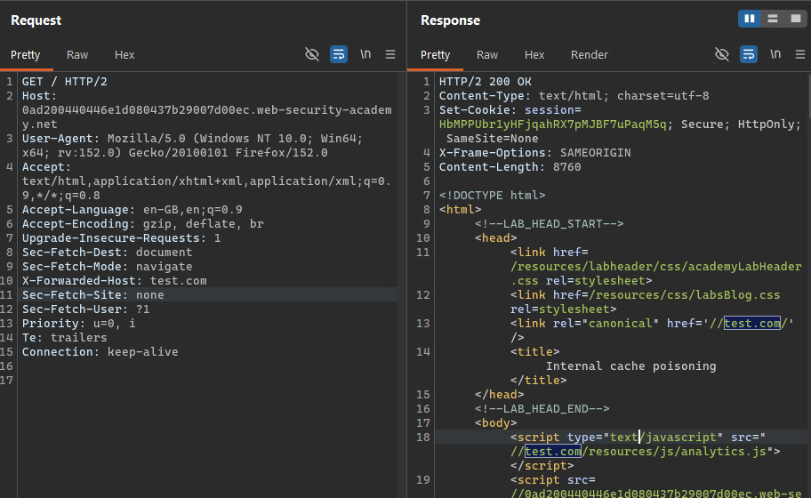

The point of this lab is to introduce 2 separate caches stacked on top of each other.

The external cache seems to always reflect a query string, indicating it's part of the external cache's key. This means if we keep changing the query and always hit the origin, we can see the internal behaviour.

If you keep spamming the `X-Forwarded-Url` in Intruder, the lab eventually gets solved.

## Cache Deception

### Lab 1: Path Mapping

To solve this, the API key for `carlos` had to be found.

When logged in, adding `a.js` to the end of the path resulted in the API key still being rendered, and it was cached:

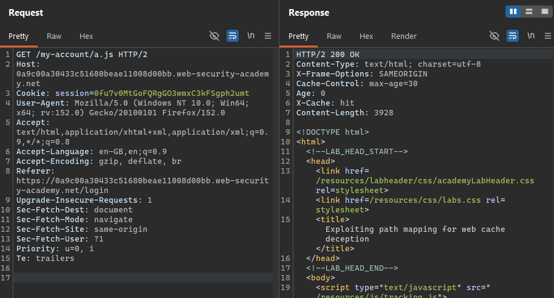

The API key was viewable even after the session cookies were removed, indicating web cache deception was present.

To solve the lab, host this on the exploit server and deliver it to the victim:

```html
<script>document.location="https://0a9c00a30433c51680beae11008d00bb.web-security-academy.net/my-account/a.js"</script>
```

Then, load the `/my-account/a.js` to find the right key:

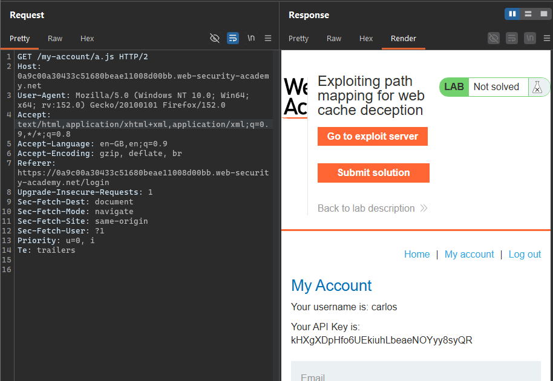

### Lab 2: Path Delimiters

This lab introduces path delimiters as a possible caching point. The goal is the same as above.

Appending `a.js` or `a.css` to any endpoint resulted in 404s being returned. By sending the request to Intruder with URL encoding turned off using the delimiter wordlist given, some return 200:

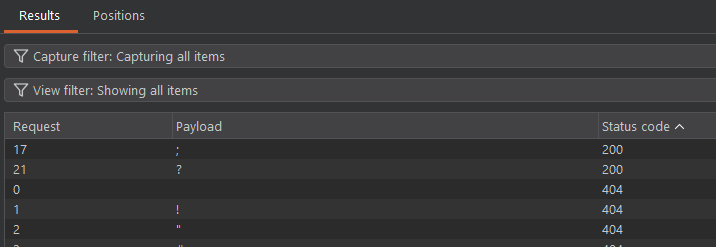

Appending `;b.js` causes a cache hit to be returned:

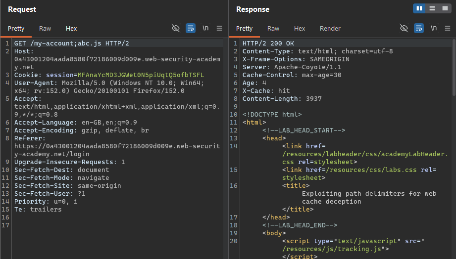

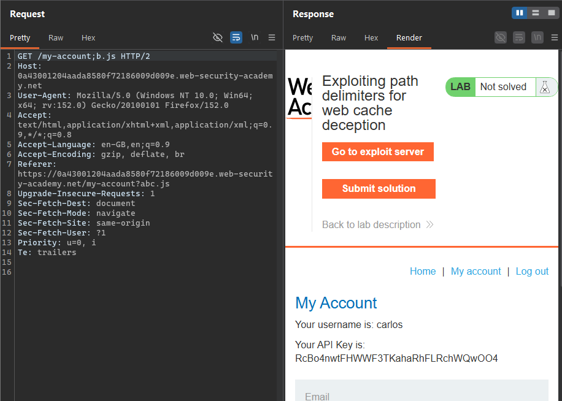

### Lab 3: Origin Server Normalisation

For this lab, the cache and origin server normalise the URL Path. First, use Intruder with the delimiter check to see which returns 200. Only `?` returns 200, still not useful since the response still does not indicate anything related to caching.

When visiting any of the JS sources, the cache information appears:

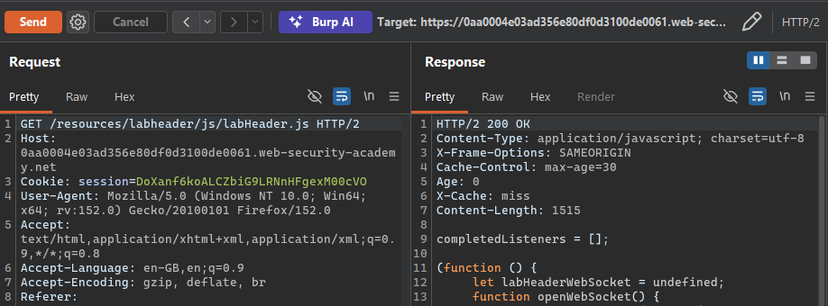

Using `/resources/../my-account` causes it to be cached.

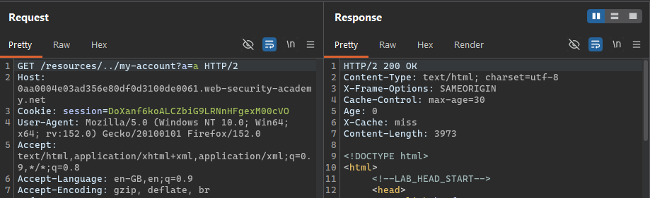

The rest is simple.

### Lab 4: Cache Server Normalisation

In short for this one, the cache server normalises URLs, checking whether `/resources` is present before caching.

By using an encoded `#` to become `%23`, the cache server is forced to cache the dynamic page.

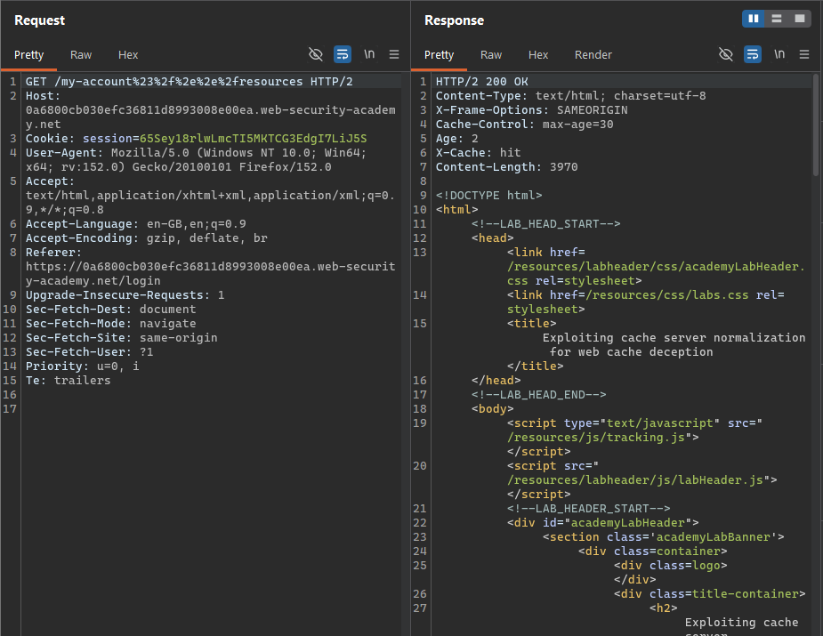

The cache server decodes and resolves `..` sequences, and caches anything under `/resources`. `/a/..%2fresources` gets normalised and cached.

The origin server sees the `#` delimiter early and stops at `/my-account`, while the cache server decodes and resolves everything to see `/resources`.

Payload used:

```html
<script>document.location="https://0a6800cb030efc36811d8993008e00ea.web-security-academy.net/my-account%23%2f%2e%2e%2fresources"</script>
```


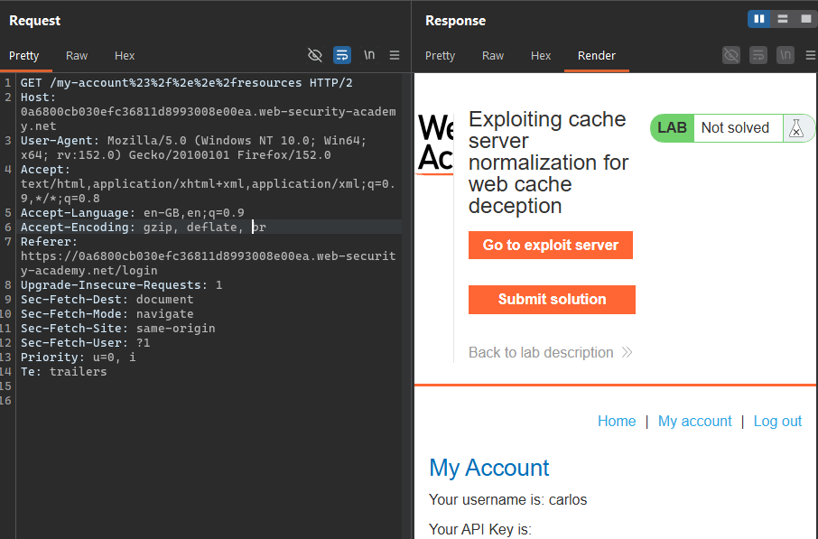

### Lab 5: Exact-Match Cache Rules

To solve this lab, the email address for `administrator` must be changed. This lab requires us to somehow use web cache poisoning to perform a CSRF attack. 

The CSRF token is located on the account page. So, the first step is to figure out how to cache the admin's account page to steal this token.

This lab does not cache the `/resources` directory, but instead caches things with `.txt`.

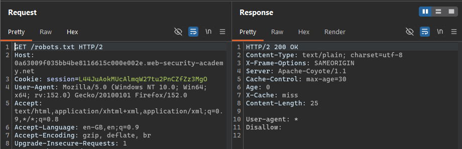

So the cache rule only applies to `robots.txt` and nothing else.

Intruder can be used to find the delimiter, which was either `?` or `;`. Caching behaviour:

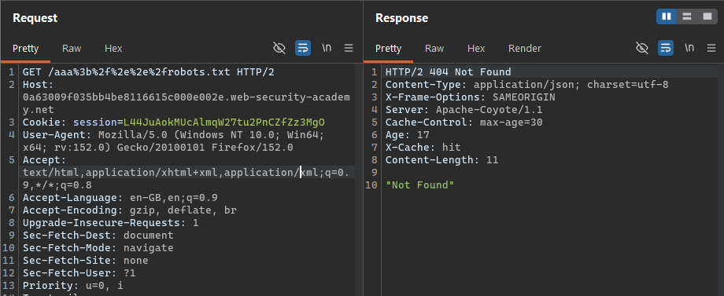

Changing it to `/my-account;%2f%2e%2erobots.txt?123` will redirect users to the `/my-account` page. If the account page is cached, then finding the administrator's CSRF token is easy.

Deliver this exploit to the victim:

```html
<script>document.location="https://0a63009f035bb4be8116615c000e002e.web-security-academy.net/my-account;%2f%2e%2e%2frobots.txt?abc"</script>
```

Then, visit the same link and see that the admin's account and CSRF token are loaded:

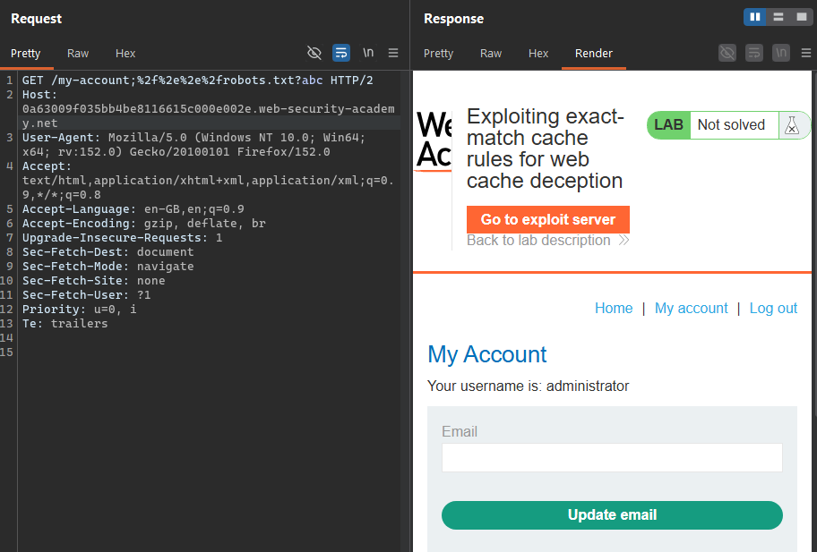

Use BurpSuite to generate the CSRF PoC, and replace the token with the admin's. Once sent, the lab is solved.

```html
<html>
  <!-- CSRF PoC - generated by Burp Suite Professional -->
  <body>
    <form action="https://0a63009f035bb4be8116615c000e002e.web-security-academy.net/my-account/change-email" method="POST">
      <input type="hidden" name="email" value="test&#64;test&#46;com" />
      <input type="hidden" name="csrf" value="" />
      <input type="submit" value="Submit request" />
    </form>
    <script>
      history.pushState('', '', '/');
      document.forms[0].submit();
    </script>
  </body>
</html>
```