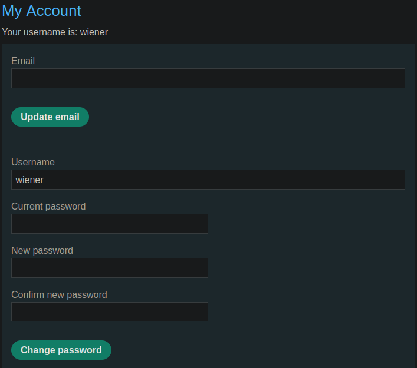

# Portswigger Writeups

## Lab 1: Excessive trust in client-side controls

To solve this lab, buy the leather jacket. When added to the cart, here are the parameters sent:

```
productId=1&redir=PRODUCT&quantity=1&price=133700
```

I can change the `price` to 1, and then send the request. This sets the price of the jacket to $0.01.


## Lab 2: High-Level Logic Vuln

To solve the lab, buy the jacket. This time, the `price` parameter is not present. When removing items from the cart, it sends another POST request:

```
productId=1&quantity=-1&redir=CART
```

I can keep sending the same request until I get a negative number of jackets:


When trying to checkout, it does not let me as the total price cannot be negative. In this case, I can keep adding other products until the total price is a positive number.


This method works in checking out. To exploit it, I can just add 1 jacket and then add other products in the negatives until I can afford it.


## Lab 3: Inconsistent Security Controls

To solve this lab, delete the `carlos` user. I have access to an email client and I can register users using an email:


I registered a user with the email and confirmed the account:


I noticed that there was a domain for workers. I changed my email account to `attacker@dontwannacry.com` on the 'My Account' page.


I could then access the admin panel to delete `carlos`.

## Lab 4: Flawed Enforcement of Rules

To solve this lab, buy the jacket. I noticed that there was a checkout code:


At the bottom of the page when logged in, there's a newsletter sign up:


This gives me a new coupon code:


By using these two coupon codes, I can bypass the 'Coupon has already been used' error by interleaving their usage:


It seems that the website only checks whether the **previously used coupon** is the same. Repeated usage will result in a free jacket!


## Lab 5: Low-Level Logic Flaw

This lab has an integer flow error. So by adding a ton of jackets to the cart, I can cause an overflow which will make the price negative. 


Eventually, after adding enough jackets, the price will almost be affordable.


Just add enough items to the cart such that the total price is positive and less than 100. 


Then checkout!

## Lab 6: Inconsistent Exceptional Input Handling

To solve this lab, delete `carlos` as the administrator of the website. I have access to an email client for this lab.

One thing I noted was the fact that the email client will receive emails with all subdomains.


I registered with a very long email:

```
attackerwwwwwwwwwwwwwwwwwwwwwwwwwwwwwwwwwwwwwwwwwwwwwwwwwwwwwwwwwwwwwwwwwwwwwwwwwwwwwwwwwwwwwwwwwwwwwwwwwwwwwwwwwwwwwwwwwwwwwwwwwwwwwwwwwwwwwwwwwwwwwwwwwwwwwwwwwwwwwwwwwwwwwwwwwwwwwwwwwwwwwwwwwwwwwwwwwwwwww@exploit-0aea00fa03545b628000c58c0125005c.exploit-server.net
```

I confirmed my email via the client, and logged in. The first thing I noticed was that my email was truncated!


The above has 255 characters. To access the admin panel, I need an email ending with `@dontwannacry.com`. 

To do this, I have to somehow make the website truncate my email to `email@dontwannacry.com`, but I still have to receive the actual email to confirm my account.

Since the client receives all email with the same domain, I can create an email ending with `@dontwannacry.com.EXPLOITMAIL`, and just append junk to the front such that the 'm' from `.com` is at the 255th character.

I used this email to register:

```
1111111111111111111111111111111111111111111111111111111111111111111111111111111111111111111111111111111111111111111111111111111111111111111111111111111111111111111111111111111111111111111111111111111111111111111111111111111111111111111111@dontwannacry.com.exploit-0aea00fa03545b628000c58c0125005c.exploit-server.net
```

When the account is confirmed and I logged in, I could see that it worked. The website truncated the email to end with `dontwannacry.com` and I had access to the administrator panel:


## Lab 7: Weak isolation on dual-use endpoint

To solve this lab, delete `carlos`. When logged in, I noticed there was a password change functionality that takes in a username and current password:



By changing the `username` to `administrator` and removing the 'current password' parameter, I can change the admin's password:


Then I can login and delete `carlos`.

## Lab 8: Insufficient Workflow Validation

To solve this lab, buy the jacket. When trying to buy it, I see this request being made due to me not having enough money:


When buying a product I can actually afford, this is the message returned:


So when intercepting requests, I can attempt to checkout and change the `err` request to the `order-confirmed` request to solve the lab. 

## Lab 9: Auth Bypass via Flawed State

To solve this lab, delete `carlos`. I intercepted each request for the login.

There was this option here to select a 'role':


When intercepted, I changed the `role` parameter sent to `administrator`.


However, this did not work. I tried dropping the request to the `role-selector`, and the website defaulted to make me an administrator:


Then, just delete `carlos`.

## Lab 10: Infinite Money

To solve this lab, buy the jacket.