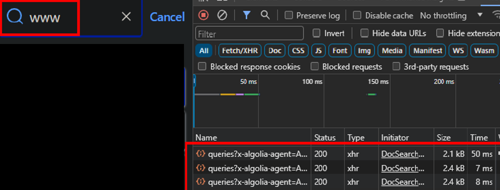
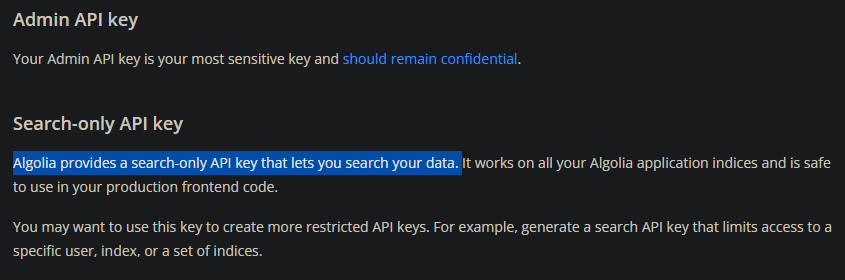
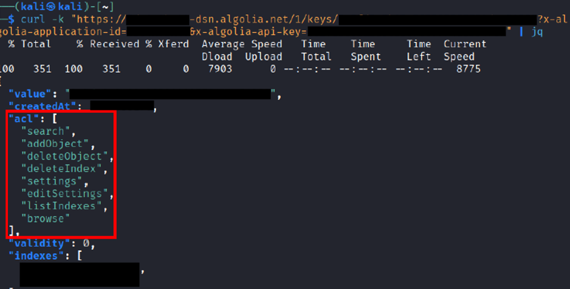
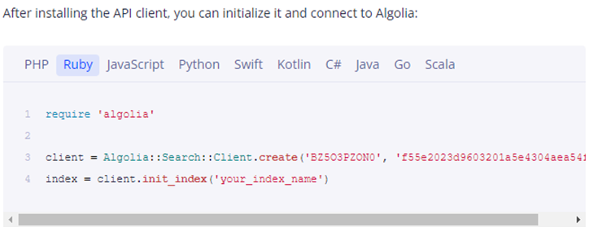

# Algolia API

The asset owners have agreed to a partial disclosure of this finding.

Vector String: **CVSS:3.0/AV:N/AC:L/PR:N/UI:N/S:U/C:H/I:H/A:H**

Score: **9.8 (Critical)**

## Discovery

Typically, university course websites are static pages with just words and images on them. When looking at this particular university's site, I noticed that there was a search function powered by Algolia in the lower right corner.

Algolia is a third-party, search as a service platform.



Further enumeration using browser inspector tools shows that each keystroke typed in the search bar sent a request to an external domain.

The external domain was `https://APPID-dsn.algolia.net`, and it included 2 parameters, namely the `x-algolia-api-key` and `x-algolia-application-id`.

I was curious about whether this `api-key` parameter was sensitive, so I read up on the Algolia documentation. It states that the keys are safe to expose provided they are set to **SEARCH-ONLY**. There is another admin API key which must be kept secret.



Naturally, I wanted to enumerate if the API was configured properly. Visiting `https://APPID-dsn.algolia.net/1/keys/APIKEY?x-algolia-application-id=APPID&x-algolia-api-key=APIKEY` will return the permissions of the key. The output from `curl` returned excessive permissions for this publicly exposed API key:

This confirms that the admin API key was being use. These administrative permissions are dangerous and can be abused by attackers:

- `listIndexes` can cause information disclosure.
- `editSettings` can be used to update indexes with Javascript, allowing for Stored XSS.
- `addObject` allows for indexes to be added, allowing attackers to deface the website by adding their own objects.

## Fix and Cause

I worked with the developers to fix this issue, which included setting up my own Algolia instance. The dashboard allows for Admin API keys to be revoked and regenerated.

The fix was straightforward, revoke the admin key, and replace the old key with the Search-Only key. The real question is: **How did this bug occur?**

The root cause is their documentation. Algolia has 'dynamic' documentation, which generates code snippets for any developer to copy and paste, like so:

I found that this feature automatically includes the **Admin API key**. There is **little prior warning** about this, and the developer probably copied and pasted without knowing this.

In hindsight, this is a major design flaw.

## Timeline

Reported in March 2024.

Verified in April 2024.

Fixed in May 2024.

Agreed to publicly disclose June 2024.

## Other Resources



{% embed url="https://www.secjuice.com/api-misconfiguration-data-breach/"}