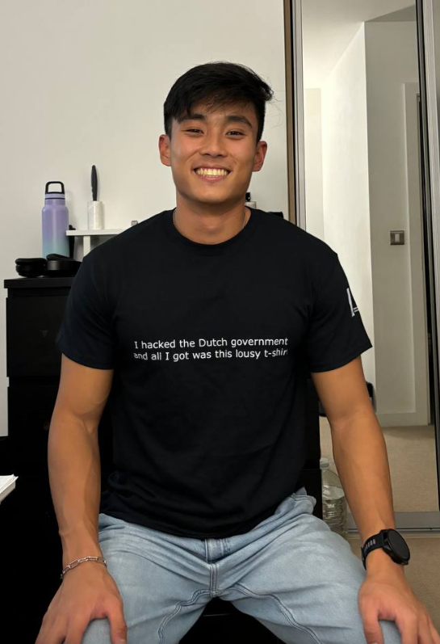

# Hacked Dutch Government

Finally got around to hacking the Dutch Government!

I am unsure if I can publicly disclose the vulnerability because technically, there are still issues with it, so I will err on the side of caution here.

A big thank you to the National Cyber Security Centre (NCSC) for promptly replying me and working with me to fix the vulnerability.