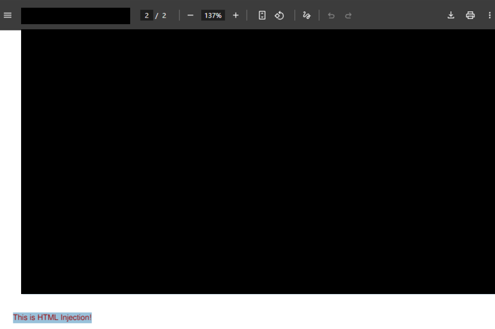
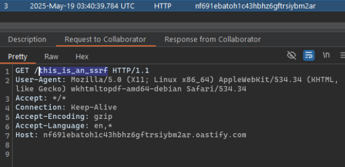
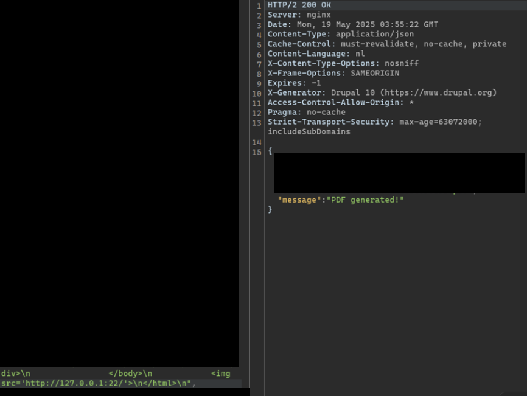
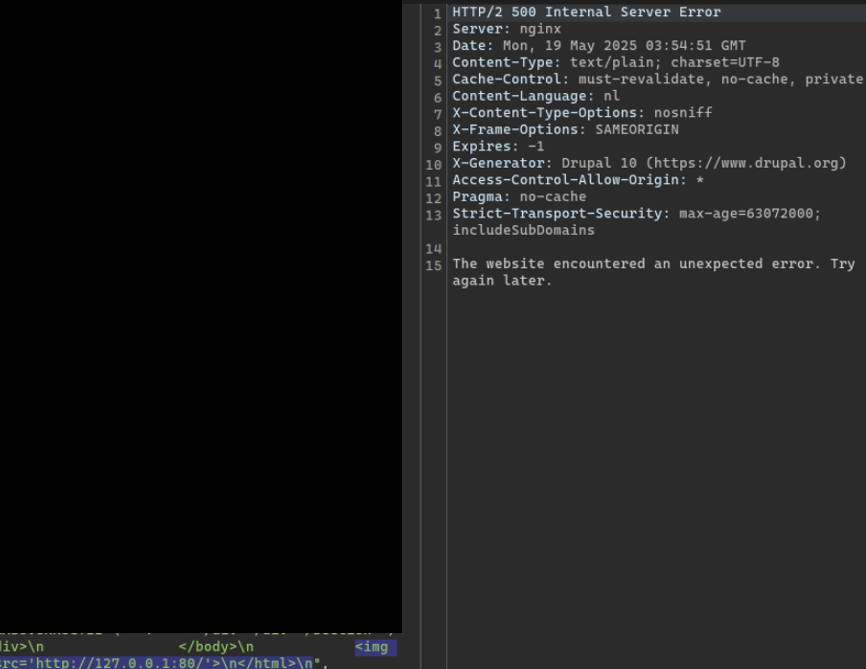

# Blind SSRF

## Discovery

This was found during the re-testing of the LFI issue I reported for PDF generation on a Dutch Government website. That particular site takes HTML input from the client-side, and uses it to generate a PDF via `wkhtmltopdf`:


After their fix, I noticed that I was still able to do HTML injection using this payload:

```html
<pre style='color:red;'>This is HTML Injection!</pre>
```

This was the PDF generated:



`<script>` tags were no longer allowed after the fix, but I noted that using `` still worked. Using this payload allowed for callbacks on my BurpSuite Collaborator client, with `wkhtmltopdf-amd64-debian` in the `User-Agent` header.

```html
\n
```



I confirmed that the IP address is indeed a Dutch IP using `whois.domaintools.com`. 

## Exploitation

Using this, I knew that blind SSRF itself was not a valid issue on its own. As such, it had to be combined with something else to become more severe and worth reporting. I noticed that using various URLs will cause different issues.

For this instance, using `http://127.0.0.1:22` in the `` header would cause a PDF to be generated. 



Using `http://127.0.0.1:80` would not, and actually returns a 500.



This was quite clearly a blind SSRF that allowed for port enumeration. I tested further with `https://example.com` and `https://thisdoesnotexist.xyz`, and noted that `example.com` returned a valid PDF.

## Cause

`wkhtmltopdf` actually has `--disable-external-links --disable-internal-links` flags that can be used to prevent retrieving information from any links. I suspect that this was not included in their current settings. 

I was however, unable to exploit this further and it was rated a P3, which was not processed.