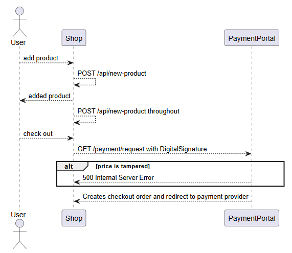

# Price Manipulation

They acknowledged the report, fixed the change, but decided my report was deemed as 'Invalid' 🤷‍♂️

## Discovery

I was looking at a target that featured a shop to buy items. When adding things to the cart, it would send a POST request ti `/api/new-product` with a JSON payload as follows:

```http
POST /api/new-product HTTP/2
Host: target.com
Authorization: Bearer <Token>
Content-Type: application/json

{
    "date":"2025-05-22"
    "adult":"1",
    "child":"0"
}
```

The response would reflect the number of adults and children, and then the final price. When checking out, it would send the same POST request multiple times, presumably ensuring that the items are not changed.

When checking out, it would send GET request to the payment portal with a few parameters:

```http
GET /Payment?ReferenceNum=<refnumber>&Price=56&DigitalSignature=<signature>
```

Specifically, there seems to be a `DigitalSignature` field that prevents the tampering of parameters. When `Price` was manipulated in this GET request, the server responded with a 500.

So this is the flow:



## Exploitation

Changing the price in the GET request to the PaymentPortal will cause errors. So I started experimenting with the parameters within `/api/new-product`.

Eventually, I found that the `adult` parameter was not sanitised, and decimals could be used.This means that changing the value of `adult` from 1 to 0.01 would reduce the price by a factor of 100.

I knew that there were multiple POST requests being sent to that endpoint throughout the checkout process as I filled my details, so exploiting any of the intermediate requests was useless.

As such, I intercepted the very first POST request and changed the `adult` parameter to have `0.01`. This worked in manipulating the initial price to be a lot lesser. Subsequent POST requests also reflected this manipulated price.

When checkout was called, the manipulated price was passed to the payment portal, and the `DigitalSignature` parameter was created successfully. I was thus able to checkout for an item for a lot lesser!

Sequence of exploit:


After paying, the order was reflected successfully in my account. Each order had a `Number of Travelers`  field, and the order created using my exploit method was set to 0, which I found rather odd. It also did not send me any confirmation emails, and I figured that it caused a backend error since the parameter was set to 0. 

I repeated the exploit, this time using 0.5 instead of 0.01, since I figured that it would be rounded up. This worked in creating an order and calling the payment portal with `Number of Travelers` being set to 1, with the product at half price. I did not check out for this, since the product was really expensive and I did not want to pay real money.

## Reporting

I reported this issue for a **bug bounty**. However, due to my report failing to produce a valid order ID, they deemed it as 'Invalid`. They mentioned, and I quote:



```
After reviewing the issue, we observed that no Order ID was generated because no order was created. This is the expected behaviour and part of the normal application flow. As such, it is not considered a valid security issue.
```



The rather infuriating part was that after they got back to me, they **fixed the issue**, and I was unable to recreate it. I personally felt it was a bit unfair since they claimed it was 'expected behaviour', then proceeded to change and add validation for the parameters I highlighted.

Regardless, I thought it was a pretty interesting experience, seeing how business logic flaws like this still exist despite measures like signatures being implemented to prevent tampering of parameters.

