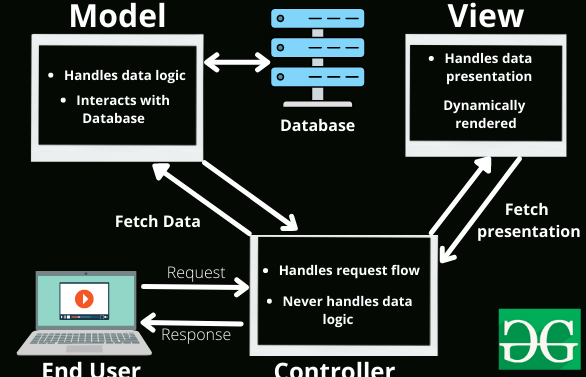
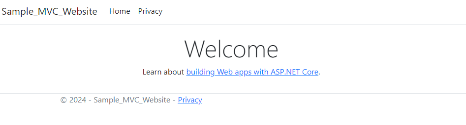
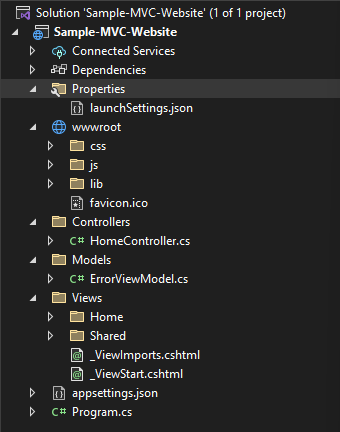
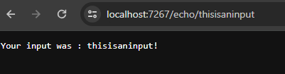

# MVC Framework

To better understand MVC Frameworks, I created a simple MVC website using ASP.NET. It features an MSSQL backend, with an administrative interface featuring some CRUD functions.



## What is MVC?

Model-View-Controller is a framework that separates an application into 3 logical components, which are the Model, View and Controller. Each component is built to handle a specific functionality of the web application.

The reason that this framework was established was due to applications supporting storage of information, displaying information and changing of stored information. These components are highly coupled and interlinked, and it can be difficult to debug should it be all lumped together.

Thus, classifying the code into 3 major components greatly helps developers, allowing individual testing for each component and reducing complexity. It provides a clear separation of business, UI and data input logic, allowing us to build more scalable web or mobile applications.

Here is the rough breakdown of the framework:

* View: Displays data, interacts with the user, and pulls data from the model. Dynamically generated from the controller.
* Controller: Handles, processes, and parses user input. Acts as an intermediary between the View (UI) and the backend logic (Model). 
* Model: Stores and maintains data, parses data and handles connections to databases.



### Model

The Model component stores and maintains data, and does database connections too. This is the part of the application that keeps the data structures, algorithms, computation engine and the logic that interacts with databases. There can be validation logic that enforces rules for the data (e.g. A `string` variable cannot accept an `int` type).

For example, suppose an application has a `Animal` object. The Model is where I could declare the classes and functions used to store and retrieve data.

```cs
public class Animal { 
    public string animalSound {get; set;}
    public int animalAge {get; set;}
    public string animalName {get; set;}
}
```

The Model would have the name and the public properties defined with the class. Apart form that, it can also contain logic for the database interactions to retrieve the objects like this:

```cs
using Microsoft.EntityFrameworkCore;

public class AnimalDbContext : DbContext
{
    public DbSet<Animal> Animals { get; set; }

    protected override void OnConfiguring(DbContextOptionsBuilder optionsBuilder)
    {
        optionsBuilder.UseSqlServer("Server=localhost;Database=AnimalDatabase;User Id=sa;Password=your_password;");

    }
}
```

The above is a `DbContext` object used ot handle the task of connecting to the database. Using this, one can construct the code for an example query like so in `Main`:

```cs
using System;
using System.Linq;

class Program
{
    static void Main()
    {
        using (var dbContext = new AnimalDbContext())
        {
            // Ensure the database is created
            dbContext.Database.EnsureCreated();

            // Add a sample animal to the database
            dbContext.Animals.Add(new Animal { AnimalSound = "Meow", AnimalAge = 2, AnimalName = "Whiskers" });
            dbContext.SaveChanges();

            // Query all animals
            var allAnimals = dbContext.Animals.ToList();

            // Display the results
            Console.WriteLine("All Animals:");
            foreach (var animal in allAnimals)
            {
                Console.WriteLine($"Name: {animal.AnimalName}, Sound: {animal.AnimalSound}, Age: {animal.AnimalAge}");
            }
        }
    }
}
```

Generally, the Controller is the one that contains the code that is in charge of **using** the data models amd methods defined in the Model component. The displaying of the results is done in the View component.

In summary, the Model component defines all the data types, classes and methods for data within the application.

### Controller

The Controller is responsible for handling the user's input, processing it and updating the Model objects with the data retrieved. It invokes methods from the Model to do stuff like create new `Animal` objects, or perhaps store data within a database. It also does the routing for the web applications, and is typically responsible for sanitising user input.

For example, here's how to define a route that accepts POST requests:

```cs
public class AnimalController: Controller
{
    [HttpPost, ValidateAngiForgeryToken]
    public IActionResult addAnimal(Animal animal)
    {
        try
        {
            if (ModelState.IsValid)
            {
                _dbContext.Animals.add(animal);
                _dbContext.SaveChanges();
                
                return RedirectToAction("Success")
            }
            else
            {
                return View(animal);
            }
        }
        catch (Exception ex)
        {
            Console.WriteLine($"Error: {ex.Message}");
            ModelState.AddModelError(string.Empty, "An error occurred while adding the animal. Please try again.");
            return View(animal);
        }
    }
}
```

Firstly, an `AnimalController` class is defined which inherits from the general `Controller` class. These controllers are the things that handle HTTP requests.

Afterwards, I defined an attribute to the `addAnimal()` method. I specified that this method takes HTTP POST requests and verifies CSRF tokens to prevent forgery attempts. The route itself can be specified using `[Route("animals/add")]` if needed. However, this can also be done in the `Startup.cs` file located in `wwwroot`, depends on what is required. ASP.NET also infers the route from the controller and actions anmes automatically, so the actual directory to add animals would be `/Animal/AddAnimal`.

ASP.NET MVC also automatically parses the POST parameters from the user, and matches creates a new `Animal` object, which I find pretty cool. Alternatively, the parameters can be manually retrieved like so:

```cs

string animalSound = Request.Form["animalSound"];
int animalAge = int.Parse(Request.Form["animalAge"]);
string animalName = Request.Form["animalName"];

Animal animal = new Animal
{
    AnimalSound = animalSound,
    AnimalAge = animalAge,
    AnimalName = animalName
};
```

It is recommended to let ASP.NET do this automatically since it is easier for the programmer, unless specific logic to pass data elsewhere is required.

Apart from POST requests, other HTTP methods like GET, PUT or DELETE can be specified using attributes. 

```cs
[HttpGet]
public class HomeController: Controller 
{
    public class IActionResult Index()
    {
        return View();
    }
}
```

Note that `IActionResult` is an interface in ASP.NET Core that represents the result of an action method. It is the base interface for all action results in ASP.NET core. Returning `View()` would render the HTML view associated with the action (again, ASP.NET is kinda hella smart to associate this for me).

There are other interfaces like `IWebHost` which represents the hosting environment, or `IConfiguration` that sets the configuration settings (such as setting the default page to `/home/index`) in `Startup.cs`.

Lastly, there is an in-built dependency injection technique, which basically provides the objects that an objects needs rather than having it create them. Dependencies are usually passed through constructors, and inverts the flow of control. This is because the object itself creates the object it needs!

The below code would inject the instance through the constructor, instead of creating a new instance within the controller for the `AnimalController` class. Again, this can be configured within the `Startup.cs` file.

```cs
public class AnimalController : Controller
{
    private readonly AnimalDbContext _dbContext;

    public AnimalController(AnimalDbContext dbContext)
    {
        _dbContext = dbContext;
    }
}
```


In conclusion, Controller does all the processing of user input, and updates the Model (e.g. database update) using the methods defined in Model, and the content displayed to the user in the View.

### View

The View represents the user interface of an application, responsible for dynamically displaying data to the user, and also capturing the user's input through forms or clicks. The captured input is sent to the Controller for processing.

For ASP.NET, View can use Razor to embed server-based code into web pages. It is a combination of HTML and C# code (`.cshtml` files). This allows the developer to display server information retrieved from the Model. 

```html
@model Animal

<!DOCTYPE html>
<html>
<head>
    <title>@Model.AnimalName Details</title>
</head>
<body>
    <h2>@Model.AnimalName Details</h2>

    <dl>
        <dt>Sound:</dt>
        <dd>@Model.AnimalSound</dd>

        <dt>Age:</dt>
        <dd>@Model.AnimalAge</dd>
    </dl>
</body>
</html>
```

The View class can also take input via forms:

```html
@model Animal

<!DOCTYPE html>
<html>
<head>
    <title>Create Animal</title>
</head>
<body>
    <h1>Create Animal</h1>

    <form asp-action="Create" method="post">
        <label for="AnimalName">Name:</label>
        <input type="text" id="AnimalName" name="AnimalName" />

        <br />

        <label for="AnimalSound">Sound:</label>
        <input type="text" id="AnimalSound" name="AnimalSound" />

        <br />

        <input type="submit" value="Submit" />
    </form>
</body>
</html>
```

This specifies that something uses the `Animal` class from the Model component, and a simple form is created to take user input. Separate files can be created to display the data:

```html
@model Animal

<!DOCTYPE html>
<html>
<head>
    <title>Result</title>
</head>
<body>
    <h1>Result</h1>
    
    <p>Received: @Model.AnimalName - @Model.AnimalSound</p>
</body>
</html>
```

In short, View takes user input, sends / receives it to Controller, and displays it. Razor is a powerful templating engine, that is sometimes vulnerable to SSTI if developers use `Razor.Parse` and `.Template` on unsanitised inputs.

Here's a simple web application I created to attempt to understand MVC and ASP.NET better. 



Below is a look into some files created and components in an MVC application (just because I was curious).



## `wwwroot`

When creating a new ASP.NET MVC project, one can see the files automatically created:



The Models, Views and Controllers folders are where the majority of our code will go.

The `wwwroot` file is the web root folder, and static files can be stored under that folder and viewed from the browser. **Code and Razor files should not be placed here!**

## `Program.cs`

`Program.cs` is the entry point. All the services are configured and started up here. The explanation behind all the code for it can be found here:



### Services

The only thing I noted was that services could be added to the container. The default calls `buider.services.AddControllerWithViews()`, and I can do `AddRazorPages()` to add that. 

Database contexts are added to the container at this point as well! After all the services are added, `builder.Build();` is invoked to instantiate a `WebAppication` object with whatever services enabled.

```cs
 var builder = WebApplication.CreateBuilder(args);

/* Add services here: https://learn.microsoft.com/en-us/aspnet/core/fundamentals/dependency-injection?view=aspnetcore-7.0#framework-provided-services
* Added: Razor pages, MVC controllers with views, custom DbContext for Animals
*/
builder.Services.AddControllersWithViews();
builder.Services.AddRazorPages();
var app = builder.Build();
```

### Middleware

Next would be the Middleware portion, which is the request handling pipeline. This is the default code:

```cs
 // Configure the HTTP request pipeline.
if (!app.Environment.IsDevelopment())
{
    app.UseExceptionHandler("/Home/Error");
    // The default HSTS value is 30 days. You may want to change this for production scenarios, see https://aka.ms/aspnetcore-hsts.
    app.UseHsts();
}
app.UseHttpsRedirection();
app.UseStaticFiles();
app.UseAuthorization();
```

Self-explanatory.

### Routing

This is the part that gives us control over the URLs used by the application, and it calls `UseRouting` to do so. Custom routes can be specified like this:

```cs
app.UseRouting();
app.MapGet("/hello", () => "This is a route!");
```

`MapGet` is used to define and endpoint, which is something that can be selected by the URL and HTTP method, and executed. 

Route templates can be used to customise its behaviour:

```cs
app.MapGet("/echo/{input:alpha}", (string input) => $"Your input was : {input}!");
```



The usage of `:alpha` constrains the input to only have alphabetic characters. They act like regex and only select the matching characters. Here are a few more:

* `{id:int}`: Match any integer
* `{money:float}`: Match any float value.
* `{ssn:regex(^\\d{{3}}-\\d{{2}}-\\d{{4}}$)}`: Specifies regex to match.
* `{input:required}`: Enforce a parameter.

Routing also covers authorisation:

```cs
builder.Services.AddHealthChecks();
...
app.MapHealthChecks("/admin").RequireAuthorization();
app.UseAuthorization();
```

Pretty interesting how easy it is to add routes.