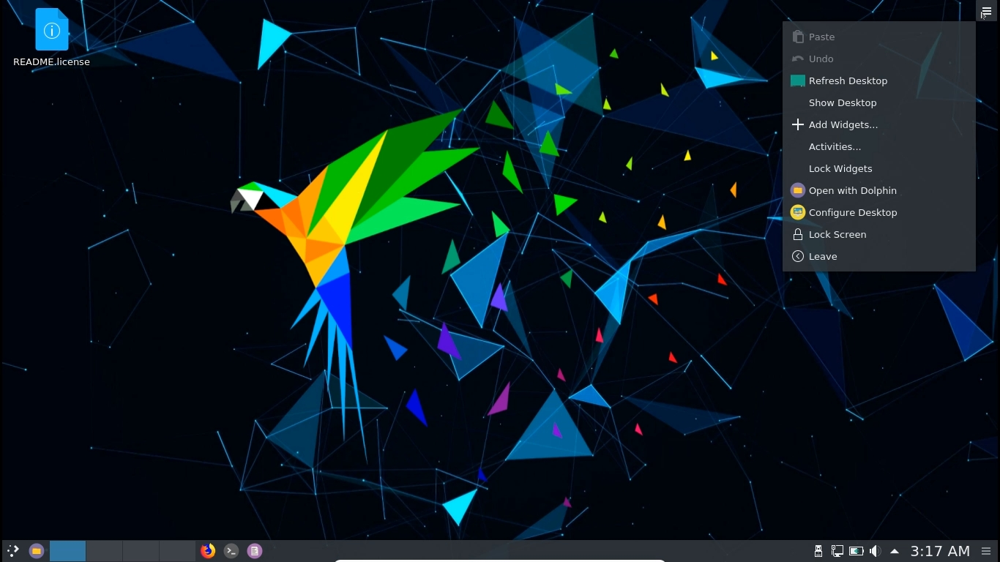
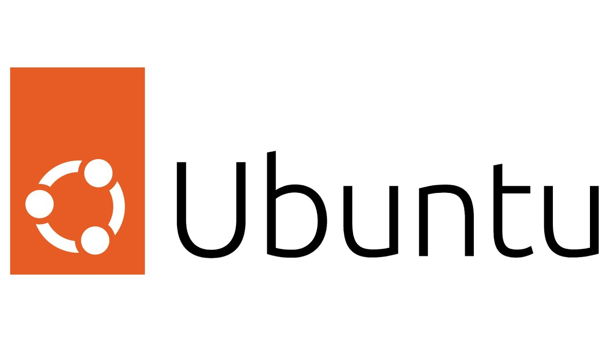

# Distros and VMs

## Why Linux?

Generally, when we are doing security operations, we use Unix based systems, such as that of Kali Linux, Ubuntu, or MacOS.

If you're unaware, Linux is an operating system that is open-source, flexible, portable and very, very customisable. Linux mainly relies on the Command Line Interface to work, meaning that expert users of Linux tend to rely purely on talking to the terminal to use their computer for daily tasks.

Here are a couple of reasons:

1. Linux is safer and more secure than Windows.
   * Using Windows feels like using a black box, and there are so many things and inner workings hidden away from the user. Windows uses a lot of proprietary software, while Linux is generally open-sourced so one can better understand how Linux works over Windows.
   * In Windows, new users are granted administrative privileges (being able to change whatever file I want). In Linux, this is not the case. This can lead to a lot of malware making their way into your computer and they already have administrator privileges.
   * In Q1 2020, 83% of malware attacks were on Windows systems, and most of the malware out there is generally made for Windows users.
2. Linux actually runs faster and uses less hardware.
   * In Windows, there are a ton of processes and things that make it such that it loads very slowly
   * Compared to Linux, where Kali Linux can actually run properly on just 2GB of RAM, assuming we have a Graphical User Interface (GUI) and not just a terminal.
3. Most of the tools used are made for Linux.
   * Stuff like Nmap, John the Ripper, Searchsploit and more are actually created and used mainly from Linux systems, making installing and using these tools a lot easier.
4. If you're a programmer, then you would know running code on Linux is just easier in general.

Some reasons users don't pick up Linux is because it's harder to use. For example, troubleshooting Wifi issues is done by the user themselves, and there's no "fix" button like in Windows. Also, Linux can sometiems break if we install wrong packages and they are not compatible.&#x20;

## Distros

Distros are Linux systems that have different flavours and come pre-built. There are many types of Distros around, some as daily drivers and some for security. Here are a few of my personal favourites:

### Kali Linux

Kali Linux is made by Offensive Security, and it is a Debian-derived Linux Distro made for digital forensics and Pentesting. This whole project is funded by Offensive Security, who are the same people that made the Offensive Security Certified Professional or Pentesting with Kali course.

Kali comes with a whole slute of tools already pre-installed, so if you're going to start doing security, most of the tools are present already. However, some of the tools are uncessary and there are loads of overlaps, as well as tools that you don't know are installed.&#x20;

<figure><figcaption>
<em>Kali Linux</em>
</figcaption></figure>

### Parrot OS

Parrot OS is another Debian-derived Linux Distro that focuses on Security. It's a bit different from Kali as it is maintained by the Parrot Team. There is a family of different Parrot OS's, and some are not security focused and more as daily drivers or developing. Parrot Security does come pre-installed with security tools already in it.

<figure><figcaption>
<em>Parrot OS</em>
</figcaption></figure>

### Ubuntu

Ubuntu is an open source OS for the enterprise server, desktop, cloud and IoT. For me, I mainly use Ubuntu for coding, development or as a daily driver because of how clean it looks. You can choose to use this for security as it can install tools, but you have to do so manually.&#x20;

Ubuntu comes with its own disadvantages, of which one is bloatware. There's a ton of pre-installed applications on this system, and also in my experience it uses more power than Windows. If you want to convert your daily Ubuntu driver to a pentesting machine, **I do not recommend this.** I will explain more later.

<figure><figcaption>
<em>Ubuntu</em>
</figcaption></figure>

### Debian&#x20;

Debian is sort of the ancestor of loads of Distros now, and it is a free and open-sourced software that is **community maintained**. If you're looking into building your own custom machine for security operations, you can start with Debian. However, take note that you would need extensive knowledge on the tools and configurations required to make this work.

<figure><figcaption>
<em>Debian</em>
</figcaption></figure>

Whatever OS you want to use, that's up to you. I personally have Ubuntu on Dual boot with Windows on a daily driver, with Kali and Parrot both on Virutal Machines.

## Virtual Machines

Earlier, I said you don't want to have your daily driver also be a pentesting machine. The reason is, for practicing pentesting, you would need to connect to a VPN, exposing yourself.&#x20;

This is definitely insecure, as your daily driver machine would definitely have some kind of sensitive information within it. When connecting to a VPN with other hackers on the same net, you wouldn't want your own system to be compromised.

This is where Virtual Machines come in. Virutal Machines are basically like running an OS on top of your current OS. The virtual machine you run would allow the OS to run completely separate in an application window, and it is **sandboxed.** Meaning that if attackers were to somehow get into your VM, they wouldn't compromise the underlying OS easily.

Also, a VM can be easily reinstalled and reconfigured if needed. Systems running on bare metal would be a lot harder to redownload should one mess up.

Lastly, you would want to have another Windows VM machine. The reason being is that this would allow for you to disassemble Windows malware, run Immunity Debugger for Buffer Overflows etc. Some tools like dnSpy run best on Windows machines.

Here are a few links to VM software:





## Download Links

### Kali



### Parrot OS



### **Debian**



### Ubuntu



### Windows



One that I've been using nowadays is **Commando VM**, which is basically a Windows machine that has all the tools I need, such as Bloodhound or WinDbg. Make sure to have a new Windows VM for it.


